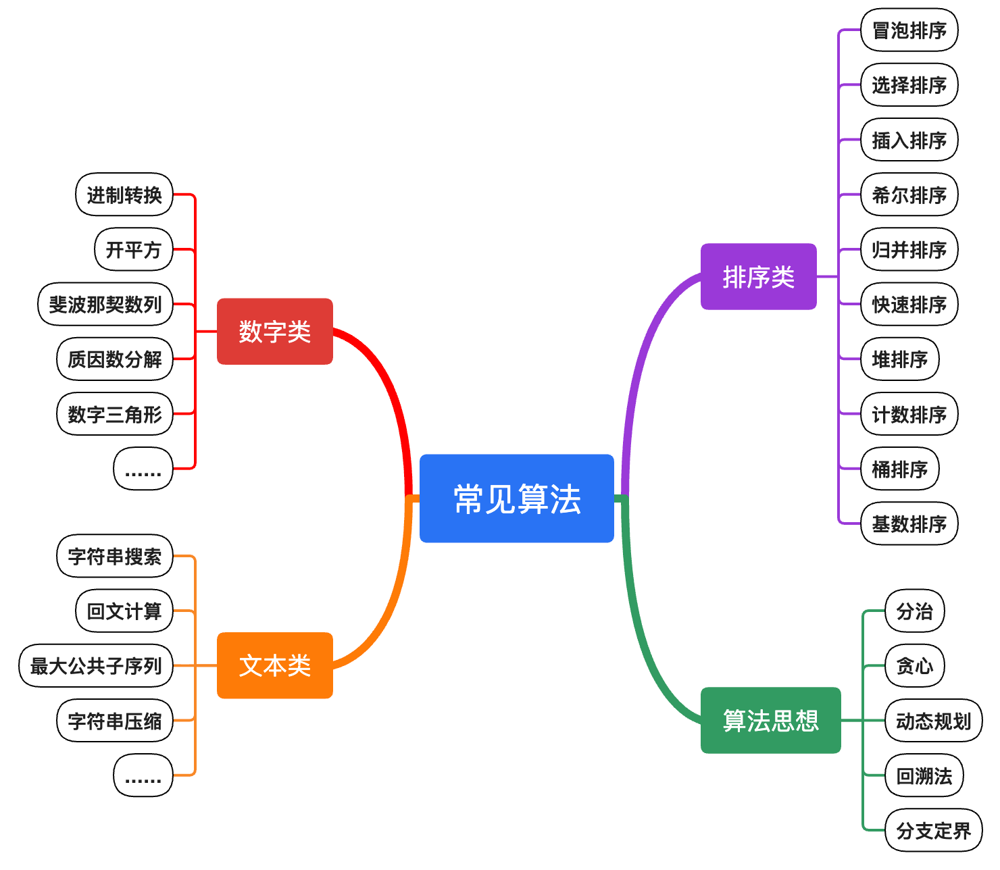

# AI编程：算法思想与数据结构知识库大全 | [English](./README_en.md)

> AI时代，我们更需要理解算法思想与数据结构，学习不同编程语言特性。

    

本仓库旨在帮助大学生和程序员**用不同编程语言来学习数据结构和经典算法思想**，包括 `C`、`C++`、`Java`、`Python`、`JavaScript`、`TypeScript`、`Go`、`Rust等多种语言，提供充分注释说明。由简入深，让你充分理解算法与数据结构的原理，同时又能掌握不同编程语言的特点，助你**从"编码执行者"转型为"AI驱动者"。**

AI可以替代人工编码工作，但难以替代人的认知与思考。**深入理解编程核心（算法+数据结构、设计模式+系统架构）将有助于我们更好地驾驭AI，让AI发挥更高的效率与价值。**

表层的API、框架与应用方案日新月异，而**数据结构、算法以及底层逻辑思维则历久弥新**。表层技术需要快速学习、持续迭代；底层原理与思想则需要反复钻研与沉淀，从而持续提升认知。

## 🚀 本项目特点

1. **多语言实现**：涵盖 C、Java、Python、JavaScript、TypeScript、Go、Rust 等 多种编程语言
2. **全面覆盖**：包含排序、搜索、字符串处理、树、图、动态规划、贪心算法、回溯算法、位操作、网络流等各种经典算法
3. **数据结构完整**：涵盖数组、链表、栈、队列、树、堆、图、哈希表、集合、映射等核心数据结构
4. **循序渐进**：从入门指南到算法思想，再到具体实现和项目实践，逐一递进，形成完整学习路径
5. **实践导向**：提供丰富的实践项目和问题集，帮助理论联系实际

## 适合大学生与程序员学习
本项目将“**概念理解 → 代码实现 → 对比语言 → 练习进阶**”串成一条清晰路径，适合作为课程补充、自学路线或面试与工程能力提升的长期仓库。你可以获得：

- 体系化学习路径：从入门到经典算法，再到题库与项目，循序渐进不走弯路。
- 多语言对照：同一算法多语言实现，帮助理解语言差异与工程习惯。
- 可实践与可复用：多数目录提供可运行代码与说明，方便作业、面试与项目中直接参考。
- 强化基础与思维：重视复杂度分析与算法思想，提升解决问题的效率与正确性。

## 新手入门指南

如果你是**编程新手**或**算法初学者**，建议从这里开始：

### [入门指南](./start-here/)

- **[学习路线](./start-here/learning-path.md)** - 从入门到精通的完整学习规划
- **[什么是编程](./start-here/what-is-programming.md)** - 理解编程的本质和核心概念  
- **[算法思想](./start-here/AI-Era-Programmers-Need-Algorithmic-Thinking.md)** - 掌握核心算法思想，应用无穷
- **[环境搭建](./start-here/environment-setup.md)** - 快速配置开发环境
- **[推荐语言](./start-here/recommand-learning-languages.md)** - 选择合适的入门语言
- **[常见问题](./start-here/faq.md)** - 初学者常见问题解答

>**快速开始**：完全新手建议按顺序阅读，有编程基础可直接看算法思想部分。

# 算法概览

## 常见的算法有哪些？
- **文本查找**：包括线性搜索、二分搜索、树形搜索、最大公共子序列、回文计算等，主要针对字符串查找。
- **数学计算**：包括进制转换、开平方、斐波那契数列、质因数分解、数字三角形等，主要进行数值计算。
- **排序算法**：包括冒泡、选择、插入、希尔、归并、快速、堆、计数、桶、基数等，用于按顺序排列数据。
- **其他算法**：包括动态规划、贪心算法、分治算法、回溯算法、图算法（如广度优先搜索、深度优先搜索、Dijkstra算法、Kruskal算法等），此外还包括机器学习和人工智能算法，如分类算法、聚类算法、深度学习、强化学习等。

## 常见算法思想
- **[贪心算法](./algorithmic-thinking/greedy-algorithm/)**：一种通过每次选择局部最优解来期望得到全局最优解的方法。
- **[分治算法](./algorithmic-thinking/divide-and-conquer/)**：将问题分解为较小的子问题，独立解决后再合并结果。
- **[动态规划](./algorithmic-thinking/dynamic-programming/)**：通过将复杂问题分解为更简单的重叠子问题来求解。
- **[回溯算法](./algorithmic-thinking/backtracking/)**：通过逐步构建候选解并放弃那些无法满足条件的方案来解决问题。
- **[图算法](./algorithmic-thinking/search-algorithms/)**：包括广度优先搜索、深度优先搜索、Dijkstra算法、Kruskal算法等，用于解决图相关问题。
- **[分支限界法](./algorithmic-thinking/branch-and-bound/)**：一种组合优化问题的求解方法，通过系统地探索搜索树的分支来解决问题。

详细请见：[程序员需要掌握的算法思想大全](./algorithmic-thinking)
    
## 10大经典排序算法

| 排序算法 | C | C++ | Java | Py | JS | TS | Go | Rust | Swift | 适用场景 |
|----------|---|-----|------|----|----|----|----|------|-------|----------|
| [冒泡排序 bubble sort](./sorting/bubblesort/) | [C](./sorting/bubblesort/bubble_sort.c) | [C++](./sorting/bubblesort/bubble_sort.cpp) | [Java](./sorting/bubblesort/BubbleSort.java) | [Py](./sorting/bubblesort/bubble_sort.py) | [JS](./sorting/bubblesort/bubble_sort.js) | [TS](./sorting/bubblesort/BubbleSort.ts) | [Go](./sorting/bubblesort/bubble_sort.go) | [Rust](./sorting/bubblesort/bubble_sort.rs) | [Swift](./sorting/bubblesort/bubble_sort.swift) | 适用于小规模数据排序，教学用途 |
| [插入排序 insert sort](./sorting/insertsort/) | [C](./sorting/insertsort/insert_sort.c) | [C++](./sorting/insertsort/insert_sort.cpp) | [Java](./sorting/insertsort/InsertSort.java) | [Py](./sorting/insertsort/insert_sort.py) | [JS](./sorting/insertsort/insert_sort.js) | [TS](./sorting/insertsort/InsertSort.ts) | [Go](./sorting/insertsort/insert_sort.go) | [Rust](./sorting/insertsort/insert_sort.rs) | [Swift](./sorting/insertsort/insert_sort.swift) | 适用于小规模数据，少量元素已基本有序的情况 |
| [选择排序 selection sort](./sorting/selectionsort/) | [C](./sorting/selectionsort/selection_sort.c) | [C++](./sorting/selectionsort/selection_sort.cpp) | [Java](./sorting/selectionsort/SelectionSort.java) | [Py](./sorting/selectionsort/selection_sort.py) | [JS](./sorting/selectionsort/selection_sort.js) | [TS](./sorting/selectionsort/SelectionSort.ts) | [Go](./sorting/selectionsort/selection_sort.go) | [Rust](./sorting/selectionsort/selection_sort.rs) | [Swift](./sorting/selectionsort/selection_sort.swift) | 适用于小规模数据，数据交换次数较少 |
| [堆排序 heap sort](./sorting/heapsort/) | [C](./sorting/heapsort/heap_sort.c) | [C++](./sorting/heapsort/heap_sort.cpp) | [Java](./sorting/heapsort/HeapSort.java) | [Py](./sorting/heapsort/heap_sort.py) | [JS](./sorting/heapsort/heap_sort.js) | [TS](./sorting/heapsort/HeapSort.ts) | [Go](./sorting/heapsort/heap_sort.go) | [Rust](./sorting/heapsort/heap_sort.rs) | [Swift](./sorting/heapsort/heap_sort.swift) | 适用于优先队列、TOP K问题 |
| [快速排序 quick sort](./sorting/quicksort/) | [C](./sorting/quicksort/quick_sort.c) | [C++](./sorting/quicksort/quick_sort.cpp) | [Java](./sorting/quicksort/QuickSort.java) | [Py](./sorting/quicksort/quick_sort.py) | [JS](./sorting/quicksort/quick_sort.js) | [TS](./sorting/quicksort/QuickSort.ts) | [Go](./sorting/quicksort/quick_sort.go) | [Rust](./sorting/quicksort/quick_sort.rs) | [Swift](./sorting/quicksort/quick_sort.swift) | 适用于一般排序场景，性能优异但不稳定 |
| [归并排序 merge sort](./sorting/mergesort/) | [C](./sorting/mergesort/merge_sort.c) | [C++](./sorting/mergesort/merge_sort.cpp) | [Java](./sorting/mergesort/MergeSort.java) | [Py](./sorting/mergesort/merge_sort.py) | [JS](./sorting/mergesort/merge_sort.js) | [TS](./sorting/mergesort/MergeSort.ts) | [Go](./sorting/mergesort/merge_sort.go) | [Rust](./sorting/mergesort/merge_sort.rs) | [Swift](./sorting/mergesort/merge_sort.swift) | 适用于大数据量排序，适合外部排序 |
| [计数排序 counting sort](./sorting/countingsort/) | [C](./sorting/countingsort/counting_sort.c) | [C++](./sorting/countingsort/counting_sort.cpp) | [Java](./sorting/countingsort/CountingSort.java) | [Py](./sorting/countingsort/counting_sort.py) | [JS](./sorting/countingsort/counting_sort.js) | [TS](./sorting/countingsort/CountingSort.ts) | [Go](./sorting/countingsort/counting_sort.go) | [Rust](./sorting/countingsort/counting_sort.rs) | [Swift](./sorting/countingsort/counting_sort.swift) | 适用于数据范围有限的整数排序 |
| [基数排序 radix sort](./sorting/radixsort/) | [C](./sorting/radixsort/radix_sort.c) | [C++](./sorting/radixsort/radix_sort.cpp) | [Java](./sorting/radixsort/RadixSort.java) | [Py](./sorting/radixsort/radix_sort.py) | [JS](./sorting/radixsort/radix_sort.js) | [TS](./sorting/radixsort/RadixSort.ts) | [Go](./sorting/radixsort/radix_sort.go) | [Rust](./sorting/radixsort/radix_sort.rs) | [Swift](./sorting/radixsort/radix_sort.swift) | 适用于大规模整数排序，如身份证号、手机号排序 |
| [桶排序 bucket sort](./sorting/bucketsort/) | [C](./sorting/bucketsort/bucket_sort.c) | [C++](./sorting/bucketsort/bucket_sort.cpp) | [Java](./sorting/bucketsort/BucketSort.java) | [Py](./sorting/bucketsort/bucket_sort.py) | [JS](./sorting/bucketsort/bucket_sort.js) | [TS](./sorting/bucketsort/BucketSort.ts) | [Go](./sorting/bucketsort/bucket_sort.go) | [Rust](./sorting/bucketsort/bucket_sort.rs) | [Swift](./sorting/bucketsort/bucket_sort.swift) | 适用于数据范围均匀分布的排序 |
| [希尔排序 shell sort](./sorting/shellsort/) | [C](./sorting/shellsort/shell_sort.c) | [C++](./sorting/shellsort/ShellSort.cpp) | [Java](./sorting/shellsort/ShellSort.java) | [Py](./sorting/shellsort/shell_sort.py) | [JS](./sorting/shellsort/shell_sort.js) | [TS](./sorting/shellsort/ShellSort.ts) | [Go](./sorting/shellsort/shell_sort.go) | [Rust](./sorting/shellsort/shell_sort.rs) | [Swift](./sorting/shellsort/shell_sort.swift) | 适用于中等规模数据排序，适合半有序数据 |

📖 **详细指南**：[十大排序算法全解：多语言源码仓库](./sorting/10-Sorting-Algorithms-Multi-Language.md)

## 字符串搜索与查找

| 算法 | C | Java | Py | JS | TS | Go | Rust | Swift | 适用场景 |
|------|---|-----|----|----|----|----|------|-------|----------|
| [朴素搜索](./string/nativesearch/) | [C](./string/nativesearch/string_search.c) | [Java](./string/nativesearch/StringSearch.java) | [Python](./string/nativesearch/string_search.py) | [JS](./string/nativesearch/string_search.js) | [TS](./string/nativesearch/StringSearch.ts) | [Go](./string/nativesearch/string_search.go) | [Rust](./string/nativesearch/string_search.rs) | 适用于小规模文本搜索 |
| [二分查找](./searching/binarysearch/) | [C](./searching/binarysearch/binary_search.c) | [Java](./searching/binarysearch/BinarySearch.java) | [Python](./searching/binarysearch/binary_search.py) | [JS](./searching/binarysearch/binary_search.js) | [TS](./searching/binarysearch/BinarySearch.ts) | [Go](./searching/binarysearch/binary_search.go) | [Rust](./searching/binarysearch/binary_search.rs) | [Swift](./searching/binarysearch/binary_search.swift) | 适用于已排序数组的查找 |
| [KMP搜索](./string/KMPsearch/) | [C](./string/KMPsearch/kmp_search.c) | [Java](./string/KMPsearch/KMPSearch.java) | [Python](./string/KMPsearch/kmp_search.py) | [JS](./string/KMPsearch/kmp_search.js) | [TS](./string/KMPsearch/KMPSearch.ts) | [Go](./string/KMPsearch/kmp_search.go) | [Rust](./string/KMPsearch/kmp_search.rs) | 适用于大规模文本搜索 |

## 树搜索与遍历

| 算法 | C | Java | Py | JS | TS | Go | Rust | 适用场景 |
|------|---|-----|----|----|----|----|------|----------|
| [二叉树遍历](./tree/binarytree/) | [C](./tree/binarytree/binary_tree.c) | [Java](./tree/binarytree/BinaryTree.java) | [Python](./tree/binarytree/binary_tree.py) | [JS](./tree/binarytree/binary_tree.js) | [TS](./tree/binarytree/BinaryTree.ts) | [Go](./tree/binarytree/binary_tree.go) | [Rust](./tree/binarytree/binary_tree.rs) | 适用于树结构数据的遍历，如 XML 解析、文件系统遍历 |
| [堆](./tree/heap/) | [C](./tree/heap/heap.c) | [Java](./tree/heap/Heap.java) | [Python](./tree/heap/heap.py) | [JS](./tree/heap/heap.js) | [TS](./tree/heap/Heap.ts) | [Go](./tree/heap/heap.go) | [Rust](./tree/heap/heap.rs) | 适用于优先队列、TOP K 问题 |
| [树遍历](./tree/traversal/) | [C](./tree/traversal/tree_traversal.c) | [Java](./tree/traversal/TreeTraversal.java) | [Python](./tree/traversal/tree_traversal.py) | [JS](./tree/traversal/tree_traversal.js) | [TS](./tree/traversal/TreeTraversal.ts) | [Go](./tree/traversal/tree_traversal.go) | [Rust](./tree/traversal/tree_traversal.rs) | 前序、中序、后序、层序遍历 |
| [树搜索](./tree/tree-search/) | [C](./tree/tree-search/tree_search.c) | [Java](./tree/tree-search/TreeSearch.java) | [Python](./tree/tree-search/tree_search.py) | [JS](./tree/tree-search/tree_search.js) | [TS](./tree/tree-search/TreeSearch.ts) | [Go](./tree/tree-search/tree_search.go) | [Rust](./tree/tree-search/tree_search.rs) | DFS、BFS、A* 搜索 |

## 图算法

| 算法 | C | Java | Py | JS | TS | Go | Rust | 适用场景 |
|------|---|-----|----|----|----|----|------|----------|
| [BFS 广度优先搜索](./graph/bfs/) | [C](./graph/bfs/graph_bfs.c) | [Java](./graph/bfs/GraphBFS.java) | [Python](./graph/bfs/graph_bfs.py) | [JS](./graph/bfs/graph_bfs.js) | [TS](./graph/bfs/GraphBFS.ts) | [Go](./graph/bfs/graph_bfs.go) | [Rust](./graph/bfs/graph_bfs.rs) | 最短路径、连通性检测 |
| [DFS 深度优先搜索](./graph/dfs/) | [C](./graph/dfs/graph_dfs.c) | [Java](./graph/dfs/GraphDFS.java) | [Python](./graph/dfs/graph_dfs.py) | [JS](./graph/dfs/graph_dfs.js) | [TS](./graph/dfs/GraphDFS.ts) | [Go](./graph/dfs/graph_dfs.go) | [Rust](./graph/dfs/graph_dfs.rs) | 拓扑排序、路径查找 |
| [Dijkstra 最短路径](./graph/dijkstra/) | [C](./graph/dijkstra/graph_dijkstra.c) | [Java](./graph/dijkstra/GraphDijkstra.java) | [Python](./graph/dijkstra/graph_dijkstra.py) | [JS](./graph/dijkstra/graph_dijkstra.js) | [TS](./graph/dijkstra/GraphDijkstra.ts) | [Go](./graph/dijkstra/graph_dijkstra.go) | [Rust](./graph/dijkstra/graph_dijkstra.rs) | 单源最短路径 |
| [拓扑排序](./graph/topological/) | [C](./graph/topological/topological_sort.c) | [Java](./graph/topological/TopologicalSort.java) | [Python](./graph/topological/topological_sort.py) | [JS](./graph/topological/topological_sort.js) | [TS](./graph/topological/TopologicalSort.ts) | [Go](./graph/topological/topological_sort.go) | [Rust](./graph/topological/topological_sort.rs) | 任务调度、依赖关系 |

## 位操作

| 算法 | C | Java | Py | JS | TS | Go | Rust | 适用场景 |
|------|---|-----|----|----|----|----|------|----------|
| [位计数](./bit-manipulation/count-bits/) | [C](./bit-manipulation/count-bits/count_bits.c) | [Java](./bit-manipulation/count-bits/CountBits.java) | [Python](./bit-manipulation/count-bits/count_bits.py) | [JS](./bit-manipulation/count-bits/count_bits.js) | [TS](./bit-manipulation/count-bits/CountBits.ts) | [Go](./bit-manipulation/count-bits/count_bits.go) | [Rust](./bit-manipulation/count-bits/count_bits.rs) | 统计二进制中 1 的个数 |
| [最大异或对](./bit-manipulation/max-xor-pair/) | [C](./bit-manipulation/max-xor-pair/max_xor_pair.c) | [Java](./bit-manipulation/max-xor-pair/MaxXORPair.java) | [Python](./bit-manipulation/max-xor-pair/max_xor_pair.py) | [JS](./bit-manipulation/max-xor-pair/max_xor_pair.js) | [TS](./bit-manipulation/max-xor-pair/MaxXORPair.ts) | [Go](./bit-manipulation/max-xor-pair/max_xor_pair.go) | [Rust](./bit-manipulation/max-xor-pair/max_xor_pair.rs) | 寻找最大异或值 |
| [2 的幂判断](./bit-manipulation/power-of-two/) | [C](./bit-manipulation/power-of-two/power_of_two.c) | [Java](./bit-manipulation/power-of-two/PowerOfTwo.java) | [Python](./bit-manipulation/power-of-two/power_of_two.py) | [JS](./bit-manipulation/power-of-two/power_of_two.js) | [TS](./bit-manipulation/power-of-two/PowerOfTwo.ts) | [Go](./bit-manipulation/power-of-two/power_of_two.go) | [Rust](./bit-manipulation/power-of-two/power_of_two.rs) | 判断是否为 2 的幂 |
| [反转位](./bit-manipulation/reverse-bits/) | [C](./bit-manipulation/reverse-bits/reverse_bits.c) | [Java](./bit-manipulation/reverse-bits/ReverseBits.java) | [Python](./bit-manipulation/reverse-bits/reverse_bits.py) | [JS](./bit-manipulation/reverse-bits/reverse_bits.js) | [TS](./bit-manipulation/reverse-bits/ReverseBits.ts) | [Go](./bit-manipulation/reverse-bits/reverse_bits.go) | [Rust](./bit-manipulation/reverse-bits/reverse_bits.rs) | 反转二进制位 |

## 压缩算法详解

| 算法 | C | Java | Py | JS | TS | Go | Rust | 适用场景 |
|------|---|-----|----|----|----|----|------|----------|
| [Huffman编码](./compression/huffman/) | [C](./compression/huffman/huffman.c) | [Java](./compression/huffman/HuffmanCoding.java) | [Python](./compression/huffman/huffman.py) | [JS](./compression/huffman/huffman.js) | [TS](./compression/huffman/HuffmanCoding.ts) | [Go](./compression/huffman/huffman.go) | [Rust](./compression/huffman/huffman.rs) | 适用于无损数据压缩、文件压缩 |
| [Run-Length Encoding](./compression/rle/) | [C](./compression/rle/rle.c) | [Java](./compression/rle/RLE.java) | [Python](./compression/rle/rle.py) | [JS](./compression/rle/rle.js) | [TS](./compression/rle/RLE.ts) | [Go](./compression/rle/rle.go) | [Rust](./compression/rle/rle.rs) | 适用于简单重复数据压缩 |
| [LZ77算法](./compression/lz77/) | [C](./compression/lz77/lz77.c) | [Java](./compression/lz77/LZ77.java) | [Python](./compression/lz77/lz77.py) | [JS](./compression/lz77/lz77.js) | [TS](./compression/lz77/LZ77.ts) | [Go](./compression/lz77/lz77.go) | [Rust](./compression/lz77/lz77.rs) | 适用于文本压缩、ZIP格式基础 |
| [LZW算法](./compression/lzw/) | [C](./compression/lzw/lzw.c) | [Java](./compression/lzw/LZW.java) | [Python](./compression/lzw/lzw.py) | [JS](./compression/lzw/lzw.js) | [TS](./compression/lzw/LZW.ts) | [Go](./compression/lzw/lzw.go) | [Rust](./compression/lzw/lzw.rs) | 适用于GIF格式、文本压缩 |

## 加密算法详解

| 算法 | C | Java | Py | JS | TS | Go | Rust | 适用场景 |
|------|---|-----|----|----|----|----|------|----------|
| [AES加密](./cryptography/aes/) | [C](./cryptography/aes/aes.c) | [Java](./cryptography/aes/AES.java) | [Python](./cryptography/aes/aes.py) | [JS](./cryptography/aes/aes.js) | [TS](./cryptography/aes/AES.ts) | [Go](./cryptography/aes/aes.go) | [Rust](./cryptography/aes/aes.rs) | 适用于对称加密、数据保护 |
| [RSA加密](./cryptography/rsa/) | [C](./cryptography/rsa/rsa.c) | [Java](./cryptography/rsa/RSA.java) | [Python](./cryptography/rsa/rsa.py) | [JS](./cryptography/rsa/rsa.js) | [TS](./cryptography/rsa/RSA.ts) | [Go](./cryptography/rsa/rsa.go) | [Rust](./cryptography/rsa/rsa.rs) | 适用于非对称加密、数字签名 |
| [SHA哈希](./cryptography/sha/) | [C](./cryptography/sha/sha.c) | [Java](./cryptography/sha/SHA.java) | [Python](./cryptography/sha/sha.py) | [JS](./cryptography/sha/sha.js) | [TS](./cryptography/sha/SHA.ts) | [Go](./cryptography/sha/sha.go) | [Rust](./cryptography/sha/sha.rs) | 适用于数据完整性校验、密码存储 |
| [凯撒密码](./cryptography/caesar/) | [C](./cryptography/caesar/caesar.c) | [Java](./cryptography/caesar/Caesar.java) | [Python](./cryptography/caesar/caesar.py) | [JS](./cryptography/caesar/caesar.js) | [TS](./cryptography/caesar/Caesar.ts) | [Go](./cryptography/caesar/caesar.go) | [Rust](./cryptography/caesar/caesar.rs) | 适用于古典加密、教学演示 |

## 网络流算法

| 算法 | C | Java | Py | JS | TS | Go | Rust | 适用场景 |
|------|---|-----|----|----|----|----|------|----------|
| [Ford-Fulkerson](./network-flow/ford-fulkerson/) | [C](./network-flow/ford-fulkerson/ford_fulkerson.c) | [Java](./network-flow/ford-fulkerson/FordFulkerson.java) | [Python](./network-flow/ford-fulkerson/ford_fulkerson.py) | [JS](./network-flow/ford-fulkerson/ford_fulkerson.js) | [TS](./network-flow/ford-fulkerson/FordFulkerson.ts) | [Go](./network-flow/ford-fulkerson/ford_fulkerson.go) | [Rust](./network-flow/ford-fulkerson/ford_fulkerson.rs) | 最大流问题 |
| [Edmonds-Karp](./network-flow/edmonds-karp/) | [C](./network-flow/edmonds-karp/edmonds_karp.c) | [Java](./network-flow/edmonds-karp/EdmondsKarp.java) | [Python](./network-flow/edmonds-karp/edmonds_karp.py) | [JS](./network-flow/edmonds-karp/edmonds_karp.js) | [TS](./network-flow/edmonds-karp/EdmondsKarp.ts) | [Go](./network-flow/edmonds-karp/edmonds_karp.go) | [Rust](./network-flow/edmonds-karp/edmonds_karp.rs) | Ford-Fulkerson 的 BFS 实现 |
| [最大流](./network-flow/max-flow/) | [C](./network-flow/max-flow/max_flow.c) | [Java](./network-flow/max-flow/MaxFlow.java) | [Python](./network-flow/max-flow/max_flow.py) | [JS](./network-flow/max-flow/max_flow.js) | [TS](./network-flow/max-flow/MaxFlow.ts) | [Go](./network-flow/max-flow/max_flow.go) | [Rust](./network-flow/max-flow/max_flow.rs) | 网络最大流问题 |
| [最小割](./network-flow/min-cut/) | [C](./network-flow/min-cut/min_cut.c) | [Java](./network-flow/min-cut/MinCut.java) | [Python](./network-flow/min-cut/min_cut.py) | [JS](./network-flow/min-cut/min_cut.js) | [TS](./network-flow/min-cut/MinCut.ts) | [Go](./network-flow/min-cut/min_cut.go) | [Rust](./network-flow/min-cut/min_cut.rs) | 网络最小割问题 |

## 质因数分解

| 语言 | 代码链接 | 复杂度 | 适用场景 |
|------|---------|--------|--------|
| C | [factor.c](./math/factor/factor.c) | O(√n) | 计算大整数的质因数分解 |
| C++ | [factor.cpp](./math/factor/factor.cpp) | O(√n) | 适用于高效数学计算 |
| JavaScript | [PrimeFactor.js](./math/factor/PrimeFactor.js) | O(√n) | Web 端数论计算 |
| TypeScript | [PrimeFactor.ts](./math/factor/PrimeFactor.ts) | O(√n) | 适用于前端或 Node.js 计算 |
| Go | [factor.go](./math/factor/factor.go) | O(√n) | 适用于后端服务计算 |
| Python | [factor.py](./math/factor/factor.py) | O(√n) | 适用于科学计算、数据分析 |
| Java | [Factor.java](./math/factor/Factor.java) | O(√n) | 适用于企业级应用计算 |
| Kotlin | [factor.kt](./math/factor/factor.kt) | O(√n) | 适用于 Android 和后端计算 |
| Swift | [factor.swift](./math/factor/factor.swift) | O(√n) | 适用于 iOS/macOS 开发 |
| Objective-C | [factor.m](./math/factor/factor.m) | O(√n) | 适用于老版本 iOS/macOS |
| Rust | [factor.rs](./math/factor/factor.rs) | O(√n) | 适用于高性能计算 |

## 数组列表去重复项

| 语言 | 代码链接 | 时间复杂度 | 适用场景 |
|------|---------|--------|--------|
| C | [unique.c](./array/unique/unique.c) | O(n log n) | 适用于嵌入式开发 |
| Go | [unique.go](./array/unique/unique.go) | O(n log n) | 适用于高并发场景 |
| JS | [unique.js](./array/unique/unique.js) | O(n) | 适用于前端数据处理 |
| Python | [unique.py](./array/unique/unique.py) | O(n) | 适用于数据清洗、分析 |
| Java | [UniqueArray.java](./array/unique/UniqueArray.java) | O(n log n) | 适用于企业级应用 |
| TypeScript | [UniqueArray.ts](./array/unique/UniqueArray.ts) | O(n) | 适用于前端 TypeScript 项目 |
| Rust | [unique.rs](./array/unique/unique.rs) | O(n) | 适用于高性能计算 |

## 递归

| 算法 | 代码链接 | 时间复杂度 | 空间复杂度 | 适用场景 |
|------|---------|------------|------------|--------|
| [简单递归](./recursion/) | [多语言实现](./recursion/) | O(2^n) | O(n) | 适用于分治算法、树和图的遍历、回溯问题 |

## 数学计算

| 算法 | 代码链接 | 时间复杂度 | 空间复杂度 | 适用场景 |
|------|---------|------------|------------|--------|
| [数学计算](./math/) | [多语言实现](./math/) | O(n) | O(1) | 适用于数论、加法、乘法、大整数计算、质因数分解、GCD、斐波那契等 |

## 日期与日历

| 算法 | 代码链接 | 时间复杂度 | 空间复杂度 | 适用场景 |
|------|---------|------------|------------|--------|
| [日期与日历](./date-time/) | [多语言实现](./date-time/) | O(1) | O(1) | 适用于日期计算、闰年判断、星期计算、日期间隔、时间戳转换等 |

---

# 数据结构

数据结构是数据的组织和存储的方式，通过选择合适的数据结构，可以高效地处理数据。详见：[数据结构概述](./data-structures/README.md)

| 数据结构 | 描述 | 访问效率 | 插入/删除效率 |
|---------|------|---------|-------------|
| [Array (数组)](./data-structures/array/) | 具有相同数据类型的元素集合，支持按索引随机访问 | O(1) | O(n) |
| [Linked List (链表)](./data-structures/linked/) | 数据以链式结构存储，通过指针连接，分为单向链表、双向链表和循环链表 | O(n) | O(1) (头部) / O(n) (中间) |
| [Tree (树)](./data-structures/tree/) | 树状数据集合，节点按层级关系组织，常见类型包括二叉树、二叉搜索树、平衡树等 | O(log n) | O(log n) |
| [Heap (堆)](./data-structures/heap/) | 一种特殊的完全二叉树，满足堆序性（最大堆或最小堆），常用于优先队列 | O(1) (取堆顶) | O(log n) |
| [Stack (栈)](./data-structures/stack/) | 后进先出 (LIFO) 的数据集合 | O(1) | O(1) |
| [Queue (队列)](./data-structures/queue/) | 先进先出 (FIFO) 的数据集合 | O(1) | O(1) |
| [Graph (图)](./data-structures/graph/) | 由节点（顶点）和边组成的图形数据结构，常见存储方式为邻接表或邻接矩阵 | O(1) (邻接矩阵) / O(n) (邻接表) | O(1) (邻接矩阵) / O(n) (邻接表) |
| [Hash (散列)](./data-structures/hash/) | 通过哈希函数将键映射到存储位置的数据结构，支持快速查找、插入和删除 | O(1) (均摊) | O(1) (均摊) |
| [Struct (结构体)](./data-structures/struct/) | 组合多种类型的数据，形成一个整体，常用于表示复杂对象 | O(1) | O(1) |
| [List (列表)](./data-structures/list/) | 有序集合，允许重复元素，支持索引访问 | O(1) (末尾插入)，O(n) (中间插入/删除) | O(1) (索引访问)，O(n) (查找) |
| [Set (集合)](./data-structures/set/) | 无序集合，不允许重复元素，支持高效查找 | O(1) (哈希实现)，O(log n) (树实现) | O(1) (哈希实现)，O(log n) (树实现) |
| [Map (映射)](./data-structures/map/) | 存储键值对的数据结构，支持快速查找、插入和删除 | O(1) (哈希实现)，O(log n) (树实现) | O(1) (哈希实现)，O(log n) (树实现) |  

---

## 实践项目

本项目提供丰富的实践项目，帮助将理论知识应用到实际场景中：

- [布隆过滤器](./practice-projects/real-world/bloom-filter/) - 高效的去重和存在性检测
- [缓存系统](./practice-projects/real-world/cache-system/) - LRU、LFU 等缓存策略
- [限流器](./practice-projects/real-world/rate-limiter/) - 令牌桶、漏桶算法
- [字符串压缩](./practice-projects/real-world/string-compression/) - 实际场景的压缩应用
- [一致性哈希](./practice-projects/real-world/consistent-hashing/) - 分布式系统负载均衡
- [哈希验证](./practice-projects/real-world/hash-verification/) - 数据完整性验证

## 问题集

按难度分类的练习题，帮助巩固知识：

- [简单题](./problem-sets/easy/) - 适合初学者的基础练习
- [中等题](./problem-sets/medium/) - 需要一定算法基础的练习
- [困难题](./problem-sets/hard/) - 挑战性强的算法题
- [面试题](./problem-sets/interview/) - 常见的面试算法题

---

## 学习文档
- [推荐学习的编程语言](./start-here/recommand-learning-languages.md)
- [不同编程语言有哪些差异？如何选择入门语言？](https://www.toutiao.com/article/7122744261904450063) 
- [如何学好编程？一文彻底搞懂](https://zhuanlan.zhihu.com/p/582174773)

## AI时代程序员成长体系

> AI时代，我们要从编码程序员转变成驱动AI的指挥官，告诉AI该怎么做，什么是好、什么是坏。

- [《AI时代，程序员必备的算法思想指南》](https://github.com/microwind/algorithms/blob/main/start-here/AI-Era-Programmers-Need-Algorithmic-Thinking.md)
- [《AI时代，人人都是Agent应用工程师》](https://github.com/microwind/algorithms/blob/main/start-here/AI-Era-Programmers-as-Agent-Engineers.md)
- ai-prompt - AI编程提示词库：[https://github.com/microwind/ai-prompt](https://github.com/microwind/ai-prompt)
- ai-skills - AI编程Skill库：[https://github.com/microwind/ai-skills](https://github.com/microwind/ai-skills)
- algorithms - 算法思想与数据结构：[https://github.com/microwind/algorithms](https://github.com/microwind/algorithms)
- design-patterns - 设计模式与编程范式：[https://github.com/microwind/design-patterns](https://github.com/microwind/design-patterns)
  
## 欢迎加入共建

`仓库：` [https://github.com/microwind/algorithms](https://github.com/microwind/algorithms)
`站点：` [https://microwind.github.io/algorithms](https://microwind.github.io/algorithms)

如果您对本项目感兴趣请加我，欢迎一起共建！ 
If you are interested in this project, please add me on WeChat. Let’s build it together!

**我是Jarry 李春平, 工作20多年的互联网程序员。**

- 📧 mail: `jarryli@gmail.com`  or `lichunping@buaa.edu.cn`
- 💬 wechat: `springbuild`
- 🌟 如果这个项目对你有帮助，请给个 Star 支持一下！
