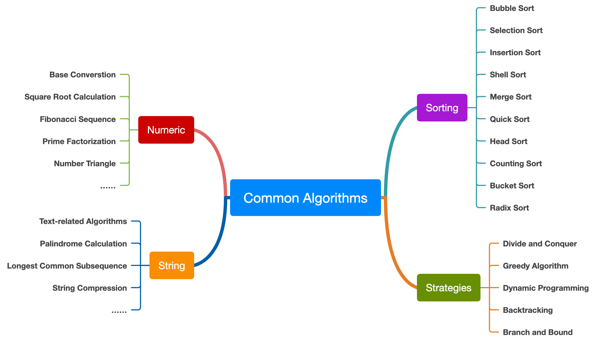

# In the age of AI, Understanding Algorithms and Data Structures, Learning Different Programming Languages | [中文](./README.md)

> In the age of AI, you need to understand algorithmic thinking and data structures, and learn different programming languages.

This repository helps you learn data structures and algorithms with different programming languages, including `C` `Java` `Python` `JavaScript` `Go` `TypeScript`, with rich comments and explanations.

In the AI era, AI can replace a lot of basic coding tasks, but it cannot replace human thinking and understanding. Only by deeply understanding the core of programming (data structures + algorithms) can we truly harness AI and make it produce high-value results.

Surface-level APIs, frameworks, and application solutions change rapidly, while data structures, algorithms, and fundamental logic endure. Surface technologies require fast learning and constant updates; fundamental principles require repeated study and reflection to continuously improve understanding.

## Project Highlights
1. Covers numerical computation, string search, tree traversal, sorting, dynamic programming, and more.
2. Each algorithm has multiple language implementations, helping you understand language features through algorithms and data structures.
3. Examples are rich and progressive, suitable for students and programmers to learn, analyze, and continuously improve their coding skills.

## Learning Value for Students and Engineers
This project connects "concept understanding -> code implementation -> language comparison -> practice and progression" into a clear path, making it a long-term resource for coursework, self-study, interviews, and engineering skill development.

You will gain:
- A systematic learning path: from fundamentals to classic algorithms, then to problem sets and projects, step by step.
- Multi-language comparison: the same algorithm implemented in multiple languages to reveal differences and engineering practices.
- Practical and reusable materials: most directories include runnable code and explanations, useful for coursework, interviews, and real projects.
- Stronger foundations and thinking: emphasis on complexity analysis and algorithmic ideas to improve efficiency and correctness.

# Algorithm Overview

## What are common algorithms?
- **Text search**: linear search, binary search, tree-based search, longest common subsequence, palindrome computation, mainly for string search.
- **Mathematical computation**: base conversion, square roots, Fibonacci sequence, prime factorization, numeric triangles, mainly for numerical computation.
- **Sorting algorithms**: bubble, selection, insertion, shell, merge, quick, heap, counting, bucket, radix, used to order data.
- **Other algorithms**: dynamic programming, greedy algorithms, divide and conquer, backtracking, graph algorithms (e.g., BFS, DFS, Dijkstra, Kruskal), plus machine learning and AI algorithms like classification, clustering, deep learning, and reinforcement learning.

## Common algorithmic paradigms
- **Greedy**: chooses the local optimum at each step to reach a global optimum.
- **Divide and conquer**: splits a problem into smaller subproblems, solves them independently, then combines results.
- **Dynamic programming**: breaks a complex problem into overlapping subproblems and solves them with memoization or tabulation.
- **Backtracking**: builds solutions incrementally and abandons those that violate constraints.
- **Graph algorithms**: BFS, DFS, Dijkstra, Kruskal, etc., for graph-related problems.
- **Branch and bound**: explores a search tree with bounds to prune unnecessary branches.

For details, see: [Classic Algorithm Ideas](./start-here/algorithmic-thinking.md)

## 10 Classic Sorting Algorithms

| 排序算法 | C | C++ | Java | Py | JS | TS | Go | Rust | Swift | 适用场景 |
|----------|---|-----|------|----|----|----|----|------|-------|----------|
| [冒泡排序 bubble sort](./sorting/bubblesort/) | [C](./sorting/bubblesort/bubble_sort.c) | [C++](./sorting/bubblesort/bubble_sort.cpp) | [Java](./sorting/bubblesort/BubbleSort.java) | [Py](./sorting/bubblesort/bubble_sort.py) | [JS](./sorting/bubblesort/bubble_sort.js) | [TS](./sorting/bubblesort/BubbleSort.ts) | [Go](./sorting/bubblesort/bubble_sort.go) | [Rust](./sorting/bubblesort/bubble_sort.rs) | [Swift](./sorting/bubblesort/BubbleSort.swift) | 适用于小规模数据排序，教学用途 |
| [插入排序 insert sort](./sorting/insertsort/) | [C](./sorting/insertsort/insert_sort.c) | [C++](./sorting/insertsort/insert_sort.cpp) | [Java](./sorting/insertsort/InsertSort.java) | [Py](./sorting/insertsort/insert_sort.py) | [JS](./sorting/insertsort/insert_sort.js) | [TS](./sorting/insertsort/InsertSort.ts) | [Go](./sorting/insertsort/insert_sort.go) | [Rust](./sorting/insertsort/insert_sort.rs) | [Swift](./sorting/insertsort/InsertSort.swift) | 适用于小规模数据，少量元素已基本有序的情况 |
| [选择排序 selection sort](./sorting/selectionsort/) | [C](./sorting/selectionsort/selection_sort.c) | [C++](./sorting/selectionsort/selection_sort.cpp) | [Java](./sorting/selectionsort/SelectionSort.java) | [Py](./sorting/selectionsort/selection_sort.py) | [JS](./sorting/selectionsort/selection_sort.js) | [TS](./sorting/selectionsort/SelectionSort.ts) | [Go](./sorting/selectionsort/selection_sort.go) | [Rust](./sorting/selectionsort/selection_sort.rs) | [Swift](./sorting/selectionsort/SelectionSort.swift) | 适用于小规模数据，数据交换次数较少 |
| [堆排序 heap sort](./sorting/heapsort/) | [C](./sorting/heapsort/heap_sort.c) | [C++](./sorting/heapsort/heap_sort.cpp) | [Java](./sorting/heapsort/HeapSort.java) | [Py](./sorting/heapsort/heap_sort.py) | [JS](./sorting/heapsort/heap_sort.js) | [TS](./sorting/heapsort/HeapSort.ts) | [Go](./sorting/heapsort/heap_sort.go) | [Rust](./sorting/heapsort/heap_sort.rs) | [Swift](./sorting/heapsort/HeapSort.swift) | 适用于优先队列、TOP K问题 |
| [快速排序 quick sort](./sorting/quicksort/) | [C](./sorting/quicksort/quick_sort.c) | [C++](./sorting/quicksort/quick_sort.cpp) | [Java](./sorting/quicksort/QuickSort.java) | [Py](./sorting/quicksort/quick_sort.py) | [JS](./sorting/quicksort/quick_sort.js) | [TS](./sorting/quicksort/QuickSort.ts) | [Go](./sorting/quicksort/quick_sort.go) | [Rust](./sorting/quicksort/quick_sort.rs) | [Swift](./sorting/quicksort/QuickSort.swift) | 适用于一般排序场景，性能优异但不稳定 |
| [归并排序 merge sort](./sorting/mergesort/) | [C](./sorting/mergesort/merge_sort.c) | [C++](./sorting/mergesort/merge_sort.cpp) | [Java](./sorting/mergesort/MergeSort.java) | [Py](./sorting/mergesort/merge_sort.py) | [JS](./sorting/mergesort/merge_sort.js) | [TS](./sorting/mergesort/MergeSort.ts) | [Go](./sorting/mergesort/merge_sort.go) | [Rust](./sorting/mergesort/merge_sort.rs) | [Swift](./sorting/mergesort/MergeSort.swift) | 适用于大数据量排序，适合外部排序 |
| [计数排序 counting sort](./sorting/countingsort/) | [C](./sorting/countingsort/counting_sort.c) | [C++](./sorting/countingsort/counting_sort.cpp) | [Java](./sorting/countingsort/CountingSort.java) | [Py](./sorting/countingsort/counting_sort.py) | [JS](./sorting/countingsort/counting_sort.js) | [TS](./sorting/countingsort/CountingSort.ts) | [Go](./sorting/countingsort/counting_sort.go) | [Rust](./sorting/countingsort/counting_sort.rs) | [Swift](./sorting/countingsort/CountingSort.swift) | 适用于数据范围有限的整数排序 |
| [基数排序 radix sort](./sorting/radixsort/) | [C](./sorting/radixsort/radix_sort.c) | [C++](./sorting/radixsort/radix_sort.cpp) | [Java](./sorting/radixsort/RadixSort.java) | [Py](./sorting/radixsort/radix_sort.py) | [JS](./sorting/radixsort/radix_sort.js) | [TS](./sorting/radixsort/RadixSort.ts) | [Go](./sorting/radixsort/radix_sort.go) | [Rust](./sorting/radixsort/radix_sort.rs) | [Swift](./sorting/radixsort/RadixSort.swift) | 适用于大规模整数排序，如身份证号、手机号排序 |
| [桶排序 bucket sort](./sorting/bucketsort/) | [C](./sorting/bucketsort/bucket_sort.c) | [C++](./sorting/bucketsort/bucket_sort.cpp) | [Java](./sorting/bucketsort/BucketSort.java) | [Py](./sorting/bucketsort/bucket_sort.py) | [JS](./sorting/bucketsort/bucket_sort.js) | [TS](./sorting/bucketsort/BucketSort.ts) | [Go](./sorting/bucketsort/bucket_sort.go) | [Rust](./sorting/bucketsort/bucket_sort.rs) | [Swift](./sorting/bucketsort/BucketSort.swift) | 适用于数据范围均匀分布的排序 |
| [希尔排序 shell sort](./sorting/shellsort/) | [C](./sorting/shellsort/shell_sort.c) | [C++](./sorting/shellsort/ShellSort.cpp) | [Java](./sorting/shellsort/ShellSort.java) | [Py](./sorting/shellsort/shell_sort.py) | [JS](./sorting/shellsort/shell_sort.js) | [TS](./sorting/shellsort/ShellSort.ts) | [Go](./sorting/shellsort/shell_sort.go) | [Rust](./sorting/shellsort/shell_sort.rs) | [Swift](./sorting/shellsort/ShellSort.swift) | 适用于中等规模数据排序，适合半有序数据 |

## String Search and Lookup

| Algorithm | C | Go | JS | Python | Java | TS | Time Complexity (Avg/Worst) | Space Complexity | Use Cases |
|------|--------|---------|-------------|---------|-------|-------------|--------------------|---------|--------|
| [Naive Search](string/nativesearch/) | [C](string/nativesearch/string_search.c) | [Go](string/nativesearch/string_search.go) | [JS](string/nativesearch/string_search.js) | [Python](string/nativesearch/string_search.py) | [Java](string/nativesearch/StringSearch.java) | [TS](string/nativesearch/StringSearch.ts) | O(mn) / O(mn) | O(1) | Suitable for small-scale text search |
| [Binary Search](searching/binarysearch/) | [C](searching/binarysearch/binary_search.c) | [Go](searching/binarysearch/binary_search.go) | [JS](searching/binarysearch/binary_search.js) | [Python](searching/binarysearch/binary_search.py) | [Java](searching/binarysearch/BinarySearch.java) | [TS](searching/binarysearch/BinarySearch.ts) | O(log n) / O(log n) | O(1) | Suitable for searching in sorted arrays |
| [KMP Search](string/KMPsearch/) | [C](string/KMPsearch/kmp_search.c) | [Go](string/KMPsearch/kmp_search.go) | [JS](string/KMPsearch/kmp_search.js) | [Python](string/KMPsearch/kmp_search.py) | [Java](string/KMPsearch/KMPSearch.java) | [TS](string/KMPsearch/KMPSearch.ts) | O(n + m) / O(n + m) | O(m) | Suitable for large-scale text search |

## Tree Search and Traversal

| Algorithm | C | JS | Python | Java | TS | Time Complexity (Avg/Worst) | Space Complexity | Use Cases |
|------|--------|-------------|---------|-------|-------------|--------------------|---------|--------|
| [Binary Tree Traversal](tree/binarytree/) | [C](tree/binarytree/binary_tree.c) | [JS](tree/binarytree/binary_tree.js) | [Python](tree/binarytree/binary_tree.py) | [Java](tree/binarytree/BinaryTree.java) | [TS](tree/binarytree/BinaryTree.ts) | O(n) / O(n) | O(n) | Suitable for tree traversal, e.g., XML parsing or file system traversal |

## Prime Factorization

| Language | Code Link | Complexity | Use Cases |
|------|---------|--------|--------|
| C | [factor.c](math/factor/factor.c) | O(sqrt(n)) | Prime factorization of large integers |
| C++ | [factor.cpp](math/factor/factor.cpp) | O(sqrt(n)) | Efficient mathematical computation |
| JavaScript | [factor.js](math/factor/factor.js) | O(sqrt(n)) | Number theory on the web |
| TypeScript | [PrimeFactor.ts](math/factor/PrimeFactor.ts) | O(sqrt(n)) | Front-end or Node.js computation |
| Go | [factor.go](math/factor/factor.go) | O(sqrt(n)) | Backend service computation |
| Python | [factor.py](math/factor/factor.py) | O(sqrt(n)) | Scientific computing and data analysis |
| Java | [Factor.java](math/factor/Factor.java) | O(sqrt(n)) | Enterprise application computation |
| Kotlin | [factor.kt](math/factor/factor.kt) | O(sqrt(n)) | Android and backend computation |
| Swift | [factor.swift](math/factor/factor.swift) | O(sqrt(n)) | iOS/macOS development |
| Objective-C | [factor.m](math/factor/factor.m) | O(sqrt(n)) | Legacy iOS/macOS development |
| Rust | [factor.rs](math/factor/factor.rs) | O(sqrt(n)) | High-performance computation |

## Removing Duplicate Items from Arrays and Lists

| Language | Code Link | Time Complexity | Use Cases |
|------|---------|--------|--------|
| C | [unique.c](array/unique/unique.c) | O(n log n) | Embedded development |
| Go | [unique.go](array/unique/unique.go) | O(n log n) | High-concurrency scenarios |
| JS | [unique.js](array/unique/unique.js) | O(n) | Front-end data processing |
| Python | [unique.py](array/unique/unique.py) | O(n) | Data cleaning and analysis |
| Java | [UniqueArray.java](array/unique/UniqueArray.java) | O(n log n) | Enterprise applications |
| TypeScript | [UniqueArray.ts](array/unique/UniqueArray.ts) | O(n) | Front-end TypeScript projects |
| Rust | [unique.rs](array/unique/unique.rs) | O(n) | High-performance computation |

## Recursion

| Algorithm | Code Link | Time Complexity | Space Complexity | Use Cases |
|------|---------|------------|------------|--------|
| [Basic Recursion](./recursion/) | [C](./recursion/) | O(2^n) | O(n) | Divide and conquer, tree/graph traversal, backtracking |

## Mathematical Computation

| Algorithm | Code Link | Time Complexity | Space Complexity | Use Cases |
|------|---------|------------|------------|--------|
| [Mathematical Computation](math/number/) | [C](math/number/) | O(n) | O(1) | Number theory, addition, multiplication, big integer computation |

## Date and Calendar

| Algorithm | Code Link | Time Complexity | Space Complexity | Use Cases |
|------|---------|------------|------------|--------|
| [Date and Calendar](date-time/) | [C](date-time/) | O(1) | O(1) | Date calculation, holiday estimation, date conversion |

---

# Data Structures
Data structures organize and store data, enabling efficient processing. Different data structures have different efficiency for access, insertion, and deletion. Choosing the right structure improves performance. See: [Overview of Data Structures](./data-structures)

| Data Structure | Description | Characteristics | Access Complexity | Insert/Delete Complexity |
|---------|------|---------|---------|-------------|
| [Array](./data-structures/array/) | A collection of elements of the same type, supports random access by index | Contiguous memory, linear or non-linear | O(1) | O(n) |
| [Linked List](./data-structures/linked/) | Nodes connected by pointers; includes singly, doubly, and circular lists | Linear, non-contiguous memory | O(n) | O(1) (head) / O(n) (middle) |
| [Tree](./data-structures/tree/) | Hierarchical data; includes binary tree, BST, balanced trees | Non-linear, one root node, multiple children | O(log n) | O(log n) |
| [Heap](./data-structures/heap/) | Special complete binary tree with heap property | Non-linear, efficient for extremes | O(1) (peek) | O(log n) |
| [Stack](./data-structures/stack/) | LIFO structure | Linear, only top operations | O(1) | O(1) |
| [Queue](./data-structures/queue/) | FIFO structure | Linear, enqueue at tail, dequeue at head | O(1) | O(1) |
| [Graph](./data-structures/graph/) | Nodes (vertices) and edges; adjacency list or matrix | Non-linear, many-to-many | O(1) (matrix) / O(n) (list) | O(1) (matrix) / O(n) (list) |
| [Hash](./data-structures/hash/) | Maps keys to positions via hash functions | Linear, key-value mapping | O(1) (amortized) | O(1) (amortized) |
| [Struct](./data-structures/struct/) | Combines multiple fields into one object | Custom, fixed fields, multiple types | O(1) | O(1) |
| [List](./data-structures/list/) | Ordered collection allowing duplicates | Linear, insertion order | O(1) (append), O(n) (middle ops) | O(1) (index), O(n) (search) |
| [Set](./data-structures/set/) | Unordered collection without duplicates | Linear, based on hash or tree | O(1) (hash) / O(log n) (tree) | O(1) (hash) / O(log n) (tree) |
| [Map](./data-structures/map/) | Stores key-value pairs | Associative array, hash or balanced tree | O(1) (hash) / O(log n) (tree) | O(1) (hash) / O(log n) (tree) |

---

## Related Links
- [Recommended Programming Languages](./start-here/recommand-learning-languages.md)
- [Differences Between Programming Languages and How to Choose](https://www.toutiao.com/article/7122744261904450063)
- [How to Learn Programming Well](https://zhuanlan.zhihu.com/p/582174773)

## Welcome to Contribute

`Repository:` [https://github.com/microwind/algorithms](https://github.com/microwind/algorithms)
`Site:` [https://microwind.github.io/algorithms](https://microwind.github.io/algorithms)

If you are interested in this project, please add me on WeChat. Let’s build it together!

**wechat:** `springbuild`

**Email:** `jarryli@gmail.com` or `lichunping@buaa.edu.cn`
