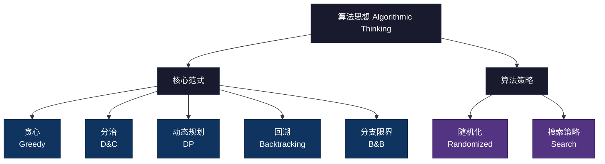
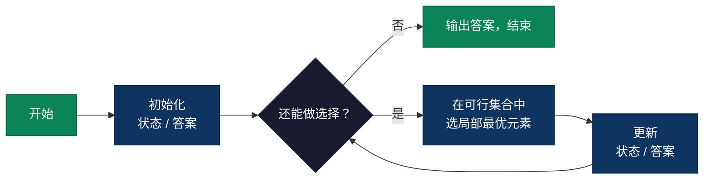
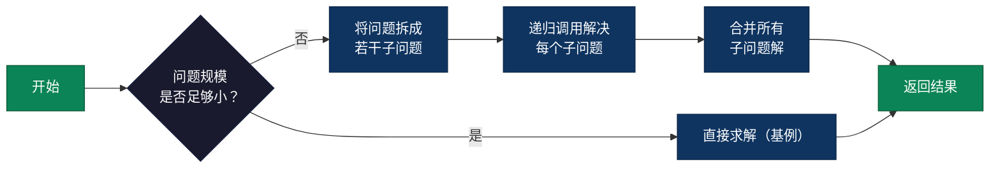
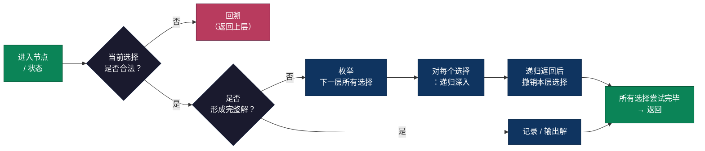
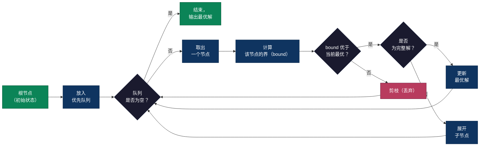
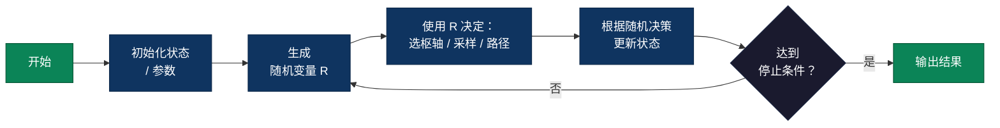
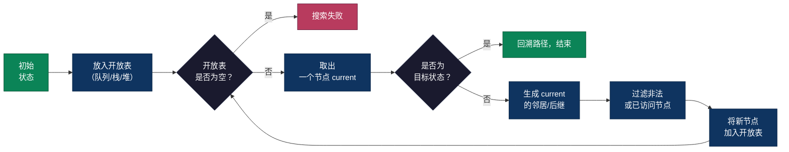
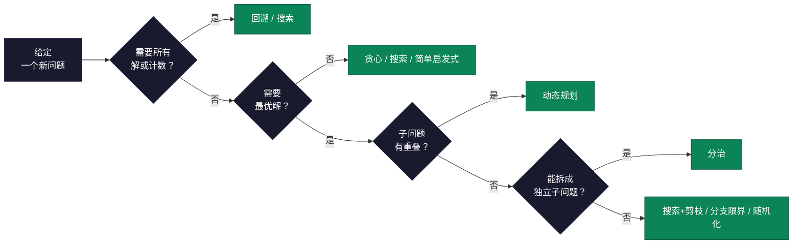
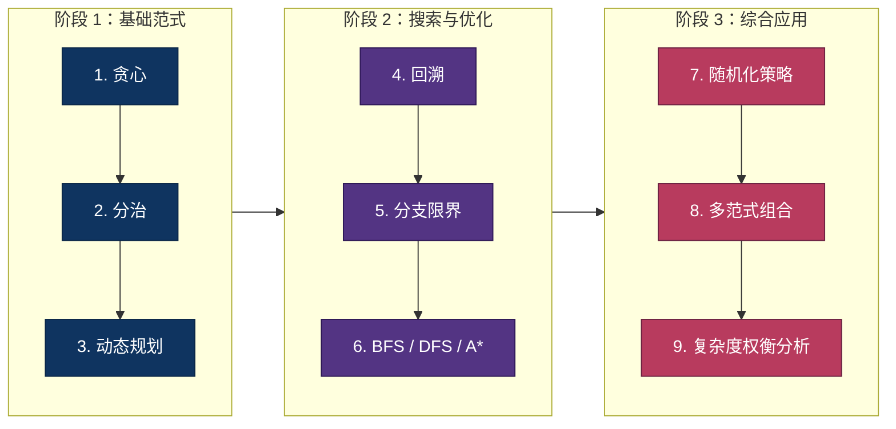

# 算法思想大全（Algorithmic Thinking）

> 算法思想是解决问题的"方法论"。掌握了方法论，面对新问题就能快速找到突破口。本目录提供常见算法思想的流程图示、伪代码模板和典型应用，助你从"会写代码"升级到"会设计算法"。

## 1. 分类总览




| 算法思想 | 目录 | 一句话说明 |
|---------|------|-----------|
| 贪心 Greedy | [`greedy-algorithm/`](./greedy-algorithm/) | 每步选局部最优，期望累积成全局最优 |
| 分治 Divide & Conquer | [`divide-and-conquer/`](./divide-and-conquer/) | 拆分子问题 → 递归求解 → 合并结果 |
| 动态规划 DP | [`dynamic-programming/`](./dynamic-programming/) | 重叠子问题 + 最优子结构 + 状态转移方程 |
| 回溯 Backtracking | [`backtracking/`](./backtracking/) | DFS 枚举所有可能，不合法就撤销回退 |
| 分支限界 Branch & Bound | [`branch-and-bound/`](./branch-and-bound/) | 回溯 + 上下界剪枝，搜索最优解 |
| 随机化 Randomized | [`random-algorithm/`](./random-algorithm/) | 引入随机性，获得更好的期望性能或近似解 |
| 搜索策略 Search | [`search-algorithms/`](./search-algorithms/) | BFS / DFS / A* / IDDFS 等系统化探索策略 |


---

## 2. 贪心（Greedy）

- **核心**：每一步都做当前看来"最好"的选择，希望累积成全局最优。
- **适用条件**：
  - **贪心选择性质**：局部最优可扩展为全局最优
  - **最优子结构**：全局最优解由子问题的最优解组合而成
- **典型应用**：区间调度（活动选择）、最小生成树（Prim/Kruskal）、Dijkstra、Huffman 编码

### 贪心算法流程



### 贪心伪代码模板

```c
GREEDY-SOLVE(problem):
    state  ← INIT-STATE(problem)
    answer ← INIT-ANSWER()

    while NOT FINISHED(state, problem):
        CANDIDATES ← GENERATE-CANDIDATES(state, problem)
        choice     ← ARG-BEST(CANDIDATES, LOCAL-CRITERION)
        state, answer ← APPLY(choice, state, answer)

    return answer
```

> 详见 [`greedy-algorithm/`](./greedy-algorithm/)

---

## 3. 分治（Divide and Conquer）

- **核心**：**分解（Divide）→ 递归求解（Conquer）→ 合并结果（Combine）**
- **适用条件**：
  - 问题可分成**多个规模更小且相互独立**的子问题
  - 合并子问题结果的代价可控
- **典型应用**：归并排序、快速排序、二分查找、最近点对、FFT

### 分治算法流程



### 分治伪代码模板

```c
DIVIDE-AND-CONQUER(problem):
    if SMALL(problem):
        return SOLVE-DIRECTLY(problem)

    subproblems ← SPLIT(problem)

    solutions ← []
    for sub in subproblems:
        solutions.APPEND(DIVIDE-AND-CONQUER(sub))

    return COMBINE(solutions)
```

> 详见 [`divide-and-conquer/`](./divide-and-conquer/)

---

## 4. 动态规划（Dynamic Programming）

- **核心**：**重叠子问题 + 最优子结构 + 状态转移方程**
- **适用条件**：
  - 子问题会被重复求解（可记忆化或表格化）
  - 全局最优可由子问题最优解递推得到
- **典型应用**：背包问题、LCS、编辑距离、最长上升子序列、路径计数/最短路（表格 DP）

### 动态规划流程


### 动态规划伪代码模板（表格 DP）

```c
DP-SOLVE(problem):
    DEFINE dp[0..N][0..M]          // 视问题而定
    INITIALIZE-BASE-CASES(dp)

    for i in RANGE-I:              // 选好遍历顺序
        for j in RANGE-J:
            dp[i][j] = TRANSFER(dp, i, j, problem)

    return EXTRACT-ANSWER(dp, problem)
```

> 详见 [`dynamic-programming/`](./dynamic-programming/)

---

## 5. 回溯（Backtracking）

- **核心**：**深度优先搜索（DFS）+ 约束检查 + 恢复现场（回溯）**
- **适用条件**：
  - 需要**枚举所有解**或检查是否存在某个可行解
  - 搜索空间可以用"决策树/状态树"来表示
- **典型应用**：全排列、组合枚举、N 皇后、数独、子集和

### 回溯算法流程



### 回溯伪代码模板

```c
BACKTRACK(state):
    if IS-COMPLETE-SOLUTION(state):
        RECORD-SOLUTION(state)
        return

    for choice in ALL-POSSIBLE-CHOICES(state):
        if NOT IS-VALID(choice, state):
            continue

        APPLY(choice, state)            // 做选择
        BACKTRACK(state)                // 向下一层
        UNDO(choice, state)             // 撤销选择（回溯）
```

> 详见 [`backtracking/`](./backtracking/)

---

## 6. 分支限界（Branch and Bound）

- **核心**：在回溯基础上，加上**上下界估计**，利用"最优值界限"提前剪掉不可能更优的分支。
- **适用条件**：
  - 要求**最优解**（极小/极大化），而搜索空间巨大
  - 可以为部分解快速计算"最好/最坏可能"的估计值（bound）
- **典型应用**：旅行商问题（TSP）、整数规划、任务分配、0/1 背包（优化版）

### 分支限界流程



### 分支限界伪代码模板

```c
BRANCH-AND-BOUND(root):
    best_solution ← NONE
    best_value    ← +∞ or -∞       // 视是求最小还是最大

    PQ ← PRIORITY-QUEUE()
    PQ.PUSH(root)

    while NOT PQ.EMPTY():
        node ← PQ.POP()
        bound ← COMPUTE-BOUND(node)

        if NOT IS-PROMISING(bound, best_value):
            continue                // 剪枝

        if IS-COMPLETE-SOLUTION(node):
            value ← VALUE(node)
            if BETTER(value, best_value):
                best_value    ← value
                best_solution ← node
        else:
            for child in EXPAND(node):
                PQ.PUSH(child)

    return best_solution, best_value
```

> 详见 [`branch-and-bound/`](./branch-and-bound/)

---

## 7. 随机化算法策略（Randomized Algorithms）

> 随机化不算是核心算法思想，可算是一种算法策略

- **核心**：在算法运行中引入随机性，使得**期望性能更好**或实现近似解。
- **主要类型**：
  - **Monte Carlo**：时间固定，结果有小概率错误
  - **Las Vegas**：结果一定正确，时间是随机的
- **典型应用**：随机快速排序、随机选择（第 k 小）、水库采样、蒙特卡洛积分/π 估算

### 随机化算法流程



### 随机化伪代码模板

```c
RANDOMIZED-ALGO(problem, MAX-ITER):
    state ← INIT-STATE(problem)

    for t in 1..MAX-ITER:
        r ← RANDOM()
        decision ← RANDOM-DECISION(state, r)
        state ← UPDATE-STATE(state, decision)

        if DONE(state):
            break

    return EXTRACT-RESULT(state)
```

> 详见 [`random-algorithm/`](./random-algorithm/)

---

## 8. 搜索算法策略（BFS / DFS / A* / IDDFS）

> 搜索不算是核心算法思想，可算是一种算法策略

- **核心**：在状态图或搜索树上系统地探索，常与其他范式组合使用。
- **常见模式**：
  - **BFS**：按层扩展，适合无权图最短路
  - **DFS**：深度优先，可用于拓扑排序、回溯等
  - **A\***：BFS + 启发式估计（f = g + h）
  - **迭代加深 DFS（IDDFS）**：逐步增加深度上限，综合 DFS 的低空间和 BFS 的最短路特性

### 通用搜索流程



### 搜索伪代码模板（以 BFS 为例）

```c
BFS(start):
    QUEUE ← empty
    VISITED ← empty-set

    ENQUEUE(QUEUE, start)
    ADD(VISITED, start)

    while QUEUE not empty:
        node ← DEQUEUE(QUEUE)
        PROCESS(node)

        for each neighbor in NEIGHBORS(node):
            if neighbor not in VISITED:
                ADD(VISITED, neighbor)
                ENQUEUE(QUEUE, neighbor)
```

> 详见 [`search-algorithms/`](./search-algorithms/)

---

## 9. 算法与思想范式映射总表

> 把"具体算法 / 经典问题"映射到对应的**算法思想或策略**，方便从题目快速反推该用哪类方法。

| 算法 / 问题 | 典型问题 | 所属思想 / 策略 | 备注 |
|------------|----------|-----------------|------|
| 活动选择 / 区间调度 | 选最多不重叠区间 | 贪心（Greedy） | 结束时间最早优先 |
| 最小生成树 Kruskal | 图的最小生成树 | 贪心（Greedy） | 选当前最小权重边（并查集） |
| 最小生成树 Prim | 图的最小生成树 | 贪心（Greedy） | 每次扩展最近顶点（堆优化） |
| Dijkstra | 单源最短路（非负权） | 贪心 + 图论 | 每次选当前最短的未确定点 |
| Huffman 编码 | 最优前缀编码 | 贪心 + 堆 | 频率最小两个合并 |
| 经典背包贪心 | 分数背包 | 贪心 | 按"价值密度"排序 |
| 归并排序 | 排序 | 分治（Divide & Conquer） | 拆分数组，排序后合并 |
| 快速排序（标准/随机） | 排序 | 分治 + 随机化 | 按枢轴分区递归 |
| 二分查找 | 有序数组查找 | 分治 | 每次减半搜索空间 |
| 最近点对 / FFT | 计算几何 / 多项式运算 | 分治 | 按维度划分空间 / 区间 |
| 0/1 背包 DP | 约束优化 | 动态规划 | 状态：容量 & 物品索引 |
| 完全背包 / 多重背包 | 背包变种 | 动态规划 | 不同转移顺序或多维 DP |
| LCS / 编辑距离 | 字符串相似度 | 动态规划 | 二维 DP，行列递推 |
| LIS（最长上升子序列） | 序列分析 | DP / 贪心+二分 | O(n²) DP 或 O(n log n) 优化 |
| 矩阵链乘 / 区间 DP | 算式最优括号化 | 动态规划 | 枚举划分点的区间 DP |
| 全排列 / 组合枚举 | 堆栈全排列 | 回溯（Backtracking） | DFS + 访问标记 |
| N 皇后 | 约束满足问题 | 回溯 | 冲突检测 + 剪枝 |
| 数独求解 | 数独填数 | 回溯 | 多维约束 + 剪枝 |
| 子集和 / 组合求和 | 选出满足条件的子集 | 回溯 / 分支限界 | 早剪枝可显著减支 |
| TSP 暴力 + 剪枝 | 旅行商问题 | 分支限界 | 用下界（最小生成树等）剪枝 |
| 作业分配 / 指派问题 | 任务最优分配 | 分支限界 | 经典整数规划搜索 |
| 随机快速排序 | 排序 | 随机化 + 分治 | 随机枢轴避免退化 |
| 随机选择（Quickselect） | 第 k 小元素 | 随机化 + 分治 | 期望 O(n) |
| 水库采样 | 流式随机抽样 | 随机化 | 不需预知数据总量 |
| 蒙特卡洛 π 估算 | 数值计算 | 随机化（Monte Carlo） | 用随机点估计面积比例 |
| BFS | 无权图最短路 / 层次遍历 | 搜索（BFS） | 适合最少步数类问题 |
| DFS / 拓扑排序 | 有向无环图分析 | 搜索（DFS） | 递归栈或显式栈 |
| A\* | 有启发式的最短路 | 搜索（A\*） | f = g + h，引导搜索 |
| IDDFS | 深度受限搜索 | 搜索（DFS 变种） | 结合 BFS 深度和 DFS 空间 |

---

## 10. 选择范式的决策指南



---

## 11. 范式快速对比

| 范式 | 典型时间复杂度 | 空间 | 最优性 | 典型场景 |
|------|----------------|------|--------|----------|
| 贪心 | 多项式（视问题） | 低 | **有条件最优** | 区间调度、MST、最短路（非负权） |
| 分治 | 通常 O(n log n) | O(n) 或更低 | **通常最优** | 排序、几何分治、FFT |
| 动态规划 | 多项式（有时高维） | 视状态维度而定 | **全局最优** | 背包、字符串 DP、路径问题 |
| 回溯 | 指数级 | O(深度) | **搜索到的解是正确的** | 枚举、约束满足问题 |
| 分支限界 | 指数（剪枝后通常远小于） | O(深度) | **全局最优** | 组合优化（TSP、分配） |
| 随机化 | 期望多项式 | 低 | 概率意义下"好" | 大数据、近似计算 |
| 搜索策略 | 视图结构 & 剪枝而定 | 低~中 | 可保证或近似 | 图搜索、博弈、路径规划 |

---

## 12. 学习路径



### 实践建议

- **先理解套路再看代码**：每个子目录都有带注释的多语言实现，对照流程图与伪代码理解
- **多做对比**：同一问题尝试用不同范式解决（如最短路：Dijkstra vs BFS vs DP）
- **重视复杂度与边界情况**：每次写完算法，主动分析时间/空间复杂度和最坏情况
- **善用混合策略**：现实问题往往需要"搜索 + 剪枝 + DP/贪心 + 随机化"综合使用
- **定期复盘**：总结"这个题为什么适合这种范式，而不适合另一种？"抽象出可迁移的经验
