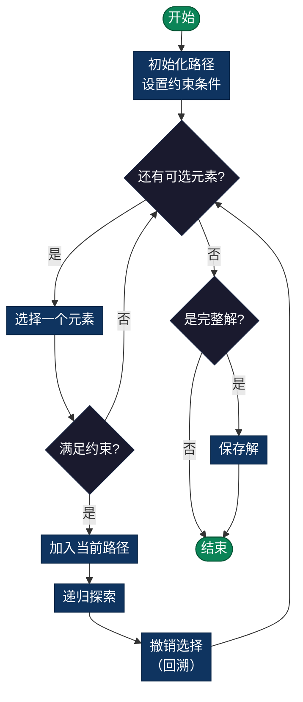

# 回溯算法 Backtracking

> 一种通用的递归求解问题的方法，采用**选择-探索-撤销**的模式，适用于排列、组合、N皇后等经典问题。

## 导航

| [算法原理](#概述) | [复杂度分析](#复杂度分析总结) | [实现列表](#实现列表) |

---

## 概述

回溯算法是一种通用的递归求解问题的方法，采用 **选择-探索-撤销** 的模式：

1. **选择**：从候选集合中选择一个元素
2. **探索**：基于这个选择继续递归探索
3. **撤销**：当当前路线无法继续时，移除该选择并尝试其他选择

**适用场景**：
- 问题有多个候选解
- 需要按某种顺序逐个构建解
- 约束条件可以被逐步验证

**常见应用**：排列、组合、N皇后、迷宫、数独等

### 流程图



---

## 算法1：全排列 (PERMUTATION)

### 描述
使用回溯法生成列表/数组的所有排列。

### 关键特性
- **方法**：选择-探索-撤销模式
- **每种语言两种实现**：
  1. **基础版**：为每个级别创建新数组/切片
  2. **优化版**：原地交换以获得更好的内存效率
- **时间复杂度**：O(n! × n)
- **空间复杂度**：O(n) 递归深度（不包括输出）

### 算法步骤
1. 对于每个位置，尝试每个未使用的元素
2. 递归排列剩余元素
3. 通过移除选定的元素进行回溯
4. 当所有元素都被使用时，保存排列

### 实现示例 (Python)

```python
def permute(nums):
    """
    生成列表的所有排列
    
    时间复杂度: O(n! * n)
    空间复杂度: O(n)
    
    参数:
        nums: 待排列的数字列表
    
    返回:
        包含所有排列的列表
    
    示例:
        permute([1, 2, 3]) -> [[1,2,3], [1,3,2], [2,1,3], ...]
    """
    result = []
    
    def backtrack(current):
        # 基础情况：已经用完所有元素，说明找到一个完整排列
        if len(current) == len(nums):
            result.append(current[:])
            return
        
        # 尝试每个元素作为下一个位置的候选
        for num in nums:
            if num not in current:
                # 选择：将当前元素加入排列
                current.append(num)
                # 探索：继续构建剩余排列
                backtrack(current)
                # 撤销：移除该元素，以便尝试其他候选
                current.pop()
    
    backtrack([])
    return result
```

### 包含的测试用例
- permute([1, 2, 3]) → 6 个排列
- permute([1, 2]) → 2 个排列
- permute([1]) → 1 个排列
- permute([1, 2, 3, 4]) → 24 个排列
- 字符排列示例

### 示例输出
```
测试 1：permute([1, 2, 3])
结果 (count=6):
  [1, 2, 3]
  [1, 3, 2]
  [2, 1, 3]
  [2, 3, 1]
  [3, 1, 2]
  [3, 2, 1]
```

---

## 算法2：组合 (COMBINATION)

### 描述
使用回溯法从n个元素中生成k个元素的所有组合。

### 关键特性
- **方法**：带位置约束的选择-探索-撤销
- **每种语言两种实现**：
  1. **基础版**：标准组合生成
  2. **优化版**：提前终止剪枝
- **时间复杂度**：O(C(n,k) × k)
- **空间复杂度**：O(k) 递归深度
- **公式**：C(n,k) = n! / (k! × (n-k)!)

### 算法步骤
1. 从位置 1 到 n 开始
2. 仅考虑 >= 当前位置的元素（避免重复）
3. 当组合大小达到 k 时，保存它
4. 回溯并尝试下一个元素
5. 提前终止：如果剩余元素不足则停止

### 实现示例 (Python)

```python
def combine(n, k):
    """
    从 1 到 n 中选择 k 个数的所有组合
    
    时间复杂度: O(C(n,k) * k)
    空间复杂度: O(k)
    
    参数:
        n: 范围的上界
        k: 需要选择的元素个数
    
    返回:
        包含所有组合的列表
    
    示例:
        combine(4, 2) -> [[1,2], [1,3], [1,4], [2,3], [2,4], [3,4]]
    """
    result = []
    
    def backtrack(start, current):
        # 基础情况：已经选了 k 个元素
        if len(current) == k:
            result.append(current[:])
            return
        
        # 探索范围 [start, n]，避免重复组合
        for i in range(start, n + 1):
            # 选择：将数字 i 加入当前组合
            current.append(i)
            # 探索：继续选择更大的数字（保证组合有序）
            backtrack(i + 1, current)
            # 撤销：移除数字 i
            current.pop()
    
    backtrack(1, [])
    return result
```

### 包含的测试用例
- combine(4, 2) → 6 个组合
- combine(3, 1) → 3 个组合
- combine(3, 3) → 1 个组合
- combine(5, 3) → 10 个组合
- combine(6, 2) → 15 个组合

### 示例输出
```
测试 1：combine(4, 2)
结果 (count=6):
  [1, 2]
  [1, 3]
  [1, 4]
  [2, 3]
  [2, 4]
  [3, 4]
```

### 算法步骤
1. 从位置 1 到 n 开始
2. 仅考虑 >= 当前位置的元素（避免重复）
3. 当组合大小达到 k 时，保存它
4. 回溯并尝试下一个元素
5. 提前终止：如果剩余元素不足则停止

### 包含的测试用例
- combine(4, 2) → 6 个组合
- combine(3, 1) → 3 个组合
- combine(3, 3) → 1 个组合
- combine(5, 3) → 10 个组合
- combine(6, 2) → 15 个组合

### 示例输出
```
测试 1：combine(4, 2)
结果 (count=6):
  [1, 2]
  [1, 3]
  [1, 4]
  [2, 3]
  [2, 4]
  [3, 4]
```

---

## 算法3：N皇后 (N-QUEENS)

### 描述
在 n×n 棋盘上放置 n 个皇后，使得任意两个皇后都不能相互攻击，使用回溯法。

### 关键特性
- **方法**：逐行放置，带攻击检测
- **每种语言两种实现**：
  1. **求解**：返回所有有效解
  2. **计数**：计算解数而不存储（内存高效）
- **时间复杂度**：O(n!) 带剪枝
- **空间复杂度**：O(n) 用于跟踪列和对角线

### 攻击检测
皇后沿三个方向攻击：
1. **同列**：在集合中跟踪
2. **对角线（↘）**：按 (row - col) 跟踪
3. **对角线（↙）**：按 (row + col) 跟踪

### 实现示例 (Python)

```python
def solve_n_queens(n):
    """
    在 n×n 的棋盘上放置 n 个皇后，使得它们互不攻击
    
    时间复杂度: O(n!)
    空间复杂度: O(n)
    
    参数:
        n: 棋盘大小
    
    返回:
        所有可行的皇后放置方案
    
    约束条件：
    - 每行恰好一个皇后
    - 每列恰好一个皇后
    - 任意两个皇后不在同一条对角线上
    """
    result = []
    
    # 记录已占用的列和对角线
    cols = set()
    diag1 = set()  # 左上到右下对角线：row - col
    diag2 = set()  # 右上到左下对角线：row + col
    
    def backtrack(row, current_solution):
        # 基础情况：已经放置了所有 n 个皇后
        if row == n:
            result.append([''.join(row_str) for row_str in current_solution])
            return
        
        # 尝试在当前行的每一列放置皇后
        for col in range(n):
            # 检查该位置是否合法（不与已放置的皇后冲突）
            if col not in cols and (row - col) not in diag1 and (row + col) not in diag2:
                # 选择：在 (row, col) 放置皇后
                cols.add(col)
                diag1.add(row - col)
                diag2.add(row + col)
                
                # 构建当前行的字符串表示
                row_chars = ['.' for _ in range(n)]
                row_chars[col] = 'Q'
                current_solution.append(row_chars)
                
                # 探索：在下一行放置皇后
                backtrack(row + 1, current_solution)
                
                # 撤销：移除该皇后及其标记
                current_solution.pop()
                cols.remove(col)
                diag1.remove(row - col)
                diag2.remove(row + col)
    
    backtrack(0, [])
    return result
```

### 已知解
- N=1：1 个解
- N=2：0 个解
- N=3：0 个解
- N=4：2 个解
- N=5：10 个解
- N=6：4 个解
- N=7：40 个解
- N=8：92 个解

### 包含的测试用例
- solveNQueens(4) → 2 个解
- solveNQueens(1) → 1 个解
- solveNQueens(5) → 10 个解
- countNQueens(1-8) → 所有大小的计数

### 示例输出
```
测试 1：solveNQueens(4)
找到 2 个解：

解 1：
  .Q..
  ...Q
  Q...
  ..Q.

解 2：
  ..Q.
  Q...
  ...Q
  .Q..
```

### 算法步骤
1. 每行放置一个皇后（列待定）
2. 对于每一行，尝试每一列
3. 检查放置是否安全（与之前的皇后无冲突）
4. 如果安全，放置皇后并移动到下一行
5. 如果放置了所有 n 个皇后，找到一个解
6. 回溯并尝试下一列

### 使用的剪枝技术
1. **排列**：检查元素是否已被使用
2. **组合**：仅考虑 >= 当前位置的元素
3. **N皇后**：检查列和对角线冲突

---

## 复杂度分析总结

| 算法 | 时间复杂度 | 空间复杂度 | 解数 |
|-----------|-----------------|------------------|-------------|
| Permutation(n) | O(n! × n) | O(n) | n! |
| Combination(n,k) | O(C(n,k) × k) | O(k) | C(n,k) |
| N-Queens(n) | O(n!) | O(n) | 变化 |

---

## 实现列表

| 语言 | 文件名 | 说明 |
|------|--------|------|
| C | [permutation.c](./permutation.c) | 全排列实现 |
| C | [combination.c](./combination.c) | 组合实现 |
| C | [nqueens.c](./nqueens.c) | N皇后实现 |
| Java | [Permutation.java](./Permutation.java) | 全排列类 |
| Java | [Combination.java](./Combination.java) | 组合类 |
| Java | [NQueens.java](./NQueens.java) | N皇后类 |
| Go | [backtracking.go](./backtracking.go) | 综合实现 |
| Python | [permutation.py](./permutation.py) | 简洁实现 |
| Python | [combination.py](./combination.py) | 组合生成 |
| Python | [nqueens.py](./nqueens.py) | N皇后求解 |
| JavaScript | [backtracking.js](./backtracking.js) | 递归实现 |
| TypeScript | [Backtracking.ts](./Backtracking.ts) | 类型安全 |
| Rust | [backtracking.rs](./backtracking.rs) | 内存安全 |

---

## 扩展阅读

- 回溯算法的剪枝优化技巧
-  Dancing Links算法（精确覆盖问题）
- 约束传播（CSP求解）