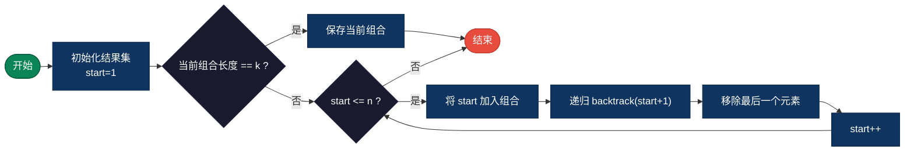
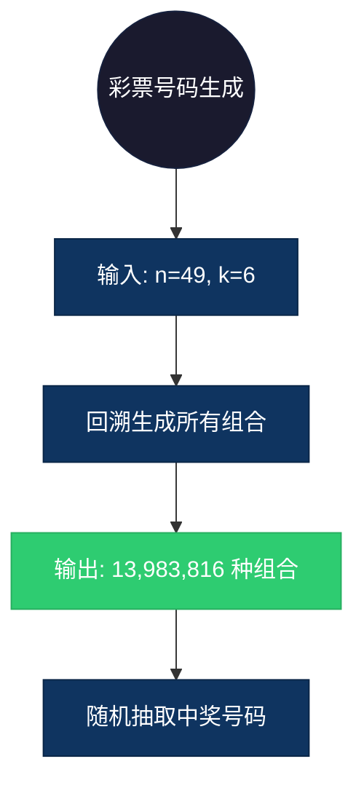

## 【组合生成算法详解】C/Java/Go/Python/JS/Rust不同语言实现

## 说明

组合生成算法使用回溯法从 n 个元素中选取 k 个元素的所有组合，即 C(n, k)。

> **生活类比**：从 5 个朋友中选 3 个人一起去旅行，列举所有可能的选择方案。

## 实现过程

1. 初始化一个空数组用于存储当前组合
2. 从指定起点开始，依次尝试选择每个元素
3. 将选中的元素加入当前组合
4. 如果组合长度达到 k，保存当前组合
5. 否则递归选择下一个元素（起点+1，避免重复）
6. 回溯：移除最后一个元素，尝试下一个选择

## 算法流程



## 示意图

```
n=4, k=2 的组合生成过程：

[1,2] [1,3] [1,4] [2,3] [2,4] [3,4]

递归树：
              []
         /  |  \  \
       1   2   3   4
      /|   |\   \
     2 3  4 3  4  4
```

## 复杂度分析

| 复杂度 | 说明 |
|--------|------|
| 时间复杂度 | O(C(n,k) * k) - 需要生成所有组合，每个组合需要复制 |
| 空间复杂度 | O(k) - 递归深度和当前组合存储 |

## 实际应用举例

### 1. 彩票号码生成
**场景**：从 1-49 中选择 6 个号码生成彩票组合。

**具体例子**：
- 输入：n=49, k=6
- 输出：所有可能的 6 个号码组合（约 1398 万种）
- 应用：彩票系统随机抽取中奖号码



### 2. 团队人员组合
**场景**：从 10 名员工中选 3 人组成项目团队。

**具体例子**：
- 输入：员工列表 [Alice, Bob, Charlie, David, Eve, Frank, Grace, Henry, Ivy, Jack], k=3
- 输出：所有可能的 3 人团队组合（120 种）
- 应用：人力资源部门评估团队搭配方案

### 3. 商品套餐推荐
**场景**：电商从 20 个商品中选 5 个组成促销套餐。

**具体例子**：
- 输入：商品列表 [商品1, 商品2, ..., 商品20], k=5
- 输出：所有可能的 5 商品套餐
- 应用：营销部门筛选利润最高的套餐组合

## 实现列表

| 语言 | 文件名 |
|------|--------|
| C | [combination.c](./combination.c) |
| Java | [Combination.java](./Combination.java) |
| Go | [combination.go](./combination.go) |
| Python | [combination.py](./combination.py) |
| JavaScript | [combination.js](./combination.js) |
| Rust | [combination.rs](./combination.rs) |
