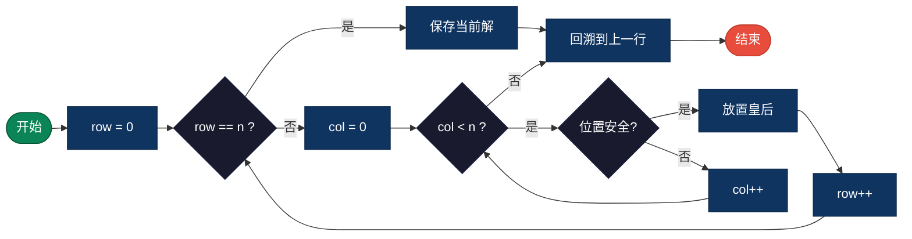
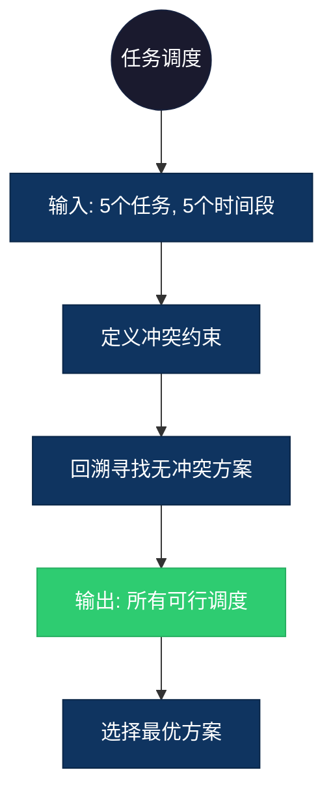

## 【N皇后问题算法详解】C/Java/Go/Python/JS/Rust不同语言实现

## 说明

N皇后问题是在 n×n 的棋盘上放置 n 个皇后，使得任意两个皇后不能相互攻击（不在同一行、列或对角线上）。

> **生活类比**：安排 n 个重要人物在 n 个座位上，要求任何两人不能坐在同一行、同一列或同一对角线上。

## 实现过程

1. 从第一行开始，尝试在每一列放置皇后
2. 检查当前放置位置是否安全（不被之前放置的皇后攻击）
3. 如果安全，放置皇后并递归到下一行
4. 如果所有皇后都放置完成，记录一个解
5. 如果当前行无法放置，回溯到上一行，尝试下一列
6. 重复直到找到所有解

## 算法流程



## 示意图

```
8皇后问题的一个解：

. . Q . . . . .
. . . . . . Q .
. . . Q . . . .
. . . . . . . Q
. Q . . . . . .
. . . . Q . . .
. . . . . Q . .
Q . . . . . . .

Q 表示皇后，. 表示空格
```

## 复杂度分析

| 复杂度 | 说明 |
|--------|------|
| 时间复杂度 | O(n!) - 最坏情况下需要探索所有可能的排列 |
| 空间复杂度 | O(n) - 递归深度和存储棋盘状态 |

## 实际应用举例

### 1. 任务调度冲突检测
**场景**：安排 n 个任务在 n 个时间段执行，检测是否存在冲突。

**具体例子**：
- 输入：n=5，任务 A、B、C、D、E，时间段 1-5
- 约束：某些任务不能在同一时间段或相邻时间段执行
- 输出：所有无冲突的调度方案
- 应用：生产计划排程、课程表安排



### 2. 电路板布局优化
**场景**：在电路板上放置 n 个元件，避免信号干扰。

**具体例子**：
- 输入：n=8，8 个元件需要在 8x8 网格中放置
- 约束：某些元件不能在同一行、列或对角线上（避免电磁干扰）
- 输出：所有可行的布局方案
- 应用：PCB 设计优化、芯片布局

### 3. 资源分配问题
**场景**：将 n 个资源分配给 n 个部门，避免资源冲突。

**具体例子**：
- 输入：n=6，6 台服务器分配给 6 个部门
- 约束：某些部门不能共享服务器或相邻服务器
- 输出：所有无冲突的分配方案
- 应用：数据中心资源管理、云服务器分配

## 实现列表

| 语言 | 文件名 |
|------|--------|
| C | [n_queens.c](./n_queens.c) |
| Java | [NQueens.java](./NQueens.java) |
| Go | [n_queens.go](./n_queens.go) |
| Python | [n_queens.py](./n_queens.py) |
| JavaScript | [n_queens.js](./n_queens.js) |
| Rust | [n_queens.rs](./n_queens.rs) |
