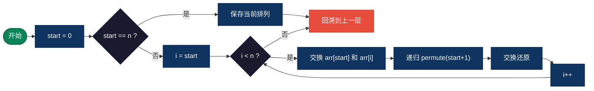
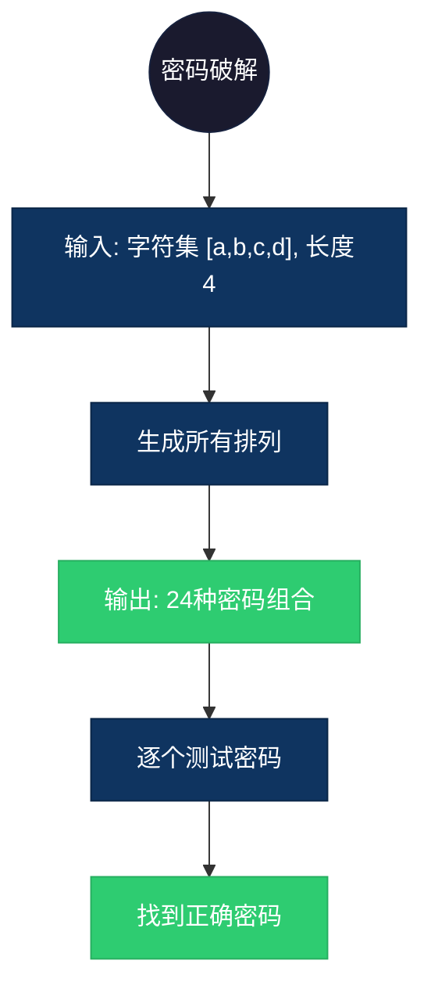

## 【全排列算法详解】C/Java/Go/Python/JS/Rust不同语言实现

## 说明

全排列算法使用回溯法生成数组/列表的所有排列，即所有可能的元素顺序组合。

> **生活类比**：安排 3 个人（A、B、C）排队，列举所有可能的排队顺序：ABC、ACB、BAC、BCA、CAB、CBA。

## 实现过程

1. 从起始位置开始，依次将每个元素交换到当前位置
2. 递归处理下一个位置
3. 当到达最后一个位置时，记录当前排列
4. 回溯：将交换的元素还原，尝试下一个元素
5. 重复直到生成所有排列

## 算法流程



## 示意图

```
[1, 2, 3] 的排列生成过程：

[1,2,3]
  ├─ [1,2,3] → [1,3,2]
  └─ [2,1,3] → [2,3,1]
              └─ [3,2,1] → [3,1,2]

递归树：
          []
      /   |   \
     1    2    3
    / \   |   / \
   2   3  1  2   3
   3   2     3   2
```

## 复杂度分析

| 复杂度 | 说明 |
|--------|------|
| 时间复杂度 | O(n! * n) - n! 个排列，每个需要 O(n) 时间复制 |
| 空间复杂度 | O(n) - 递归深度（不计算输出） |

## 实际应用举例

### 1. 密码破解
**场景**：暴力破解已知字符集的密码。

**具体例子**：
- 输入：字符集 [a, b, c, d]，密码长度 4
- 输出：所有可能的 4 字符排列（4! = 24 种）
- 应用：安全测试、密码恢复工具



### 2. 路径规划
**场景**：计算访问多个城市的所有可能路线。

**具体例子**：
- 输入：城市列表 [北京, 上海, 广州, 深圳]
- 输出：所有访问顺序（4! = 24 种）
- 应用：物流配送路线优化、旅行商问题

### 3. 排课系统
**场景**：安排多门课程在不同时间段的所有可能排法。

**具体例子**：
- 输入：课程列表 [数学, 英语, 物理, 化学, 生物]
- 输出：所有排课顺序（5! = 120 种）
- 应用：学校排课系统、考试安排

## 实现列表

| 语言 | 文件名 |
|------|--------|
| C | [permutation.c](./permutation.c) |
| Java | [Permutation.java](./Permutation.java) |
| Go | [permutation.go](./permutation.go) |
| Python | [permutation.py](./permutation.py) |
| JavaScript | [permutation.js](./permutation.js) |
| Rust | [permutation.rs](./permutation.rs) |
