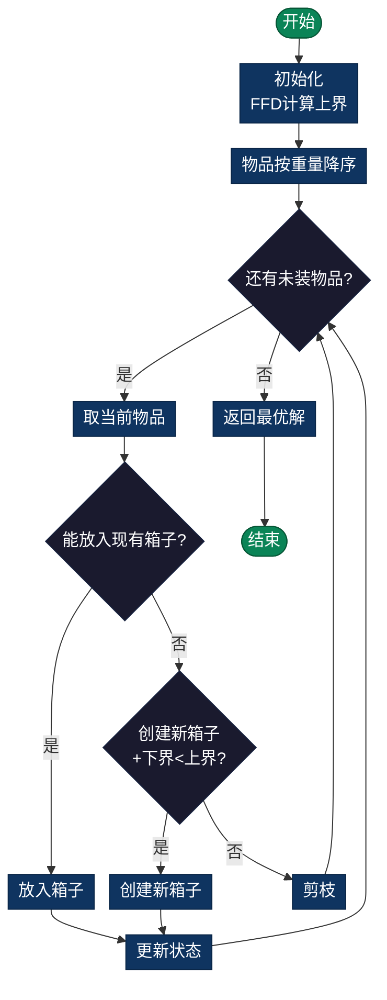

# Bin Packing Problem（装箱问题）

> 将n个物品装入最少数量的容量相同的箱子中，每个物品不可分割。经典NP-hard组合优化问题。

## 导航

| [问题定义](#问题定义) | [分支定界策略](#分支定界策略) | [复杂度分析](#时间复杂度) | [实现列表](#实现列表) |

---

## 问题定义
将n个物品装入最少数量的容量相同的箱子中，每个物品不可分割。

## 数学表述
最小化：使用的箱子数量m

约束条件：每个箱子中物品总重量 ≤ 容量C

## 分支定界策略

### 下界估计（Lower Bound）
使用**连续松弛**：
```
LB = ⌈(∑ 物品重量) / 箱容量⌉
```

### 上界估计（Upper Bound）
**First Fit Decreasing (FFD)** 贪心算法：
```
1. 将物品按重量降序排列
2. 对每个物品，放入第一个能容纳它的箱子
3. 若无法放入任何箱子，创建新箱子
结果是上界
```

### 剪枝条件
若 `当前箱子数 + 下界 ≥ 当前最优` → 剪枝该分支

### 流程图



## 时间复杂度
- **最坏情况**：O(2^n)
- **FFD贪心**：O(n log n) + O(n*m_opt)
- **分支定界**：O(n * m / k)，k是剪枝因子

## Bin Packing的NP困难性
- 这是一个**NP困难**问题
- 没有已知多项式算法
- 贪心近似：FFD保证在7/6倍最优解内

## 实现细节

### 关键决策
1. **放入现有箱子**：尝试将物品放入已有的箱子
2. **创建新箱子**：若无法放入，创建新箱子

### 优化技巧
- **物品排序**：降序排列提高装箱效率
- **FFD初值**：用FFD得到初始上界
- **最先适应递减**：First Fit Decreasing

## 应用场景
- **物流**：集装箱装载、卡车配送
- **存储**：磁盘块分配、内存分页
- **制造**：零件装配、批量生产

---

## 实现列表

| 语言 | 文件名 | 说明 |
|------|--------|------|
| C | [bin_packing.c](./bin_packing.c) | 分支定界实现 |
| Java | [BinPacking.java](./BinPacking.java) | 装箱问题类 |
| Python | [bin_packing.py](./bin_packing.py) | 简洁实现 |
| Go | [bin_packing.go](./bin_packing.go) | 并发优化 |

---

## 扩展阅读

- FFD近似算法的性能保证
- 三维装箱问题变体
- 在线装箱算法## 相关问题
- **带权Bin Packing**：物品有不同重要性
- **多维Bin Packing**：物品占用多个维度空间
- **在线Bin Packing**：物品动态到达
