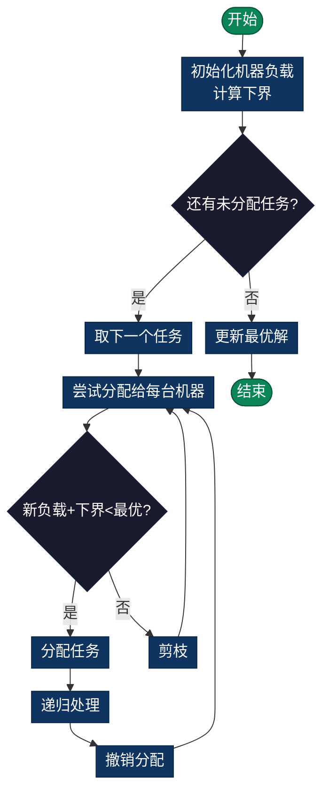

# Job Scheduling Problem（任务调度问题）

> 将n个任务分配给m台机器，最小化所有任务完成的时间（最大完成时间）。经典调度优化问题。

## 导航

| [问题定义](#问题定义) | [分支定界策略](#分支定界策略) | [复杂度分析](#时间复杂度) | [实现列表](#实现列表) |

---

## 问题定义
将n个任务分配给m台机器，最小化所有任务完成的时间（最大完成时间）。

## 数学表述
最小化：$\max_{j=1}^{m} \sum_{i \in S_j} t_i$

其中 $S_j$ 是分配给机器j的任务集合

## 分支定界策略

### 下界估计（Lower Bound）
```
LB = max(
    当前最长加载机器的时间,
    ⌈(∑ 剩余任务时间) / m⌉
)
```

### 上界估计（Upper Bound）
当前任务分配方案的最大完成时间。

### 剪枝条件
若 `下界(task) ≥ 当前最优` → 剪枝该分支

### 流程图



## 时间复杂度
- **最坏情况**：O(m^n)（每个任务有m种选择）
- **实际情况**：O(m^n / k)
- **空间复杂度**：O(n + m)

## 与其他调度问题的关系
| 问题 | 约束 | 目标 |
|------|------|------|
| 机器调度 | 无优先级 | 最小化最大完成时间 |
| 流程车间 | 任务顺序固定 | 最小化最大完成时间 |
| 作业车间 | 任务在不同机器 | 最小化总时间 |

## 实现细节

### 关键数据结构
```python
machine_times = [0] * m  # 每台机器的当前加载时间
current_assignment = [[...] for _ in range(m)]  # 当前分配方案
```

### 递归逻辑
```
1. 对当前任务，尝试分配给每台机器
2. 更新该机器的加载时间
3. 计算下界，决定是否继续
4. 递归分配下一个任务
5. 回溯
```

## 启发式优化

### 贪心初始解
```
# Longest Processing Time (LPT)
1. 按处理时间降序排列
2. 每次选择加载最少的机器
```

### 动态规划补充
- 对小规模实例（n ≤ 20），可用DP预处理

## 应用场景
- **云计算**：任务到虚拟机分配
- **并行计算**：进程到处理器分配
- **制造业**：产品到生产线分配
- **数据中心**：负载均衡

## 扩展问题
- **带优先级**：某些任务必须在其他前完成
- **带通信成本**：任务间有依赖关系
- **带机器差异**：不同机器性能不同
- **在线调度**：任务动态到达

---

## 实现列表

| 语言 | 文件名 | 说明 |
|------|--------|------|
| C | [job_scheduling.c](./job_scheduling.c) | 分支定界实现 |
| Java | [JobScheduling.java](./JobScheduling.java) | 调度问题类 |
| Python | [job_scheduling.py](./job_scheduling.py) | 简洁实现 |
| Go | [job_scheduling.go](./job_scheduling.go) | 并发优化 |

---

## 扩展阅读

- List Scheduling近似算法
- 异构机器调度问题
- 带优先级约束的调度
