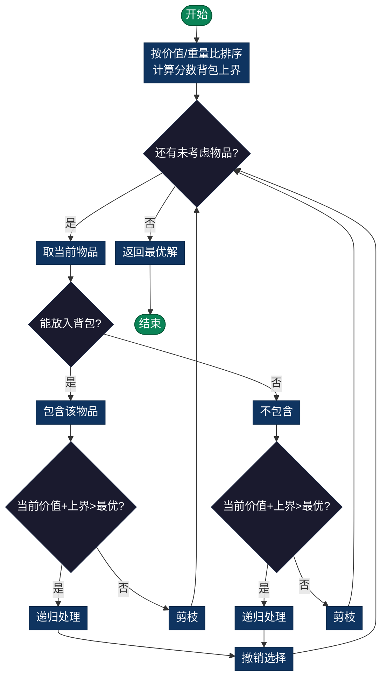

# 0-1 Knapsack Optimization（0-1背包优化）

> 在背包容量限制下，选择物品使总价值最大。使用分支定界优化搜索空间。

---

## 问题定义
在容量限制下，选择物品使得总价值最大（与DP版本相同，但用分支定界求解）。

## 数学表述
最大化：$\sum_{i=0}^{n-1} v_i \cdot x_i$

约束条件：$\sum_{i=0}^{n-1} w_i \cdot x_i \leq C$，其中 $x_i \in \{0, 1\}$

## 分支定界策略

### 上界估计（Upper Bound）
使用**分数背包放松**（Fractional Knapsack Relaxation）：
```
允许拿取物品的一部分，贪心选择价值/重量比最高的物品
结果是0-1背包的上界
```

### 下界估计（Lower Bound）
当前选中物品的总价值。

### 剪枝条件
若 `当前物品价值 + 上界 ≤ 当前最优` → 剪枝该分支

### 流程图



## 时间复杂度
- **最坏情况**：O(2^n)（完全搜索树）
- **实际情况**：O(2^n / k)，k取决于剪枝效率
- **空间复杂度**：O(n)（递归深度）

## DP vs 分支定界对比
| 方面 | DP | 分支定界 |
|------|-----|--------|
| **空间** | O(nC) | O(n) |
| **时间** | O(nC) | O(2^n/k) |
| **最优** | 保证，多项式 | 保证，指数（剪枝后） |
| **类型** | 数据密集 | 计算密集 |

## 实现细节

### 关键决策
1. **包含物品**：如果容量允许，选择包含当前物品
2. **排除物品**：跳过当前物品，尝试其他选择

### 优化技巧
- **排序**：按价值/重量比降序排列，提高剪枝效率
- **贪心初值**：用贪心得到初始上界，加速剪枝

## 应用场景
- **投资组合优化**：在预算限制下最大化收益
- **资源分配**：网络带宽、内存分配
- **物品装箱**：物流中的装箱优化

## 相关问题
- **多维背包**：多个容量约束
- **绑定背包**：物品组合约束
- **分组背包**：物品来自互斥组

---

## 实现列表

| 语言 | 文件名 | 说明 |
|------|--------|------|
| C | [knapsack_bb.c](./knapsack_bb.c) | 分支定界实现 |
| Java | [KnapsackBB.java](./KnapsackBB.java) | 背包问题类 |
| Python | [knapsack_bb.py](./knapsack_bb.py) | 简洁实现 |
| Go | [knapsack_bb.go](./knapsack_bb.go) | 并发优化 |

---

## 扩展阅读

- 分数背包问题（贪心解法）
- 动态规划解法对比
- 多约束背包问题
---

## 实现列表

| 语言 | 文件名 | 说明 |
|------|--------|------|
| C | [knapsack_bb.c](./knapsack_bb.c) | 分支定界实现 |
| Java | [KnapsackBB.java](./KnapsackBB.java) | 背包问题类 |
| Python | [knapsack_bb.py](./knapsack_bb.py) | 简洁实现 |
| Go | [knapsack_bb.go](./knapsack_bb.go) | 并发优化 |

---

## 扩展阅读

- 分数背包问题（贪心解法）
- 动态规划解法对比
- 多约束背包问题
