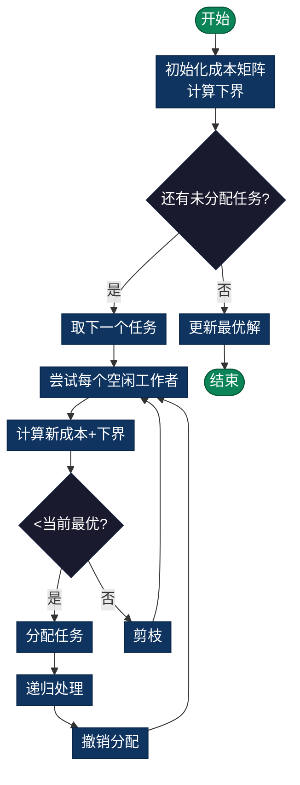

# Task Assignment Problem（任务分配问题）

> 将n个任务分配给n个工作者，使得总成本最小。每个任务恰好分配给一个工作者，经典指派问题。

## 导航

| [问题定义](#问题定义) | [分支定界策略](#分支定界策略) | [复杂度分析](#时间复杂度) | [实现列表](#实现列表) |

---

## 问题定义
将n个任务分配给m个工作者，使得总成本最小。每个任务恰好分配给一个工作者。

## 数学表述
最小化：$\sum_{i=0}^{n-1} c_{i,x_i}$

约束条件：每个任务分配给恰好一个工作者，每个工作者最多处理一个任务（当n=m时）

## 分支定界策略

### 下界估计（Lower Bound）
**匈牙利算法近似**或**贪心选择**：
```
对每个未分配任务，选择成本最低的工作者
结果是最优解的下界
```

### 上界估计（Upper Bound）
当前找到的最优分配方案的总成本。

### 剪枝条件
若 `当前分配成本 + 下界 ≥ 当前最优` → 剪枝该分支

### 流程图



## 时间复杂度
- **最坏情况**：O(n!)（完全排列）
- **实际情况**：O(n!/k)，k是剪枝因子
- **空间复杂度**：O(n)

## 与最优分配问题的关系
这是一个特殊的**二部图最小成本匹配问题**。
- **精确算法**：匈牙利算法 O(n³)
- **分支定界**：O(n!/k)，在n小时有竞争力

## 实现细节

### 成本矩阵含义
```
cost[i][j] = 将任务i分配给工作者j的成本
```

### 递归结构
```
1. 枚举当前任务的所有可能工作者
2. 标记工作者已分配
3. 递归分配下一个任务
4. 回溯，尝试其他工作者
```

## 应用场景
- **人力资源**：员工工作分配
- **云计算**：任务到服务器映射
- **制造业**：生产任务调度
- **项目管理**：人员任务分配

## 扩展问题
- **多任务工作者**：一个工作者可处理多个任务
- **工作者分组**：某些工作者互斥
- **优先级约束**：任务有优先级

---

## 实现列表

| 语言 | 文件名 | 说明 |
|------|--------|------|
| C | [task_assignment.c](./task_assignment.c) | 分支定界实现 |
| Java | [TaskAssignment.java](./TaskAssignment.java) | 任务分配类 |
| Python | [task_assignment.py](./task_assignment.py) | 简洁实现 |
| Go | [task_assignment.go](./task_assignment.go) | 并发优化 |

---

## 扩展阅读

- 匈牙利算法（多项式解法）
- Auction算法
- 带约束的任务分配
