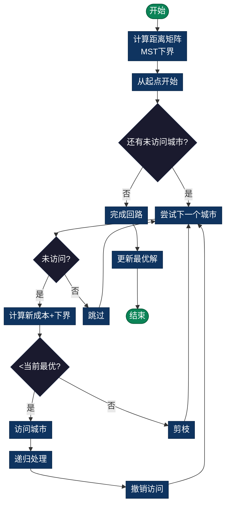

# Traveling Salesman Problem (TSP，旅行商问题)

> 找到访问所有城市恰好一次并以最小成本返回起点的最短封闭路径。经典NP-hard组合优化问题。

## 导航

| [问题定义](#问题定义) | [分支定界策略](#分支定界策略) | [复杂度分析](#时间复杂度) | [实现列表](#实现列表) |

---

## 问题定义
找到访问所有城市恰好一次并以最小成本返回起点的最短封闭路径（哈密尔顿回路）。

## 数学表述
最小化：$\sum_{i=0}^{n-1} d(x_i, x_{i+1})$，其中路径访问每个城市恰好一次。

## 分支定界策略

### 下界估计（Lower Bound）
使用**最小生成树近似**或**1-树放松**：
```
LB = 当前路径成本 + 最小边权和
```

### 上界估计（Upper Bound）
当前找到的最优完整tour成本。

### 剪枝条件
若 `当前部分路径成本 + 下界 ≥ 当前最优` → 剪枝该分支

### 流程图



## 时间复杂度
- **最坏情况**：O(n!)（无剪枝）
- **平均情况**：O(n! / k)，k是剪枝因子
- **空间复杂度**：O(n)（递归深度）

## 实现细节

### 关键部分
1. **距离矩阵**：d[i][j] 表示城市i到j的距离
2. **访问标记**：visited[] 跟踪已访问城市
3. **路径记录**：path[] 存储最优路径

### 算法流程
```
1. 从起点出发（假设为城市0）
2. 递归尝试访问未访问的城市
3. 计算当前部分路径的下界
4. 若下界小于当前最优解，继续探索；否则剪枝
5. 完成全路径后更新最优解
```

## 应用场景
- 物流配送：快递员最优路线
- 制造业：机器加工流程顺序
- 电路设计：芯片钻孔最优顺序
- 旅游规划：景点访问路线

## 相关问题
- **车辆路由问题(VRP)**：多辆车配送
- **运输问题(TP)**：多仓库配送
- **线性分配问题**：资源最优分配

---

## 实现列表

| 语言 | 文件名 | 说明 |
|------|--------|------|
| C | [tsp.c](./tsp.c) | 分支定界实现 |
| Java | [TSP.java](./TSP.java) | TSP问题类 |
| Python | [tsp.py](./tsp.py) | 简洁实现 |
| Go | [tsp.go](./tsp.go) | 并发优化 |

---

## 扩展阅读

- 动态规划解法（Held-Karp算法）
- 近似算法（Christofides算法）
- 蚁群优化等元启发式算法
