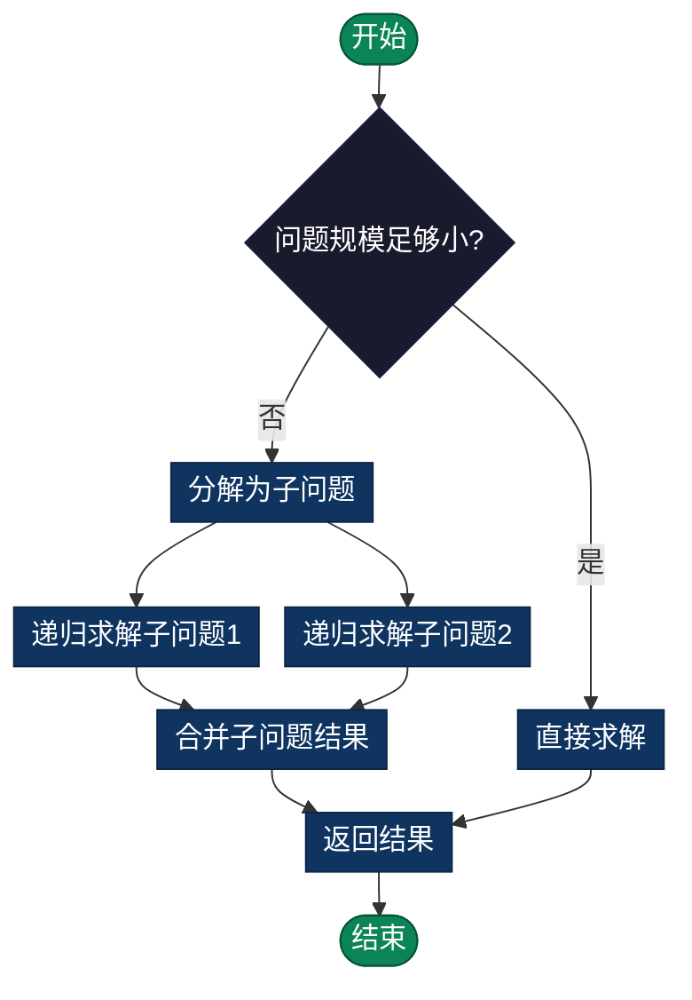

# 分治算法 Divide and Conquer

> 将复杂大问题分解为规模较小的相同子问题，递归求解后合并结果。是许多高效算法（快速排序、归并排序、二分查找）的基础。

## 导航

| [算法原理](#概述) | [复杂度分析](#复杂度分析) | [实现列表](#实现列表) |

---

## 概述
分治（Divide and Conquer）是一种重要的算法设计思想，其核心理念是"分而治之"。该算法将一个复杂的大问题分解为规模较小的相同子问题，递归地解决这些子问题，然后将子问题的解合并为原问题的解。分治是许多高效算法（如快速排序、归并排序、二分查找）的基础。

### 分治算法的三个步骤
1. **分解（Divide）**：将问题分解为规模更小的相同子问题
2. **解决（Conquer）**：递归求解这些子问题
3. **合并（Combine）**：将子问题的解合并为原问题的解

### 图形结构示例
以归并排序为例，分治过程：
```
原数组: [38, 27, 43, 3, 9, 82, 10]

分解阶段（Divide）：
           [38, 27, 43, 3, 9, 82, 10]
          /                          \
      [38, 27, 43, 3]          [9, 82, 10]
      /         \              /       \
   [38,27]    [43,3]       [9,82]    [10]
   /    \     /    \       /    \      |
 [38]  [27]  [43]  [3]   [9]  [82]   [10]

合并阶段（Combine）：
 [38]  [27]  [43]  [3]   [9]  [82]   [10]
   \    /     \    /       \    /      /
   [27,38]   [3,43]       [9,82]    [10]
      \        /             \      /
      [3,27,38,43]       [9,10,82]
            \                /
         [3,9,10,27,38,43,82]
```

### 特点

#### 优点
- **高效算法**：产生许多高效算法（快速排序O(n log n)、二分查找O(log n)）
- **并行性**：子问题独立，天然适合并行计算
- **问题分解**：复杂问题清晰分解为子问题
- **最优子结构**：许多问题具有最优子结构，分治自然适用

#### 缺点
- **额外开销**：递归调用和数据合并产生额外开销
- **栈深度**：过多的递归可能导致栈溢出
- **空间复杂度**：通常需要额外空间存储中间结果
- **不是所有问题都适合**：某些问题分治效率不高

### 操作方式
- **递归分解**：将问题递归分解为子问题
- **递归求解**：对每个子问题递归调用相同函数
- **合并结果**：将子问题的结果合并为最终答案

### 流程图



### 复杂度分析

| 算法 | 时间复杂度 | 空间复杂度 | 适用场景 |
|------|----------|----------|--------|
| 二分查找 | O(log n) | O(1) | 已排序数组查找 |
| 归并排序 | O(n log n) | O(n) | 大规模数据排序 |
| 快速排序 | O(n log n) 平均 | O(log n) | 通用排序 |
| 二分幂运算 | O(log n) | O(log n) | 计算幂运算 |

### 应用场景
- **排序算法**：快速排序、归并排序
- **搜索算法**：二分查找、在排序数组中搜索
- **计算问题**：矩阵乘法（Strassen算法）、快速幂
- **其他问题**：最接近的点对、计数逆序对

### 简单例子

#### Python 示例 - 二分查找
```python
# 二分查找：每次排除一半数据，O(log n) 时间复杂度
def binary_search(arr, target):
    """在已排序数组中查找目标值"""
    left, right = 0, len(arr) - 1

    while left <= right:
        mid = (left + right) // 2
        if arr[mid] == target:
            return mid
        elif arr[mid] < target:
            left = mid + 1  # 目标在右侧
        else:
            right = mid - 1  # 目标在左侧

    return -1  # 未找到

# 递归版二分查找
def binary_search_recursive(arr, target, left, right):
    """递归实现二分查找"""
    if left > right:
        return -1

    mid = (left + right) // 2
    if arr[mid] == target:
        return mid
    elif arr[mid] < target:
        return binary_search_recursive(arr, target, mid + 1, right)
    else:
        return binary_search_recursive(arr, target, left, mid - 1)

# 使用
arr = [1, 3, 5, 7, 9, 11, 13]
print(binary_search(arr, 7))  # 输出: 3
```

#### Python 示例 - 归并排序
```python
# 归并排序：分治算法的经典例子
def merge_sort(arr):
    """归并排序：O(n log n) 时间复杂度"""
    if len(arr) <= 1:
        return arr

    # 分解：将数组分成两部分
    mid = len(arr) // 2
    left = merge_sort(arr[:mid])
    right = merge_sort(arr[mid:])

    # 合并：合并两个已排序的数组
    return merge(left, right)

def merge(left, right):
    """合并两个已排序数组"""
    result = []
    i, j = 0, 0

    while i < len(left) and j < len(right):
        if left[i] <= right[j]:
            result.append(left[i])
            i += 1
        else:
            result.append(right[j])
            j += 1

    result.extend(left[i:])
    result.extend(right[j:])
    return result

# 使用
arr = [38, 27, 43, 3, 9, 82, 10]
print(merge_sort(arr))  # 输出: [3, 9, 10, 27, 38, 43, 82]
```

#### C 语言示例 - 二分查找
```c
#include <stdio.h>

/* 二分查找：O(log n) 时间复杂度 */
int binary_search(int arr[], int size, int target) {
    int left = 0, right = size - 1;

    while (left <= right) {
        int mid = (left + right) / 2;
        if (arr[mid] == target) {
            return mid;  /* 找到目标 */
        } else if (arr[mid] < target) {
            left = mid + 1;  /* 目标在右侧 */
        } else {
            right = mid - 1;  /* 目标在左侧 */
        }
    }

    return -1;  /* 未找到 */
}

/* 递归版二分查找 */
int binary_search_recursive(int arr[], int target, int left, int right) {
    if (left > right) {
        return -1;
    }

    int mid = (left + right) / 2;
    if (arr[mid] == target) {
        return mid;
    } else if (arr[mid] < target) {
        return binary_search_recursive(arr, target, mid + 1, right);
    } else {
        return binary_search_recursive(arr, target, left, mid - 1);
    }
}

int main() {
    int arr[] = {1, 3, 5, 7, 9, 11, 13};
    int size = sizeof(arr) / sizeof(arr[0]);

    printf("位置: %d\n", binary_search(arr, size, 7));  /* 输出: 3 */
    return 0;
}
```

#### Java 示例 - 快速排序
```java
public class QuickSort {
    /* 快速排序：平均 O(n log n) 时间复杂度 */
    public static void quickSort(int[] arr, int left, int right) {
        if (left < right) {
            // 分解：选择枢纽并分割
            int pivot = partition(arr, left, right);

            // 解决：递归排序左右两部分
            quickSort(arr, left, pivot - 1);
            quickSort(arr, pivot + 1, right);
        }
    }

    /* 分割函数：返回枢纽的最终位置 */
    private static int partition(int[] arr, int left, int right) {
        int pivot = arr[right];
        int i = left - 1;

        for (int j = left; j < right; j++) {
            if (arr[j] < pivot) {
                i++;
                int temp = arr[i];
                arr[i] = arr[j];
                arr[j] = temp;
            }
        }

        int temp = arr[i + 1];
        arr[i + 1] = arr[right];
        arr[right] = temp;

        return i + 1;
    }

    public static void main(String[] args) {
        int[] arr = {38, 27, 43, 3, 9, 82, 10};
        quickSort(arr, 0, arr.length - 1);
        for (int x : arr) System.out.print(x + " ");
    }
}
```

#### Go 示例 - 分治
```go
package main

import "fmt"

// 二分查找
func BinarySearch(arr []int, target int) int {
    left, right := 0, len(arr)-1

    for left <= right {
        mid := (left + right) / 2
        if arr[mid] == target {
            return mid
        } else if arr[mid] < target {
            left = mid + 1
        } else {
            right = mid - 1
        }
    }

    return -1
}

// 归并排序
func MergeSort(arr []int) []int {
    if len(arr) <= 1 {
        return arr
    }

    // 分解：分成两部分
    mid := len(arr) / 2
    left := MergeSort(arr[:mid])
    right := MergeSort(arr[mid:])

    // 合并：合并两个已排序的数组
    return Merge(left, right)
}

// 合并函数
func Merge(left, right []int) []int {
    result := make([]int, 0, len(left)+len(right))
    i, j := 0, 0

    for i < len(left) && j < len(right) {
        if left[i] <= right[j] {
            result = append(result, left[i])
            i++
        } else {
            result = append(result, right[j])
            j++
        }
    }

    result = append(result, left[i:]...)
    result = append(result, right[j:]...)
    return result
}

func main() {
    arr := []int{38, 27, 43, 3, 9, 82, 10}
    fmt.Println(MergeSort(arr))  // [3 9 10 27 38 43 82]
}
```

### 分治算法模板

所有分治算法遵循相同的模式：

```python
def divide_conquer(problem):
    # 1. 基础情况：问题足够小，直接求解
    if is_base_case(problem):
        return solve_directly(problem)

    # 2. 分解：将问题分解为子问题
    sub_problems = divide(problem)

    # 3. 解决：递归求解子问题
    sub_results = []
    for sub_problem in sub_problems:
        sub_result = divide_conquer(sub_problem)
        sub_results.append(sub_result)

    # 4. 合并：合并子问题的结果
    result = combine(sub_results)

    return result
```

### 常见陷阱
1. **分解不当**：子问题不能独立求解或不符合原问题结构
2. **合并错误**：子问题的解无法正确合并为原问题的解
3. **基础情况缺失**：导致无限递归
4. **效率不高**：某些问题分治反而增加复杂度
5. **空间复杂度过高**：递归深度过大导致栈溢出

### 高级分治与递归完整代码示例

以下为分治算法完整实现，涵盖归并排序、快速排序、二分查找、快速幂、最大子数组和等分治经典问题，含详细注释与测试：

```python
"""
分治与递归（Divide and Conquer）- 大问题分解的艺术

分治法的三个步骤：
1. 分解（Divide）：将原问题分解为若干子问题
   - 子问题是原问题的较小实例
   - 形式和原问题相同但规模更小

2. 递归求解（Conquer）：递归地求解每个子问题
   - 若子问题仍然过大，继续分解
   - 直到问题规模足够小可直接求解

3. 合并（Combine）：将子问题的答案合并得到原问题的解
   - 根据子问题的解构造原问题的解

关键特性：
- 层级结构清晰：形成递归树
- 子问题相对独立：处理互不影响
- 合并相对简单：如何将子问题答案组合

时间复杂度分析：
使用主定理（Master Theorem）分析 T(n) = aT(n/b) + f(n)
- a：子问题个数
- n/b：每个子问题的规模
- f(n)：分解和合并的代价

常见应用：
- 排序：归并排序 O(n log n)、快速排序 O(n log n)
- 搜索：二分搜索 O(log n)
- 树/图算法：二叉树遍历、图连通性等
- 数值计算：矩阵乘法、傅里叶变换等
- 几何算法：最近点对问题等
"""

# 问题 1: 归并排序（Merge Sort）
def merge_sort(arr):
    """
    归并排序 - 分治的经典排序算法
    
    流程：
    1. 分解：将数组对半分割直到单元素
    2. 合并：比较相邻的排好序的子数组，合并成一个更大的有序数组
    
    时间复杂度：O(n log n)（最好、平均、最坏都是）
    空间复杂度：O(n)（需要临时存储合并的数据）
    
    稳定性：稳定的排序算法（相等元素保持原相对位置）
    
    参数:
        arr: 待排序的数组
    
    返回:
        排好序的数组
    
    示例:
        merge_sort([38, 27, 43, 3, 9]) → [3, 9, 27, 38, 43]
    """
    # 基础情况：数组长度 <= 1 时已有序
    if len(arr) <= 1:
        return arr
    
    # 步骤 1：分解 - 找中点分割数组
    mid = len(arr) // 2
    left_half = arr[:mid]
    right_half = arr[mid:]
    
    # 步骤 2：递归求解 - 对左右两个子数组分别排序
    left_sorted = merge_sort(left_half)
    right_sorted = merge_sort(right_half)
    
    # 步骤 3：合并 - 将两个有序子数组合并为一个有序数组
    return merge(left_sorted, right_sorted)

def merge(left, right):
    """
    合并两个有序数组
    
    关键思路：
    - 使用两个指针分别指向两个数组的开头
    - 每次比较两个指针指向的元素，选择较小的放入结果
    - 直到一个数组处理完，将另一个数组的剩余元素追加
    
    时间复杂度：O(m + n)（m, n 是两个数组的长度）
    """
    result = []
    i = j = 0
    
    # 逐个比较两个数组的元素
    while i < len(left) and j < len(right):
        if left[i] <= right[j]:
            # 选择左数组的元素
            result.append(left[i])
            i += 1
        else:
            # 选择右数组的元素
            result.append(right[j])
            j += 1
    
    # 追加左数组的剩余元素
    while i < len(left):
        result.append(left[i])
        i += 1
    
    # 追加右数组的剩余元素
    while j < len(right):
        result.append(right[j])
        j += 1
    
    return result

# 问题 2: 快速排序（Quick Sort）
def quick_sort(arr, low=0, high=None):
    """
    快速排序 - 分治的高效排序算法
    
    流程：
    1. 分解：选择一个基准元素（pivot），将数组分为 < pivot、= pivot、> pivot 三部分
    2. 递归求解：对 < pivot 和 > pivot 的部分递归排序
    3. 合并：自动完成（原地排序）
    
    时间复杂度：
    - 平均：O(n log n)
    - 最坏：O(n²)（当基准总是最小或最大元素时）
    - 最好：O(n log n)
    
    空间复杂度：O(log n)（递归栈深度）
    
    稳定性：不稳定的排序
    
    参数:
        arr: 待排序的数组
        low: 子数组的左端点
        high: 子数组的右端点
    
    返回:
        排好序的数组（原地排序）
    """
    if high is None:
        high = len(arr) - 1
    
    # 基础情况：子数组大小 <= 1 时已有序
    if low < high:
        # 分解：选择基准并分割
        pivot_index = partition(arr, low, high)
        
        # 递归求解：分别对左右两部分排序
        quick_sort(arr, low, pivot_index - 1)  # 左部分：< pivot
        quick_sort(arr, pivot_index + 1, high)  # 右部分：> pivot
    
    return arr

def partition(arr, low, high):
    """
    分割函数 - 选择基准并分割数组
    
    策略：Lomuto 分割方案
    - 选择最后一个元素作为基准（也可选第一个或中间的）
    - 维持两个区间：[low, i] 是 <= pivot，[i+1, j-1] 是 > pivot
    - 最后将基准放在正确位置
    
    时间复杂度：O(n)
    """
    # 选择最后一个元素作为基准
    pivot = arr[high]
    
    # i 标记 <= pivot 的最后一个元素位置
    i = low - 1
    
    # 遍历数组，比较每个元素与基准
    for j in range(low, high):
        if arr[j] <= pivot:
            i += 1
            # 交换：把 <= pivot 的元素放到左边
            arr[i], arr[j] = arr[j], arr[i]
    
    # 将基准放在正确的位置
    arr[i + 1], arr[high] = arr[high], arr[i + 1]
    
    return i + 1  # 返回基准的最终位置

# 问题 3: 二分搜索（Binary Search）
def binary_search(arr, target):
    """
    二分搜索 - 有序数组的高效搜索
    
    流程：
    1. 分解：比较中间元素与目标
    2. 递归求解：
       - 如果中间元素 == 目标，找到了
       - 如果中间元素 > 目标，搜索左半部分
       - 如果中间元素 < 目标，搜索右半部分
    3. 合并：无需合并（直接返回结果）
    
    时间复杂度：O(log n)
    空间复杂度：O(log n)（递归栈深度），迭代版本 O(1)
    
    前提条件：数组必须是已排序的
    
    参数:
        arr: 已排序的数组
        target: 要搜索的值
    
    返回:
        目标值的索引，如果不存在返回 -1
    
    示例:
        binary_search([1, 3, 5, 7, 9], 5) → 2
        binary_search([1, 3, 5, 7, 9], 4) → -1
    """
    def _binary_search_helper(low, high):
        # 基础情况：搜索范围为空
        if low > high:
            return -1
        
        # 分解：计算中点
        mid = (low + high) // 2
        
        # 分析：比较中点元素与目标
        if arr[mid] == target:
            # 找到目标，返回索引
            return mid
        elif arr[mid] < target:
            # 目标在右半部分，递归搜索右半
            return _binary_search_helper(mid + 1, high)
        else:
            # 目标在左半部分，递归搜索左半
            return _binary_search_helper(low, mid - 1)
    
    return _binary_search_helper(0, len(arr) - 1)

# 问题 4: 计算幂（Power）
def power(base, exponent):
    """
    快速幂计算 - 计算 base^exponent
    
    流程：
    1. 分解：base^n = base^(n//2) * base^(n//2) * (base if n is odd else 1)
    2. 递归求解：计算 base^(n//2)
    3. 合并：将两个 base^(n//2) 相乘（如果 n 为奇数，再乘以 base）
    
    时间复杂度：O(log n)（对比朴素方法的 O(n)）
    空间复杂度：O(log n)（递归栈）
    
    参数:
        base: 底数
        exponent: 指数（可为负数）
    
    返回:
        base^exponent 的结果
    
    示例:
        power(2, 10) → 1024
        power(2, -2) → 0.25
    """
    # 处理边界情况
    if exponent == 0:
        return 1
    
    # 处理负数指数
    if exponent < 0:
        return power(1 / base, -exponent)
    
    # 分解：计算 base^(exponent//2)
    half_power = power(base, exponent // 2)
    
    # 合并：
    if exponent % 2 == 0:
        # exponent 为偶数：base^n = (base^(n/2))^2
        return half_power * half_power
    else:
        # exponent 为奇数：base^n = (base^(n/2))^2 * base
        return half_power * half_power * base

# 问题 5: 最大子数组问题（Maximum Subarray Problem）
def max_subarray_sum(arr):
    """
    最大子数组和 - 找连续子数组使其和最大
    
    分治方法：
    1. 分解：将数组分为左右两部分
    2. 递归求解：
       - 最大和可能在左部分
       - 最大和可能在右部分
       - 最大和可能跨越中点（需要特殊处理）
    3. 合并：比较三种情况，返回最大值
    
    时间复杂度：O(n log n)（对比动态规划的 O(n)，但思想更清晰）
    空间复杂度：O(log n)（递归栈）
    
    参数:
        arr: 整数数组
    
    返回:
        最大子数组的和
    
    示例:
        max_subarray_sum([-2, 1, -3, 4, -1, 2, 1, -5, 4]) → 6
        （子数组 [4, -1, 2, 1] 的和）
    """
    def _max_subarray_helper(low, high):
        # 基础情况：只有一个元素
        if low == high:
            return arr[low]
        
        # 分解：计算中点
        mid = (low + high) // 2
        
        # 递归求解：左右两部分的最大和
        left_max = _max_subarray_helper(low, mid)
        right_max = _max_subarray_helper(mid + 1, high)
        
        # 特殊处理：跨越中点的最大和
        cross_max = _max_cross_sum(low, mid, high)
        
        # 合并：返回三者中的最大值
        return max(left_max, right_max, cross_max)
    
    def _max_cross_sum(low, mid, high):
        """计算跨越中点的最大子数组和"""
        # 从中点向左延伸，找最大和
        left_sum = float('-inf')
        sum_val = 0
        for i in range(mid, low - 1, -1):
            sum_val += arr[i]
            left_sum = max(left_sum, sum_val)
        
        # 从中点向右延伸，找最大和
        right_sum = float('-inf')
        sum_val = 0
        for i in range(mid + 1, high + 1):
            sum_val += arr[i]
            right_sum = max(right_sum, sum_val)
        
        # 跨越中点的最大和 = 左边最大和 + 右边最大和
        return left_sum + right_sum
    
    return _max_subarray_helper(0, len(arr) - 1)

# 测试代码
if __name__ == "__main__":
    print("=" * 70)
    print("分治与递归 - 完整中文注释版本")
    print("=" * 70)
    
    test_arr = [38, 27, 43, 3, 9, 82, 10]
    
    # 测试归并排序
    print("\n1. 归并排序")
    arr_copy = test_arr.copy()
    sorted_arr = merge_sort(arr_copy)
    print(f"   原始数组: {test_arr}")
    print(f"   排序后: {sorted_arr}")
    print(f"   时间复杂度: O(n log n) = O({len(test_arr)} * {len(test_arr).bit_length() - 1})")
    
    # 测试快速排序
    print("\n2. 快速排序")
    arr_copy = test_arr.copy()
    sorted_arr = quick_sort(arr_copy)
    print(f"   原始数组: {test_arr}")
    print(f"   排序后: {sorted_arr}")
    print(f"   均匀复杂度: O(n log n)，最坏 O(n²)")
    
    # 测试二分搜索
    print("\n3. 二分搜索")
    arr_sorted = sorted(test_arr)
    target = 43
    index = binary_search(arr_sorted, target)
    print(f"   有序数组: {arr_sorted}")
    print(f"   搜索 {target} 的索引: {index}")
    print(f"   时间复杂度: O(log n) = O(log {len(arr_sorted)})")
    
    # 测试快速幂
    print("\n4. 快速幂计算")
    base, exp = 2, 10
    result = power(base, exp)
    print(f"   {base}^{exp} = {result}")
    print(f"   负数指数：{base}^-2 = {power(base, -2)}")
    
    # 测试最大子数组和
    print("\n5. 最大子数组和（分治解法）")
    arr_test = [-2, 1, -3, 4, -1, 2, 1, -5, 4]
    max_sum = max_subarray_sum(arr_test)
    print(f"   数组: {arr_test}")
    print(f"   最大子数组和: {max_sum}")
    print(f"   时间复杂度: O(n log n)（分治），也可用 O(n) 的贪心解法）")
    
    print("\n" + "=" * 70)

## 实现列表

| 语言 | 文件名 | 说明 |
|------|--------|------|
| C | [binary_search.c](./binary_search.c) | 二分查找实现 |
| C | [merge_sort.c](./merge_sort.c) | 归并排序实现 |
| C | [quick_sort.c](./quick_sort.c) | 快速排序实现 |
| Java | [BinarySearch.java](./BinarySearch.java) | 二分查找类 |
| Java | [MergeSort.java](./MergeSort.java) | 归并排序类 |
| Java | [QuickSort.java](./QuickSort.java) | 快速排序类 |
| Go | [divide_and_conquer.go](./divide_and_conquer.go) | 综合实现 |
| Python | [divide_and_conquer.py](./divide_and_conquer.py) | 综合实现 |
| JavaScript | [divideAndConquer.js](./divideAndConquer.js) | 递归实现 |
| TypeScript | [DivideAndConquer.ts](./DivideAndConquer.ts) | 类型安全 |
| Rust | [divide_and_conquer.rs](./divide_and_conquer.rs) | 泛型实现 |

## 扩展阅读

- 主定理（Master Theorem）复杂度分析
- Strassen矩阵乘法算法
- Karatsuba快速乘法算法