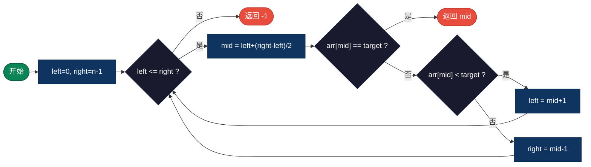
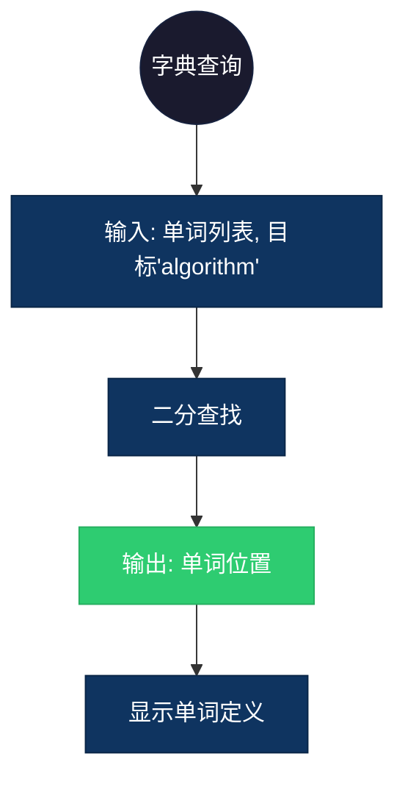

## 【二分查找算法详解】C/Java/Go/Python/JS/Rust不同语言实现

## 说明

二分查找是一种高效的查找算法，通过不断将搜索区间减半来快速定位目标值。要求数组必须已排序。

> **生活类比**：在字典中查单词，从中间开始，根据字母顺序决定向前或向后翻页。

## 实现过程

1. 初始化左右指针，left=0, right=n-1
2. 计算中间位置 mid = left + (right-left)/2
3. 比较 arr[mid] 与 target
4. 如果相等，返回 mid
5. 如果 arr[mid] < target，说明目标在右半部分，left = mid+1
6. 如果 arr[mid] > target，说明目标在左半部分，right = mid-1
7. 重复直到找到目标或 left > right

## 算法流程



## 示意图

```
在数组 [1, 3, 5, 7, 9, 11, 13] 中查找 7：

步骤1: left=0, right=6, mid=3, arr[3]=7 == 7 → 找到！

查找 4：
步骤1: left=0, right=6, mid=3, arr[3]=7 > 4, right=2
步骤2: left=0, right=2, mid=1, arr[1]=3 < 4, left=2
步骤3: left=2, right=2, mid=2, arr[2]=5 > 4, right=1
步骤4: left=2 > right=1 → 未找到
```

## 复杂度分析

| 复杂度 | 说明 |
|--------|------|
| 时间复杂度 | O(log n) - 每次将搜索区间减半 |
| 空间复杂度 | O(1) - 迭代版本，仅需常数空间 |

## 实际应用举例

### 1. 字典查询
**场景**：在英文字典中快速查询单词。

**具体例子**：
- 输入：已排序的单词列表，目标单词 "algorithm"
- 输出：单词在字典中的页码/索引
- 应用：电子词典、搜索引擎索引查询



### 2. 版本控制系统
**场景**：Git 中查找特定版本的提交。

**具体例子**：
- 输入：按时间排序的提交历史，目标提交哈希
- 输出：提交的索引位置
- 应用：Git bisect 命令快速定位引入 bug 的提交

### 3. 系统日志搜索
**场景**：在按时间排序的日志文件中查找特定时间点的日志。

**具体例子**：
- 输入：按时间戳排序的日志文件，目标时间 "2024-01-01 12:00:00"
- 输出：该时间点附近的日志条目
- 应用：日志分析系统、故障排查工具

## 实现列表

| 语言 | 文件名 |
|------|--------|
| C | [binary_search.c](./binary_search.c) |
| Java | [BinarySearch.java](./BinarySearch.java) |
| Go | [binary_search.go](./binary_search.go) |
| Python | [binary_search.py](./binary_search.py) |
| JavaScript | [binary_search.js](./binary_search.js) |
| Rust | [binary_search.rs](./binary_search.rs) |
