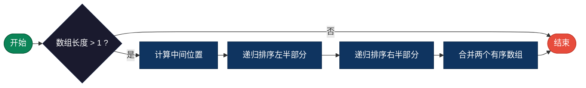
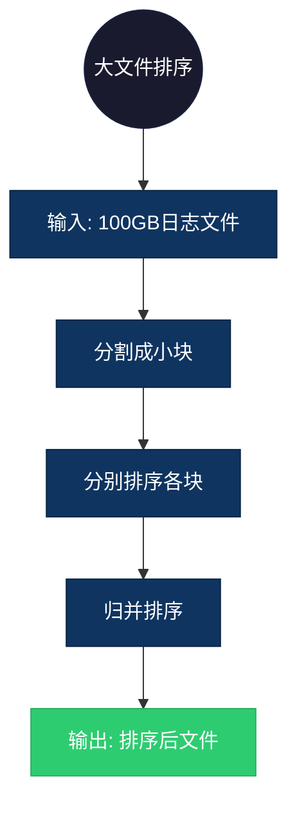

## 【归并排序算法详解】C/Java/Go/Python/JS/Rust不同语言实现

## 说明

归并排序是一种稳定的排序算法，采用分治策略，将数组分成两半，分别排序后合并。

> **生活类比**：整理扑克牌，将牌分成两堆分别整理，然后按顺序合并。

## 实现过程

1. 分解：将数组从中间分成两半
2. 递归：对左右两半分别进行归并排序
3. 合并：将两个已排序的子数组合并为一个有序数组

## 算法流程



## 示意图

```
归并排序过程：

[38, 27, 43, 3, 9, 82, 10]
        ↓ 分解
[38, 27, 43] [3, 9, 82, 10]
     ↓            ↓
[38] [27, 43] [3, 9] [82, 10]
         ↓         ↓       ↓
      [27, 43]   [3, 9] [10, 82]
        ↓          ↓       ↓
     [27, 43]   [3, 9] [10, 82]
        ↓            ↓
   [27, 38, 43]  [3, 9, 10, 82]
              ↓
     [3, 9, 10, 27, 38, 43, 82]
```

## 复杂度分析

| 复杂度 | 说明 |
|--------|------|
| 时间复杂度 | O(n log n) - 每层 O(n)，共 log n 层 |
| 空间复杂度 | O(n) - 需要额外空间存储合并结果 |

## 实际应用举例

### 1. 大文件排序
**场景**：排序超过内存容量的大文件。

**具体例子**：
- 输入：100GB 的日志文件
- 输出：按时间排序的日志文件
- 应用：外部排序、数据库排序



### 2. 多路归并
**场景**：合并多个已排序的数据流。

**具体例子**：
- 输入：10 个已排序的文件
- 输出：合并后的一个有序文件
- 应用：Hadoop MapReduce 输出合并

### 3. 逆序对计数
**场景**：计算数组中的逆序对数量。

**具体例子**：
- 输入：[2, 4, 1, 3, 5]
- 输出：3 个逆序对 (2,1), (4,1), (4,3)
- 应用：数据分析、相似度计算

## 实现列表

| 语言 | 文件名 |
|------|--------|
| C | [merge_sort.c](./merge_sort.c) |
| Java | [MergeSort.java](./MergeSort.java) |
| Go | [merge_sort.go](./merge_sort.go) |
| Python | [merge_sort.py](./merge_sort.py) |
| JavaScript | [merge_sort.js](./merge_sort.js) |
| Rust | [merge_sort.rs](./merge_sort.rs) |
