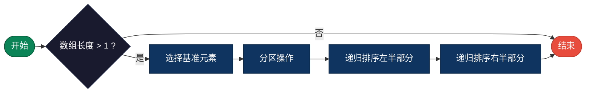
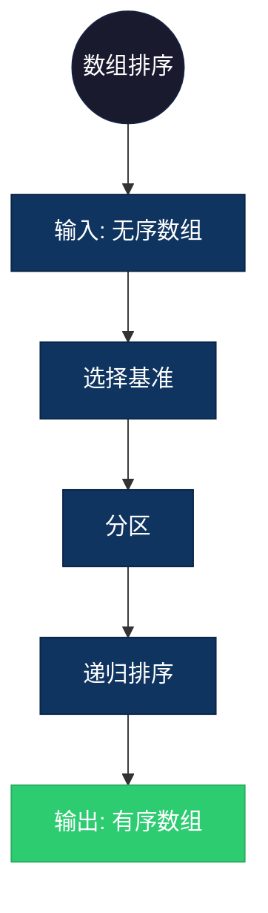

## 【快速排序算法详解】C/Java/Go/Python/JS/Rust不同语言实现

## 说明

快速排序是一种高效的排序算法，采用分治策略，选择一个基准元素，将数组分为小于和大于基准的两部分，递归排序。

> **生活类比**：整理书籍，选一本书作为基准，比它薄的放左边，比它厚的放右边，然后分别整理两边。

## 实现过程

1. 选择基准元素（pivot）
2. 分区：将数组分为小于 pivot 和大于 pivot 的两部分
3. 递归：对左右两部分分别进行快速排序
4. 合并：左右两部分已有序，无需额外合并

## 算法流程



## 示意图

```
快速排序过程（选择最后一个元素作为基准）：

[3, 6, 8, 10, 1, 2, 1]
        ↓ pivot=1
[1, 1] [3, 6, 8, 10, 2]
   ↓         ↓ pivot=2
[1, 1] [2] [3, 6, 8, 10]
              ↓ pivot=10
[1, 1, 2, 3, 6, 8, 10]
```

## 复杂度分析

| 复杂度 | 说明 |
|--------|------|
| 时间复杂度 | 平均 O(n log n)，最坏 O(n²) |
| 空间复杂度 | 平均 O(log n)，最坏 O(n) |

## 实际应用举例

### 1. 数组排序
**场景**：对大量数据进行快速排序。

**具体例子**：
- 输入：[5, 2, 9, 1, 5, 6]
- 输出：[1, 2, 5, 5, 6, 9]
- 应用：数据库排序、数据分析预处理



### 2. 第K大元素
**场景**：快速查找数组中第K大的元素。

**具体例子**：
- 输入：[3, 2, 1, 5, 6, 4], K=2
- 输出：5（第二大的元素）
- 应用：排行榜查询、中位数计算

### 3. 快速选择
**场景**：在无序数组中快速找到中位数。

**具体例子**：
- 输入：[1, 3, 2, 4, 5]
- 输出：3（中位数）
- 应用：统计分析、数据挖掘

## 实现列表

| 语言 | 文件名 |
|------|--------|
| C | [quick_sort.c](./quick_sort.c) |
| Java | [QuickSort.java](./QuickSort.java) |
| Go | [quick_sort.go](./quick_sort.go) |
| Python | [quick_sort.py](./quick_sort.py) |
| JavaScript | [quick_sort.js](./quick_sort.js) |
| Rust | [quick_sort.rs](./quick_sort.rs) |
