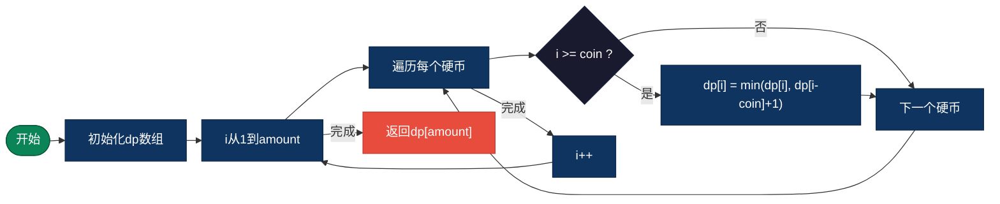
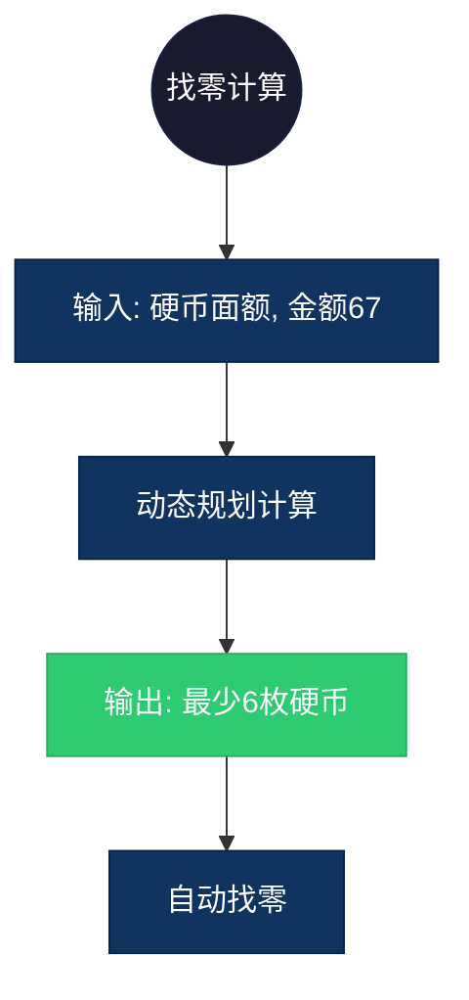

## 【零钱兑换算法详解】C/Java/Go/Python/JS/Rust不同语言实现

## 说明

零钱兑换问题是动态规划的经典问题：给定不同面额的硬币和一个总金额，计算可以凑成总金额的最少硬币数。

> **生活类比**：用 1元、5元、10元、20元纸币凑出 43 元，求最少需要几张。

## 实现过程

1. 定义 dp[i] 为凑出金额 i 的最少硬币数
2. 初始化 dp[0] = 0，其他为无穷大
3. 对于每个金额 i，遍历所有硬币面额
4. dp[i] = min(dp[i], dp[i-coin] + 1)
5. 返回 dp[amount]

## 算法流程



## 示意图

```
coins = [1, 2, 5], amount = 11

dp[0] = 0
dp[1] = 1 (1)
dp[2] = 1 (2)
dp[3] = 2 (1+2)
dp[4] = 2 (2+2)
dp[5] = 1 (5)
dp[6] = 2 (5+1)
dp[7] = 2 (5+2)
dp[8] = 3 (5+2+1)
dp[9] = 3 (5+2+2)
dp[10] = 2 (5+5)
dp[11] = 3 (5+5+1)
```

## 复杂度分析

| 复杂度 | 说明 |
|--------|------|
| 时间复杂度 | O(amount × coins) |
| 空间复杂度 | O(amount) |

## 实际应用举例

### 1. 自动售货机找零
**场景**：计算找零的最少硬币/纸币数量。

**具体例子**：
- 输入：硬币 [1, 5, 10, 25]，金额 67
- 输出：6 (25+25+10+5+1+1)
- 应用：自动售货机、收银系统



### 2. 最少邮票数
**场景**：用不同面值的邮票凑出指定邮资。

**具体例子**：
- 输入：邮票 [1, 3, 5]，邮资 8
- 输出：2 (5+3)
- 应用：邮政系统、资源分配

### 3. 购物优惠组合
**场景**：用不同面值的优惠券凑出指定折扣金额。

**具体例子**：
- 输入：优惠券 [5, 10, 20]，折扣 35
- 输出：2 (20+15 或 10+10+10+5)
- 应用：电商平台、促销活动

## 实现列表

| 语言 | 文件名 |
|------|--------|
| C | [coin_change.c](./coin_change.c) |
| Java | [CoinChange.java](./CoinChange.java) |
| Go | [coin_change.go](./coin_change.go) |
| Python | [coin_change.py](./coin_change.py) |
| JavaScript | [coin_change.js](./coin_change.js) |
| Rust | [coin_change.rs](./coin_change.rs) |
