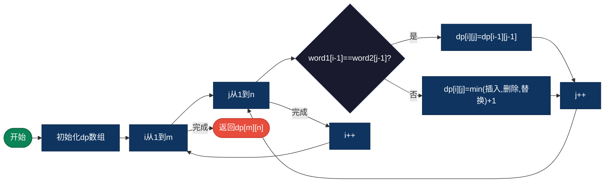
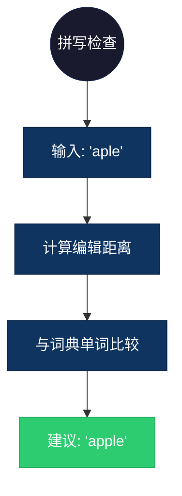

## 【编辑距离算法详解】C/Java/Go/Python/JS/Rust不同语言实现

## 说明

编辑距离（Levenshtein距离）计算将一个字符串转换为另一个字符串所需的最少编辑操作次数（插入、删除、替换）。

> **生活类比**：将 "kitten" 改为 "sitting" 需要最少几步？答案是 3 步：k→s, e→i, 插入g。

## 实现过程

1. 创建 dp[m+1][n+1] 二维数组
2. dp[i][j] 表示 word1[0..i-1] 转换为 word2[0..j-1] 的最少操作
3. 初始化边界条件
4. 遍历填充 dp 数组：
   - 如果字符相同，dp[i][j] = dp[i-1][j-1]
   - 否则，dp[i][j] = min(插入, 删除, 替换) + 1
5. 返回 dp[m][n]

## 算法流程



## 示意图

```
word1 = "horse", word2 = "ros"

      ''  r  o  s
  ''   0  1  2  3
  h    1  1  2  3
  o    2  2  1  2
  r    3  2  2  2
  s    4  3  3  2
  e    5  4  4  3

编辑距离 = 3
操作：h→r, 删除r, 删除e
```

## 复杂度分析

| 复杂度 | 说明 |
|--------|------|
| 时间复杂度 | O(m × n) - m, n 为两个字符串长度 |
| 空间复杂度 | O(m × n) - 可优化为 O(min(m,n)) |

## 实际应用举例

### 1. 拼写检查
**场景**：检测用户输入的拼写错误并给出建议。

**具体例子**：
- 输入：用户输入 "aple"
- 输出：建议 "apple"（编辑距离 1）
- 应用：搜索引擎、输入法



### 2. DNA序列比对
**场景**：比较两个DNA序列的相似度。

**具体例子**：
- 输入：DNA序列 "AGCT" 和 "ACGT"
- 输出：编辑距离 2
- 应用：生物信息学、基因研究

### 3. 版本差异对比
**场景**：比较两个文本文件的差异。

**具体例子**：
- 输入：旧版本代码和新版本代码
- 输出：差异位置和编辑距离
- 应用：Git diff、代码审查工具

## 实现列表

| 语言 | 文件名 |
|------|--------|
| C | [edit_distance.c](./edit_distance.c) |
| Java | [EditDistance.java](./EditDistance.java) |
| Go | [edit_distance.go](./edit_distance.go) |
| Python | [edit_distance.py](./edit_distance.py) |
| JavaScript | [edit_distance.js](./edit_distance.js) |
| Rust | [edit_distance.rs](./edit_distance.rs) |
