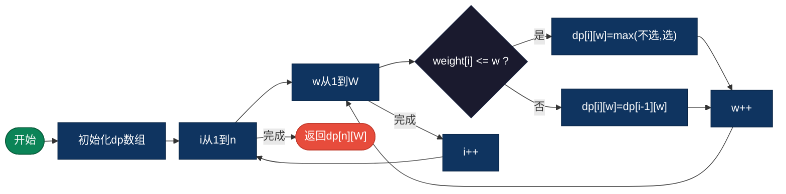
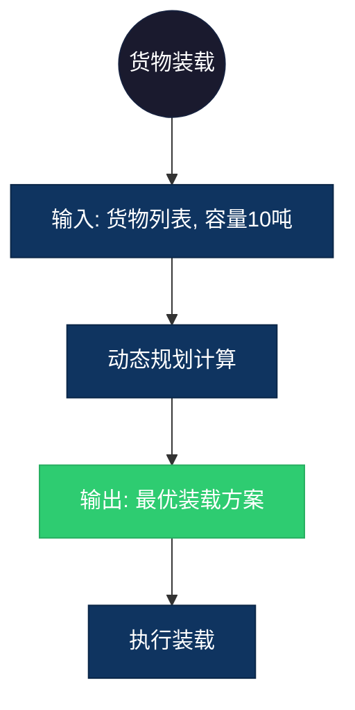

## 【背包问题算法详解】C/Java/Go/Python/JS/Rust不同语言实现

## 说明

0/1背包问题：给定一组物品，每个物品有重量和价值，在背包容量限制下，选择物品使总价值最大。

> **生活类比**：背包容量20kg，有多个物品（重量、价值），选哪些装入背包价值最大？

## 实现过程

1. 定义 dp[i][w] 为前 i 个物品在容量 w 下的最大价值
2. 初始化 dp[0][w] = 0
3. 遍历每个物品和每个容量：
   - 如果物品重量 <= 容量：dp[i][w] = max(不选, 选)
   - 否则：dp[i][w] = dp[i-1][w]
4. 返回 dp[n][W]

## 算法流程



## 示意图

```
物品: (重量, 价值)
A: (2, 3), B: (3, 4), C: (4, 5), D: (5, 6)
背包容量: 5

dp表格：
      0  1  2  3  4  5
  ''   0  0  0  0  0  0
  A    0  0  3  3  3  3
  B    0  0  3  4  4  7
  C    0  0  3  4  5  7
  D    0  0  3  4  5  7

最大价值 = 7 (选B和C)
```

## 复杂度分析

| 复杂度 | 说明 |
|--------|------|
| 时间复杂度 | O(n × W) - n为物品数，W为背包容量 |
| 空间复杂度 | O(n × W) - 可优化为 O(W) |

## 实际应用举例

### 1. 货物装载
**场景**：卡车载重有限，选择装载哪些货物价值最大。

**具体例子**：
- 输入：货物列表（重量、价值），卡车容量 10吨
- 输出：最优装载方案，最大价值
- 应用：物流运输、货运调度



### 2. 投资组合
**场景**：在预算限制下选择投资项目使收益最大。

**具体例子**：
- 输入：项目列表（成本、收益），预算 100万
- 输出：最优投资组合，最大收益
- 应用：投资决策、资源分配

### 3. 任务选择
**场景**：在时间限制下选择完成哪些任务收益最大。

**具体例子**：
- 输入：任务列表（耗时、收益），时间限制 8小时
- 输出：最优任务组合，最大收益
- 应用：项目管理、时间规划

## 实现列表

| 语言 | 文件名 |
|------|--------|
| C | [knapsack.c](./knapsack.c) |
| Java | [Knapsack.java](./Knapsack.java) |
| Go | [knapsack.go](./knapsack.go) |
| Python | [knapsack.py](./knapsack.py) |
| JavaScript | [knapsack.js](./knapsack.js) |
| Rust | [knapsack.rs](./knapsack.rs) |
