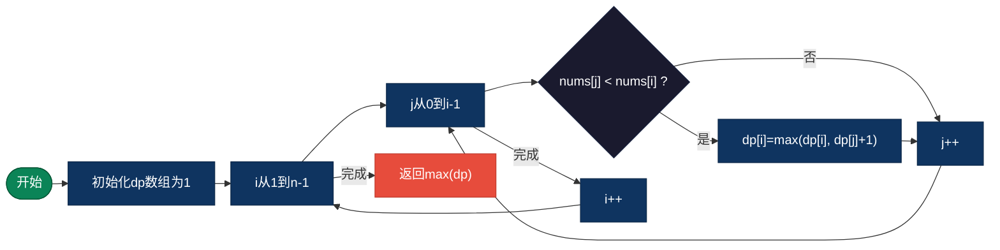
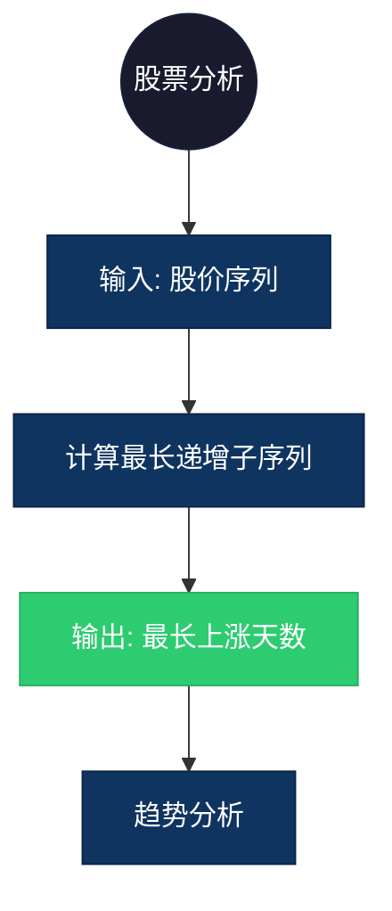

## 【最长递增子序列算法详解】C/Java/Go/Python/JS/Rust不同语言实现

## 说明

最长递增子序列（LIS）：给定一个序列，找出其中最长的严格递增子序列的长度。

> **生活类比**：在 [10, 9, 2, 5, 3, 7, 101, 18] 中，最长的递增序列是 [2, 3, 7, 101]，长度为 4。

## 实现过程

1. 定义 dp[i] 为以 nums[i] 结尾的最长递增子序列长度
2. 初始化 dp[i] = 1（每个元素本身构成长度为1的序列）
3. 对于每个 i，遍历所有 j < i
4. 如果 nums[j] < nums[i]，dp[i] = max(dp[i], dp[j] + 1)
5. 返回 dp 数组中的最大值

## 算法流程



## 示意图

```
nums = [10, 9, 2, 5, 3, 7, 101, 18]

dp数组:
索引:   0  1  2  3  4  5  6   7
nums:  10  9  2  5  3  7  101 18
dp:     1  1  1  2  2  3  4   4

最长递增子序列: [2, 3, 7, 101] 或 [2, 5, 7, 101]
长度: 4
```

## 复杂度分析

| 复杂度 | 说明 |
|--------|------|
| 时间复杂度 | O(n²) - 二分优化可到 O(n log n) |
| 空间复杂度 | O(n) |

## 实际应用举例

### 1. 股票最长上涨期
**场景**：计算股票连续上涨的最长天数。

**具体例子**：
- 输入：股价 [100, 105, 102, 110, 115, 108]
- 输出：最长连续上涨 3 天 (102→110→115)
- 应用：股票分析、金融预测



### 2. 建筑高度规划
**场景**：城市规划中，建筑物从左到右高度递增的最大数量。

**具体例子**：
- 输入：建筑高度 [20, 15, 30, 25, 40, 35]
- 输出：最长递增高度序列长度 3
- 应用：城市规划、建筑设计

### 3. 学生成绩排名
**场景**：找出学生成绩连续提升的最长学期数。

**具体例子**：
- 输入：成绩 [80, 85, 82, 90, 95, 88]
- 输出：最长连续提升 3 学期
- 应用：教育分析、学习追踪

## 实现列表

| 语言 | 文件名 |
|------|--------|
| C | [lis.c](./lis.c) |
| Java | [LIS.java](./LIS.java) |
| Go | [lis.go](./lis.go) |
| Python | [lis.py](./lis.py) |
| JavaScript | [lis.js](./lis.js) |
| Rust | [lis.rs](./lis.rs) |
