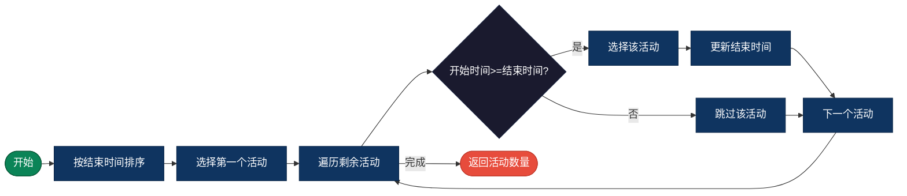
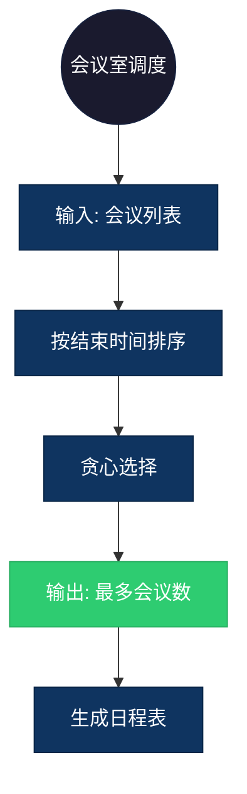

## 【活动选择算法详解】C/Java/Go/Python/JS/Rust不同语言实现

## 说明

活动选择问题：给定 n 个活动，每个活动有开始和结束时间，选择互不冲突的活动使数量最多。

> **生活类比**：会议室一天有多个会议预约，选择最多能安排的会议数量。

## 实现过程

1. 按活动结束时间排序
2. 选择第一个活动（结束最早的）
3. 遍历剩余活动，选择开始时间 >= 上一个活动结束时间的活动
4. 重复直到所有活动处理完成
5. 返回选中的活动数量

## 算法流程



## 示意图

```
活动: (开始, 结束)
A: (1, 3), B: (2, 4), C: (3, 5), D: (0, 6), E: (5, 7), F: (8, 9), G: (5, 9)

按结束时间排序: A(1,3), B(2,4), C(3,5), E(5,7), G(5,9), D(0,6), F(8,9)

选择过程:
1. 选择 A (1,3)
2. 跳过 B (2<3)
3. 选择 C (3>=3)
4. 选择 E (5>=5)
5. 跳过 G (5<7)
6. 跳过 D (0<7)
7. 选择 F (8>=7)

结果: A, C, E, F (4个活动)
```

## 复杂度分析

| 复杂度 | 说明 |
|--------|------|
| 时间复杂度 | O(n log n) - 排序时间 |
| 空间复杂度 | O(1) - 不考虑排序空间 |

## 实际应用举例

### 1. 会议室调度
**场景**：安排一天内最多的会议。

**具体例子**：
- 输入：会议列表（开始、结束时间）
- 输出：最多能安排的会议数量
- 应用：企业日程管理、会议系统



### 2. 资源分配
**场景**：CPU时间片分配，运行最多的任务。

**具体例子**：
- 输入：任务列表（执行时间段）
- 输出：最多能执行的任务数
- 应用：操作系统调度、云资源管理

### 3. 广告投放
**场景**：在有限时间段内投放最多广告。

**具体例子**：
- 输入：广告列表（播放时间段）
- 输出：最多能播放的广告数
- 应用：电视台、流媒体平台

## 实现列表

| 语言 | 文件名 |
|------|--------|
| C | [activity_selection.c](./activity_selection.c) |
| Java | [ActivitySelection.java](./ActivitySelection.java) |
| Go | [activity_selection.go](./activity_selection.go) |
| Python | [activity_selection.py](./activity_selection.py) |
| JavaScript | [activity_selection.js](./activity_selection.js) |
| Rust | [activity_selection.rs](./activity_selection.rs) |
