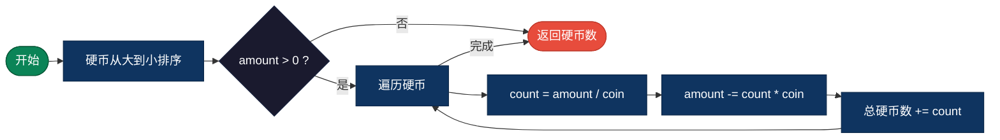
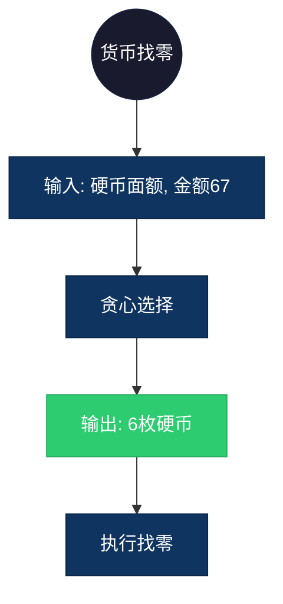

## 【贪心零钱兑换算法详解】C/Java/Go/Python/JS/Rust不同语言实现

## 说明

贪心零钱兑换：使用贪心策略计算最少硬币数，每次选择面值最大的硬币。

> **生活类比**：找零时，先给最大的面值，不够再给小的。

**注意**：贪心算法仅在硬币面值具有特定性质（如 1, 5, 10, 25）时才正确，对于一般情况可能得不到最优解。

## 实现过程

1. 将硬币按面值从大到小排序
2. 对于目标金额，从最大面值开始
3. 计算当前面值能用多少枚：count = amount / coin
4. 更新剩余金额：amount -= count * coin
5. 重复直到金额为 0
6. 返回总硬币数

## 算法流程



## 示意图

```
硬币: [25, 10, 5, 1], 金额: 67

步骤1: 67 / 25 = 2, 使用 2 枚 25, 剩余 17
步骤2: 17 / 10 = 1, 使用 1 枚 10, 剩余 7
步骤3: 7 / 5 = 1, 使用 1 枚 5, 剩余 2
步骤4: 2 / 1 = 2, 使用 2 枚 1, 剩余 0

结果: 2+1+1+2 = 6 枚硬币
```

## 复杂度分析

| 复杂度 | 说明 |
|--------|------|
| 时间复杂度 | O(n) - n 为硬币种类数 |
| 空间复杂度 | O(1) |

## 实际应用举例

### 1. 货币找零
**场景**：收银系统快速找零。

**具体例子**：
- 输入：硬币 [1, 5, 10, 25]，金额 67
- 输出：6 枚硬币 (25×2 + 10×1 + 5×1 + 1×2)
- 应用：自动售货机、收银系统



### 2. 邮票组合
**场景**：用最少数量的邮票凑出邮资。

**具体例子**：
- 输入：邮票 [1, 5, 10, 50]，邮资 83
- 输出：5 枚邮票 (50×1 + 10×3 + 1×2)
- 应用：邮政系统、资源优化

### 3. 积分兑换
**场景**：用最少的积分兑换券兑换商品。

**具体例子**：
- 输入：兑换券 [100, 50, 20, 10, 5, 1]，目标 275
- 输出：4 张 (100×2 + 50×1 + 20×1 + 5×1)
- 应用：会员系统、积分商城

## 实现列表

| 语言 | 文件名 |
|------|--------|
| C | [coin_change_greedy.c](./coin_change_greedy.c) |
| Java | [CoinChangeGreedy.java](./CoinChangeGreedy.java) |
| Go | [coin_change_greedy.go](./coin_change_greedy.go) |
| Python | [coin_change_greedy.py](./coin_change_greedy.py) |
| JavaScript | [coin_change_greedy.js](./coin_change_greedy.js) |
| Rust | [coin_change_greedy.rs](./coin_change_greedy.rs) |
