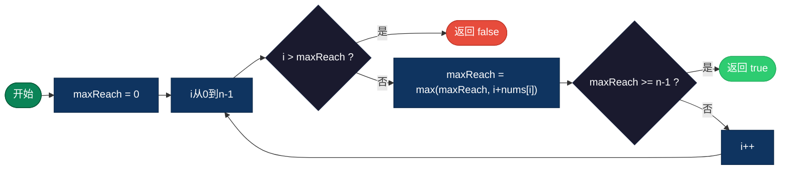
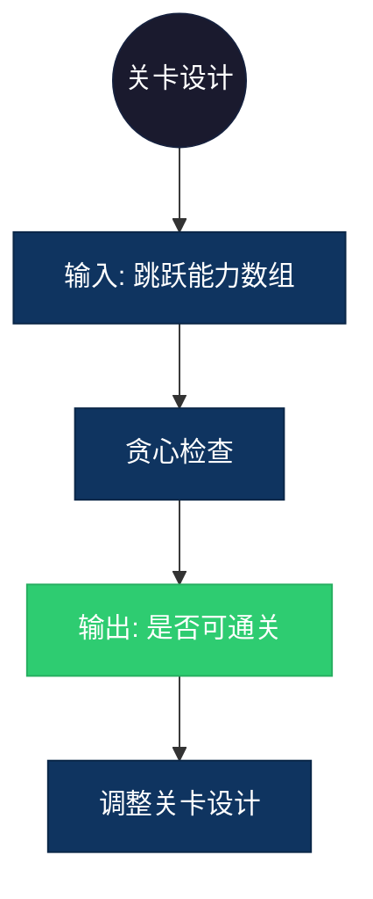

## 【跳跃游戏算法详解】C/Java/Go/Python/JS/Rust不同语言实现

## 说明

跳跃游戏：给定非负整数数组，每个元素表示从该位置可以跳跃的最大长度，判断是否能到达最后一个位置。

> **生活类比**：玩跳格子游戏，每个格子写着最多能跳几步，判断能否跳到终点。

## 实现过程

1. 维护一个变量 maxReach 表示当前能到达的最远位置
2. 遍历数组，更新 maxReach = max(maxReach, i + nums[i])
3. 如果当前位置 i > maxReach，说明无法继续前进，返回 false
4. 如果 maxReach >= 最后一个索引，返回 true

## 算法流程



## 示意图

```
nums = [2, 3, 1, 1, 4]

位置:  0  1  2  3  4
值:    2  3  1  1  4

i=0: maxReach = max(0, 0+2) = 2
i=1: maxReach = max(2, 1+3) = 4
i=2: maxReach = max(4, 2+1) = 4
i=3: maxReach = max(4, 3+1) = 4
i=4: maxReach = 4 >= 4 → 可以到达

路径: 0 → 1 → 4
```

## 复杂度分析

| 复杂度 | 说明 |
|--------|------|
| 时间复杂度 | O(n) - 遍历数组一次 |
| 空间复杂度 | O(1) - 只需常数空间 |

## 实际应用举例

### 1. 游戏关卡设计
**场景**：设计关卡，确保玩家能够通关。

**具体例子**：
- 输入：关卡跳跃能力数组
- 输出：判断关卡是否可通关
- 应用：游戏开发、关卡测试



### 2. 网络跳板攻击
**场景**：判断能否通过一系列跳板服务器到达目标。

**具体例子**：
- 输入：每个服务器能连接的最大距离
- 输出：判断能否到达目标服务器
- 应用：网络安全、渗透测试

### 3. 资源跳转路径
**场景**：在分布式系统中，判断能否通过节点跳转到达目标节点。

**具体例子**：
- 输入：每个节点的最大跳转距离
- 输出：判断能否到达目标节点
- 应用：分布式系统、网络路由

## 实现列表

| 语言 | 文件名 |
|------|--------|
| C | [jump_game.c](./jump_game.c) |
| Java | [JumpGame.java](./JumpGame.java) |
| Go | [jump_game.go](./jump_game.go) |
| Python | [jump_game.py](./jump_game.py) |
| JavaScript | [jump_game.js](./jump_game.js) |
| Rust | [jump_game.rs](./jump_game.rs) |
