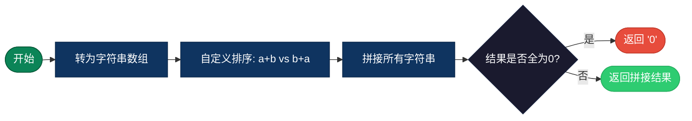
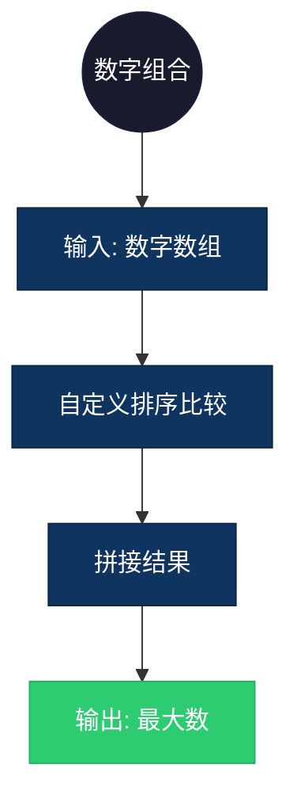

## 【最大数拼接算法详解】C/Java/Go/Python/JS/Rust不同语言实现

## 说明

最大数拼接：给定一组非负整数，将它们排列成最大的数。

> **生活类比**：有数字卡片 3, 30, 34, 5, 9，怎么排列能组成最大的数？答案是 9534330。

## 实现过程

1. 将所有数字转换为字符串
2. 自定义排序：对于两个字符串 a 和 b，比较 a+b 和 b+a
3. 如果 a+b > b+a，则 a 排在 b 前面
4. 按排序后的顺序拼接所有字符串
5. 处理前导零的情况

## 算法流程



## 示意图

```
nums = [3, 30, 34, 5, 9]

排序比较:
3 vs 30: "330" < "303" → 30 排在 3 前面
30 vs 34: "3034" < "3430" → 34 排在 30 前面
34 vs 5: "345" > "534" → 34 排在 5 前面
5 vs 9: "59" < "95" → 9 排在 5 前面

排序结果: [9, 5, 34, 3, 30]
拼接结果: "9534330"
```

## 复杂度分析

| 复杂度 | 说明 |
|--------|------|
| 时间复杂度 | O(n log n) - 排序时间 |
| 空间复杂度 | O(n) - 存储字符串数组 |

## 实际应用举例

### 1. 最大数字组合
**场景**：将多个数字组合成最大的数。

**具体例子**：
- 输入：[10, 2]
- 输出："210"
- 应用：数字游戏、数学竞赛



### 2. 文件名排序
**场景**：按数字大小对文件名进行排序。

**具体例子**：
- 输入：["file1", "file10", "file2"]
- 输出：["file10", "file2", "file1"]（组成最大数）
- 应用：文件管理、系统排序

### 3. 版本号排序
**场景**：将版本号按数字大小排序。

**具体例子**：
- 输入：["1.10", "1.2", "1.1"]
- 输出：["1.10", "1.2", "1.1"]（组成最大数）
- 应用：软件版本管理、依赖排序

## 实现列表

| 语言 | 文件名 |
|------|--------|
| C | [maximize_number.c](./maximize_number.c) |
| Java | [MaximizeNumber.java](./MaximizeNumber.java) |
| Go | [maximize_number.go](./maximize_number.go) |
| Python | [maximize_number.py](./maximize_number.py) |
| JavaScript | [maximize_number.js](./maximize_number.js) |
| Rust | [maximize_number.rs](./maximize_number.rs) |
