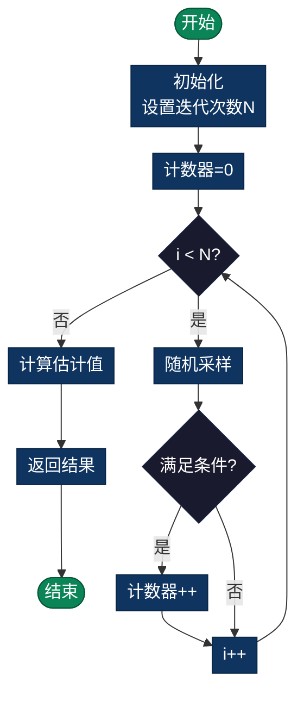

# 蒙特卡洛算法（Monte Carlo Algorithm）

> 一种随机化算法，运行时间固定，以高概率给出正确答案。适用于需要固定运行时间但可以接受小概率错误的场景。

## 概述

蒙特卡洛算法是一种随机化算法，其特点是：
- **运行时间固定**
- **给出正确答案的概率很高**
- 可能会返回错误答案，但概率可控

## 与拉斯维加斯算法的对比

| 特性 | 拉斯维加斯 | 蒙特卡洛 |
|------|----------|---------|
| 正确性 | 总是正确 | 概率正确 |
| 时间 | 随机 | 固定 |
| 例子 | 随机快速排序 | π估算 |

## 经典应用

### 1. π 的估算
- 在单位正方形内随机投点
- 计算落在内切圆内的比例
- π ≈ 4 × (圆内点数 / 总点数)

### 2. 数值积分
- 随机采样计算函数平均值
- 估算定积分值
- 适用于高维积分

### 3. 概率问题模拟

### 流程图

## 复杂度分析

| 指标 | 复杂度 | 说明 |
|------|--------|------|
| **时间** | O(N) | N为采样次数 |
| **空间** | O(1) | 常数额外空间 |
| **正确率** | 随N增加 | 误差 ∝ 1/√N |

---

## 实现列表

| 语言 | 文件名 | 说明 |
|------|--------|------|
| C | [monte_carlo.c](./monte_carlo.c) | 蒙特卡洛实现 |
| Java | [MonteCarlo.java](./MonteCarlo.java) | 蒙特卡洛类 |
| Python | [monte_carlo.py](./monte_carlo.py) | 简洁实现 |
| Go | [monte_carlo.go](./monte_carlo.go) | 并发优化 |

---

## 扩展阅读

- 蒙特卡洛积分
- 马尔可夫链蒙特卡洛（MCMC）
- 粒子滤波算法- 模拟随机事件
- 计算复杂概率
- 统计分析

### 4. 优化问题
- 随机搜索
- 模拟退火
- 遗传算法

## 实现语言

本目录包含以下语言的实现：
- C
- Go
- Java
- JavaScript
- Python
- Rust
