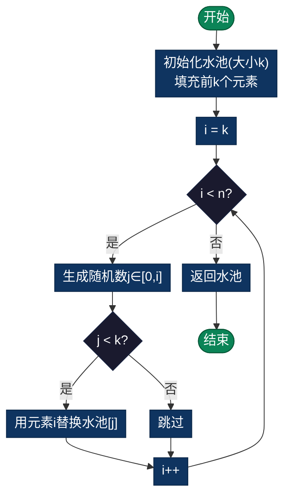

# 随机采样（Random Sampling）

> 从大数据集中随机选择k个元素，使得每个元素被选中的概率相等。水库采样（Reservoir Sampling）可高效处理流式数据。

## 导航

| [算法原理](#定义) | [复杂度分析](#时间和空间复杂度) | [实现列表](#实现列表) |

---

## 定义

随机采样是从一个大数据集中随机选择 k 个元素的过程，使得每个元素被选中的概率相等。特别是 Reservoir Sampling 方法可以高效处理流式或无限数据。

## 核心算法：Reservoir Sampling（水库采样）

### 时间和空间复杂度

- **时间复杂度**：O(n)
- **空间复杂度**：O(k)
- **特点**：
  - 每个元素被选中的概率相等 = k/n
  - 适合流式数据，无需预知数据量
  - 单遍扫描，内存高效

### 算法步骤

1. 初始化一个大小为 k 的"水池"（数组）
2. 填充前 k 个元素到水池中
3. 对于第 i 个元素（i > k）：
   - 生成一个 0 到 i 的随机数 j
   - 如果 j < k，用第 i 个元素替换水池中第 j 个元素
   - 否则，忽略第 i 个元素
4. 继续处理所有元素后，水池即为采样结果

### 流程图



### 伪代码

```
ReservoirSampling(stream, k):
    reservoir = array of size k
    
    // 填充前 k 个元素
    for i from 0 to k-1:
        reservoir[i] = stream[i]
    
    // 处理第 k 个之后的元素
    for i from k to length(stream)-1:
        j = random(0, i)  // 在 [0, i] 内随机
        if j < k:
            reservoir[j] = stream[i]
    
    return reservoir
```

### Python 示例

```python
import random

def reservoir_sampling(stream, k):
    """
    从流中随机采样 k 个元素
    每个元素被选中的概率 = k/n
    """
    reservoir = []
    
    for i, item in enumerate(stream):
        if i < k:
            reservoir.append(item)
        else:
            j = random.randint(0, i)
            if j < k:
                reservoir[j] = item
    
    return reservoir
```

## 数学证明（为什么每个元素概率相等）

对于第 n 个元素（n ≥ k）：
- 被选中进水池的概率 = k/n
- 保留在水池中的概率 = 保留的概率

对于前 k 个元素的每个：
- 被选中概率 = k/k = 1（初始）
- 不被替换的概率 = (1 - 1/(k+1)) × (1 - 1/(k+2)) × ... × (1 - 1/n)
                = k/(k+1) × (k+1)/(k+2) × ... × (n-1)/n = k/n

因此，每个元素被选中的概率都是 k/n ✓

## 应用场景

| 场景 | 说明 |
|------|------|
| **日志流处理** | 从海量日志中随机采样进行分析 |
| **大文件抽样** | 从大文件中随机抽取 k 行 |
| **数据库查询** | 随机采样提高大表查询性能 |
| **网络流量采样** | 监控中采样网络数据包 |
| **推荐系统** | 从用户历史中随机采样用于模型训练 |
| **A/B 测试** | 随机选择实验组用户 |
| **数据统计** | 无偏估计和置信区间计算 |

## 变种方法

### 1. 加权随机采样

根据权重而非均匀分布选择元素。

### 2. 无放回采样 vs 有放回采样

- **无放回**：每个元素最多选一次（标准水库采样）
- **有放回**：元素可能重复选择

### 3. 随机排序采样

先随机排序再取前 k 个（适合有限数据）。

## 对比其他采样方法

| 方法 | 适用场景 | 时间 | 内存 | 优点 | 缺点 |
|------|---------|------|------|------|------|
| 水库采样 | 流式、无限 | O(n) | O(k) | 高效、无需预知n | 需逐个处理 |
| 随机排序 | 有限数据 | O(n log n) | O(n) | 简单 | 需整个数据集 |
| 系统采样 | 已排序数据 | O(n) | O(1) | 高效 | 需扫描 |
| 分层采样 | 分类数据 | O(n) | O(k) | 代表性好 | 需分类信息 |

## 实际应用示例

### 从文件中随机读取 k 行

```python
def sample_lines_from_file(filename, k):
    """从大文件中随机采样 k 行"""
    with open(filename, 'r') as f:
        return reservoir_sampling(f, k)
```

### 从数据生成器中采样

```python
def generator():
    for i in range(1000000):
        yield i

sample = reservoir_sampling(generator(), 1000)
```

## 实现列表

| 语言 | 文件名 | 说明 |
|------|--------|------|
| C | [reservoir_sampling.c](./reservoir_sampling.c) | 水库采样实现 |
| Java | [ReservoirSampling.java](./ReservoirSampling.java) | 采样类 |
| Python | [reservoir_sampling.py](./reservoir_sampling.py) | 简洁实现 |
| Go | [reservoir_sampling.go](./reservoir_sampling.go) | 流式处理 |
| JavaScript | [reservoirSampling.js](./reservoirSampling.js) | ES6实现 |
| TypeScript | [ReservoirSampling.ts](./ReservoirSampling.ts) | 类型安全 |
| Rust | [reservoir_sampling.rs](./reservoir_sampling.rs) | 内存安全 |

---

## 扩展阅读

- 加权水库采样
- 分布式水库采样
- 滑动窗口采样
