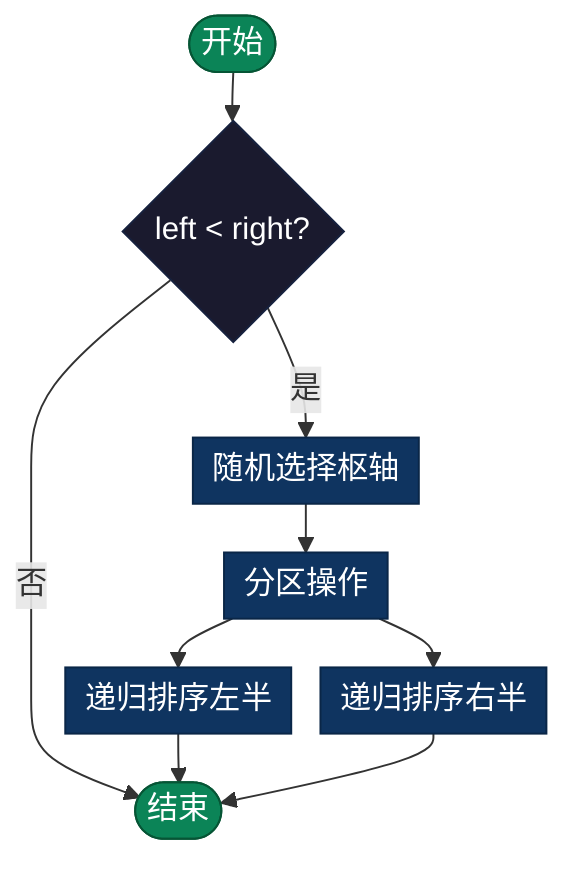

# 随机快速排序（Randomized QuickSort）

> 快速排序的随机化版本，通过随机选择枢轴避免最坏情况，实现稳定的O(n log n)期望性能。

## 定义

随机快速排序是快速排序的一个变种，通过随机选择枢轴元素而不是固定选择，来改进平均性能和避免最坏情况。

## 时间和空间复杂度

- **平均时间复杂度**：O(n log n)
- **最坏时间复杂度**：O(n²) - 但概率极低（≈ 1/2^n）
- **空间复杂度**：O(log n) 平均，O(n) 最坏

## vs 标准快速排序

| 特性 | 标准快速排序 | 随机快速排序 |
|------|-----------|-----------|
| 枢轴选择 | 首、尾或中间 | 随机选择 |
| 最坏情况 | O(n²) - 可被精心构造 | O(n²) - 概率极低 |
| 平均情况 | O(n log n) | O(n log n) |
| 实际性能 | 可能对抗输入不稳定 | 稳定且高效 |

## 算法步骤

1. **随机选择枢轴**：在 [left, right] 范围内随机选择一个元素作为枢轴
2. **分区**：将数组分成三部分：
   - 小于枢轴的元素
   - 等于枢轴的元素
   - 大于枢轴的元素
3. **递归排序**：分别递归排序左右两部分
4. **合并**：按顺序组合三部分

### 流程图



## 伪代码

```c
RandomizedQuickSort(arr, left, right):
    if left >= right:
        return
    
    // 随机选择枢轴
    pivotIdx = random(left, right)
    pivotIdx = Partition(arr, left, right, pivotIdx)
    
    RandomizedQuickSort(arr, left, pivotIdx - 1)
    RandomizedQuickSort(arr, pivotIdx + 1, right)

Partition(arr, left, right, pivotIdx):
    pivot = arr[pivotIdx]
    swap(arr[pivotIdx], arr[right])
    
    storeIdx = left
    for i from left to right-1:
        if arr[i] < pivot:
            swap(arr[i], arr[storeIdx])
            storeIdx++
    
    swap(arr[right], arr[storeIdx])
    return storeIdx
```

## 为什么随机更好？

1. **避免敌对输入**：对手无法预知随机决策
2. **概率保证**：99.9% 时间内是 O(n log n)
3. **简化分析**：期望值比最坏情况更现实
4. **实际应用**：对各种输入都表现稳定

## 优势

- **性能稳定**：不易遇到最坏情况
- **易于实现**：只需在选择枢轴时加入随机
- **理论保证**：概率性能保证明确
- **广泛应用**：被许多库函数采用

## 劣势

- **最坏仍然是 O(n²)**：虽然概率极低
- **常数因子**：比某些其他排序稍大
- **不稳定**：不能保证相等元素的相对顺序

## 与其他排序对比

| 排序算法 | 平均时间 | 最坏时间 | 空间 | 稳定性 |
|---------|---------|---------|------|-------|
| 随机快速排序 | O(n log n) | O(n²) | O(log n) | 否 |
| 合并排序 | O(n log n) | O(n log n) | O(n) | 是 |
| 堆排序 | O(n log n) | O(n log n) | O(1) | 否 |
| 内省排序 | O(n log n) | O(n log n) | O(log n) | 否 |

## 实现列表

| 语言 | 文件名 | 说明 |
|------|--------|------|
| C | [randomized_quicksort.c](./randomized_quicksort.c) | 随机快排实现 |
| Java | [RandomizedQuickSort.java](./RandomizedQuickSort.java) | 快排类 |
| Python | [randomized_quicksort.py](./randomized_quicksort.py) | 简洁实现 |
| Go | [randomized_quicksort.go](./randomized_quicksort.go) | 并发优化 |
| JavaScript | [randomizedQuickSort.js](./randomizedQuickSort.js) | ES6实现 |
| TypeScript | [RandomizedQuickSort.ts](./RandomizedQuickSort.ts) | 类型安全 |
| Rust | [randomized_quicksort.rs](./randomized_quicksort.rs) | 内存安全 |

---

## 扩展阅读

- 快速排序的三向分区优化
- 内省排序（Introsort）
- 排序网络理论
