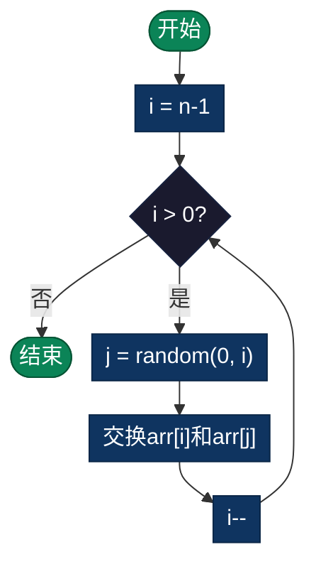

# 洗牌算法（Shuffle Algorithm）

> 随机重新排列数组元素，使所有可能排列概率相等（均匀分布）。Fisher-Yates算法是最优的洗牌算法。

## 导航

| [算法原理](#定义) | [复杂度分析](#时间和空间复杂度) | [实现列表](#实现列表) |

---

## 定义

洗牌算法用于随机重新排列数组或集合中的元素，使得结果是所有可能排列之一，且每个排列出现的概率相等（均匀分布）。

## 最常用：Fisher-Yates 洗牌

### 时间和空间复杂度

- **时间复杂度**：O(n)
- **空间复杂度**：O(1) 原地洗牌，O(n) 创建新数组
- **概率分布**：均匀分布，每个排列概率 = 1/n!

### 算法步骤

1. 从数组末尾开始（索引 i = n-1）
2. 在范围 [0, i] 内随机选择一个索引 j
3. 交换 arr[i] 和 arr[j]
4. 向前移动（i--）
5. 重复直到 i = 0

### 伪代码

```
FisherYates(arr):
    n = length(arr)
    for i from n-1 down to 1:
        j = random(0, i)  // 在 [0, i] 内随机选择
        swap(arr[i], arr[j])
```

### 流程图



### Python 示例

```python
import random

def shuffle(arr):
    n = len(arr)
    for i in range(n - 1, 0, -1):
        j = random.randint(0, i)
        arr[i], arr[j] = arr[j], arr[i]
    return arr
```

## 为什么是均匀分布？

- 有 n! 种可能的排列
- 每次交换有 (n-1) 种选择（随机 j）
- 总可能次数 = n × (n-1) × ... × 1 = n!
- 每种排列恰好对应一种随机选择序列
- 因此每种排列的概率 = 1/n!

## 常见错误

1. **范围错误**：不是 random(0, n)，而是从末尾开始 random(0, i)
2. **交换遗漏**：必须进行交换，否则会有偏差
3. **起点错误**：应该从 i = n-1 开始，不是 n

## 应用场景

- **游戏开发**：洗牌、骰子等随机化
- **数据预处理**：机器学习中的数据随机化
- **抽签抽取**：随机选择人员或项目
- **随机测试**：生成随机测试用例
- **集合操作**：生成随机排列

## 变种方法

1. **现代洗牌**：从前向后交换
2. **Sattolo 循环**：生成随机循环排列
3. **选择性洗牌**：只洗前 k 个元素

## 对比其他洗牌方法

| 方法 | 时间 | 均匀分布 | 说明 |
|------|------|--------|------|
| Fisher-Yates | O(n) | ✓ | 标准，最优 |
| 随机排序 | O(n log n) | ✗ | 简单但不均匀 |
| 递归洗牌 | O(n) | ✓ | 思想相同 |

## 实现列表

| 语言 | 文件名 | 说明 |
|------|--------|------|
| C | [shuffle.c](./shuffle.c) | Fisher-Yates实现 |
| Java | [Shuffle.java](./Shuffle.java) | 洗牌类 |
| Python | [shuffle.py](./shuffle.py) | 简洁实现 |
| Go | [shuffle.go](./shuffle.go) | 原地洗牌 |
| JavaScript | [shuffle.js](./shuffle.js) | ES6实现 |
| TypeScript | [Shuffle.ts](./Shuffle.ts) | 类型安全 |
| Rust | [shuffle.rs](./shuffle.rs) | 内存安全 |

---

## 扩展阅读

- Sattolo循环（随机循环排列）
- 完美洗牌
- 加密安全随机数生成器
