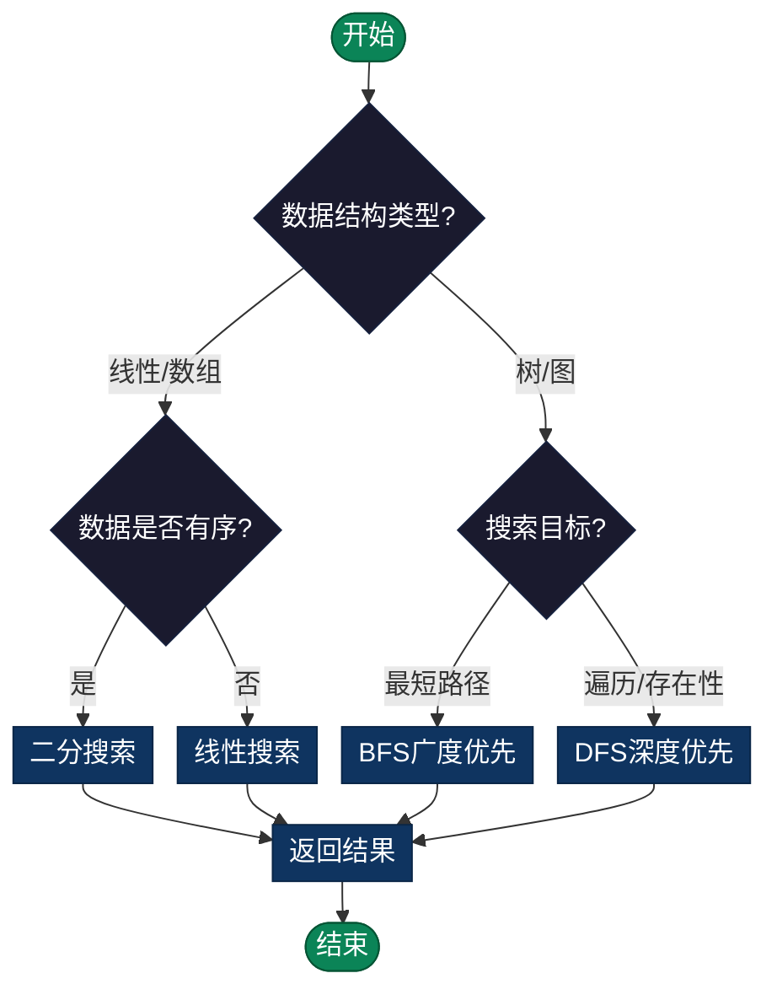

# 搜索（Search）算法总览

> 在给定的数据结构（数组、树、图等）中找到满足条件的元素或路径。包含线性搜索、二分搜索、DFS、BFS等经典算法。

## 导航

| [算法分类](#一搜索算法分类与选择) | [复杂度分析](#复杂度分析) | [实现列表](#实现列表) |

---

## 概述

搜索的目标是在给定的数据结构（数组、树、图等）中**找到满足条件的元素或路径**。  
本目录提供：

- 搜索算法的**分类与选择指南**
- 带有详细中文注释的 **基础实现 `search.py`**
- 更系统、分门别类且带讲解的 **增强实现 `search_enhanced.py`**

---

## 一、搜索算法分类与选择

### 1.1 按数据结构分类

- **线性结构（数组 / 链表）**
  - 线性搜索（Linear Search）
  - 二分搜索（Binary Search）及其变种（左/右边界）
- **树 / 图结构**
  - 深度优先搜索（DFS：递归 / 迭代）
  - 广度优先搜索（BFS：遍历 + 最短路径）

### 1.2 快速选择建议

```text
数据是否有序？
  ├─ 否 → 数据量小：线性搜索；数据量大：考虑哈希 / 索引
  └─ 是 → 二分搜索族（普通 / 左边界 / 右边界）

问题是否在图 / 树上？
  ├─ 是 → 需要最短步数 → BFS
  └─ 是 → 更关注是否存在路径 / 遍历 → DFS / BFS
```

### 流程图



---

## 二、基础实现

> 适合快速上手，掌握线性搜索、二分搜索、DFS、BFS 的最小可运行示例。

```python
"""
搜索算法 - 在数据中查找特定元素

特点：
- 线性搜索：简单，适合小数据集
- 二分搜索：高效，需要有序数据
- DFS：探索深度方向，用于图/树
- BFS：逐层探索，找最短路径
"""

# 例1: 线性搜索
def linear_search(arr, target):
    """
    在数组中线性搜索目标值
    时间: O(n), 空间: O(1)
    """
    for i in range(len(arr)):
        if arr[i] == target:
            return i
    return -1

# 例2: 二分搜索
def binary_search(arr, target):
    """
    在有序数组中进行二分搜索
    时间: O(log n), 空间: O(1)
    """
    left, right = 0, len(arr) - 1
    
    while left <= right:
        mid = (left + right) // 2
        if arr[mid] == target:
            return mid
        elif arr[mid] < target:
            left = mid + 1
        else:
            right = mid - 1
    
    return -1

# 例3: 二分搜索 (递归版)
def binary_search_recursive(arr, target, left=0, right=None):
    """
    递归实现二分搜索
    时间: O(log n), 空间: O(log n)
    """
    if right is None:
        right = len(arr) - 1
    
    if left > right:
        return -1
    
    mid = (left + right) // 2
    if arr[mid] == target:
        return mid
    elif arr[mid] < target:
        return binary_search_recursive(arr, target, mid + 1, right)
    else:
        return binary_search_recursive(arr, target, left, mid - 1)

# 例4: 深度优先搜索 (递归)
def dfs_recursive(graph, node, visited=None):
    """
    使用递归进行深度优先搜索
    时间: O(V+E), 空间: O(V)
    """
    if visited is None:
        visited = set()
    
    visited.add(node)
    result = [node]
    
    for neighbor in graph.get(node, []):
        if neighbor not in visited:
            result.extend(dfs_recursive(graph, neighbor, visited))
    
    return result

# 例5: 深度优先搜索 (迭代)
def dfs_iterative(graph, start):
    """
    使用栈进行深度优先搜索
    时间: O(V+E), 空间: O(V)
    """
    visited = set()
    stack = [start]
    result = []
    
    while stack:
        node = stack.pop()
        if node not in visited:
            visited.add(node)
            result.append(node)
            # 注意：添加邻接点时要反序，保持与递归相同的顺序
            stack.extend(reversed(graph.get(node, [])))
    
    return result

# 例6: 广度优先搜索
def bfs(graph, start):
    """
    使用队列进行广度优先搜索
    时间: O(V+E), 空间: O(V)
    """
    from collections import deque
    
    visited = set()
    queue = deque([start])
    visited.add(start)
    result = []
    
    while queue:
        node = queue.popleft()
        result.append(node)
        
        for neighbor in graph.get(node, []):
            if neighbor not in visited:
                visited.add(neighbor)
                queue.append(neighbor)
    
    return result
```

---

## 三、增强实现

> 在基础版本上扩展了更多**变种与详细注释**，适合系统学习和复用。

```python
"""
搜索算法（Search Algorithms）-从线性到对数的效率进阶

搜索问题的核心：
在给定数据结构中查找特定元素，并返回其位置或相关信息

搜索算法的分类：
1. 线性搜索族（Sequential Search）
   - 顺序搜索：O(n)，适用于无序数据
   - 哨兵搜索：O(n)，优化访问次数
   
2. 二分搜索族（Binary Search）
   - 二分搜索：O(log n)，要求数据有序
   - 分支限界搜索：减少比较次数
   
3. 图搜索族（Graph Search）
   - 深度优先搜索（DFS）：O(V+E)，用于路径、连通性
   - 广度优先搜索（BFS）：O(V+E)，用于最短路径
   
4. 高级搜索
   - 启发式搜索（A*）：利用启发函数加速
   - 哈希搜索：平均 O(1)
"""

# ====================
# 第一类：线性搜索
# ====================

def linear_search(arr, target):
    """
    线性搜索（顺序搜索）- 最朴素的搜索方法
    ...
    """
    for i in range(len(arr)):
        if arr[i] == target:
            return i
    return -1

def linear_search_sentinel(arr, target):
    """
    哨兵搜索（Sentinel Search）- 优化的线性搜索
    ...
    """
    n = len(arr)
    last_elem = arr[-1]
    arr[-1] = target
    i = 0
    while arr[i] != target:
        i += 1
    arr[-1] = last_elem
    if i < n - 1 or last_elem == target:
        return i
    else:
        return -1

# ====================
# 第二类：二分搜索
# ====================

def binary_search(arr, target):
    """
    二分搜索（Binary Search）- 有序数据的高效搜索
    ...
    """
    low, high = 0, len(arr) - 1
    while low <= high:
        mid = low + (high - low) // 2
        if arr[mid] == target:
            return mid
        elif arr[mid] > target:
            high = mid - 1
        else:
            low = mid + 1
    return -1

def binary_search_leftmost(arr, target):
    """
    二分搜索变种：查找最左边的目标
    """
    low, high = 0, len(arr) - 1
    result = -1
    while low <= high:
        mid = low + (high - low) // 2
        if arr[mid] == target:
            result = mid
            high = mid - 1
        elif arr[mid] < target:
            low = mid + 1
        else:
            high = mid - 1
    return result

def binary_search_rightmost(arr, target):
    """
    二分搜索变种：查找最右边的目标
    """
    low, high = 0, len(arr) - 1
    result = -1
    while low <= high:
        mid = low + (high - low) // 2
        if arr[mid] == target:
            result = mid
            low = mid + 1
        elif arr[mid] < target:
            low = mid + 1
        else:
            high = mid - 1
    return result

# ====================
# 第三类：图搜索 - DFS
# ====================

def dfs_iterative(graph, start):
    """
    深度优先搜索（DFS - 迭代版本）
    ...
    """
    visited = set()
    stack = [start]
    result = []
    while stack:
        node = stack.pop()
        if node not in visited:
            visited.add(node)
            result.append(node)
            for neighbor in reversed(graph.get(node, [])):
                if neighbor not in visited:
                    stack.append(neighbor)
    return result

def dfs_recursive(graph, node, visited=None):
    """
    深度优先搜索（DFS - 递归版本）
    ...
    """
    if visited is None:
        visited = set()
    visited.add(node)
    result = [node]
    for neighbor in graph.get(node, []):
        if neighbor not in visited:
            result.extend(dfs_recursive(graph, neighbor, visited))
    return result

# ====================
# 第四类：图搜索 - BFS
# ====================

def bfs(graph, start):
    """
    广度优先搜索（BFS）
    ...
    """
    from collections import deque
    visited = set()
    queue = deque([start])
    visited.add(start)
    result = []
    while queue:
        node = queue.popleft()
        result.append(node)
        for neighbor in graph.get(node, []):
            if neighbor not in visited:
                visited.add(neighbor)
                queue.append(neighbor)
    return result

def bfs_shortest_path(graph, start, end):
    """
    使用 BFS 找最短路径
    ...
    """
    from collections import deque
    if start == end:
        return [start]
    visited = {start}
    queue = deque([(start, [start])])
    while queue:
        node, path = queue.popleft()
        for neighbor in graph.get(node, []):
            if neighbor not in visited:
                if neighbor == end:
                    return path + [neighbor]
                visited.add(neighbor)
                queue.append((neighbor, path + [neighbor]))
    return []
```

---

## 四、复杂度与应用场景对比表

| 算法 | 时间复杂度 | 空间复杂度 | 前置条件 | 典型应用 |
|------|-----------|-----------|---------|---------|
| 线性搜索 | O(n) | O(1) | 无 | 小数据集、无序数组 |
| 哨兵线性搜索 | O(n) | O(1) | 可修改数组 | 频繁线性搜索的小优化 |
| 二分搜索 | O(log n) | O(1) | 有序数组 | 大数据集精确查找 |
| 左/右边界二分 | O(log n) | O(1) | 有序数组 | 统计元素个数、区间查找 |
| DFS（递归/迭代） | O(V+E) | O(V) | 图/树 | 路径存在性、连通性、拓扑排序 |
| BFS | O(V+E) | O(V) | 图/树 | 无权图最短路径、层序遍历 |
| BFS 最短路径 | O(V+E) | O(V) | 图/树 | 返回具体最短路径 |

---

## 五、如何在本目录继续深入
-  查看子目录各种算法，理解其中的原理。
- 结合 `algorithmic-thinking/README.md` 中的搜索策略部分，思考：  
  - “为什么 BFS 总能给出无权图的最短路径？”  
  - “为什么二分搜索必须要求数据有序？”  
  - “什么时候 DFS 比 BFS 更合适？”  
- 在此基础上，可以继续扩展到 A\*、双向 BFS、IDA\* 等更高级搜索算法。

---

## 实现列表

| 语言 | 文件名 | 说明 |
|------|--------|------|
| C | [linear_search.c](./linear_search.c) | 线性搜索实现 |
| C | [binary_search.c](./binary_search.c) | 二分搜索实现 |
| C | [dfs.c](./dfs.c) | DFS实现 |
| C | [bfs.c](./bfs.c) | BFS实现 |
| Java | [LinearSearch.java](./LinearSearch.java) | 线性搜索类 |
| Java | [BinarySearch.java](./BinarySearch.java) | 二分搜索类 |
| Java | [DFS.java](./DFS.java) | DFS类 |
| Java | [BFS.java](./BFS.java) | BFS类 |
| Go | [search_algorithms.go](./search_algorithms.go) | 综合实现 |
| Python | [search.py](./search.py) | 基础实现 |
| Python | [search_enhanced.py](./search_enhanced.py) | 增强实现 |
| JavaScript | [searchAlgorithms.js](./searchAlgorithms.js) | 搜索算法实现 |
| TypeScript | [SearchAlgorithms.ts](./SearchAlgorithms.ts) | 类型安全 |
| Rust | [search_algorithms.rs](./search_algorithms.rs) | 搜索实现 |

---

## 扩展阅读

- A*搜索算法（启发式搜索）
- 双向BFS优化
- IDA*迭代加深搜索
