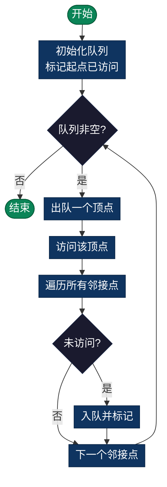

# 广度优先搜索（BFS - Breadth First Search）

> 逐层探索图的遍历算法，优先访问所有距离起点相等距离的顶点，适用于找最短路径的场景。

## 定义

广度优先搜索是一种图遍历算法，它逐层探索图，优先访问所有距离起点相等距离的顶点，然后再向外扩展。适用于树和图结构，特别是需要找最短路径的场景。

## 核心特点

- **策略**：逐层探索，由近到远
- **数据结构**：队列（Queue）FIFO
- **遍历顺序**：先浅后深
- **最短性**：找到的第一条路径就是最短路径

## 时间和空间复杂度

- **时间复杂度**：O(V + E)
  - V：顶点数
  - E：边数
  
- **空间复杂度**：O(V)
  - 队列最多存储 V 个顶点

## 算法步骤

1. 将起始顶点加入队列，标记为已访问
2. 循环直到队列为空：
   - 从队列首部出队一个顶点
   - 访问该顶点，输出或处理数据
   - 将所有未访问的邻接顶点加入队列，标记为已访问
3. 重复直到队列为空

### 流程图



## 伪代码

```c
BFS(graph, start):
    queue = Queue()
    queue.enqueue(start)
    visited[start] = true
    
    while queue not empty:
        node = queue.dequeue()
        // 处理 node
        
        for each neighbor of node:
            if not visited[neighbor]:
                visited[neighbor] = true
                queue.enqueue(neighbor)
```

## 应用场景

| 应用 | 说明 |
|------|------|
| **最短路径** | 无权图中两点最短路径 |
| **层序遍历** | 树的逐层访问 |
| **网络爬虫** | 逐层抓取链接 |
| **社交网络** | 朋友推荐、关系查询 |
| **迷宫问题** | 找到最近出口 |
| **操作序列** | BFS 找最少操作步数 |
| **拓扑排序** | 有向无环图排序 |
| **检测环** | 判断无向图是否存在环 |

## BFS vs DFS

| 特性 | BFS | DFS |
|------|-----|-----|
| 逐层遍历 | ✓ | ✗ |
| 深度优先 | ✗ | ✓ |
| 最短路径 | ✓ | ✗ |
| 数据结构 | 队列 | 栈 |
| 空间使用 | 随图宽度 | 随树深度 |
| 实现方式 | 队列 | 递归/栈 |

## 距离和层级

在 BFS 中，距离是指：
- **距离**：从起点到某点的最短边数
- **层级**：同一距离的顶点在同一层

```
例：
起点为 A
距离 0：A
距离 1：B, C（A 的邻接点）
距离 2：D, E, F（距离为 1 的点的邻接点）
```

## 优点

- 找到的路径一定是最短的（无权图）
- 可以找到到所有顶点的距离
- 适合分层结构问题
- 逻辑清晰

## 缺点

- 需要显式维护队列
- 空间使用取决于图的宽度
- 对于深层结构可能需要大量空间
- 无法找负权最短路（需要 Dijkstra）

## 常见 BFS 模板

```python
from collections import deque

def bfs(start, goal):
    queue = deque([start])
    visited = {start}
    
    while queue:
        node = queue.popleft()
        
        if node == goal:
            return True
        
        for neighbor in get_neighbors(node):
            if neighbor not in visited:
                visited.add(neighbor)
                queue.append(neighbor)
    
    return False
```

## 实现列表

| 语言 | 文件名 | 说明 |
|------|--------|------|
| C | [bfs.c](./bfs.c) | 队列实现 |
| Java | [BFS.java](./BFS.java) | BFS类 |
| Python | [bfs.py](./bfs.py) | 简洁实现 |
| Go | [bfs.go](./bfs.go) | 并发优化 |
| JavaScript | [bfs.js](./bfs.js) | ES6实现 |
| TypeScript | [BFS.ts](./BFS.ts) | 类型安全 |
| Rust | [bfs.rs](./bfs.rs) | 内存安全 |

---

## 扩展阅读

- 双向BFS
- A*搜索算法
- Dijkstra最短路径
