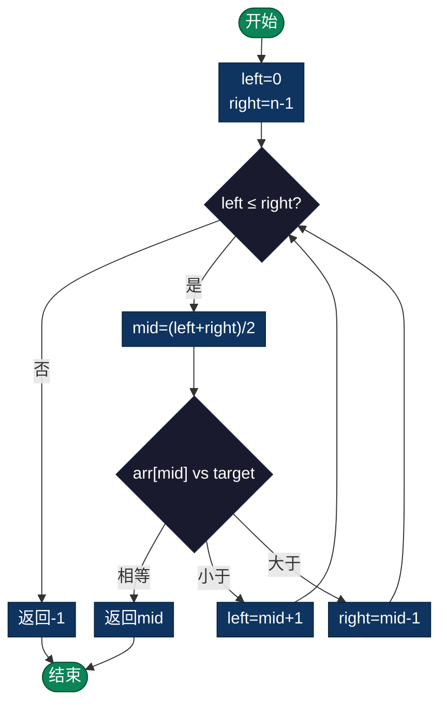

# 二分搜索（Binary Search）

> 通过不断将搜索范围折半，在有序数组中快速定位目标元素。时间复杂度O(log n)。

---

## 定义

二分搜索（折半搜索）是一种高效的搜索算法，通过不断将搜索范围折半，在有序数组中快速定位目标元素。

## 前置条件

- **必须**：数组必须是有序的（升序或降序）
- 如果数据无序，需要先排序，总成本为 O(n log n)

## 时间和空间复杂度

- **时间复杂度**：O(log n)
  - 最好情况：O(1)
  - 平均情况：O(log n)
  - 最坏情况：O(log n)

- **空间复杂度**：
  - 迭代版：O(1)
  - 递归版：O(log n) - 递归栈深度

## 算法步骤

1. 初始化左指针 left = 0，右指针 right = length - 1
2. 计算中间位置：mid = (left + right) / 2
3. 比较 arr[mid] 与目标值 target：
   - 如果相等，返回 mid
   - 如果 arr[mid] < target，搜索右半部分：left = mid + 1
   - 如果 arr[mid] > target，搜索左半部分：right = mid - 1

### 流程图



4. 重复步骤2-3，直到 left > right（未找到）

## 伪代码（迭代版）

```c
BinarySearch(arr, target):
    left = 0
    right = length(arr) - 1
    
    while left <= right:
        mid = (left + right) / 2
        if arr[mid] == target:
            return mid
        else if arr[mid] < target:
            left = mid + 1
        else:
            right = mid - 1
    
    return -1
```

## 变种

1. **搜索首个匹配**：找第一个等于 target 的位置
2. **搜索末尾匹配**：找最后一个等于 target 的位置
3. **搜索范围**：找第一个 >= target 的位置
4. **旋转数组搜索**：在部分有序的旋转数组中搜索

## 优点

- 高效，时间复杂度仅为 O(log n)
- 适合大数据集搜索
- 实现相对简单
- 无额外空间需求（迭代版）

## 缺点

- 要求数据必须有序
- 不适合链表（无法随机访问）
- 建立有序数据的成本（如需排序）
- 对动态数据维护困难

## 常见错误

1. **分界条件错误**：left <= right vs left < right
2. **中点溢出**：应使用 mid = left + (right - left) / 2
3. **搜索范围错误**：mid+1 和 mid-1 的处理
4. **目标不存在**：应正确返回 -1 或插入位置

## 应用场景

- 在大型有序数组中查询
- 数据库索引查询
- 版本控制系统（如找第一个有bug的版本）
- 资源分配问题（二分搜索答案）
- LeetCode 相关问题

## 性能对比

| 场景 | 线性搜索 | 二分搜索 |
|------|---------|---------|
| 100 个元素 | ~50 次 | ~7 次 |
| 1000 个元素 | ~500 次 | ~10 次 |
| 1百万个元素 | ~50万次 | ~20 次 |

## 实现列表

| 语言 | 文件名 | 说明 |
|------|--------|------|
| C | [binary_search.c](./binary_search.c) | 迭代/递归实现 |
| Java | [BinarySearch.java](./BinarySearch.java) | 搜索类 |
| Python | [binary_search.py](./binary_search.py) | 简洁实现 |
| Go | [binary_search.go](./binary_search.go) | 泛型实现 |
| JavaScript | [binarySearch.js](./binarySearch.js) | ES6实现 |
| TypeScript | [BinarySearch.ts](./BinarySearch.ts) | 类型安全 |
| Rust | [binary_search.rs](./binary_search.rs) | 内存安全 |

---

## 扩展阅读

- 二分搜索的边界问题详解
- 二分搜索答案技巧
- 插值搜索与指数搜索
