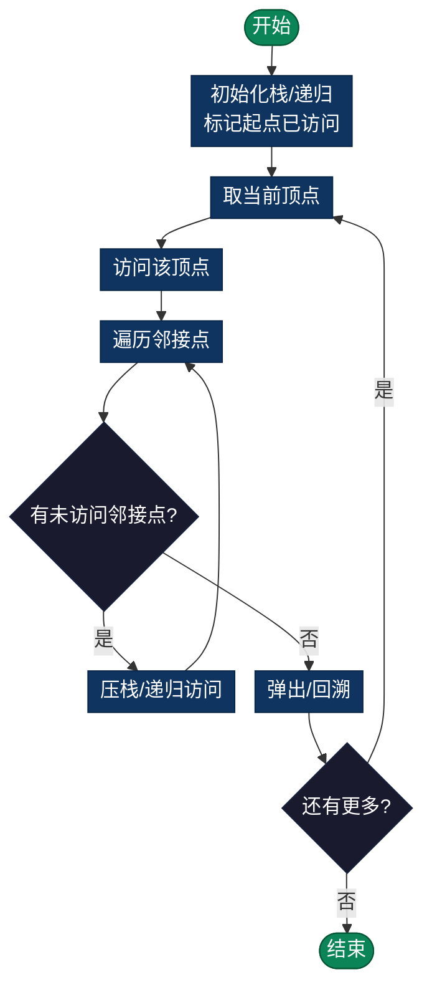

# 深度优先搜索（DFS - Depth First Search）

> 尽可能深地探索每条分支后再回溯，优先在深度方向上探索，适用于树和图结构。

## 定义

深度优先搜索是一种图遍历算法，它尽可能深地探索每条完整的分支后再回溯。优先在深度方向上探索，适用于树和图结构。

## 核心特点

- **策略**：优先往纵深方向探索
- **数据结构**：栈（Stack）或递归
- **遍历顺序**：先深后浅
- **回溯**：无法继续时返回上一层

## 时间和空间复杂度

- **时间复杂度**：O(V + E)
  - V：顶点数
  - E：边数
  
- **空间复杂度**：O(V)
  - 递归版：O(V) - 递归栈
  - 迭代版：O(V) - 显式栈

## 实现方式

### 1. 递归实现

```python
def dfs(graph, node, visited):
    visited.add(node)
    for neighbor in graph[node]:
        if neighbor not in visited:
            dfs(graph, neighbor, visited)
```

### 流程图



**优点**：代码简洁直观  
**缺点**：深度过大可能栈溢出

### 2. 迭代实现（栈）

```python
def dfs(graph, start):
    visited = set()
    stack = [start]
    
    while stack:
        node = stack.pop()
        if node not in visited:
            visited.add(node)
            stack.extend(graph[node])
```

**优点**：避免递归开销，控制更灵活  
**缺点**：需要显式栈管理

## 算法步骤

1. 选择起始顶点，标记为已访问
2. 对该顶点的每个未访问邻接顶点进行递归 DFS
3. 当无法继续深入时，回溯到上一顶点
4. 重复直到所有连通的顶点都被访问

## 应用场景

| 应用 | 说明 |
|------|------|
| **拓扑排序** | 有向无环图的排序 |
| **检测环** | 判断图中是否存在循环 |
| **路径查找** | 查找两点之间的路径 |
| **强连通分量** | 分解有向图 |
| **树的遍历** | 前序、中序、后序遍历 |
| **迷宫求解** | 回溯寻找出路 |
| **关键路径** | 项目管理中的路径分析 |

## DFS vs BFS

| 特性 | DFS | BFS |
|------|-----|-----|
| 深度优先 | ✓ | ✗ |
| 逐层遍历 | ✗ | ✓ |
| 最短路径 | ✗ | ✓ |
| 栈/队列 | 栈 | 队列 |
| 空间使用 | 不均衡 | 较均衡 |
| 实现方式 | 递归/栈 | 队列 |

## 算法变种

1. **前序遍历 DFS**：访问顶点-递归子树
2. **后序遍历 DFS**：递归子树-访问顶点
3. **带时间戳 DFS**：记录发现和完成时间

## 复杂度分析

对于无向图：
- 访问每个顶点：O(V)
- 遍历所有边：O(E)
- 总复杂度：O(V + E)

对于邻接表：
- 时间：O(V + E)
- 空间：O(V)

对于邻接矩阵：
- 时间：O(V²) 即使无边
- 空间：O(V²) 存储矩阵

## 实现列表

| 语言 | 文件名 | 说明 |
|------|--------|------|
| C | [dfs.c](./dfs.c) | 递归/栈实现 |
| Java | [DFS.java](./DFS.java) | DFS类 |
| Python | [dfs.py](./dfs.py) | 简洁实现 |
| Go | [dfs.go](./dfs.go) | 并发优化 |
| JavaScript | [dfs.js](./dfs.js) | ES6实现 |
| TypeScript | [DFS.ts](./DFS.ts) | 类型安全 |
| Rust | [dfs.rs](./dfs.rs) | 内存安全 |

---

## 扩展阅读

- 迭代深化搜索（IDDFS）
- 双向DFS
- Tarjan强连通分量算法
