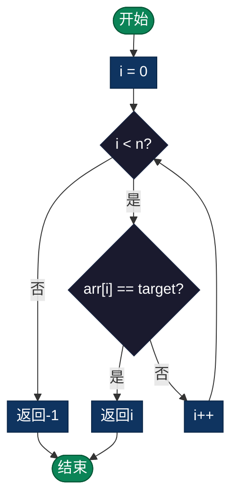

# 线性搜索（Linear Search）

> 最简单的搜索算法，从数组第一个元素开始逐个扫描，直到找到目标值或遍历完整个数组。适用于无序数据和小规模数据集。

## 导航

| [算法原理](#定义) | [复杂度分析](#时间和空间复杂度) | [实现列表](#实现列表) |

---

## 定义

线性搜索是最简单的搜索算法，从数组的第一个元素开始，逐个扫描每个元素，直到找到目标值或遍历完整个数组。

## 时间和空间复杂度

- **时间复杂度**：O(n)
  - 最好情况：O(1) - 目标在第一个位置
  - 平均情况：O(n/2) = O(n)
  - 最坏情况：O(n) - 目标在最后或不存在

- **空间复杂度**：O(1) - 只需常数额外空间

## 算法步骤

1. 从数组的第一个元素开始
2. 将当前元素与目标值比较
3. 如果相等，返回当前索引
4. 如果不相等，移动到下一个元素
5. 重复步骤2-4，直到找到或遍历完毕
6. 如果未找到，返回 -1

### 流程图



## 伪代码

```
LinearSearch(arr, target):
    for i from 0 to length(arr)-1:
        if arr[i] == target:
            return i
    return -1
```

## 优点

- 实现简单，易于理解
- 对无序数据有效
- 适合小数据集
- 无额外空间需求

## 缺点

- 效率低，不适合大数据集
- 无法利用数据有序性质
- 对于频繁搜索效率差

## 应用场景

- 小规模数据搜索（< 100 元素）
- 链表搜索（无法进行二分）
- 无序或部分有序数据
- 寻找所有匹配元素时的预处理

## 优化

1. **早期停止**：找到即返回
2. **缓存友好**：连续访问内存
3. **SIMD优化**：利用向量指令

## 实现列表

| 语言 | 文件名 | 说明 |
|------|--------|------|
| C | [linear_search.c](./linear_search.c) | 基础实现 |
| Java | [LinearSearch.java](./LinearSearch.java) | 搜索类 |
| Python | [linear_search.py](./linear_search.py) | 简洁实现 |
| Go | [linear_search.go](./linear_search.go) | 并发优化 |
| JavaScript | [linearSearch.js](./linearSearch.js) | ES6实现 |
| TypeScript | [LinearSearch.ts](./LinearSearch.ts) | 类型安全 |
| Rust | [linear_search.rs](./linear_search.rs) | 内存安全 |

---

## 扩展阅读

- 哨兵线性搜索优化
- 并行线性搜索
- GPU加速线性搜索
