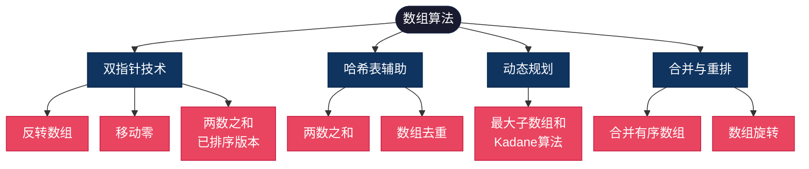
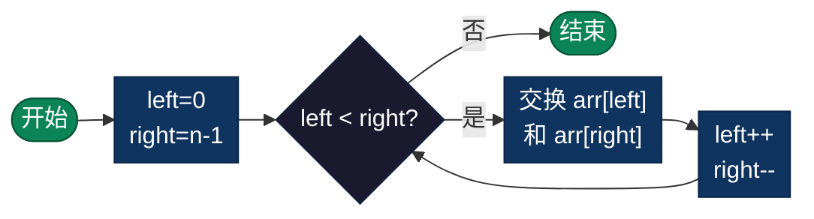
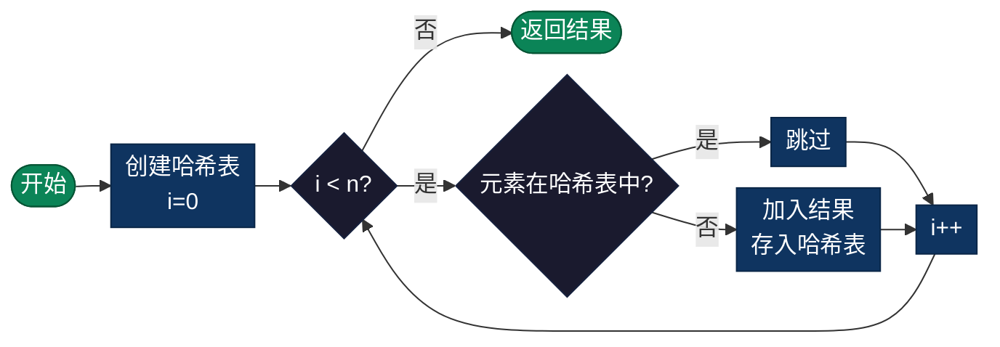
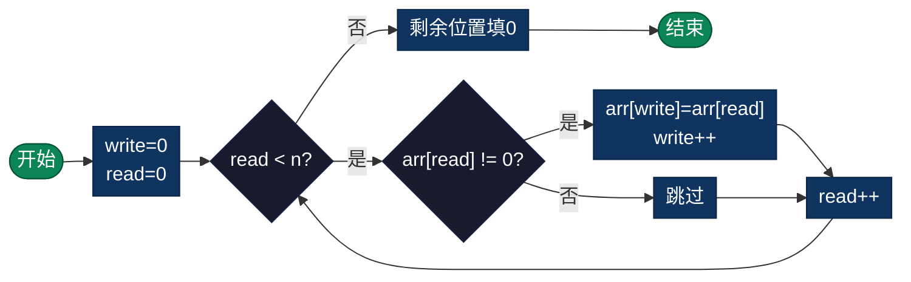
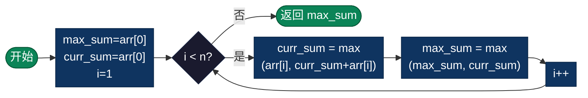
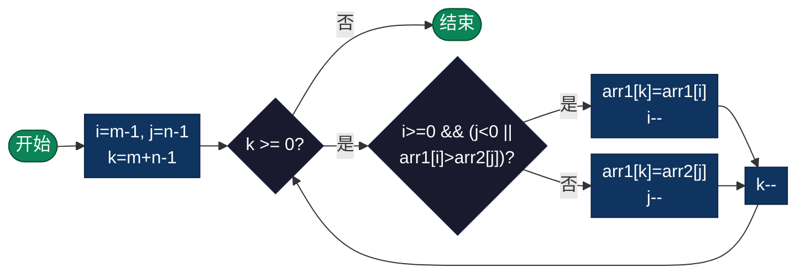
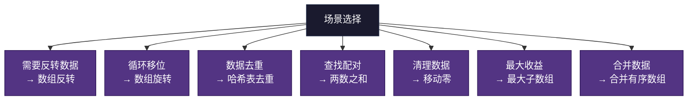
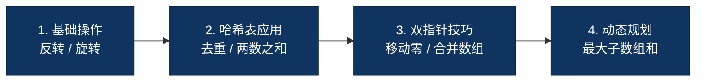

# 数组（Array）算法概述

> 数组是一种基础的线性数据结构，用于存储固定大小的同类型元素集合。所有元素在内存中连续存储，支持通过索引进行 O(1) 随机访问。本目录涵盖数组的经典操作算法，包括反转、旋转、去重、查找、合并等常用操作的多语言实现。

## 导航总览

| 算法 | 时间复杂度 | 空间复杂度 | 核心技巧 | 目录 |
|------|-----------|-----------|---------|------|
| [数组反转 Reverse](#31-数组反转reverse) | O(n) | O(1) | 双指针 | [`reverse/`](./reverse/) |
| [数组旋转 Rotate](#32-数组旋转rotate) | O(n) | O(1) | 三次翻转 | [`rotate/`](./rotate/) |
| [数组去重 Unique](#33-数组去重unique) | O(n) | O(n) | 哈希表 | [`unique/`](./unique/) |
| [两数之和 Two Sum](#34-两数之和two-sum) | O(n) | O(n) | 哈希表 | [`two-sum/`](./two-sum/) |
| [移动零 Move Zeroes](#35-移动零move-zeroes) | O(n) | O(1) | 双指针 | [`move-zeroes/`](./move-zeroes/) |
| [最大子数组和 Maximum Subarray](#36-最大子数组和maximum-subarray) | O(n) | O(1) | 动态规划 | [`maximum-subarray/`](./maximum-subarray/) |
| [合并有序数组 Merge Sorted Array](#37-合并有序数组merge-sorted-array) | O(m+n) | O(1) | 从后向前 | [`merge-sorted-array/`](./merge-sorted-array/) |

---

## 1. 数组基础

### 1.1 数组内存结构

```
索引:    0      1      2      3      4      5
      ┌──────┬──────┬──────┬──────┬──────┬──────┐
      │  10  │  20  │  30  │  40  │  50  │  60  │
      └──────┴──────┴──────┴──────┴──────┴──────┘

内存地址: 1000   1004   1008   1012   1016   1020  (假设每个元素4字节)
         ↑                         ↑
      基地址                    随机访问: O(1)
```

### 1.2 数组操作复杂度

| 操作 | 时间复杂度 | 说明 |
|------|-----------|------|
| 随机访问 | O(1) | 通过索引直接访问 |
| 线性搜索 | O(n) | 逐个遍历查找 |
| 插入/删除 | O(n) | 需要移动后续元素 |
| 反转 | O(n) | 双指针交换 |
| 排序 | O(n log n) | 基于比较的排序 |

---

## 2. 数组算法分类

### 2.1 算法分类树



---

## 3. 经典数组算法

### 3.1 数组反转（Reverse）

**简介**：使用双指针技术，一个在数组头部，一个在尾部，向中间移动并交换元素，直到相遇。

| 时间复杂度 | 空间复杂度 | 稳定性 |
|-----------|-----------|--------|
| O(n) | O(1) | 稳定 |



**适用场景**：字符串反转、数据预处理、算法辅助操作。

**实现目录**：[`reverse/`](./reverse/)

---

### 3.2 数组旋转（Rotate）

**简介**：将数组元素向左或向右旋转 k 个位置。使用三次翻转法实现原地旋转：翻转整个数组，再分别翻转两部分。

| 时间复杂度 | 空间复杂度 | 稳定性 |
|-----------|-----------|--------|
| O(n) | O(1) | 不稳定 |


**适用场景**：循环队列、字符串轮转、数据重排。

**实现目录**：[`rotate/`](./rotate/)

---

### 3.3 数组去重（Unique）

**简介**：移除数组中的重复元素，保留唯一值。使用哈希表记录已出现元素，或先排序后用双指针。

| 时间复杂度 | 空间复杂度 | 稳定性 |
|-----------|-----------|--------|
| O(n) | O(n) | 不稳定 |



**适用场景**：数据清洗、统计分析、缓存优化。

**实现目录**：[`unique/`](./unique/)

---

### 3.4 两数之和（Two Sum）

**简介**：在数组中找到两个数，使其和等于目标值。使用哈希表存储已遍历元素，实现 O(n) 查找。

| 时间复杂度 | 空间复杂度 | 稳定性 |
|-----------|-----------|--------|
| O(n) | O(n) | - |

```mermaid
%%{init: {'flowchart': {'nodeSpacing': 15, 'rankSpacing': 25, 'padding': 5}}}%%
graph LR
    S(["开始"]) --> INIT["创建哈希表<br/>i=0"]
    INIT --> LOOP{"i < n?"}
    LOOP -->|"否"| END(["未找到"])
    LOOP -->|"是"| CALC["补数 = target - arr[i]"]
    CALC --> CHECK{"补数在哈希表中?"}
    CHECK -->|"是"| FOUND(["返回结果"])
    CHECK -->|"否"| STORE["存入哈希表<br/>arr[i]:i"]
    STORE --> INC["i++"]
    INC --> LOOP

    classDef start fill:#0b8457,color:#fff,stroke:#065535
    classDef decision fill:#1a1a2e,color:#fff,stroke:#16213e
    classDef process fill:#0f3460,color:#fff,stroke:#0a2647
    classDef end fill:#e94560,color:#fff,stroke:#c81e45

    class S start
    class END,FOUND end
    class LOOP,CHECK decision
    class INIT,CALC,STORE,INC process
```

**适用场景**：配对问题、数据匹配、游戏开发。

**实现目录**：[`two-sum/`](./two-sum/)

---

### 3.5 移动零（Move Zeroes）

**简介**：将数组中的所有零移动到末尾，保持非零元素相对顺序。使用双指针，一个读一个写。

| 时间复杂度 | 空间复杂度 | 稳定性 |
|-----------|-----------|--------|
| O(n) | O(1) | 稳定 |



**适用场景**：数据清理、内存压缩、算法优化。

**实现目录**：[`move-zeroes/`](./move-zeroes/)

---

### 3.6 最大子数组和（Maximum Subarray）

**简介**：使用 Kadane 算法找到连续子数组的最大和。动态规划思想，维护当前和与最大和。

| 时间复杂度 | 空间复杂度 | 稳定性 |
|-----------|-----------|--------|
| O(n) | O(1) | - |



**适用场景**：股票最大收益、信号处理、数据分析。

**实现目录**：[`maximum-subarray/`](./maximum-subarray/)

---

### 3.7 合并有序数组（Merge Sorted Array）

**简介**：合并两个已排序数组。从尾部向前填充，避免覆盖未处理元素。

| 时间复杂度 | 空间复杂度 | 稳定性 |
|-----------|-----------|--------|
| O(m+n) | O(1) | 稳定 |



**适用场景**：归并排序、数据合并、外部排序。

**实现目录**：[`merge-sorted-array/`](./merge-sorted-array/)

---

## 4. 算法复杂度对比

| 算法 | 时间复杂度 | 空间复杂度 | 核心技巧 |
|------|-----------|-----------|---------|
| 数组反转 | O(n) | O(1) | 双指针 |
| 数组旋转 | O(n) | O(1) | 三次翻转 |
| 数组去重 | O(n) | O(n) | 哈希表 |
| 两数之和 | O(n) | O(n) | 哈希表 |
| 移动零 | O(n) | O(1) | 双指针 |
| 最大子数组 | O(n) | O(1) | 动态规划 |
| 合并有序数组 | O(m+n) | O(1) | 从后向前 |

---

## 5. 典型应用场景



### 5.1 数据处理
- **数据清洗**：去重、过滤、格式化
- **数据转换**：重排、旋转、反转
- **数据合并**：多个数据源的整合

### 5.2 算法基础
- **排序算法**：快速排序、归并排序的基础
- **搜索算法**：二分搜索的前提
- **动态规划**：状态存储和转移

### 5.3 系统开发
- **缓冲区管理**：固定大小的数据存储
- **队列实现**：循环队列、双端队列
- **缓存系统**：LRU缓存的数据存储

---

## 6. 学习建议

### 6.1 学习路径



### 6.2 实践要点
- **边界条件**：空数组、单元素数组
- **时间复杂度**：选择最优算法
- **空间复杂度**：尽量原地操作
- **代码规范**：清晰的变量命名和注释

---

## 7. 数组算法多语言实现

| 算法 | C | Java | Go | Python | JavaScript | TypeScript | Rust |
|------|---|------|----|--------|------------|------------|------|
| **数组反转** | [C](./reverse/reverse_array.c) | [Java](./reverse/ReverseArray.java) | [Go](./reverse/reverse_array.go) | [PY](./reverse/reverse_array.py) | [JS](./reverse/reverse_array.js) | [TS](./reverse/ReverseArray.ts) | [Rust](./reverse/reverse_array.rs) |
| **数组旋转** | [C](./rotate/rotate_array.c) | [Java](./rotate/RotateArray.java) | [Go](./rotate/rotate_array.go) | [PY](./rotate/rotate_array.py) | [JS](./rotate/rotate_array.js) | [TS](./rotate/RotateArray.ts) | [Rust](./rotate/rotate_array.rs) |
| **数组去重** | [C](./unique/unique.c) | [Java](./unique/UniqueArray.java) | [Go](./unique/unique.go) | [PY](./unique/unique.py) | [JS](./unique/unique.js) | [TS](./unique/UniqueArray.ts) | [Rust](./unique/unique.rs) |
| **两数之和** | [C](./two-sum/two_sum.c) | [Java](./two-sum/TwoSum.java) | [Go](./two-sum/two_sum.go) | [PY](./two-sum/two_sum.py) | [JS](./two-sum/two_sum.js) | [TS](./two-sum/TwoSum.ts) | [Rust](./two-sum/two_sum.rs) |
| **移动零** | [C](./move-zeroes/move_zeroes.c) | [Java](./move-zeroes/MoveZeroes.java) | [Go](./move-zeroes/move_zeroes.go) | [PY](./move-zeroes/move_zeroes.py) | [JS](./move-zeroes/move_zeroes.js) | [TS](./move-zeroes/MoveZeroes.ts) | [Rust](./move-zeroes/move_zeroes.rs) |
| **最大子数组** | [C](./maximum-subarray/maximum_subarray.c) | [Java](./maximum-subarray/MaximumSubarray.java) | [Go](./maximum-subarray/maximum_subarray.go) | [PY](./maximum-subarray/maximum_subarray.py) | [JS](./maximum-subarray/maximum_subarray.js) | [TS](./maximum-subarray/MaximumSubarray.ts) | [Rust](./maximum-subarray/maximum_subarray.rs) |
| **合并有序数组** | [C](./merge-sorted-array/merge_sorted_array.c) | [Java](./merge-sorted-array/MergeSortedArray.java) | [Go](./merge-sorted-array/merge_sorted_array.go) | [PY](./merge-sorted-array/merge_sorted_array.py) | [JS](./merge-sorted-array/merge_sorted_array.js) | [TS](./merge-sorted-array/MergeSortedArray.ts) | [Rust](./merge-sorted-array/merge_sorted_array.rs) |
