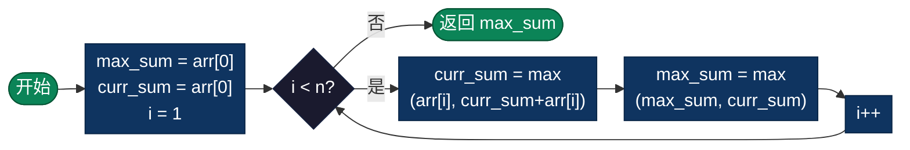

# 最大子数组和（Maximum Subarray）

> 找到数组中连续子数组的最大和。经典的 Kadane 算法是动态规划的优化版本，以 O(n) 时间复杂度解决这个问题。

## 算法概述

最大子数组和问题是要在一个包含正负数的数组中，找到一个连续的子数组，使其元素之和最大。这是一个经典的动态规划问题，在计算机科学和实际应用中具有重要意义。

### 问题定义

给定一个整数数组 `nums`，找到一个具有最大和的连续子数组（子数组至少包含一个元素），返回其最大和。

### 问题意义

- **算法基础**：这是动态规划的经典入门问题，展示了如何将问题分解为子问题
- **实际应用**：广泛用于股票交易分析、信号处理、数据分析等领域
- **算法优化**：从暴力解法 O(n²) 优化到 Kadane 算法 O(n)，展示了算法优化的思路

### 典型应用场景

- **股票交易**：计算在特定时间段内股票价格变化的最大收益
- **数据分析**：找出时间序列数据中的峰值区间
- **信号处理**：识别信号中能量最强的连续段
- **资源管理**：确定资源分配的最优连续时间段

## 算法原理

使用 **Kadane 算法**（动态规划）：
1. 维护两个变量：
   - `current_sum`：当前子数组的和
   - `max_sum`：全局最大和
2. 遍历数组，对于每个元素决定：
   - 将当前元素加入之前的子数组（`current_sum + num`）
   - 从当前元素开始新子数组（`num`）
3. 取两者较大值更新 `current_sum`
4. 用 `current_sum` 更新 `max_sum`

### 示例演示（Kadane算法）

```
初始数组: [-2, 1, -3, 4, -1, 2, 1, -5, 4]

遍历过程:
┌────────┬────────────┬─────────────┬──────────────────┐
│  元素  │ current_sum│   max_sum   │      说明        │
├────────┼────────────┼─────────────┼──────────────────┤
│   -2   │    -2      │     -2      │ 初始化           │
│    1   │     1      │      1      │ max(-2+1,1)=1   │
│   -3   │    -2      │      1      │ max(1-3,-3)=-2  │
│    4   │     4      │      4      │ max(-2+4,4)=4   │
│   -1   │     3      │      4      │ max(4-1,-1)=3   │
│    2   │     5      │      5      │ max(3+2,2)=5    │
│    1   │     6      │      6      │ max(5+1,1)=6    │
│   -5   │     1      │      6      │ max(6-5,-5)=1   │
│    4   │     5      │      6      │ max(1+4,4)=5    │
└────────┴────────────┴─────────────┴──────────────────┘

最大和: 6
子数组: [4, -1, 2, 1]（下标3到6）
```

### 关键思想
- 当 `current_sum` 为负数时，对后续元素没有贡献，重新开始
- `max_sum` 记录遍历过程中遇到的最大值

---

## 复杂度分析

| 指标 | 复杂度 | 说明 |
|------|--------|------|
| **时间复杂度** | O(n) | 单次遍历数组 |
| **空间复杂度** | O(1) | 仅使用两个变量 |
| **稳定性** | - | 只返回最大和值 |

### 解法对比

| 解法 | 时间复杂度 | 空间复杂度 | 说明 |
|------|-----------|-----------|------|
| 暴力枚举 | O(n²) | O(1) | 枚举所有子数组 |
| 分治法 | O(n log n) | O(log n) | 递归求解 |
| **Kadane算法** | **O(n)** | **O(1)** | **推荐解法** |

---

## 流程图



---

## 适用场景

- **股票交易**：寻找最佳买入卖出时机，获取最大利润
- **信号处理**：分析时序数据中的最大能量段
- **数据分析**：找出数据集中的峰值区间
- **资源调度**：寻找最优的资源分配区间

---

## 实现列表

| 语言 | 文件名 | 说明 |
|------|--------|------|
| C | [maximum_subarray.c](./maximum_subarray.c) | Kadane算法实现 |
| Java | [MaximumSubarray.java](./MaximumSubarray.java) | 面向对象实现 |
| Go | [maximum_subarray.go](./maximum_subarray.go) | 简洁实现 |
| Python | [maximum_subarray.py](./maximum_subarray.py) | 多方法对比 |
| JavaScript | [maximum_subarray.js](./maximum_subarray.js) | 标准实现 |
| TypeScript | [MaximumSubarray.ts](./MaximumSubarray.ts) | 类型安全版本 |
| Rust | [maximum_subarray.rs](./maximum_subarray.rs) | 内存安全实现 |

---

## 使用示例

### C 版本
```c
int nums[] = {-2, 1, -3, 4, -1, 2, 1, -5, 4};
int result = maxSubArray(nums, 9);
// 结果: 6
```

### Python 版本
```python
nums = [-2, 1, -3, 4, -1, 2, 1, -5, 4]
result = max_sub_array(nums)
# 结果: 6
```

---

## 扩展阅读

- 扩展版本可以同时返回子数组的起止索引
- 环形数组的最大子数组和问题需要特殊处理
- 可以扩展到求最大子矩阵和（2D 版本）
- 分治法解法虽然时间复杂度高，但思想重要
