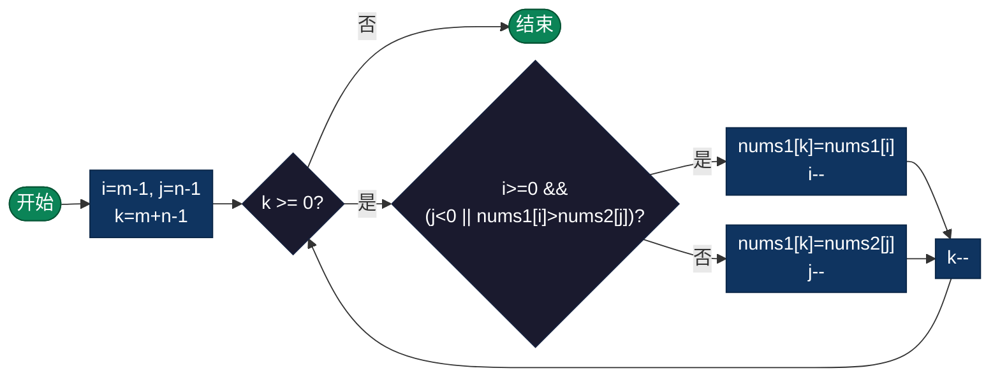

# 合并有序数组（Merge Sorted Array）

> 将两个已排序的数组合并为一个有序数组。本算法采用从后向前合并的策略，实现 O(1) 空间复杂度的原地合并。

---

## 算法原理

合并两个有序数组使用**从后向前填充**策略：
1. 使用三个指针：
   - `i`：指向 `nums1` 有效元素的末尾（索引 m-1）
   - `j`：指向 `nums2` 的末尾（索引 n-1）
   - `k`：指向合并后数组的末尾（索引 m+n-1）
2. 比较 `nums1[i]` 和 `nums2[j]`，将较大的元素放到 `nums1[k]`
3. 相应指针向前移动
4. 重复直到其中一个数组遍历完
5. 如果 `nums2` 还有剩余，复制到 `nums1` 前面

### 为什么从后向前？

- `nums1` 后面有足够的空间容纳两个数组的元素
- 从后向前填充避免覆盖 `nums1` 中尚未处理的元素
- 实现真正的 O(1) 空间原地合并

### 示例演示

```
nums1 = [1, 2, 3, 0, 0, 0], m = 3
nums2 = [2, 5, 6],       n = 3

初始化指针:
i = 2 (指向nums1的3)
j = 2 (指向nums2的6)
k = 5 (指向结果位置)

步骤1: nums1[2]=3 vs nums2[2]=6, 6更大
       nums1[5] = 6, j=1, k=4
       nums1: [1, 2, 3, 0, 0, 6]

步骤2: nums1[2]=3 vs nums2[1]=5, 5更大
       nums1[4] = 5, j=0, k=3
       nums1: [1, 2, 3, 0, 5, 6]

步骤3: nums1[2]=3 vs nums2[0]=2, 3更大
       nums1[3] = 3, i=1, k=2
       nums1: [1, 2, 3, 3, 5, 6]

步骤4: nums1[1]=2 vs nums2[0]=2, 相等
       nums1[2] = 2, j=-1, k=1
       nums1: [1, 2, 2, 3, 5, 6]

步骤5: j < 0, nums2已用完, 结束

结果: [1, 2, 2, 3, 5, 6]
```

---

## 复杂度分析

| 指标 | 复杂度 | 说明 |
|------|--------|------|
| **时间复杂度** | O(m+n) | m和n分别是两个数组的长度，每个元素访问一次 |
| **空间复杂度** | O(1) | 原地合并，仅使用指针变量 |
| **稳定性** | 稳定 | 相等元素保持原有相对顺序 |

---

## 流程图



---

## 适用场景

- **归并排序**：归并排序算法的核心步骤
- **数据合并**：整合多个有序数据源
- **外部排序**：处理无法全部载入内存的大规模数据
- **日志合并**：合并按时间排序的多个日志文件

---

## 实现列表

| 语言 | 文件名 | 说明 |
|------|--------|------|
| C | [merge_sorted_array.c](./merge_sorted_array.c) | 指针操作实现 |
| Java | [MergeSortedArray.java](./MergeSortedArray.java) | 面向对象实现 |
| Go | [merge_sorted_array.go](./merge_sorted_array.go) | 切片操作 |
| Python | [merge_sorted_array.py](./merge_sorted_array.py) | 简洁实现 |
| JavaScript | [merge_sorted_array.js](./merge_sorted_array.js) | 数组操作 |
| TypeScript | [MergeSortedArray.ts](./MergeSortedArray.ts) | 类型安全版本 |
| Rust | [merge_sorted_array.rs](./merge_sorted_array.rs) | 内存安全实现 |

---

## 使用示例

### C 版本
```c
int nums1[6] = {1, 2, 3, 0, 0, 0};
int nums2[] = {2, 5, 6};
merge(nums1, 6, 3, nums2, 3, 3);
// 结果: [1, 2, 2, 3, 5, 6]
```

### Python 版本
```python
nums1 = [1, 2, 3, 0, 0, 0]
nums2 = [2, 5, 6]
merge(nums1, 3, nums2, 3)
# 结果: [1, 2, 2, 3, 5, 6]
```

---

## 扩展阅读

- 归并排序的时间复杂度为 O(n log n)，此合并过程是其基础
- 可以扩展到合并 k 个有序数组，使用优先队列优化
- 链表版本的合并不需要考虑空间问题，更加直观
- 此算法是外部排序的核心组件，用于处理大规模数据
