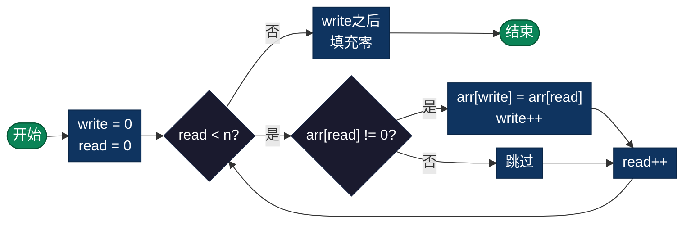

# 移动零（Move Zeroes）

> 将数组中的所有零移动到末尾，同时保持非零元素的相对顺序。这是双指针技巧的经典应用。

## 算法概述

移动零问题是要在不使用额外数组的情况下，将数组中的所有零元素移动到数组末尾，同时保持非零元素的相对顺序不变。这是一个经典的双指针应用问题，展示了如何通过原地操作优化空间复杂度。

### 问题定义

给定一个数组 `nums`，将所有值为 0 的元素移动到数组末尾，同时保持非零元素的相对顺序。必须在原数组上操作，不能使用额外数组分配空间。

### 问题意义

- **双指针技巧**：这是学习双指针技巧的经典入门问题
- **原地操作**：展示了如何在有限空间内完成数据重排
- **数据清洗**：实际应用中常用于过滤无效数据
- **算法思维**：培养对数组遍历和元素交换的深入理解

### 典型应用场景

- **数据清洗**：移除或移动无效数据（用零表示的占位符）
- **内存压缩**：将有效数据聚集，提高缓存命中率
- **稀疏数组处理**：处理含大量零值的稀疏数据结构
- **算法预处理**：为后续算法准备数据，如去除前导零

## 算法原理

使用**读写双指针**（分离双指针）：
1. `write` 指针：指向下一个非零元素应该写入的位置
2. `read` 指针：遍历数组，查找非零元素
3. 当 `read` 遇到非零元素时，复制到 `write` 位置，两指针前进
4. 当 `read` 遇到零时，只前进 `read` 指针
5. 最后将 `write` 之后的位置全部填充为零

### 示例演示

```
初始数组: [0, 1, 0, 3, 12, 0, 5]

write=0, read=0
步骤1: arr[0]=0 是零，跳过 → write=0, read=1
步骤2: arr[1]=1 非零，写入 → arr[0]=1, write=1, read=2
步骤3: arr[2]=0 是零，跳过 → write=1, read=3
步骤4: arr[3]=3 非零，写入 → arr[1]=3, write=2, read=4
步骤5: arr[4]=12 非零，写入 → arr[2]=12, write=3, read=5
步骤6: arr[5]=0 是零，跳过 → write=3, read=6
步骤7: arr[6]=5 非零，写入 → arr[3]=5, write=4, read=7

最后填充: arr[4..6] = 0

结果: [1, 3, 12, 5, 0, 0, 0]
```

---

## 复杂度分析

| 指标 | 复杂度 | 说明 |
|------|--------|------|
| **时间复杂度** | O(n) | 单次遍历数组 |
| **空间复杂度** | O(1) | 原地操作 |
| **稳定性** | 稳定 | 保持非零元素相对顺序 |

---

## 流程图



---

## 适用场景

- **数据清理**：移除或移动无效数据（用零表示）
- **内存压缩**：将有效数据聚集，提高缓存命中率
- **稀疏数组处理**：处理含大量零值的稀疏数据
- **算法优化**：为后续处理准备数据（如去除前导零）

---

## 实现列表

| 语言 | 文件名 | 说明 |
|------|--------|------|
| C | [move_zeroes.c](./move_zeroes.c) | 指针操作 |
| Java | [MoveZeroes.java](./MoveZeroes.java) | 面向对象实现 |
| Go | [move_zeroes.go](./move_zeroes.go) | 切片操作 |
| Python | [move_zeroes.py](./move_zeroes.py) | 列表操作 |
| JavaScript | [move_zeroes.js](./move_zeroes.js) | 数组操作 |
| TypeScript | [MoveZeroes.ts](./MoveZeroes.ts) | 类型安全版本 |
| Rust | [move_zeroes.rs](./move_zeroes.rs) | 内存安全实现 |

---

## 使用示例

### C 版本
```c
int nums[] = {0, 1, 0, 3, 12, 0, 5};
moveZeroes(nums, 7);
// 结果: [1, 3, 12, 5, 0, 0, 0]
```

### Python 版本
```python
nums = [0, 1, 0, 3, 12, 0, 5]
move_zeroes(nums)
# 结果: [1, 3, 12, 5, 0, 0, 0]
```

---

## 扩展阅读

- 双指针技巧是解决数组问题的核心方法
- 读写分离模式适用于需要过滤元素的场景
- 此算法与快速排序的分区过程类似
