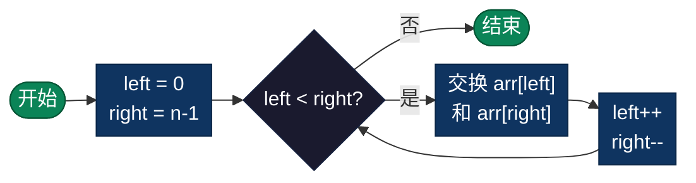

# 数组反转（Reverse Array）

> 数组反转是将数组中的元素顺序完全颠倒的算法，是最基础的数组操作之一。本目录提供数组反转的多种编程语言实现。

## 导航

| [算法原理](#算法原理) | [复杂度分析](#复杂度分析) | [流程图](#流程图) | [实现列表](#实现列表) |

---

## 算法原理

数组反转使用**双指针技术**：
1. 初始化两个指针：`left` 指向数组头部，`right` 指向数组尾部
2. 交换 `left` 和 `right` 指针指向的元素
3. `left` 指针向右移动，`right` 指针向左移动
4. 重复步骤 2-3，直到 `left >= right`

### 示例演示

```
初始数组: [1, 2, 3, 4, 5, 6]
           ↑              ↑
         left           right

步骤1: 交换 1 和 6
       [6, 2, 3, 4, 5, 1]
           ↑           ↑
         left+1      right-1

步骤2: 交换 2 和 5
       [6, 5, 3, 4, 2, 1]
              ↑     ↑
           left+2 right-2

步骤3: 交换 3 和 4
       [6, 5, 4, 3, 2, 1]
                 ↑
            left ≥ right (停止)

结果: [6, 5, 4, 3, 2, 1]
```

---

## 复杂度分析

| 指标 | 复杂度 | 说明 |
|------|--------|------|
| **时间复杂度** | O(n) | 只需遍历数组的一半，n/2 次交换 |
| **空间复杂度** | O(1) | 原地操作，仅使用临时变量 |
| **稳定性** | 稳定 | 元素相对位置关系保持不变 |

---

## 流程图



---

## 适用场景

- **字符串反转**：文本处理、回文判断
- **数据预处理**：为后续算法准备数据
- **算法辅助**：快速排序中的子数组反转
- **数据展示**：逆序展示列表数据

---

## 实现列表

| 语言 | 文件名 | 说明 |
|------|--------|------|
| C | [reverse_array.c](./reverse_array.c) | 指针操作，原地交换 |
| Java | [ReverseArray.java](./ReverseArray.java) | 面向对象实现 |
| Go | [reverse_array.go](./reverse_array.go) | 切片操作 |
| Python | [reverse_array.py](./reverse_array.py) | 列表交换语法 |
| JavaScript | [reverse_array.js](./reverse_array.js) | 数组解构交换 |
| TypeScript | [ReverseArray.ts](./ReverseArray.ts) | 类型安全版本 |
| Rust | [reverse_array.rs](./reverse_array.rs) | 内存安全实现 |

---

## 使用示例

### C 版本
```c
int arr[] = {1, 2, 3, 4, 5};
reverseArray(arr, 5);
// 结果: [5, 4, 3, 2, 1]
```

### Python 版本
```python
arr = [1, 2, 3, 4, 5]
reverse_array(arr)
# 结果: [5, 4, 3, 2, 1]
```

---

## 扩展阅读

- 双指针技术是数组算法的核心技巧
- 原地反转无需额外空间，是空间优化的典范
- 对于链表反转，思路类似但需要处理指针关系
