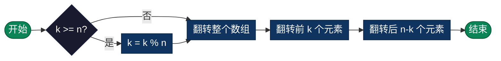

# 数组旋转（Rotate Array）

> 数组旋转是将数组元素向左或向右循环移动 k 个位置的算法。本目录提供数组旋转的多种编程语言实现，使用高效的三次翻转法。

## 算法概述

数组旋转问题是要将数组中的元素向左或向右循环移动 k 个位置，即超出数组边界的元素会从另一端重新进入数组。这是一个经典的数组操作问题，展示了如何利用数学技巧和基础操作组合实现高效算法。

### 问题定义

给定一个数组和整数 k，将数组向右循环移动 k 个位置，其中 k 是非负数。例如，向右旋转 1 位，最后一个元素会移动到第一个位置，其他元素依次向后移动。

### 问题意义

- **算法思维**：展示了如何将复杂问题分解为简单操作（三次翻转）
- **数学应用**：利用数学原理（模运算、翻转）简化问题
- **空间优化**：三次翻转法实现了 O(1) 空间复杂度的原地操作
- **面试重点**：这是技术面试中的高频题目，考察算法设计和优化能力

### 典型应用场景

- **循环队列**：实现队列的循环存储和操作
- **字符串轮转**：判断一个字符串是否是另一个的旋转版本
- **数据重排**：周期性调整数据展示顺序，如轮播图
- **图像处理**：图像像素的循环位移和旋转操作

## 算法原理

数组旋转使用**三次翻转法**（反转算法），实现原地 O(1) 空间复杂度：

1. **第一次翻转**：翻转整个数组
2. **第二次翻转**：翻转前 k 个元素
3. **第三次翻转**：翻转后 n-k 个元素

### 示例演示（向右旋转 2 位）

```
初始数组: [1, 2, 3, 4, 5, 6, 7], k=2

第1步 - 翻转整个数组:
[7, 6, 5, 4, 3, 2, 1]

第2步 - 翻转前 k 个元素 (前2个):
[6, 7, 5, 4, 3, 2, 1]
 ↑  ↑
 翻转后

第3步 - 翻转后 n-k 个元素 (后5个):
[6, 7, 1, 2, 3, 4, 5]
     ↑─────────────↑
        翻转后

结果: [6, 7, 1, 2, 3, 4, 5]
```

### 为什么三次翻转有效？

数学原理：向右旋转 k 位等价于将数组分为两部分交换位置
- 原始: [1,2,3,4,5 | 6,7] 
- 目标: [6,7 | 1,2,3,4,5]

三次翻转正好实现了这个交换操作。

---

## 复杂度分析

| 指标 | 复杂度 | 说明 |
|------|--------|------|
| **时间复杂度** | O(n) | 三次线性遍历，共 3n 次操作 |
| **空间复杂度** | O(1) | 原地操作，无需额外数组 |
| **稳定性** | 不稳定 | 元素相对位置会改变 |

---

## 流程图



---

## 适用场景

- **循环队列**：实现队列的循环存储
- **字符串轮转**：判断一个字符串是否是另一个的旋转版本
- **数据重排**：周期性调整数据展示顺序
- **图像处理**：图像像素的循环位移

---

## 实现列表

| 语言 | 文件名 | 说明 |
|------|--------|------|
| C | [rotate_array.c](./rotate_array.c) | 三次翻转实现 |
| Java | [RotateArray.java](./RotateArray.java) | 面向对象封装 |
| Go | [rotate_array.go](./rotate_array.go) | 切片翻转 |
| Python | [rotate_array.py](./rotate_array.py) | 简洁实现 |
| JavaScript | [rotate_array.js](./rotate_array.js) | 数组操作 |
| TypeScript | [RotateArray.ts](./RotateArray.ts) | 左右旋转支持 |
| Rust | [rotate_array.rs](./rotate_array.rs) | 内存安全版本 |

---

## 使用示例

### C 版本
```c
int arr[] = {1, 2, 3, 4, 5, 6, 7};
rotateArray(arr, 7, 3);  // 向右旋转3位
// 结果: [5, 6, 7, 1, 2, 3, 4]
```

### Python 版本
```python
arr = [1, 2, 3, 4, 5, 6, 7]
rotate_array(arr, 3)  # 向右旋转3位
# 结果: [5, 6, 7, 1, 2, 3, 4]
```

---

## 扩展阅读

- 向左旋转 k 位等价于向右旋转 n-k 位
- 可以使用临时数组实现 O(n) 空间复杂度的直观解法
- 三次翻转法是面试常考的空间优化技巧
