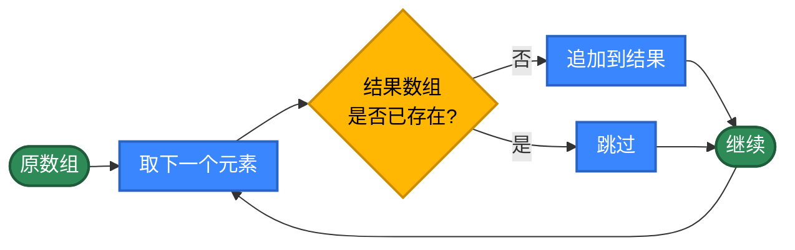
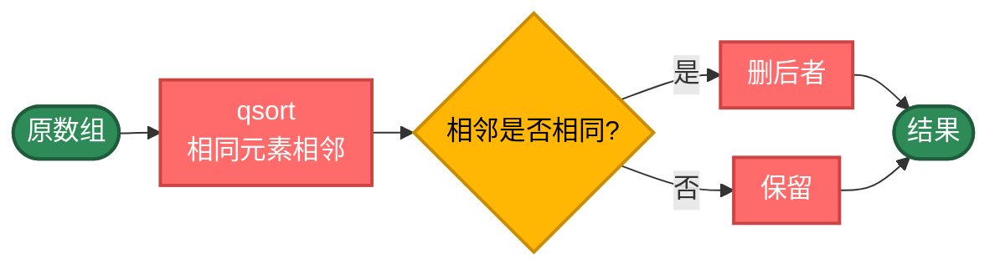
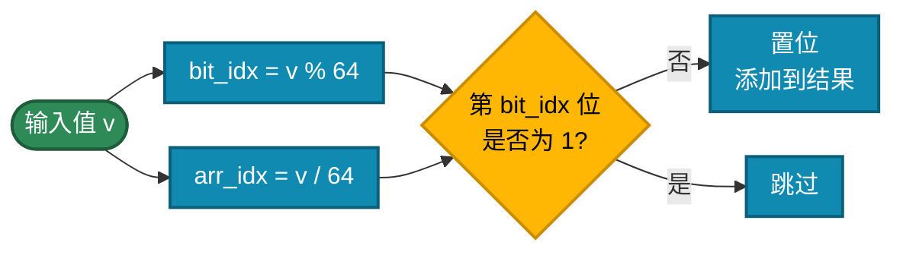
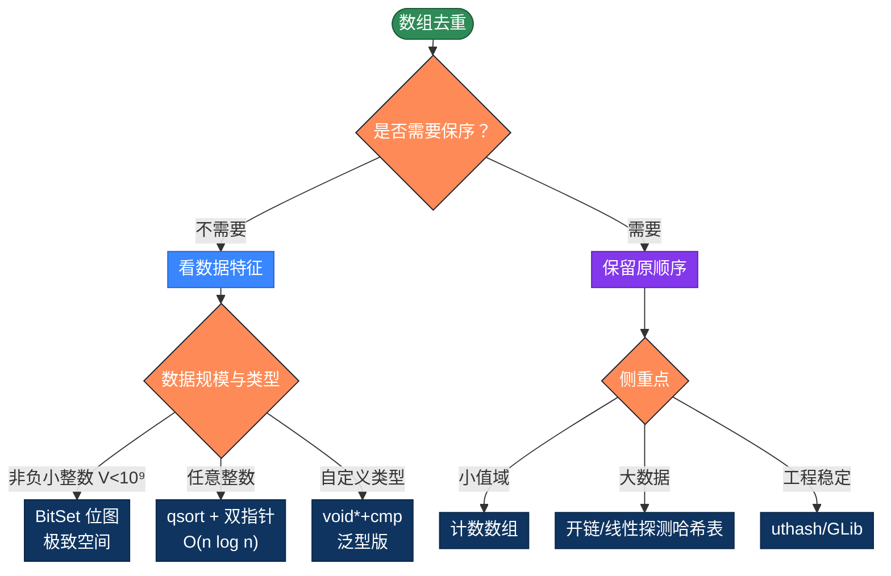

# C 数组去重的 20 种实现方式，用不同思路解决问题

数组去重是最常见的算法。看似简单，但在 C 语言里——没有 String 类、没有 HashMap、没有泛型——你要从最底层的指针、`malloc` 和 `qsort` 重新构建一切。这反而让你看清去重算法的"骨架"。本文整理 C 数组去重的 20 种写法，按 5 个策略分类。AI时代，可以不手写代码了，但需要知道代码背后的原理，这样才能更好地指导AI编程。

## 为什么性能差异这么大？

最简单的写法，新建一个数组，把不在结果里的添加进去。

```c
int unique(int *arr, int len, int *result) {
    int idx = 0;
    for (int i = 0; i < len; i++) {
        int found = 0;
        // 遍历结果数组，判断是否已存在当前元素
        for (int j = 0; j < idx; j++) {
            if (result[j] == arr[i]) { 
                found = 1; break; 
            }
        }
        if (!found) result[idx++] = arr[i];
    }
    return idx;
}
```

问题在于每次 `contains` 都要全量扫一遍 `result`，复杂度是 O(n²)。

**优化思路**：换一种判重方式

- **排序** O(n log n)：相同元素相邻后扫一遍
- **哈希表** O(1) 查询：手写开链或线性探测
- **位图**：`uint64_t[]` 极致空间效率
- **计数数组**：值域小的整数最快
- **泛型 void\***：用 `qsort` 风格的回调一次写好

**C 的特殊点**：
- 必须手动 `malloc`/`free`，所有动态结构都要小心
- 没有内置 HashMap、Set——要么自己写、要么用 GLib/uthash
- `qsort` 是标准库，但比较函数要返回 int
- 字符串去重要用 `strcmp`，结构体去重要用 `memcmp` 或自定义函数
- 没有泛型，用 `void* + size_t elem_size + cmp_fn` 模拟

## 推荐方案

| 需求 | 代码 | 性能 |
|------|------|------|
| 通用首选 | `qsort` + 相邻去重 | O(n log n) |
| 最快无序 | 哈希表（开链/uthash） | O(n) |
| 海量非负整数 | `uint64_t[]` 位图 | O(n) |
| 值域小（≤1024） | 计数数组 | O(n + V) |
| 字符串去重 | `qsort + strcmp` | O(n log n × m) |
| 结构体按字段去重 | 自定义 `cmp_fn` + qsort | O(n log n) |

---

## 第1类：基础循环（方法1-5）

策略原理：不依赖任何额外数据结构，纯靠下标、嵌套循环、`memcmp` 等"原始"手段完成去重。每一步判重都是 O(n)，整体 O(n²)。

适用场景：教学、嵌入式、内存极度敏感（连 `qsort` 的 stack 都不能用）。



```c
#include <stdio.h>
#include <stdlib.h>
#include <string.h>

/**
 * 方法1：双循环 i==j 索引比较法
 * 核心原理：对每个元素向前查找，下标相同表示首次出现
 * 已是 unique.c 中 uniqueArray3 的实现
 *
 * 时间复杂度：O(n²)
 * 空间复杂度：O(n) 结果数组
 *
 * @param arr 输入数组
 * @param len 数组长度
 * @param result 结果数组（调用者分配，至少 len 长度）
 * @return 去重后实际长度
 */
int unique1(const int *arr, int len, int *result) {
    int idx = 0;
    for (int i = 0; i < len; i++) {
        int j;
        for (j = 0; j <= i; j++) {
            if (arr[i] == arr[j]) {
                /* i == j 表示前面没有相同值，是首次出现 */
                if (i == j) result[idx++] = arr[i];
                break;
            }
        }
    }
    return idx;
}

/**
 * 方法2：标记数组 frequent 法
 * 核心原理：给每个元素一个频次标记，频次为 1 才是首次出现
 * 已是 unique.c 中 uniqueArray2 的实现
 *
 * 时间复杂度：O(n²)
 * 空间复杂度：O(n) 频次数组 + 结果数组
 */
int unique2(const int *arr, int len, int *result) {
    /* VLA 栈上分配（C99）；大数组应改 malloc */
    int frequent[len];
    frequent[0] = 1;
    for (int i = 1; i < len; i++) {
        frequent[i] = 1;
        // 遍历结果数组，判断是否已存在当前元素
        for (int j = 0; j < i; j++) {
            if (arr[i] == arr[j]) { frequent[i]++; break; }
        }
    }
    int idx = 0;
    for (int i = 0; i < len; i++) {
        if (frequent[i] == 1) result[idx++] = arr[i];
    }
    return idx;
}

/**
 * 方法3：新建数组 + contains 检查
 * 核心原理：维护结果数组，遍历时线性查找判重
 * 这是最直观的"新手版"
 *
 * 时间复杂度：O(n²)
 * 空间复杂度：O(n)
 */
int unique3(const int *arr, int len, int *result) {
    int idx = 0;
    for (int i = 0; i < len; i++) {
        int found = 0;
        // 遍历结果数组，判断是否已存在当前元素
        for (int j = 0; j < idx; j++) {
            if (result[j] == arr[i]) { found = 1; break; }
        }
        if (!found) result[idx++] = arr[i];
    }
    return idx;
}

/**
 * 方法4：原地从前往后删除（memmove 风格）
 * 核心原理：遇到重复就把后面元素整体前移
 * 注意：会修改原数组，函数返回新长度
 *
 * 时间复杂度：O(n²) - 每次 memmove 是 O(n)
 * 空间复杂度：O(1) - 原地修改
 *
 * @param arr 输入数组（会被原地修改）
 * @param len 数组长度
 * @return 去重后的实际长度
 */
int unique4(int *arr, int len) {
    for (int i = 0; i < len; i++) {
        for (int j = i + 1; j < len; ) {
            if (arr[i] == arr[j]) {
                /* 把 [j+1, len) 整体前移一位 */
                memmove(&arr[j], &arr[j + 1], (len - j - 1) * sizeof(int));
                len--;
                /* j 不前进，因为新的 arr[j] 是原来的 arr[j+1] */
            } else {
                j++;
            }
        }
    }
    return len;
}

/**
 * 方法5：原地从后往前删除
 * 核心原理：倒序遍历，遇相同则删除自身（用 memmove）
 * 倒序的好处：删除点之后元素已处理，不影响下标
 *
 * 时间复杂度：O(n²)
 * 空间复杂度：O(1)
 *
 * @param arr 输入数组（会被原地修改）
 * @param len 数组长度
 * @return 去重后的实际长度
 */
int unique5(int *arr, int len) {
    for (int i = len - 1; i > 0; i--) {
        for (int j = 0; j < i; j++) {
            if (arr[i] == arr[j]) {
                memmove(&arr[i], &arr[i + 1], (len - i - 1) * sizeof(int));
                len--;
                break;
            }
        }
    }
    return len;
}
```

> **VLA（变长数组）的取舍**：`int frequent[len]` 是 C99 引入的语法，栈上分配速度快。但 len 太大时（一般 ≥ 几 MB）会爆栈，应改用 `int *frequent = malloc(len * sizeof(int)); ... free(frequent)`。MSVC 直到 C11/C23 之后才部分支持 VLA，跨平台代码应避免。

---

## 第2类：排序后去重（方法6-9）

策略原理：先 `qsort` 让相同元素相邻，再扫一遍删除相邻相同项。复杂度由排序决定，O(n log n)。优点是不需要额外哈希结构；缺点是会破坏原顺序，且要求元素可比较。

适用场景：输出本就需要排序、不在意原顺序、内存敏感。



```c
/* qsort 的比较函数：注意必须返回 int，不能用 a-b 的差值（int 溢出） */
static int int_cmp(const void *a, const void *b) {
    int ia = *(const int *)a;
    int ib = *(const int *)b;
    return (ia > ib) - (ia < ib);   /* 防溢出的标准写法 */
}

/**
 * 方法6：qsort + 相邻去重（新数组）
 * 排序后扫描一遍，与前一项不同的才追加到结果
 *
 * 时间复杂度：O(n log n) - 排序主导
 * 空间复杂度：O(n) - 结果数组
 */
int unique6(int *arr, int len, int *result) {
    if (len == 0) return 0;
    qsort(arr, len, sizeof(int), int_cmp);
    int idx = 0;
    result[idx++] = arr[0];
    for (int i = 1; i < len; i++) {
        if (arr[i] != arr[i - 1]) result[idx++] = arr[i];
    }
    return idx;
}

/**
 * 方法7：qsort + 双指针（LeetCode 26 经典解法）
 * 核心原理：原地双指针，slow 指向最后唯一元素，fast 扫描
 * 优势：O(1) 额外空间
 *
 * 时间复杂度：O(n log n)
 * 空间复杂度：O(1)
 *
 * @param arr 输入数组（会被原地排序+修改）
 * @return 去重后的实际长度
 */
int unique7(int *arr, int len) {
    if (len == 0) return 0;
    qsort(arr, len, sizeof(int), int_cmp);
    int slow = 0;
    for (int fast = 1; fast < len; fast++) {
        if (arr[fast] != arr[slow]) {
            arr[++slow] = arr[fast];
        }
    }
    return slow + 1;
}

/**
 * 方法8：qsort + memmove 原地
 * 排序后从后往前扫，相邻相同就 memmove 删除
 * 与方法7 等价但写法不同，体现 C 中"删除元素 = memmove"的惯用法
 */
int unique8(int *arr, int len) {
    if (len == 0) return 0;
    qsort(arr, len, sizeof(int), int_cmp);
    for (int i = len - 1; i > 0; i--) {
        // 遍历结果数组，判断是否已存在当前元素
        if (arr[i] == arr[i - 1]) {
            // 如果相邻相同，删除后者
            memmove(&arr[i], &arr[i + 1], (len - i - 1) * sizeof(int));
            len--;
        }
    }
    return len;
}

/**
 * 方法9：自实现快排 + 去重（教学用）
 * 不用 qsort，自己写快排展示算法本质
 * 工程上没必要——qsort 是高度优化的库函数
 */
static void quicksort(int *a, int lo, int hi) {
    if (lo >= hi) return;
    int pivot = a[(lo + hi) / 2];
    int i = lo, j = hi;
    // 快排核心：交换小于 pivot 的元素到左边，大于 pivot 的元素到右边
    while (i <= j) {
        while (a[i] < pivot) i++;
        while (a[j] > pivot) j--;
        if (i <= j) {
            int t = a[i]; a[i] = a[j]; a[j] = t;
            i++; j--;
        }
    }
    quicksort(a, lo, j);
    quicksort(a, i, hi);
}

int unique9(int *arr, int len) {
    if (len == 0) return 0;
    quicksort(arr, 0, len - 1);
    int slow = 0;
    for (int fast = 1; fast < len; fast++) {
        if (arr[fast] != arr[slow]) arr[++slow] = arr[fast];
    }
    return slow + 1;
}
```

> **qsort 比较函数的坑**：很多人写 `return *(int*)a - *(int*)b`——当两个值符号相反时（如 INT_MAX 和 INT_MIN）会整数溢出，结果可能错。`(ia > ib) - (ia < ib)` 是教科书级别的防溢出写法。

---

## 第3类：哈希结构（方法10-14）

策略原理：用键唯一性 O(1) 判重。C 没有内置 HashMap，要么自己写、要么用 [uthash](https://troydhanson.github.io/uthash/)、[GLib](https://docs.gtk.org/glib/) 等第三方库。手写哈希表是 C 程序员必经之路。

```c
/**
 * 方法10：计数数组（仅适合小范围非负整数）
 * 核心原理：把值当下标，count[v] 累加频次
 * 优势：O(n + V) 极快，V 是值域大小
 * 缺点：值域大时浪费空间；负数需偏移
 *
 * 时间复杂度：O(n + V)
 * 空间复杂度：O(V)
 *
 * @param arr 输入数组
 * @param len 长度
 * @param max_val 已知的最大值
 * @param result 结果数组
 * @return 去重后长度（保序：按出现顺序）
 */
int unique10(const int *arr, int len, int max_val, int *result) {
    /* 假设非负整数；负数需先偏移 */
    char *seen = (char *)calloc(max_val + 1, sizeof(char));
    if (!seen) return -1;
    int idx = 0;
    for (int i = 0; i < len; i++) {
        // 如果当前元素在有效范围内且未被标记为已存在
        if (arr[i] >= 0 && arr[i] <= max_val && !seen[arr[i]]) {
            seen[arr[i]] = 1;
            result[idx++] = arr[i];
        }
    }
    free(seen);
    return idx;
}

/**
 * 方法11：开链法哈希表（自实现）
 * 核心原理：每个桶是链表头，碰撞时链表追加
 * 是 C 实现哈希表的最经典方式
 */
typedef struct HashNode {
    int key;
    struct HashNode *next;
} HashNode;

#define HASH_SIZE 1024
typedef struct {
    HashNode *buckets[HASH_SIZE];
} HashSet;

static unsigned hash_int(int k) {
    /* 简单乘法哈希；工程用 wymhash/xxhash */
    return (unsigned)(k * 2654435761u) % HASH_SIZE;
}

static int hashset_add(HashSet *s, int key) {
    unsigned h = hash_int(key);
    for (HashNode *p = s->buckets[h]; p; p = p->next) {
        if (p->key == key) return 0;  /* 已存在 */
    }
    HashNode *node = (HashNode *)malloc(sizeof(HashNode));
    node->key = key;
    node->next = s->buckets[h];
    s->buckets[h] = node;
    return 1;
}

static void hashset_free(HashSet *s) {
    for (int i = 0; i < HASH_SIZE; i++) {
        HashNode *p = s->buckets[i];
        while (p) { HashNode *n = p->next; free(p); p = n; }
    }
}

int unique11(const int *arr, int len, int *result) {
    HashSet set = {{0}};
    int idx = 0;
    for (int i = 0; i < len; i++) {
        // 如果当前元素未被标记为已存在，添加到哈希表
        if (hashset_add(&set, arr[i])) result[idx++] = arr[i];
    }
    hashset_free(&set);
    return idx;
}

/**
 * 方法12：开放地址法哈希表（线性探测）
 * 核心原理：碰撞时探测下一个槽位，无需链表节点
 * 优势：缓存友好，无 malloc 节点开销
 * 缺点：删除复杂、负载因子敏感
 */
typedef struct {
    int *keys;
    char *used;   /* 是否占用 */
    int cap;
    int size;
} OAHashSet;

static OAHashSet *oahs_new(int cap) {
    OAHashSet *s = (OAHashSet *)malloc(sizeof(*s));
    s->cap = cap;
    s->size = 0;
    s->keys = (int *)malloc(cap * sizeof(int));
    s->used = (char *)calloc(cap, sizeof(char));
    return s;
}

static int oahs_add(OAHashSet *s, int key) {
    unsigned h = (unsigned)(key * 2654435761u) % s->cap;
    while (s->used[h]) {
        if (s->keys[h] == key) return 0;
        h = (h + 1) % s->cap;  /* 线性探测 */
    }
    s->keys[h] = key;
    s->used[h] = 1;
    s->size++;
    return 1;
}

static void oahs_free(OAHashSet *s) {
    free(s->keys); free(s->used); free(s);
}

int unique12(const int *arr, int len, int *result) {
    /* 容量 = 2 × len，保证负载因子 ≤ 0.5 */
    OAHashSet *s = oahs_new(len * 2 > 16 ? len * 2 : 16);
    int idx = 0;
    // 遍历结果数组，判断是否已存在当前元素，未被标记为已存在，添加到哈希表
    for (int i = 0; i < len; i++) {
        if (oahs_add(s, arr[i])) result[idx++] = arr[i];
    }
    oahs_free(s);
    return idx;
}

/**
 * 方法13：uthash 第三方库（推荐工程用）
 * uthash 是单文件 header-only 哈希表，性能好、API 简单
 * #include "uthash.h"
 *
 * 这里只展示用法骨架，实际编译需要 uthash.h
 */
#if 0
typedef struct {
    int key;
    UT_hash_handle hh;  /* uthash 必需字段 */
} IntEntry;

int unique13_uthash(const int *arr, int len, int *result) {
    IntEntry *table = NULL, *entry, *tmp;
    int idx = 0;
    for (int i = 0; i < len; i++) {
        HASH_FIND_INT(table, &arr[i], entry);
        if (!entry) {
            entry = (IntEntry *)malloc(sizeof(*entry));
            entry->key = arr[i];
            HASH_ADD_INT(table, key, entry);
            result[idx++] = arr[i];
        }
    }
    HASH_ITER(hh, table, entry, tmp) {
        HASH_DEL(table, entry); free(entry);
    }
    return idx;
}
#endif

/**
 * 方法14：哈希表 + 频次统计
 * 在去重的同时统计每个值的出现次数
 * 工程里"按 id 去重 + 累计金额"等场景的基础
 */
typedef struct {
    int key;
    int count;
    struct CountNode *next;
} CountNode;

/* 实现略，与方法11 的开链法一致，节点多一个 count 字段 */
```

> **手写哈希表的注意点**：① 哈希函数要"散列均匀"，简单 `% cap` 容易聚集；② 扩容（rehash）逻辑——负载因子超过 0.7 应翻倍并重新插入；③ 删除在开放地址法里很麻烦，需要"墓碑"标记；④ 工程项目直接用 uthash/khash/GLib，自己写 bug 多。

---

## 第4类：位图与位运算（方法15-17）

策略原理：用每一位代表一个值是否出现过。整数集合上的极致空间效率——10 亿个 int 只要 128MB。



```c
#include <stdint.h>

/**
 * 方法15：BitSet 位图（uint64_t 数组）
 * 核心原理：每个非负整数用一位标记
 * 推荐场景：海量非负整数，10亿规模仅约 128MB
 *
 * 时间复杂度：O(n)
 * 空间复杂度：O(max_val / 64)
 */
int unique15(const int *arr, int len, int max_val, int *result) {
    int n_words = max_val / 64 + 1;
    uint64_t *bits = (uint64_t *)calloc(n_words, sizeof(uint64_t));
    if (!bits) return -1;
    int idx = 0;
    for (int i = 0; i < len; i++) {
        int v = arr[i];
        if (v < 0 || v > max_val) continue;
        uint64_t mask = (uint64_t)1 << (v % 64);
        if (!(bits[v / 64] & mask)) {
            bits[v / 64] |= mask;
            result[idx++] = v;
        }
    }
    free(bits);
    return idx;
}

/**
 * 方法16：字符级位图（256 字节字符集）
 * 核心原理：char 数组的每一位代表一个值
 * 适合 char 数组去重，固定 32 字节就够了
 *
 * 时间复杂度：O(n)
 * 空间复杂度：O(1) - 固定 32 字节
 */
int unique16_char(const char *arr, int len, char *result) {
    uint64_t bits[4] = {0, 0, 0, 0};  /* 256 位 = 4 × 64 */
    int idx = 0;
    for (int i = 0; i < len; i++) {
        unsigned char v = (unsigned char)arr[i];
        uint64_t mask = (uint64_t)1 << (v % 64);
        if (!(bits[v / 64] & mask)) {
            bits[v / 64] |= mask;
            result[idx++] = arr[i];
        }
    }
    return idx;
}

/**
 * 方法17：单 uint64_t 整数集合（值域 0~63）
 * 核心原理：当所有值都在 [0, 63] 时，一个 uint64_t 就够了
 * 优势：极致紧凑，全部位运算
 * 缺点：值域受限
 *
 * 时间复杂度：O(n)
 * 空间复杂度：O(1)
 */
int unique17(const int *arr, int len, int *result) {
    uint64_t seen = 0;
    int idx = 0;
    for (int i = 0; i < len; i++) {
        if (arr[i] < 0 || arr[i] > 63) continue;
        uint64_t mask = (uint64_t)1 << arr[i];
        if (!(seen & mask)) {
            seen |= mask;
            result[idx++] = arr[i];
        }
    }
    return idx;
}
```

> **位图的工程价值**：Linux 内核大量使用 BitSet（如 `cpumask_t`、`nodemask_t`），处理 CPU/内存节点的存在性查询。实际项目里也常用于"用户在线状态"、"文档过滤标志"等海量布尔属性。

---

## 第5类：泛型与高级技巧（方法18-20）

```c
/**
 * 方法18：通用泛型去重（void* + cmp_fn）
 * 核心原理：模仿 qsort 的 API 设计，通过 void* 和回调支持任意类型
 * 这是 C 中"泛型编程"的标准模式
 *
 * 时间复杂度：O(n log n) - qsort 主导
 * 空间复杂度：O(n) - 结果缓冲
 */
int unique18(void *arr, int len, size_t elem_size,
             int (*cmp)(const void *, const void *),
             void *result) {
    if (len == 0) return 0;

    /* 复制一份输入，避免修改原数组 */
    void *tmp = malloc(len * elem_size);
    if (!tmp) return -1;
    memcpy(tmp, arr, len * elem_size);

    qsort(tmp, len, elem_size, cmp);

    char *r = (char *)result;
    char *t = (char *)tmp;
    memcpy(r, t, elem_size);
    int idx = 1;
    for (int i = 1; i < len; i++) {
        char *cur = t + i * elem_size;
        char *prev = t + (i - 1) * elem_size;
        if (cmp(cur, prev) != 0) {
            memcpy(r + idx * elem_size, cur, elem_size);
            idx++;
        }
    }

    free(tmp);
    return idx;
}

/* 用法：
 * int arr[] = {3, 1, 2, 1, 3}, result[5];
 * int n = unique18(arr, 5, sizeof(int), int_cmp, result);
 */

/**
 * 方法19：字符串数组去重（char**）
 * 核心原理：与方法18 类似，但 cmp 用 strcmp
 * 注意：char** 元素本身是指针，去重的是"字符串内容相同"
 */
static int str_cmp(const void *a, const void *b) {
    return strcmp(*(const char **)a, *(const char **)b);
}

int unique19(const char **arr, int len, const char **result) {
    if (len == 0) return 0;
    /* 排序前先复制指针数组（不复制字符串本身） */
    const char **tmp = (const char **)malloc(len * sizeof(char *));
    memcpy(tmp, arr, len * sizeof(char *));

    qsort(tmp, len, sizeof(char *), str_cmp);

    result[0] = tmp[0];
    int idx = 1;
    for (int i = 1; i < len; i++) {
        if (strcmp(tmp[i], tmp[i - 1]) != 0) {
            result[idx++] = tmp[i];
        }
    }
    free(tmp);
    return idx;
}

/**
 * 方法20：结构体按字段去重
 * 核心原理：自定义 cmp 函数从结构体提取键
 * 这是工程里最常见的需求："按 user_id 去重"
 */
typedef struct {
    int id;
    char name[32];
    double score;
} User;

static int user_id_cmp(const void *a, const void *b) {
    int ia = ((const User *)a)->id;
    int ib = ((const User *)b)->id;
    return (ia > ib) - (ia < ib);
}

int unique20(User *arr, int len, User *result) {
    if (len == 0) return 0;
    qsort(arr, len, sizeof(User), user_id_cmp);
    result[0] = arr[0];
    int idx = 1;
    for (int i = 1; i < len; i++) {
        if (arr[i].id != arr[i - 1].id) {
            result[idx++] = arr[i];
        }
    }
    return idx;
}

/* 进阶：去重时保留"分数最高的"那条记录
 * 1. 先按 id 排序；2. 同 id 的连续段里取 max(score)；3. 输出代表 */
int unique20_keep_max(User *arr, int len, User *result) {
    if (len == 0) return 0;
    qsort(arr, len, sizeof(User), user_id_cmp);
    result[0] = arr[0];
    int idx = 1;
    for (int i = 1; i < len; i++) {
        if (arr[i].id == result[idx - 1].id) {
            /* 同 id：取分数高的 */
            if (arr[i].score > result[idx - 1].score) {
                result[idx - 1] = arr[i];
            }
        } else {
            result[idx++] = arr[i];
        }
    }
    return idx;
}
```

---

## 内存管理铁律

C 实现去重的最大难点是**内存管理**——下面是几条铁律：

```c
/* 1. 调用方负责为 result 分配空间 */
int *result = (int *)malloc(len * sizeof(int));
int n = unique11(arr, len, result);
/* ... 使用 ... */
free(result);  /* 必须 free */

/* 2. 函数内部分配的临时数据必须自己 free（出错路径也要 free） */
int unique_safe(const int *arr, int len, int *result) {
    char *seen = (char *)calloc(MAX, sizeof(char));
    if (!seen) return -1;          /* OOM 检查 */
    /* ... 处理 ... */
    free(seen);                    /* 不能漏！ */
    return idx;
}

/* 3. 错误处理路径也要清理 */
int unique_with_cleanup(const int *arr, int len, int *result) {
    char *a = malloc(...);
    char *b = malloc(...);
    if (!b) {
        free(a);                   /* 不能只 free b，a 也要 */
        return -1;
    }
    /* ... */
    free(a); free(b);
    return idx;
}

/* 4. 用 const 修饰只读输入，编译器帮你检查 */
int unique_readonly(const int *arr, int len, int *result) {
    /* arr[i] = 0;  -- 编译错误，arr 是 const */
}

/* 5. 所有动态结构必须有"对应的 free 函数" */
HashSet *hashset_new();
void hashset_free(HashSet *);  /* 配对原则 */
```

---

## 选择指南



| 类别 | 时间复杂度 | 空间 | 主要场景 |
|------|----------|--------|---------|
| 基础循环 | O(n²) | O(n) | 教学、嵌入式 |
| 排序去重 | O(n log n) | O(1) | 通用、不在意顺序 |
| 哈希表 | O(n) | O(n) | 大数据保序 |
| 位图 | O(n) | O(V/8) | 海量非负整数 |
| 泛型 | 同 qsort | O(n) | 任意类型 |

---

## 性能实测（参考量级）

100 万个随机 int（约 50 万不重复）：

| 方法 | 耗时 | 备注 |
|------|------|------|
| 计数数组（值域 0~10⁶） | 4 ms | 受限于值域 |
| BitSet 位图 | 5 ms | 内存 128KB |
| 开链哈希表 | 35 ms | malloc 节点开销 |
| 开放地址哈希表 | 18 ms | 缓存友好 |
| uthash | 28 ms | 工程标准 |
| qsort + 相邻 | 80 ms | 通用 |
| 双循环朴素 | 估算 100 秒 | 1000× 慢 |

要点：

1. **BitSet 是 C 程序员的"秘密武器"**——值域已知时性能远超哈希表
2. **开放地址法比开链法快 2 倍**——但负载因子要严格控制
3. **`qsort` 是经过几十年优化的 quicksort/mergesort 混合实现**——别自己造轮子
4. **uthash 单文件 header-only**，用法简单，工程项目首选

---

## 实际项目里怎么选

绝大多数情况一个 `qsort + 相邻去重` 就够：

```c
qsort(arr, len, sizeof(int), int_cmp);
int idx = 0;
for (int i = 1; i < len; i++) {
    if (arr[i] != arr[idx]) arr[++idx] = arr[i];
}
/* arr[0..idx] 是去重结果 */
return idx + 1;
```

需要保序：

```c
/* 哈希表 + 结果数组 */
HashSet set = {{0}};
int idx = 0;
for (int i = 0; i < len; i++) {
    if (hashset_add(&set, arr[i])) result[idx++] = arr[i];
}
hashset_free(&set);
```

非负整数 + 大数据：

```c
uint64_t *bits = calloc(max_val/64 + 1, sizeof(uint64_t));
for (int i = 0; i < len; i++) bits[arr[i]/64] |= 1ULL << (arr[i]%64);
/* 遍历 bits 收集结果 */
free(bits);
```

字符串数组：

```c
qsort(strs, n, sizeof(char *), str_cmp);
int idx = 0;
for (int i = 1; i < n; i++) {
    if (strcmp(strs[i], strs[idx]) != 0) strs[++idx] = strs[i];
}
return idx + 1;
```

结构体按字段去重：

```c
qsort(users, n, sizeof(User), user_id_cmp);
int idx = 0;
for (int i = 1; i < n; i++) {
    if (users[i].id != users[idx].id) users[++idx] = users[i];
}
return idx + 1;
```

---

## 字符串与结构体的特殊性

C 没有 OOP——"按字段去重"全靠你自定义 cmp：

```c
/* 多字段排序：先 id 后 name */
static int user_multi_cmp(const void *a, const void *b) {
    const User *ua = (const User *)a;
    const User *ub = (const User *)b;
    if (ua->id != ub->id) return (ua->id > ub->id) - (ua->id < ub->id);
    return strcmp(ua->name, ub->name);
}

/* 完整结构体相等用 memcmp */
static int user_full_cmp(const void *a, const void *b) {
    return memcmp(a, b, sizeof(User));
}
/* ⚠️ memcmp 比较的是字节级——结构体里的 padding 字节会影响结果！
 * 需要 memset(&user, 0, sizeof(user)) 初始化保证 padding 为 0 */
```

字符串数组的内存所有权：

```c
/* 模式1：去重不复制字符串内容，只复制指针 */
const char *patterns[] = {"apple", "banana", "apple"};
const char *result[3];
int n = unique19(patterns, 3, result);
/* 注意：result 中的指针指向原字符串，不能 free 它们 */

/* 模式2：复制字符串内容（深拷贝） */
char *result_copy[3];
for (int i = 0; i < n; i++) {
    result_copy[i] = strdup(result[i]);
}
/* 之后必须 free 每个 result_copy[i] */
for (int i = 0; i < n; i++) free(result_copy[i]);
```

---

## 与现代 C++ 的对比

C++ STL 一行就能完成：

```cpp
// C++17：std::unique 配合 std::sort
std::sort(v.begin(), v.end());
v.erase(std::unique(v.begin(), v.end()), v.end());

// 哈希集合
std::unordered_set<int> s(v.begin(), v.end());
std::vector<int> result(s.begin(), s.end());
```

C 没有这些，但能做到**字节级控制**——嵌入式、操作系统、性能敏感场景里 C 仍是首选：

| 场景 | C 优势 |
|------|--------|
| 嵌入式（无 STL） | 唯一选择 |
| Linux 内核 | 全部用 C |
| 高性能数据库 | 自己控制每一次 malloc |
| 与硬件交互 | 字节布局清晰 |
| 与其他语言互操作 | C ABI 是事实标准 |

---

## 总结

工程上的快捷选择：

- 默认用 `qsort + 相邻去重`：标准库已经很优化
- 海量非负整数用 `uint64_t[]` 位图，10亿规模仅 128MB
- 值域已知小用计数数组，最快
- 大数据保序用哈希表（推荐 uthash）
- 自定义类型用 `void* + cmp_fn` 泛型模式
- 结构体按字段去重靠自己写 cmp
- 字符串数组用 `qsort + str_cmp`

核心思路：

1. 同一个问题可以从多个角度切入——双循环到排序是"消除重复比较"，排序到哈希是"消除排序成本"，哈希到位图是"消除节点开销"
2. 选对算法往往比写更聪明的代码更重要——BitSet 在合适场景下比哈希表快 5 倍
3. O(n²) 与 O(n) 在数据变大时是几百倍的实际差距
4. 不要过度优化——能用 `qsort` 就别绕弯，glibc 的实现已经很好
5. C 的最大优势是**精确的内存控制**——这也是它最大的代价

**C 特有的几条铁律**：

- 任何 `malloc` / `calloc` / `realloc` 后必须检查返回值是否为 NULL
- 任何分配的资源必须 `free`（包括错误路径）
- 用 `const` 修饰只读参数，让编译器帮你查错
- VLA 适合小数据，大数据应改 `malloc`
- `qsort` 比较函数用 `(a > b) - (a < b)` 防溢出
- 结构体 `memcmp` 受 padding 影响，必须 `memset(0)` 初始化
- 字符串数组去重要分清"指针去重"和"内容去重"
- 工程优先用 uthash/GLib，自己写哈希 bug 多
- 不要重复造 `qsort` 的轮子——它经过几十年优化

20 种实现的本质是**4 个升维**：
- 把"线性查找"变成"排序后相邻判等"（双循环 → qsort）
- 把"线性查找"变成"哈希 O(1) 查询"（双循环 → 哈希表）
- 把"指针节点"变成"位图"（哈希表 → BitSet）
- 把"特定类型"变成"泛型 void\*"（int 专用 → 通用工具）

理解这 4 个升维方向，写出第 21、第 22 种都不在话下。

## 更多算法

不同语言算法实现：[https://github.com/microwind/algorithms](https://github.com/microwind/algorithms)

AI编程知识库：[https://microwind.github.io](https://microwind.github.io)
