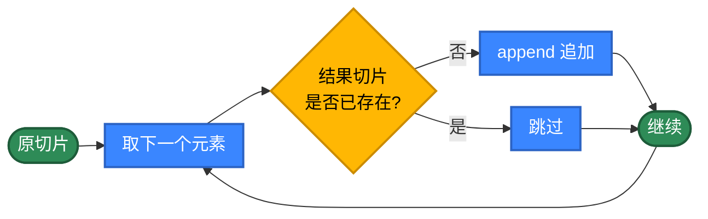
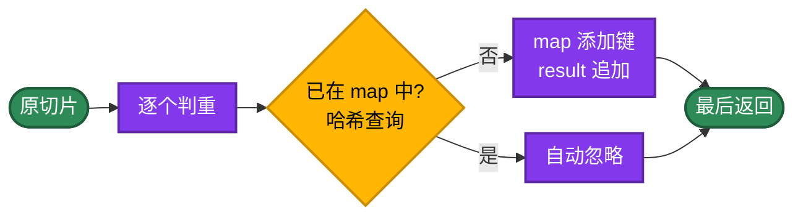
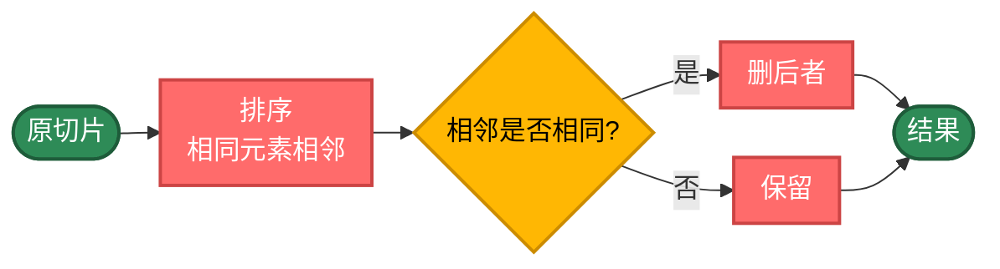
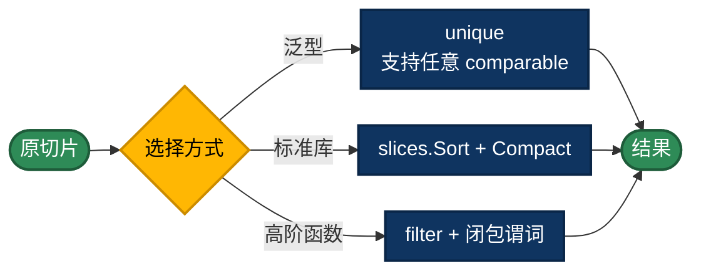
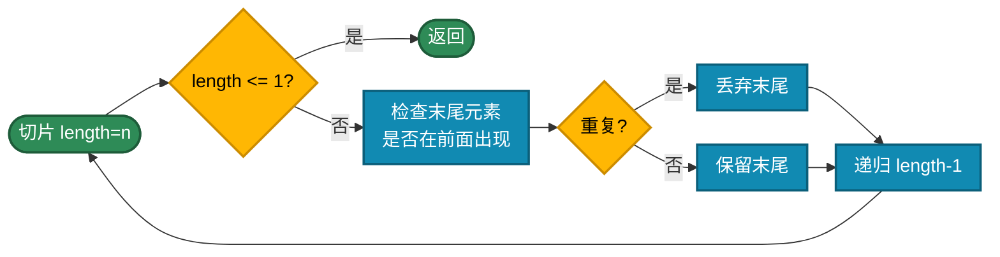
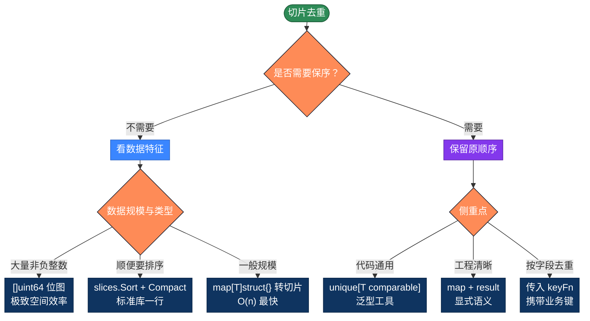

# Go数组去重的20种实现方式，用不同思路解决问题

数组去重是最常见的算法。看似简单，但不同实现方式的性能差异可能高达**几百倍**。本文整理 Go 数组和切片去重的 20 种写法，按 5 个策略分类，帮你理解每类的核心思路。AI时代，可以不手写代码了，但需要知道代码背后的原理，这样才能更好地指导AI编程。

## 为什么性能差异这么大？

最简单的写法，新建一个切片，把不在结果里的添加进去。

```go
func unique(arr []int) []int {
    result := []int{}
    for _, item := range arr {
        // 如果当前元素不在结果切片里，添加进去
        // slices.Contains 是 O(n) 线性扫描，整体则是 O(n²)
        if !slices.Contains(result, item) {
            result = append(result, item)
        }
    }
    return result
}
```

问题在于每次 `Contains` 都要遍历一遍 `result`，复杂度是 O(n²)。

**优化思路**：换一种判重方式

- **map / Set** O(1) 查询：`map[T]bool`、`map[T]struct{}`
- **排序** O(n log n)：相同元素相邻后扫一遍
- **泛型 + 标准库**：`slices.Compact` 一行搞定
- **位图**：`[]uint64` 实现 BitSet，海量非负整数极致空间效率
- **递归**：换种表达方式，本质还是上面几种

## 推荐方案

| 需求 | 代码 | 性能 | 保序 |
|------|------|------|------|
| 通用工具 | `unique[T comparable]` 泛型函数 | O(n) | ✓ |
| 标准库一行 | `slices.Sort(arr); slices.Compact(arr)` | O(n log n) | 排序 |
| 最快无序 | `map[T]struct{}` 转切片 | O(n) | ✗ |
| 海量整数 | `[]uint64` 位图 | O(n) | ✓ |

---

## 第1类：基础循环（方法1-6）

策略原理：不依赖 map 或泛型，纯靠下标、嵌套循环、`slices.Index` 这种"原始"手段完成去重。每一步判重都是 O(n)，整体 O(n²)。

适用场景：教学、面试手撕、嵌入式或受限环境。生产代码不建议使用。



```go
// 方法1：双循环索引比较——i 与左侧每个 j 比对
func unique1(arr []int) []int {
    result := make([]int, 0, len(arr))
    for i := 0; i < len(arr); i++ {
        for j := 0; j <= i; j++ {
            if arr[i] == arr[j] {
                // i == j 表示前面没有相同值，是首次出现
                if i == j {
                    result = append(result, arr[i])
                }
                break
            }
        }
    }
    return result
}

// 方法2：新建切片 + slices.Contains 检查
func unique2(arr []int) []int {
    result := make([]int, 0, len(arr))
    for _, item := range arr {
        // Contains 仍然是 O(n) 线性扫描
        if !slices.Contains(result, item) {
            result = append(result, item)
        }
    }
    return result
}

// 方法3：从后往前原地删除
// 倒序遍历，与左侧任意相同则删除自身
func unique3(arr []int) []int {
    l := len(arr)
    for l > 0 {
        l--
        i := l
        for i > 0 {
            i--
            if arr[l] == arr[i] {
                // append 拼接相当于 splice，删除下标 l 处的元素
                arr = append(arr[:l], arr[l+1:]...)
                break
            }
        }
    }
    return arr
}

// 方法4：从前往后原地删除（删后面相同项）
func unique4(arr []int) []int {
    l := len(arr)
    for i := 0; i < l; i++ {
        for j := i + 1; j < l; j++ {
            if arr[i] == arr[j] {
                arr = append(arr[:j], arr[j+1:]...)
                j--  // 删除后下标回退
                l--  // 长度同步减一
            }
        }
    }
    return arr[:l]
}

// 方法5：slices.Index 索引判等
// 首次位置等于当前下标即首次出现
func unique5(arr []int) []int {
    result := make([]int, 0, len(arr))
    for i, item := range arr {
        if slices.Index(arr, item) == i {
            result = append(result, item)
        }
    }
    return result
}

// 方法6：从右往左跳过重复
// 倒序扫描，遇相同则把 i 整体左移跳过这一段重复区
func unique6(arr []int) []int {
    n := len(arr)
    tmp := make([]int, n)
    x := n
    for i := n - 1; i >= 0; i-- {
        for j := i - 1; j >= 0; j-- {
            if arr[i] == arr[j] {
                i--
                j = i
            }
        }
        x--
        tmp[x] = arr[i]
    }
    return tmp[x:]
}
```

---

## 第2类：map 与 Set（方法7-11）

策略原理：Go 没有原生 Set 类型，但 `map[T]struct{}` 是社区公认的 Set 惯用法——struct{} 不占内存，只用键去重。把数据塞进 map，去重就自然完成。

- `map[T]bool`：最直观，bool 值 1 字节
- `map[T]struct{}`：节省内存，工程首选
- 自定义 `Set` 结构体：封装 Add/Contains 接口，复用性更强
- 频次 map：去重同时统计

代价是元素必须可比较（Go 中"可比较"指能用 `==` 比较，包含基本类型、指针、可比较的结构体等）。

适用场景：日常项目首选。需要保序就维护一个 result 切片，写入时同步推到结果尾。



```go
// 方法7：map[int]bool 显式判重
func unique7(arr []int) []int {
    seen := make(map[int]bool, len(arr))
    result := make([]int, 0, len(arr))
    for _, item := range arr {
        if !seen[item] {
            seen[item] = true
            result = append(result, item)
        }
    }
    return result
}

// 方法8：map[int]struct{} 空值集合——Set 惯用法
func unique8(arr []int) []int {
    seen := make(map[int]struct{}, len(arr))
    result := make([]int, 0, len(arr))
    for _, item := range arr {
        if _, ok := seen[item]; !ok {
            seen[item] = struct{}{}
            result = append(result, item)
        }
    }
    return result
}

// 方法9：自定义 Set 结构体
type IntSet struct {
    data map[int]struct{}
}

func newIntSet() *IntSet                  { return &IntSet{data: map[int]struct{}{}} }
func (s *IntSet) Add(v int)               { s.data[v] = struct{}{} }
func (s *IntSet) Contains(v int) bool     { _, ok := s.data[v]; return ok }

// 方法10：直接 map 转切片——写法最短，但顺序随机
func unique10(arr []int) []int {
    m := make(map[int]struct{}, len(arr))
    for _, item := range arr {
        m[item] = struct{}{}
    }
    result := make([]int, 0, len(m))
    for k := range m {
        // Go 的 map 遍历顺序是随机的（Go 团队故意设计的）
        result = append(result, k)
    }
    return result
}

// 方法11：频次统计 map——去重 + 业务统计
func unique11(arr []int) []int {
    count := make(map[int]int, len(arr))
    result := make([]int, 0, len(arr))
    for _, item := range arr {
        if count[item] == 0 {
            result = append(result, item)
        }
        count[item]++   // 累加频次
    }
    return result
}
```

---

## 第3类：排序后去重（方法12-14）

策略原理：先 `sort.Ints` 让相同元素相邻，再扫一遍删除相邻相同项。复杂度由排序决定，O(n log n)。优点是不需要额外哈希结构，"相邻判等"是最便宜的判重方式；缺点是会破坏原顺序，且要求元素可比较（基本类型直接 OK，自定义类型需要 `sort.Slice` 配合）。

适用场景：输出本就需要排序、不在意原顺序、内存敏感。



```go
// 方法12：排序后从后往前删
func unique12(arr []int) []int {
    sort.Ints(arr)
    for l := len(arr) - 1; l > 0; l-- {
        if arr[l] == arr[l-1] {
            arr = append(arr[:l], arr[l+1:]...)
        }
    }
    return arr
}

// 方法13：排序后从前往后删
func unique13(arr []int) []int {
    sort.Ints(arr)
    l := len(arr) - 1
    for i := 0; i < l; i++ {
        if arr[i] == arr[i+1] {
            arr = append(arr[:i], arr[i+1:]...)
            i--
            l--
        }
    }
    return arr
}

// 方法14：经典双指针（LeetCode 26 题解法）
// 原地排序后，在原切片上原地去重，O(1) 额外空间
func unique14(arr []int) []int {
    if len(arr) == 0 {
        return arr
    }
    sort.Ints(arr)
    slow := 0
    for fast := 1; fast < len(arr); fast++ {
        // 快指针发现新值，slow 前进一步并写入
        if arr[fast] != arr[slow] {
            slow++
            arr[slow] = arr[fast]
        }
    }
    return arr[:slow+1]
}
```

---

## 第4类：泛型与函数式（方法15-17）

策略原理：Go 1.18 引入泛型，让"通用工具函数"成为可能；Go 1.21 标准库新增 `slices.Compact`，把"已排序切片相邻去重"做成一行。函数式方面，闭包 + 高阶函数也能模拟其他语言里的 `filter`。

适用场景：现代 Go 工程的常态写法。可读性高、复用性好，特别适合编写通用的工具库。



```go
// 方法15：泛型去重（Go 1.18+）
// comparable 约束保证 == 比较有效
func unique15[T comparable](arr []T) []T {
    seen := make(map[T]struct{}, len(arr))
    result := make([]T, 0, len(arr))
    for _, item := range arr {
        if _, ok := seen[item]; !ok {
            seen[item] = struct{}{}
            result = append(result, item)
        }
    }
    return result
}

// 方法16：标准库 slices.Compact（Go 1.21+）
// Compact 删除相邻重复元素，要求已排序
func unique16(arr []int) []int {
    slices.Sort(arr)
    return slices.Compact(arr)
}

// 方法17：高阶 filter + 闭包谓词
func filter[T any](arr []T, pred func(T) bool) []T {
    result := make([]T, 0, len(arr))
    for _, item := range arr {
        if pred(item) {
            result = append(result, item)
        }
    }
    return result
}

// 方法17：高阶函数式法, 用闭包封装"已存在"状态，模拟函数式 filter
func unique17(arr []int) []int {
    seen := make(map[int]struct{}, len(arr))
    // 闭包捕获 seen，谓词带副作用：首次见到才返回 true
    return filter(arr, func(x int) bool {
        if _, ok := seen[x]; ok {
            return false
        }
        seen[x] = struct{}{}
        return true
    })
}
```

---

## 第5类：递归与位图（方法18-20）

策略原理：递归用自调用替代循环，是函数式思维的体现，主要用于教学；位图用 `[]uint64` 自己实现 BitSet——每一位标记一个非负整数是否出现过，对整数集合有极致的空间效率（10 亿个 int 只要 128MB），是大数据去重的常见选型。

适用场景：递归——教学、题型熟悉；BitSet——大规模非负整数（如用户 ID、订单号）的去重统计。



```go
// 方法18：递归原地删除
func unique18(arr []int, length int) []int {
    if length < 1 {
        return arr
    }
    last := length - 1
    for i := last - 1; i >= 0; i-- {
        if arr[last] == arr[i] {
            arr = append(arr[:last], arr[last+1:]...)
            break
        }
    }
    return unique18(arr, length-1)
}

// 方法19：递归拼接返回（不修改原切片，纯函数式）
func unique19(arr []int, length int) []int {
    if length < 1 {
        return []int{}
    }
    last := length - 1
    isRepeat := false
    for i := last - 1; i >= 0; i-- {
        if arr[last] == arr[i] {
            isRepeat = true
            break
        }
    }
    head := unique19(arr, length-1)
    if !isRepeat {
        head = append(head, arr[last])
    }
    return head
}

// 方法20：BitSet 位图（仅适用于非负整数）
// 用 []uint64 自己实现位图，每个 int 占一位
func unique20(arr []int) []int {
    maxVal := 0
    for _, v := range arr {
        if v < 0 {
            panic("BitSet 不支持负数，需要先偏移")
        }
        if v > maxVal {
            maxVal = v
        }
    }
    bits := make([]uint64, maxVal/64+1)
    result := make([]int, 0, len(arr))
    for _, v := range arr {
        // 第 v 位为 0 表示首次出现
        if bits[v/64]&(1<<(v%64)) == 0 {
            bits[v/64] |= 1 << (v % 64)
            result = append(result, v)
        }
    }
    return result
}
```

---

## 选择指南



| 类别 | 时间复杂度 | 是否保序 | 主要场景 |
|------|----------|--------|---------|
| 基础循环 | O(n²) | 是 | 教学、面试手撕 |
| map / Set | O(n) | 看实现 | 日常项目首选 |
| 排序后去重 | O(n log n) | 否（变排序）| 顺便要排序 |
| 泛型与函数式 | O(n) | 是 | 现代 Go 通用工具 |
| 递归 / 位图 | 视实现 | 看实现 | 教学 / 海量整数 |

---

## 实际项目里怎么选

绝大多数情况一个泛型函数就够：

```go
// 保序、O(n)、对所有 comparable 类型有效
func unique[T comparable](arr []T) []T {
    seen := make(map[T]struct{}, len(arr))
    result := make([]T, 0, len(arr))
    for _, item := range arr {
        if _, ok := seen[item]; !ok {
            seen[item] = struct{}{}
            result = append(result, item)
        }
    }
    return result
}
```

不在意顺序：

```go
m := make(map[int]struct{})
for _, v := range data {
    m[v] = struct{}{}
}
result := make([]int, 0, len(m))
for k := range m {
    result = append(result, k)
}
```

需要排序：

```go
slices.Sort(data)
data = slices.Compact(data)   // Go 1.21+
```

海量非负整数：

```go
// 用 []uint64 自己实现位图，10 亿规模也只要 ~128MB
bits := make([]uint64, maxVal/64+1)
for _, v := range data {
    bits[v/64] |= 1 << (v % 64)
}
```

---

## 带业务逻辑的去重

实际工作里经常遇到这样的情况：遇到重复时不能简单丢弃，要按某个规则做处理。比如：

- 按 `ID` 去重，但要保留分数最高的那条记录
- 去重的同时累加重复次数
- 数值在某个区间内才参与去重

这类需求 map 直接搞不定，需要把"判重"和"处理"两步拆开来写。Go 里通常用泛型函数 + 合并函数：

```go
// UniqueBy 带业务规则的去重。
//
// keyFn 从元素提取去重键。
// onDup 遇到重复时如何合并 (旧值, 新值) -> 新代表值。
func UniqueBy[T any, K comparable](
    data []T,
    keyFn func(T) K,
    onDup func(old, new T) T,
) []T {
    chosen := make(map[K]T)
    order := make([]K, 0)
    for _, item := range data {
        k := keyFn(item)
        if _, ok := chosen[k]; !ok {
            chosen[k] = item
            order = append(order, k)
        } else if onDup != nil {
            chosen[k] = onDup(chosen[k], item)
        }
    }
    result := make([]T, 0, len(order))
    for _, k := range order {
        result = append(result, chosen[k])
    }
    return result
}
```

例 1：按 `ID` 去重，保留分数最高的：

```go
type Student struct {
    ID    int
    Name  string
    Score int
}

students := []Student{
    {ID: 1, Name: "张三", Score: 90},
    {ID: 1, Name: "张三", Score: 95},  // 同 id，分数更高
    {ID: 2, Name: "李四", Score: 85},
}

result := UniqueBy(
    students,
    func(s Student) int { return s.ID },
    func(old, new Student) Student {
        if new.Score > old.Score {
            return new
        }
        return old
    },
)
// result: [{1 张三 95} {2 李四 85}]
```

例 2：去重同时统计频次：

```go
counts := make(map[string]int)
order := []string{}
for _, item := range data {
    if _, ok := counts[item]; !ok {
        order = append(order, item)
    }
    counts[item]++
}
// order 是保序的去重结果，counts 是频次统计
```

例 3：区间过滤——只对 `[0, 100]` 区间内的值去重，区间外原样保留：

```go
seen := make(map[int]struct{})
result := []int{}
for _, x := range data {
    if x >= 0 && x <= 100 {
        if _, dup := seen[x]; dup {
            continue
        }
        seen[x] = struct{}{}
    }
    result = append(result, x)
}
```

这三个例子是同一种思路：把判重与业务规则分开。判重用 map 保证 O(n)，规则部分留给回调或显式分支处理。

---

## 自定义对象去重：comparable 约束

Go 的"可比较"概念比 Java 的 equals 更严格——不是所有类型都能直接进 map 当键：

| 类型 | 是否可比较 | 备注 |
|---|---|---|
| 基本类型（int, string, bool 等） | ✓ | 直接可用 |
| 指针 | ✓ | 比较指针地址 |
| 数组 `[N]T` | ✓ | 元素可比较即可 |
| 字段全部可比较的 struct | ✓ | 逐字段比较 |
| 接口类型 | ✓ | 但运行时 panic 风险 |
| slice / map / func | ✗ | 不可比较 |
| 含 slice 字段的 struct | ✗ | 不可比较 |

如果元素是含 slice 的 struct，需要自己提取一个可比较的"键"：

```go
type User struct {
    ID       int64
    Name     string
    Tags     []string  // 不可比较！
}

// 用 ID 作为去重键
seen := make(map[int64]struct{})
result := []User{}
for _, u := range users {
    if _, ok := seen[u.ID]; !ok {
        seen[u.ID] = struct{}{}
        result = append(result, u)
    }
}
```

注意：**Go 没有 equals/hashCode 重写机制**。要按业务字段去重，就要么自己定义 keyFn，要么把"业务等价"压进一个可比较的 struct 字段。

---

## 总结

工程应用选择：

- 默认用泛型 `unique[T comparable](arr []T) []T`：保序、一行、O(n)
- 标准库一步到位 `slices.Sort` + `slices.Compact`：原地、O(n log n)、顺便排序
- 不要顺序就直接 `map[T]struct{}` 转切片
- 海量非负整数用 `[]uint64` 自实现位图
- 含 slice 字段的 struct 先提取可比较键再去重
- 业务规则干预用 keyFn + 合并函数

核心思路：

1. 同一个问题可以从多个角度切入
2. 选对数据结构往往比写更聪明的代码更重要
3. O(n²) 与 O(n) 在数据变大时是几百倍的实际差距
4. 不要过度优化——能用 `slices.Compact` 就别绕弯
5. 遇到新问题先写最直观的版本，再按瓶颈逐步优化

## 更多算法

不同语言算法实现：[https://github.com/microwind/algorithms](https://github.com/microwind/algorithms)

AI编程知识库：[https://microwind.github.io](https://microwind.github.io)
