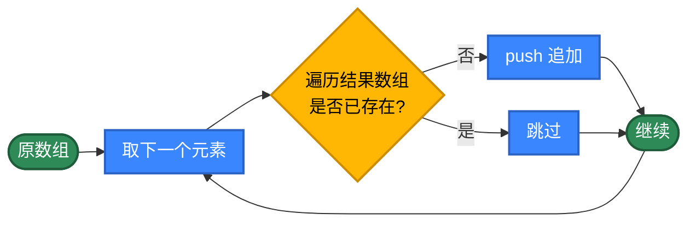
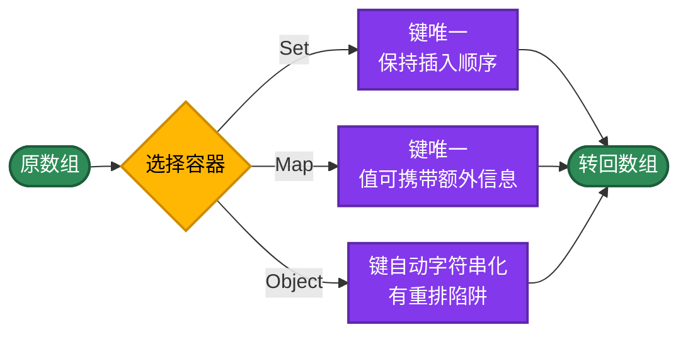
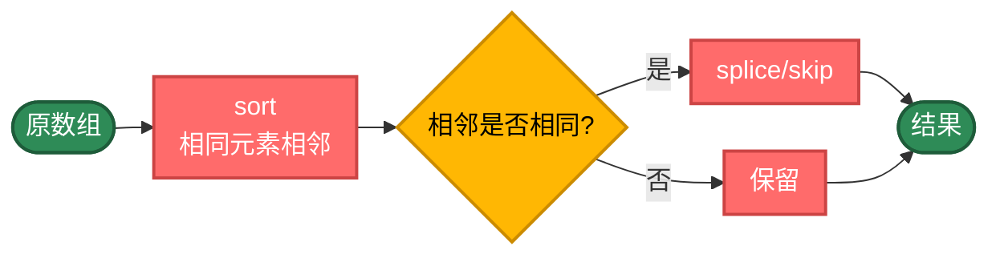
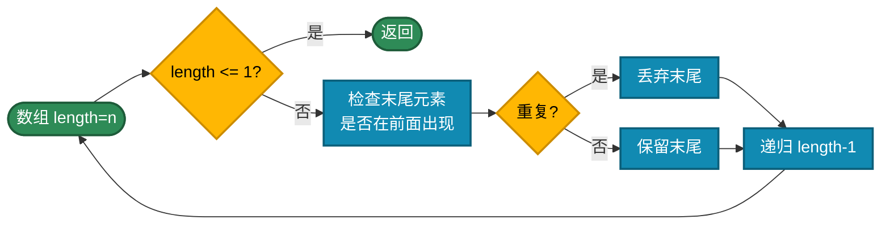

# JavaScript 数组去重的 20 种实现方式，用不同思路解决问题

数组去重是最常见的算法。看似简单，但不同实现方式的性能差异可能高达**几百倍**。本文整理 JavaScript 数组去重的 20 种写法，按 5 个策略分类，帮你理解每类的核心思路。

## 为什么性能差异这么大？

最简单的写法，新建一个数组，把不在结果里的添加进去。

```javascript
function unique(arr) {
  const result = []
  for (const item of arr) {
    // includes 是 O(n) 线性扫描，整体则是 O(n²)
    if (!result.includes(item)) {
      result.push(item)
    }
  }
  return result
}
```

问题在于每次 `includes` 都要全量扫一遍 `result`，复杂度是 O(n²)。

**优化思路**：换一种判重方式

- **Set / Map** O(1) 查询：`new Set(arr)`
- **排序** O(n log n)：相同元素相邻后扫一遍
- **filter + 闭包**：在函数式管道里携带"已见"状态
- **JSON 序列化**：处理对象、嵌套数组等不可哈希元素
- **递归**：换种表达方式，本质仍是上面的思路

## 推荐方案

| 需求 | 代码 | 性能 | 保序 |
|------|------|------|------|
| 一行最简 | `[...new Set(arr)]` | O(n) | ✓ |
| 函数式风格 | `arr.filter((x,i,a) => a.indexOf(x)===i)` | O(n²) | ✓ |
| 函数式 + Set | `arr.filter(x => !seen.has(x) && seen.add(x))` | O(n) | ✓ |
| 要排序 | `[...new Set(arr)].sort((a,b)=>a-b)` | O(n log n) | 排序 |
| 对象数组 | `JSON.stringify` 作为 Set 的键 | O(n×m) | ✓ |

---

## 第1类：基础循环（方法1-6）

策略原理：不用任何内置数组方法，纯靠下标、嵌套循环、`indexOf` 这种"原始"手段完成去重。每一步判重都是 O(n)，整体 O(n²)。

适用场景：教学、面试手撕。生产代码不建议使用。



```javascript
// 方法1：双循环索引比较——i 与左侧每个 j 比对
function unique1(arr) {
  const result = []
  for (let i = 0, l = arr.length; i < l; i++) {
    for (let j = 0; j <= i; j++) {
      if (arr[i] === arr[j]) {
        // i === j 表示前面没有相同值，是首次出现
        if (i === j) result.push(arr[i])
        break
      }
    }
  }
  return result
}

// 方法2：新建数组 + includes 检查
function unique2(arr) {
  const result = []
  for (const item of arr) {
    if (!result.includes(item)) result.push(item)
  }
  return result
}

// 方法3：从后往前原地 splice
function unique3(arr) {
  let l = arr.length
  while (l-- > 0) {
    for (let i = 0; i < l; i++) {
      if (arr[l] === arr[i]) {
        arr.splice(l, 1)
        break
      }
    }
  }
  return arr
}

// 方法4：从前往后原地 splice（删后面相同项）
function unique4(arr) {
  let l = arr.length
  for (let i = 0; i < l; i++) {
    for (let j = i + 1; j < l; j++) {
      if (arr[i] === arr[j]) {
        arr.splice(j, 1)
        j--; l--
      }
    }
  }
  return arr
}

// 方法5：forEach + indexOf
// indexOf 返回首次出现下标，等于当前下标即首次
function unique5(arr) {
  const result = []
  arr.forEach((item, i) => {
    if (arr.indexOf(item) === i) result.push(item)
  })
  return result
}

// 方法6：双重 while 倒序 splice
function unique6(arr) {
  let l = arr.length
  while (l-- > 0) {
    let i = l
    while (i-- > 0) {
      if (arr[l] === arr[i]) {
        arr.splice(l, 1)
        break
      }
    }
  }
  return arr
}
```

---

## 第2类：内置数组方法（方法7-11）

策略原理：JavaScript 数组自带 `filter`、`reduce`、`forEach` 等高阶方法，可以把"判重 + 收集"写成函数式风格。注意`indexOf` / `includes` 仍是 O(n)，需要用 `Set` 闭包才能压到 O(n)。

适用场景：现代 JS 工程的常态写法。可读性高，链式组合方便。

```mermaid
%%{init: {'flowchart': {'nodeSpacing': 30, 'rankSpacing': 25, 'padding': 8}}}%%
graph LR
    A([原数组]) --> B[filter / reduce 管道]
    B --> C{选择策略}
    C -->|indexOf 判重| D[O(n²) 但简洁]
    C -->|Set 闭包判重| E[O(n) 推荐]
    C -->|对象键| F[O(n) 但有类型陷阱]
    D --> G([新数组])
    E --> G
    F --> G

    classDef start fill:#2E8B57,color:#fff,stroke:#1e5c3a,stroke-width:2px
    classDef step  fill:#0F3460,color:#fff,stroke:#0a2647,stroke-width:2px
    classDef check fill:#FFB703,color:#000,stroke:#cc8c00,stroke-width:2px
    class A,G start
    class B,D,E,F step
    class C check
```

```javascript
// 方法7：filter + indexOf 一行经典
// 写法最短，但每次 indexOf 都是 O(n)
function unique7(arr) {
  return arr.filter((item, i) => arr.indexOf(item) === i)
}

// 方法8：filter + Set 闭包——推荐写法
// Set.add 返回 Set 自身，结合短路 && 返回布尔值
function unique8(arr) {
  const seen = new Set()
  return arr.filter(item => !seen.has(item) && seen.add(item))
}

// 方法9：reduce 累加（用数组）
// 函数式风格，但 includes 仍是 O(n²)
function unique9(arr) {
  return arr.reduce((acc, item) => {
    if (!acc.includes(item)) acc.push(item)
    return acc
  }, [])
}

// 方法10：reduce + Set 闭包——O(n) 函数式
function unique10(arr) {
  const seen = new Set()
  return arr.reduce((acc, item) => {
    if (!seen.has(item)) {
      seen.add(item)
      acc.push(item)
    }
    return acc
  }, [])
}

// 方法11：Object + typeof 键
// 用 typeof + value 拼成字符串作为对象键，避免 1 与 '1' 冲突
function unique11(arr) {
  const obj = {}
  return arr.filter(item => {
    const key = typeof item + item
    return Object.prototype.hasOwnProperty.call(obj, key)
      ? false
      : (obj[key] = true)
  })
}
```

---

## 第3类：集合容器（方法12-14）

策略原理：ES6 引入的 `Set` 与 `Map` 用 SameValueZero 算法判等，键唯一且 O(1)，是 JS 里最自然的去重工具。`Object` 字面量虽然也能当哈希用，但有"键自动字符串化""数字键被引擎重排"等坑。

适用场景：日常项目首选 `Set`；需要保留 value 选 `Map`；只在小数据或特殊兼容场景才用 `Object`。



```javascript
// 方法12：new Set 转数组——一行经典
// Set 用 SameValueZero 比较，NaN 也能正确去重
function unique12(arr) {
  return [...new Set(arr)]
}

// 方法13：Map.set + keys
// 适合"按键去重，值携带其他信息"的场景
function unique13(arr) {
  const map = new Map()
  arr.forEach(item => map.set(item, item))
  return [...map.keys()]
}

// 方法14：Object 字面量哈希
// 注意：1 与 '1' 会被合并；数字键会被引擎按升序重排
// [1, 'a', 2, 'b', -1] 会变成 [1, 2, 'a', 'b', -1]
function unique14(arr) {
  const obj = {}
  for (const item of arr) obj[item] = item
  return Object.values(obj)
}
```

> **小心 Object 的两个坑**：① 数字字符串键会被 V8/SpiderMonkey 重排到前面（升序）；② 引用类型（对象、数组）会变成 `[object Object]` 之类的字符串，全部合并成一个键。生产代码不要用 `Object` 当 Set。

---

## 第4类：排序后去重（方法15-17）

策略原理：先 `sort` 让相同元素相邻，再扫一遍删除相邻相同项。复杂度由排序决定，O(n log n)。优点是不需要额外的哈希结构，"相邻判等"是最便宜的判重方式；缺点是会破坏原顺序。

适用场景：输出本就需要排序、不在意原顺序。



```javascript
// 方法15：sort + splice 升序去重
// 注意 sort 不传比较函数会按字符串排序，数字数组要传 (a, b) => a - b
function unique15(arr) {
  arr.sort((a, b) => a - b)
  let l = arr.length
  while (l-- > 1) {
    if (arr[l] === arr[l - 1]) arr.splice(l, 1)
  }
  return arr
}

// 方法16：sort + filter 相邻判重
function unique16(arr) {
  arr.sort((a, b) => a - b)
  // 保留首项 + 与前一项不同的项
  return arr.filter((item, i) => i === 0 || item !== arr[i - 1])
}

// 方法17：经典双指针（LeetCode 26）
// 排序后原地双指针，O(1) 额外空间
function unique17(arr) {
  if (arr.length === 0) return arr
  arr.sort((a, b) => a - b)
  let slow = 0
  for (let fast = 1; fast < arr.length; fast++) {
    if (arr[fast] !== arr[slow]) arr[++slow] = arr[fast]
  }
  return arr.slice(0, slow + 1)
}
```

---

## 第5类：递归与特殊（方法18-20）

策略原理：递归用自调用替代循环，是函数式思维的体现，主要用于教学。`JSON.stringify` 把对象映射为字符串，是 JS 里处理"不可哈希元素"（对象数组、嵌套数组）的常见招数。

适用场景：递归——教学；JSON——对象数组按整体结构去重。



```javascript
// 方法18：递归原地删除
function unique18(arr, length) {
  if (length <= 1) return arr
  const last = length - 1
  for (let i = last - 1; i >= 0; i--) {
    if (arr[last] === arr[i]) {
      arr.splice(last, 1)
      break
    }
  }
  return unique18(arr, length - 1)
}

// 方法19：递归拼接返回（不修改原数组）
function unique19(arr, length) {
  if (length <= 1) return arr.slice(0, length)
  const last = length - 1
  const lastItem = arr[last]
  let isRepeat = false
  for (let i = last - 1; i >= 0; i--) {
    if (lastItem === arr[i]) {
      isRepeat = true
      break
    }
  }
  const head = unique19(arr, length - 1)
  return isRepeat ? head : head.concat(lastItem)
}

// 方法20：JSON 字符串判重——处理对象数组
// 把对象序列化成字符串作为 Set 的键，能去重 {id:1} 这类结构
function unique20(arr) {
  const seen = new Set()
  const result = []
  for (const item of arr) {
    const key = JSON.stringify(item)
    if (!seen.has(key)) {
      seen.add(key)
      result.push(item)
    }
  }
  return result
}

// 用法示例：
// unique20([{id: 1}, {id: 2}, {id: 1}])
// => [{id: 1}, {id: 2}]
```

> **JSON 的两个限制**：① 字段顺序不同的对象会被认为不同（`{a:1,b:2}` ≠ `{b:2,a:1}`）；② `undefined`、函数、循环引用会丢失或抛错。

---

## 选择指南

```mermaid
%%{init: {'flowchart': {'nodeSpacing': 25, 'rankSpacing': 15, 'padding': 5}}}%%
graph TD
    Start(["数组去重"]) --> Need{"是否需要保序？"}

    Need -->|不需要| Fast["看数据特征"]
    Need -->|需要| Ordered["保留原顺序"]

    Fast --> Q1{"数据形态"}
    Q1 -->|顺便要排序| Sort["sort + Set"]
    Q1 -->|纯基本类型| Set1["[...new Set(arr)]"]

    Ordered --> Q2{"侧重点"}
    Q2 -->|代码简洁| Set2["[...new Set(arr)]<br/>一行解决"]
    Q2 -->|函数式 O(n)| FilterSet["filter + Set 闭包"]
    Q2 -->|按字段去重| MapByKey["Map + keyFn"]
    Q2 -->|对象数组| JSON["JSON.stringify + Set"]

    classDef start fill:#2E8B57,color:#fff,stroke:#1e5c3a
    classDef decision fill:#FE8B57,color:#fff,stroke:#141b2d
    classDef fast fill:#3A86FF,color:#fff,stroke:#2b63c4
    classDef ordered fill:#8338EC,color:#fff,stroke:#5e27a8
    classDef method fill:#0f3460,color:#fff,stroke:#0a2647

    class Start start
    class Need,Q1,Q2 decision
    class Fast fast
    class Ordered ordered
    class Sort,Set1,Set2,FilterSet,MapByKey,JSON method
```

| 类别 | 时间复杂度 | 是否保序 | 主要场景 |
|------|----------|--------|---------|
| 基础循环 | O(n²) | 是 | 教学、面试手撕 |
| 内置数组方法 | O(n) ~ O(n²) | 是 | 函数式风格 |
| 集合容器 | O(n) | 看具体类 | 日常项目首选 |
| 排序后去重 | O(n log n) | 否 | 顺便要排序 |
| 递归 / JSON | 视实现 | 看实现 | 教学 / 对象数组 |

---

## 实际项目里怎么选

绝大多数情况一行就够：

```javascript
// 保序、O(n)、写法最短，工程首选
const result = [...new Set(arr)]

// 或函数式风格，O(n)
const seen = new Set()
const result = arr.filter(x => !seen.has(x) && seen.add(x))
```

按业务字段去重：

```javascript
const result = [...new Map(arr.map(x => [x.id, x])).values()]
```

对象数组去重：

```javascript
const seen = new Set()
const result = arr.filter(x => {
  const key = JSON.stringify(x)
  return !seen.has(key) && seen.add(key)
})
```

需要排序：

```javascript
const result = [...new Set(arr)].sort((a, b) => a - b)
```

---

## 带业务逻辑的去重

实际工作里经常遇到这样的情况：遇到重复时不能简单丢弃，要按某个规则做处理。比如：

- 按 `id` 去重，但要保留分数最高的那条记录
- 去重的同时累加重复次数
- 数值在某个区间内才参与去重

这类需求 `Set` 直接搞不定，需要把"判重"和"处理"两步拆开来写。JS 里通常用 `Map` + 合并函数：

```javascript
/**
 * 带业务规则的去重。
 *
 * @param {Array} data 原数据
 * @param {Function} keyFn 从元素提取去重键
 * @param {Function} onDup 遇到重复时如何合并 (旧值, 新值) -> 新代表值
 */
function uniqueBy(data, keyFn, onDup) {
  // Map 保证遍历顺序与首次出现顺序一致
  const chosen = new Map()
  for (const item of data) {
    const key = keyFn(item)
    if (!chosen.has(key)) {
      chosen.set(key, item)
    } else if (onDup) {
      chosen.set(key, onDup(chosen.get(key), item))
    }
  }
  return [...chosen.values()]
}
```

例 1：按 `id` 去重，保留分数最高的：

```javascript
const students = [
  { id: 1, name: '张三', score: 90 },
  { id: 1, name: '张三', score: 95 },   // 同 id，分数更高
  { id: 2, name: '李四', score: 85 },
]

const result = uniqueBy(
  students,
  x => x.id,
  (old, news) => news.score > old.score ? news : old,
)
// [{id:1, score:95, ...}, {id:2, score:85, ...}]
```

例 2：去重同时统计频次：

```javascript
const counts = new Map()
for (const item of data) {
  counts.set(item, (counts.get(item) || 0) + 1)
}
// counts.keys() 是保序的去重结果
// [...counts.entries()] 是 [[元素, 次数], ...]
```

例 3：区间过滤——只对 `[0, 100]` 区间内的值去重，区间外原样保留：

```javascript
const seen = new Set()
const result = []
for (const x of data) {
  if (x >= 0 && x <= 100) {
    if (seen.has(x)) continue
    seen.add(x)
  }
  result.push(x)
}
```

这三个例子是同一种思路：把判重与业务规则分开。判重用 Set/Map 保证 O(n)，规则部分留给回调或显式分支处理。

---

## 对象数组去重的几种写法

JS 里 `===` 比较对象比较的是引用，而不是内容，所以 `new Set([{id:1}, {id:1}])` 不会去重——两个独立的对象引用不相等。

实际项目里有三种常见写法：

**写法 1：按字段去重（最常见）**

```javascript
// 用 Map 按 id 去重
const result = [...new Map(arr.map(x => [x.id, x])).values()]
```

**写法 2：按多字段组合去重**

```javascript
// 拼成复合键
const result = [...new Map(arr.map(x => [`${x.id}|${x.type}`, x])).values()]
```

**写法 3：按整体结构去重（用 JSON）**

```javascript
const seen = new Set()
const result = arr.filter(x => {
  const key = JSON.stringify(x)
  return !seen.has(key) && seen.add(key)
})
// 注意：字段顺序不同的对象会被认为不同
```

---

## 总结

工程上的快捷选择：

- 默认用 `[...new Set(arr)]`：保序、一行、O(n)
- 函数式风格用 `arr.filter(x => !seen.has(x) && seen.add(x))`
- 按字段去重用 `[...new Map(arr.map(x => [x.key, x])).values()]`
- 对象整体去重用 `JSON.stringify` 作为键
- 顺便排序用 `[...new Set(arr)].sort((a, b) => a - b)`
- 业务规则干预用 Map + 合并函数

核心思路：

1. 同一个问题可以从多个角度切入
2. 选对数据结构往往比写更聪明的代码更重要
3. O(n²) 与 O(n) 在数据变大时是几百倍的实际差距
4. 不要过度优化——能用 `new Set` 就别绕弯
5. 遇到新问题先写最直观的版本，再按瓶颈逐步优化

## 更多算法

不同语言算法实现：[https://github.com/microwind/algorithms](https://github.com/microwind/algorithms)

AI编程知识库：[https://microwind.github.io](https://microwind.github.io)
