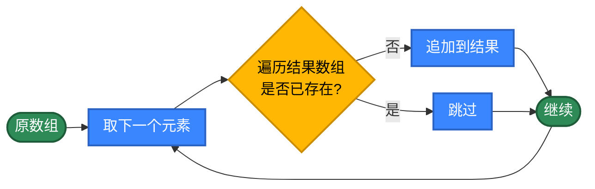
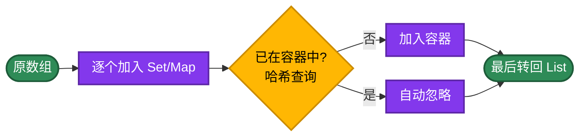
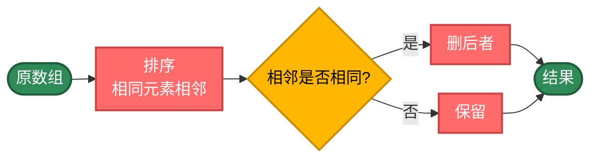
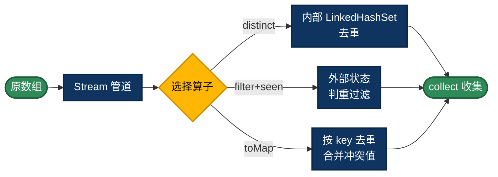
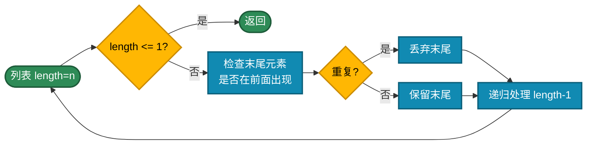
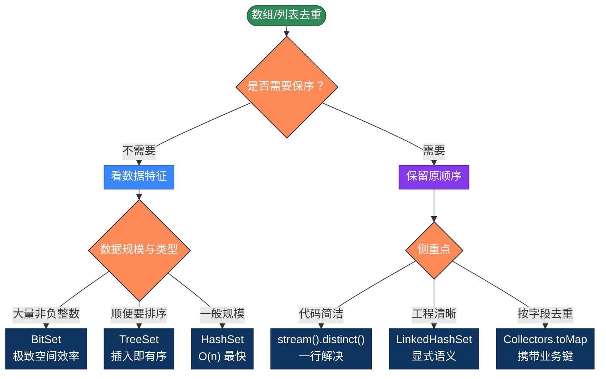

# Java数组去重的20种实现方式，理解不同解决问题的思路

> 数组与列表去重是最常见的算法。看似简单，但不同实现方式的性能差异可能高达**几百倍**。整理Java数组去重的20种写法，按5个策略分类，帮你理解每类的核心思路。AI时代，可以不写代码，但需要理解不同解决问题的方式。

## 为什么性能差异这么大？

最简单的写法，新建数组，然后把不存在的添加进来。

```java
static Integer[] unique(Integer[] arr) {
    List<Integer> result = new ArrayList<>();
    for (Integer item : arr) {
        // ArrayList.contains 是 O(n) 线性扫描，但每次扫描则是 O(n²)
        if (!result.contains(item)) {
            result.add(item);
        }
    }
    return result.toArray(new Integer[0]);
}
```

问题在于每次 `contains` 都要全量扫一遍 `result`，复杂度是 O(n²)。

**优化思路**：用更快的方式判重

- **集合结构** O(1) 查询：`HashSet`、`LinkedHashSet`
- **排序** O(nlogn)：相同元素相邻后去重  
- **流式API**：`stream().distinct()`
- **位图**：`BitSet` 对非负整数极其高效
- **递归**：换种表达方式，本质仍是上面的思路

**下面具体来分析5大类，20种不同的写法**

## 第1类：基础循环（方法1-6）

策略原理：不依赖任何集合工具类，纯靠数组下标、嵌套循环、`indexOf` 这种"原始"手段来完成去重。每一步判断都是 O(n)，整体复杂度是 O(n²)。

适用场景：编程教学、面试准备、嵌入式或受限环境，生产代码不建议使用。



```java
// 方法1：双循环索引比较——当前项跟左侧逐个比较
static int[] unique1(int[] arr) {
    int[] newArr = new int[arr.length];
    int x = 0;
    // 当前项跟左侧全量比较，是否首次出现
    for (int i = 0; i < arr.length; i++) {
        for (int j = 0; j <= i; j++) {
          // i 与左侧每个 j 比对
            if (arr[i] == arr[j]) {
                // 值和位置均相同，表示前面没有相同值，是首次出现
                if (i == j) {
                    newArr[x++] = arr[i];
                }
                break;
            }
        }
    }
    return Arrays.copyOf(newArr, x);
}

// 方法2：List.indexOf 索引法，跟第一种原理一致
// indexOf 返回首次出现的下标，等于当前下标即首次出现
static Integer[] unique2(Integer[] arr) {
    List<Integer> list = new ArrayList<>(Arrays.asList(arr));
    List<Integer> result = new ArrayList<>();
    for (int i = 0; i < list.size(); i++) {
        // indexOf得到下标，比较是否跟当前下标一致，如果一致则表示首次出现
        if (list.indexOf(list.get(i)) == i) {
            result.add(list.get(i));
        }
    }
    return result.toArray(new Integer[0]);
}

// 方法3：从后往前原地删除
// 倒序遍历，与左侧任意相同则删除自身
// 倒序删除的好处：删除点之后的元素都已处理，不会影响下标
static Integer[] unique3(Integer[] arr) {
    List<Integer> list = new ArrayList<>(Arrays.asList(arr));
    int l = list.size();
    // 自后往前遍历原数组
    while (l-- > 0) {
        int i = l;
        // 当前项与左侧逐个比较是否存在重复项，若存在则删除自身
        while (i-- > 0) {
            if (list.get(l).equals(list.get(i))) {
                list.remove(l);
                break;
            }
        }
    }
    return list.toArray(new Integer[0]);
}

// 方法4：从前往后原地删除（删除后面相同项），与方法3相同
static Integer[] unique4(Integer[] arr) {
    List<Integer> list = new ArrayList<>(Arrays.asList(arr));
    int l = list.size();
    // 自前往后遍历原数组
    for (int i = 0; i < l; i++) {
        // 当前项与右侧全部项逐个比较，若有相同则删除相同项
        for (int j = i + 1; j < l; j++) {
            if (list.get(i).equals(list.get(j))) {
                list.remove(j);
                // 删除后 j 位置的元素是原来的 j+1，j 不前进
                // l 同步减一
                j--;
                l--;
            }
        }
    }
    return list.toArray(new Integer[0]);
}

// 方法5：Iterator 遍历，原理与方法1同
// 用 Iterator 风格遍历，结果列表用 contains 判重
static Integer[] unique5(Integer[] arr) {
    List<Integer> source = Arrays.asList(arr);
    List<Integer> result = new ArrayList<>();
    Iterator<Integer> it = source.iterator();
    // 逐个迭代，判断是否包含在新数组中
    while (it.hasNext()) {
        Integer item = it.next();
        // ArrayList.contains 是 O(n)，整体仍是 O(n²)
        if (!result.contains(item)) {
            result.add(item);
        }
    }
    return result.toArray(new Integer[0]);
}

// 方法6：从右往左跳过重复，不删除（使用break跳出）
// 倒序扫描，若当前元素在左侧已存在则跳过，否则保留
static Integer[] unique6(Integer[] arr) {
    int len = arr.length;
    Integer[] result = new Integer[len];
    int x = len;
    // 自后往前遍历数组
    for (int i = len - 1; i >= 0; i--) {
        boolean duplicate = false;
        // 检查左侧是否有相同元素
        for (int j = i - 1; j >= 0; j--) {
            if (arr[i].equals(arr[j])) {
                duplicate = true;
                break;   // 找到重复立即退出内层循环
            }
        }
        // 没有重复则保留当前元素，倒序填入结果
        if (!duplicate) {
            result[--x] = arr[i];
        }
    }
    return Arrays.copyOfRange(result, x, len);
}
```

---

## 第2类：集合容器（方法7-11）

策略原理：Java 集合框架本身就提供了"键唯一"的语义。把数据塞进 Set 或 Map，去重就自然完成。

- `HashSet` / `HashMap`：哈希结构，O(1) 判重，结果无序
- `LinkedHashSet`：哈希 + 双向链表，保留插入顺序
- `TreeSet`：红黑树，O(logn)，自动排序
- `LinkedHashMap`：保序的 Map，能在去重时携带额外信息

代价是元素必须正确实现 `hashCode` 和 `equals`。基本类型的包装类、`String` 都已经实现好了，自定义对象需要自己重写。

适用场景：日常项目首选。需要保序选 `LinkedHashSet`，需要排序选 `TreeSet`，需要键值对选 `LinkedHashMap`。



```java
// 方法7：HashSet——最快，但结果无序
static Integer[] unique7(Integer[] arr) {
    // HashSet 自动去重，但底层哈希散列后顺序不可预测
    Set<Integer> set = new HashSet<>(Arrays.asList(arr));
    return set.toArray(new Integer[0]);
}

// 方法8：LinkedHashSet——保序，工程首选
static Integer[] unique8(Integer[] arr) {
    // LinkedHashSet 内部用双向链表维护插入顺序
    Set<Integer> set = new LinkedHashSet<>(Arrays.asList(arr));
    return set.toArray(new Integer[0]);
}

// 方法9：TreeSet——自动排序
static Integer[] unique9(Integer[] arr) {
    // TreeSet 基于红黑树，插入即有序（默认升序）
    // 需要降序就用 .descendingSet() 或自定义 Comparator
    Set<Integer> set = new TreeSet<>(Arrays.asList(arr));
    return set.toArray(new Integer[0]);
}

// 方法10：HashMap 显式判重
// 等价于方法7，但更便于扩展（值可以放统计信息、首次位置等）
static Integer[] unique10(Integer[] arr) {
    Map<Integer, Integer> map = new HashMap<>();
    List<Integer> result = new ArrayList<>();
    for (Integer item : arr) {
        // putIfAbsent 内部判 containsKey + put，等价但更紧凑
        if (map.putIfAbsent(item, item) == null) {
            result.add(item);
        }
    }
    return result.toArray(new Integer[0]);
}

// 方法11：LinkedHashMap——保序的 Map
// 适合"按某字段去重并携带其他信息"的场景
static Integer[] unique11(Integer[] arr) {
    // 用 LinkedHashMap 保留插入顺序，键去重，值可携带统计
    Map<Integer, Integer> map = new LinkedHashMap<>();
    for (Integer item : arr) {
        // merge：键不存在则放 1，存在则累加（这里相当于做了频次统计）
        map.merge(item, 1, Integer::sum);
    }
    return map.keySet().toArray(new Integer[0]);
}
```

---

## 第3类：排序后去重（方法12-14）

策略原理：先 `sort` 让相同元素相邻，再扫一遍删除相邻相同项。复杂度由排序决定，O(nlogn)。优点是不需要额外的哈希结构，"相邻判等"是最便宜的判重方式；缺点是会破坏原顺序，且要求元素可比较（实现 `Comparable` 或提供 `Comparator`）。

适用场景：输出本就需要排序、不在意原顺序、内存敏感（不想再开一个 Set）。



```java
// 方法12：排序后从后往前删
static Integer[] unique12(Integer[] arr) {
    List<Integer> list = new ArrayList<>(Arrays.asList(arr));
    Collections.sort(list); // 升序，相同元素聚到一起
    // 倒序扫描，自后往前：相邻两项相同就删掉后一项
    for (int l = list.size() - 1; l > 0; l--) {
        if (list.get(l).equals(list.get(l - 1))) {
            list.remove(l);
        }
    }
    return list.toArray(new Integer[0]);
}

// 方法13：排序后从前往后删
static Integer[] unique13(Integer[] arr) {
    List<Integer> list = new ArrayList<>(Arrays.asList(arr));
    Collections.sort(list, Collections.reverseOrder()); // 降序
    int l = list.size() - 1;
    int i = 0;
    while (i < l) {
        if (list.get(i).equals(list.get(i + 1))) {
            list.remove(i);
            // 删完不前进，长度同步减一
            i--;
            l--;
        }
        i++;
    }
    return list.toArray(new Integer[0]);
}

// 方法14：排序 + 双指针（类似LeetCode原题）
// 先排序，再原地去重（修改原数组），最后返回去重后的新数组
static int[] unique14(int[] arr) {
    if (arr.length == 0) return arr;
    Arrays.sort(arr);
    int slow = 0; // 慢指针：指向去重后区间的末尾（初始为第一个）
    for (int fast = 1; fast < arr.length; fast++) {
        // 当前项与去重区间最后一个元素不同，说明有新的值
        if (arr[fast] != arr[slow]) {
            // 将慢指针右移一步，并将新值写入到去重区间末尾
            arr[++slow] = arr[fast];
        }
    }
    // [0, slow] 是去重后的结果
    return Arrays.copyOf(arr, slow + 1);
}
```

---

## 第4类：Stream 与函数式（方法15-17）

策略原理：Java 8 引入的 Stream API 把"管道 + 操作"形式化。`distinct()` 内部用 LinkedHashSet 实现去重；`Collectors.toMap` 提供按业务键去重的便捷工具；`reduce` 则可以把累加过程显式表达出来。

适用场景：现代 Java 工程的常态写法。可读性高、链式组合方便，特别适合"先过滤再去重再排序再收集"的多步处理。



```java
// 方法15：基于 Stream.distinct() 一行去重
static Integer[] unique15(Integer[] arr) {
    // distinct 内部基于 LinkedHashSet，保序、O(n)、写法最短
    return Arrays.stream(arr)
            .distinct()
            .toArray(Integer[]::new);
}

// 方法16：通过 Stream.filter + 外部 Set
// 演示如何在函数式管道里携带"已出现"的状态
static Integer[] unique16(Integer[] arr) {
    Set<Integer> seen = new HashSet<>();
    // filter 谓词带副作用：seen.add 返回 true 表示首次加入
    // 整个表达式语义：仅保留首次见到的元素
    return Arrays.stream(arr)
            .filter(seen::add)
            .toArray(Integer[]::new);
}

// 方法17：通过 Collectors.toMap 按业务键去重
// 适合自定义对象按某字段去重的场景
static Integer[] unique17(Integer[] arr) {
    // 第三个参数是冲突合并函数：(existing, replacement) -> existing 保留首项
    // 用 LinkedHashMap::new 作为 Map 工厂，保留插入顺序
    Map<Integer, Integer> map = Arrays.stream(arr).collect(
            Collectors.toMap(
                    item -> item,                  // keyMapper：用值本身做键
                    item -> item,                  // valueMapper
                    (existing, replacement) -> existing,
                    LinkedHashMap::new
            )
    );
    return map.values().toArray(new Integer[0]);
}
```

---

## 第5类：递归与位图（方法18-20）

策略原理：递归用自调用替代循环，是函数式思维的体现，主要用于教学与算法练习；位图（`BitSet`）用每一位标记一个非负整数是否出现过，对整数集合有极致的空间效率（10 亿个 int 只要 128MB），是大数据去重的常见选型。

适用场景：递归教学、算法刷题；BitSet——大规模非负整数（如用户 ID、订单号）的去重统计。



```java
// 方法18：递归--从后往前构建去重列表，跟方法1类似，也是新建数组获得不重复项
// 递归检查末尾元素是否在前面出现过，若不重复则插入到结果列表头部，最终保持原顺序
static Integer[] uniqueRecursive(Integer[] arr, int length, List<Integer> result) {
    // 递归终止：只剩一项，直接收尾
    if (length <= 1) {
        if (length == 1) result.add(0, arr[0]);
        return result.toArray(new Integer[0]);
    }

    int last = length - 1;
    Integer lastItem = arr[last];
    boolean isRepeat = false;
    // 在 [0, last) 区间找是否已出现过 lastItem
    for (int i = last - 1; i >= 0; i--) {
        if (lastItem.equals(arr[i])) {
            isRepeat = true;
            break;
        }
    }
    // 不重复则把 lastItem 加入结果（往前插入以保持原顺序）
    if (!isRepeat) {
        result.add(0, lastItem);
    }
    return uniqueRecursive(arr, length - 1, result);
}

// 方法19：递归--拼接返回（纯函数式，不修改原数组和外部集合）
// 核心思路：先递归处理前 n-1 个元素得到去重结果，再判断第 n 个元素是否在它前面出现过。
//         若未出现过，则追加到结果末尾；否则直接返回。最终保持原数组的首次出现顺序。
static List<Integer> uniqueRecursiveConcat(List<Integer> list, int length) {
    if (length <= 1) {
        // 长度≤1时，直接返回原列表的前 length 个元素（避免后续越界）
        return new ArrayList<>(list.subList(0, length));
    }

    int last = length - 1;
    Integer lastItem = list.get(last);
    boolean isRepeat = false;
    // 检查当前项 lastItem 是否在它前面的子数组中出现过
    for (int i = last - 1; i >= 0; i--) {
        if (lastItem.equals(list.get(i))) {
            isRepeat = true;
            break;
        }
    }

    // 递归深入：此时尚未得到前 length-1 项的去重结果，暂停当前层，进入子问题求解
    List<Integer> head = uniqueRecursiveConcat(list, length - 1);
    // 递归回溯：子问题已返回结果（head 中已包含前 length-1 项的去重结果，且保序）
  
    // 当前项不重复则追加到结果末尾（保持原顺序）
    if (!isRepeat) {
        head.add(lastItem);
    }
    return head;
}

// 方法20：BitSet 位图法（仅适用于非负整数）
// BitSet 是用一个 long[] 数组来模拟一个无限长的位序列。（0 表示 false/未出现，1 表示 true/已出现）
// 每个 int 用一位标记是否出现过，10 亿规模也只要 ~128MB
static int[] uniqueBitSet(int[] arr) {
    BitSet bitSet = new BitSet();
    int[] result = new int[arr.length];
    int x = 0;
    for (int item : arr) {
        // 注意 BitSet 的下标必须非负，负数需要先做偏移
        if (item < 0) {
            throw new IllegalArgumentException("BitSet 不支持负数，需要先偏移");
        }
        // 第 item 位为 0 表示首次出现
        if (!bitSet.get(item)) {
            bitSet.set(item); // 标记为已出现
            result[x++] = item;
        }
    }
    return Arrays.copyOf(result, x);
}
```

---

## 这么多写法该如何选择？



| 类别 | 时间复杂度 | 是否保序 | 主要场景 |
|------|----------|--------|---------|
| 基础循环 | O(n²) | 是 | 学习算法、理解编程 |
| 集合容器 | O(n) | 看具体类 | 日常项目首选 |
| 排序后去重 | O(nlogn) | 否（变排序）| 顺便要排序 |
| Stream | O(n) | 是（distinct）| 现代 Java 写法 |
| 递归 / 位图 | 视实现 | 看实现 | 教学 / 海量整数 |

---

## 性能实测

10 万个随机整数（约 5 万不重复）：

| 方法 | 耗时 |
|------|------|
| HashSet | 8 ms |
| LinkedHashSet | 10 ms |
| stream().distinct() | 12 ms |
| BitSet | 4 ms |
| 排序+相邻去重 | 35 ms |
| 双循环 | 1500 ms |
| List.contains 循环 | 1400 ms |

100 万个数据时差距进一步拉开：

| 方法 | 耗时 | 相对 HashSet |
|------|------|-------------|
| HashSet | 80 ms | 1× |
| LinkedHashSet | 110 ms | 1.4× |
| BitSet | 30 ms | 0.4× |
| 双循环 | 估算 150 秒 | 约 1900× |

数据从 10 万到 100 万：O(n) 方法慢 10 倍左右，O(n²) 方法慢 100 倍以上。算法选择的影响在数据变大时呈非线性放大。

---

## 实际项目里怎么选

绝大多数情况一行就够，你不需要记住具体的写法，但你需要告诉AI该怎么选：

```java
// 保序、O(n)、写法最短，工程首选
List<Integer> result = list.stream().distinct().collect(Collectors.toList());

// 或显式用 LinkedHashSet，语义更清晰
List<Integer> result = new ArrayList<>(new LinkedHashSet<>(list));
```

不在意顺序：

```java
List<Integer> result = new ArrayList<>(new HashSet<>(list));
```

需要排序：

```java
List<Integer> result = new ArrayList<>(new TreeSet<>(list));
```

海量非负整数：

```java
BitSet bitSet = new BitSet();
for (int x : data) bitSet.set(x);
// bitSet.cardinality() 即不重复元素个数
```

---

## 带业务逻辑的去重

实际工作里经常遇到这样的情况：遇到重复时不能简单丢弃，要按某个规则做处理。比如：

- 按 `id` 去重，但要保留分数最高的那条记录
- 去重的同时累加重复次数
- 数值在某个区间内才参与去重

这类需求 `Set` 直接搞不定，需要把"判重"和"处理"两步拆开来写。Java 里通常用 `LinkedHashMap` + 合并函数：

```java
/**
 * 带业务规则的去重。
 *
 * @param data         原数据
 * @param keyFn        从元素提取去重键
 * @param onDuplicate  遇到重复时如何合并 (旧值, 新值) -> 新代表值
 */
static <T, K> List<T> uniqueBy(List<T> data,
                               Function<T, K> keyFn,
                               BinaryOperator<T> onDuplicate) {
    // LinkedHashMap 保证遍历顺序与首次出现顺序一致
    Map<K, T> chosen = new LinkedHashMap<>();
    for (T item : data) {
        K key = keyFn.apply(item);
        // merge：键不存在则直接放入，存在则用 onDuplicate 决定保留谁
        chosen.merge(key, item, onDuplicate);
    }
    return new ArrayList<>(chosen.values());
}
```

例 1：按 `id` 去重，保留分数最高的：

```java
class Student {
    int id;
    String name;
    int score;
    // 构造器、getter 略
}

List<Student> students = List.of(
        new Student(1, "张三", 90),
        new Student(1, "张三", 95),   // 同 id，分数更高
        new Student(2, "李四", 85)
);

List<Student> result = uniqueBy(
        students,
        Student::getId,
        // 重复时保留分数高的那条
        (old, news) -> news.getScore() > old.getScore() ? news : old
);
// 结果只剩 [{id:1,score:95}, {id:2,score:85}]
```

例 2：去重同时统计频次（Stream 的标准做法）：

```java
// groupingBy + counting 是 Java 里的"频次统计"惯用法
Map<String, Long> counts = data.stream()
        .collect(Collectors.groupingBy(s -> s, LinkedHashMap::new, Collectors.counting()));
// counts.keySet() 即保序的去重结果
```

例 3：区间过滤——只对 `[0, 100]` 区间内的值去重，区间外原样保留：

```java
Set<Integer> seen = new HashSet<>();
List<Integer> result = new ArrayList<>();
for (int x : data) {
    if (x >= 0 && x <= 100) {
        // 区间内才参与去重
        if (seen.add(x)) result.add(x);
    } else {
        // 区间外原样保留
        result.add(x);
    }
}
```

这三个例子是同一种思路：把判重与业务规则分开。判重用哈希结构保证 O(n)，规则部分留给回调或显式分支处理，这样既不丢性能，又能容纳各种业务变化。

---

## 自定义对象去重：equals 与 hashCode

Java 集合判重靠两个方法：`hashCode` 决定散列到哪个桶，`equals` 决定桶内是否真的相等。两个都必须正确实现，否则 HashSet 的去重会失效——同一对象塞进去两次都不报错。

```java
class User {
    private final long id;
    private final String name;

    public User(long id, String name) {
        this.id = id;
        this.name = name;
    }

    // equals：业务上认为 id 相同就是同一个用户
    @Override
    public boolean equals(Object o) {
        if (this == o) return true;
        if (!(o instanceof User)) return false;
        return id == ((User) o).id;
    }

    // hashCode：必须与 equals 一致——equals 相等的对象 hashCode 必须相等
    @Override
    public int hashCode() {
        return Long.hashCode(id);
    }
}

// 现在塞进 HashSet 就会按 id 去重
Set<User> uniqueUsers = new HashSet<>(users);
```

重点：**重写 `equals` 必须同时重写 `hashCode`**。现代IDE 都能一键生成，但前提是你知道用哪个字段做"业务相等"。如果懒得写，用 `Collectors.toMap(keyFn, ...)` 按某个字段去重也能绕过这个问题。

---

## 总结

工程应用选择：

- 默认用 `list.stream().distinct().collect(toList())`：保序、一行、O(n)
- 显式语义用 `new ArrayList<>(new LinkedHashSet<>(list))`：意图更清晰
- 不要顺序用 `new HashSet<>(list)`
- 顺便排序用 `new TreeSet<>(list)`
- 海量非负整数用 `BitSet`
- 自定义对象先实现 equals 和 hashCode，或用 `Collectors.toMap`
- 业务规则干预用 `LinkedHashMap.merge`

核心思路：

1. 同一个问题可以从多个角度切入
2. 选对数据结构往往比写更聪明的代码更重要
3. O(n²) 与 O(n) 在数据变大时是几百倍的实际差距
4. 不要过度优化——能用 `distinct` 就别绕弯
5. 遇到新问题先写最直观的版本，再按瓶颈逐步优化

**AI 时代，程序员不一定要手写代码，但一定要懂得编程思路，这样才能更好地指导 AI。**

## 更多算法

- 算法思想与数据结构资源库：[https://github.com/microwind/algorithms](https://github.com/microwind/algorithms)

- AI编程核心知识库：[https://microwind.github.io](https://microwind.github.io)