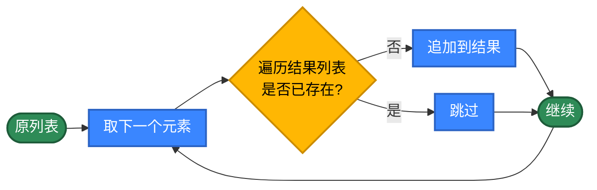
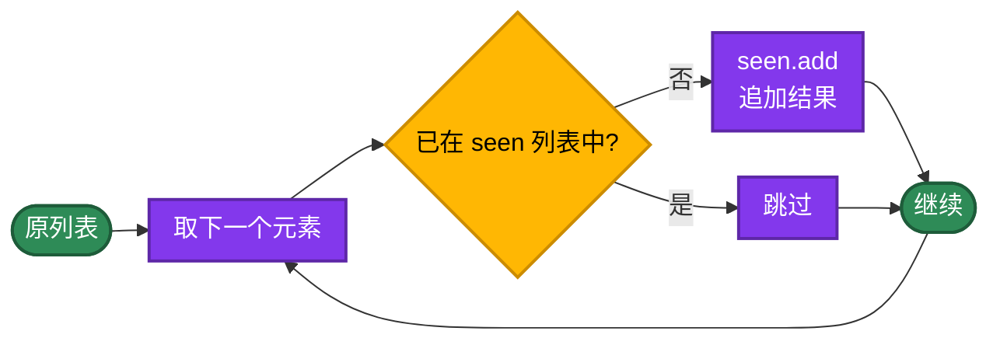
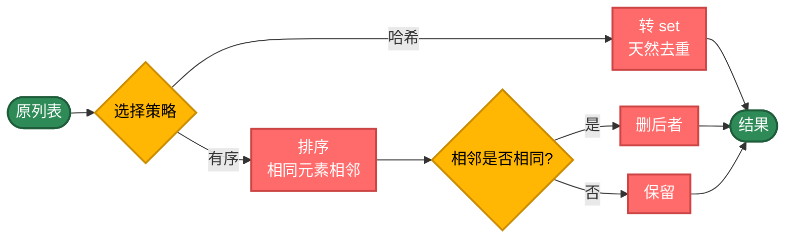
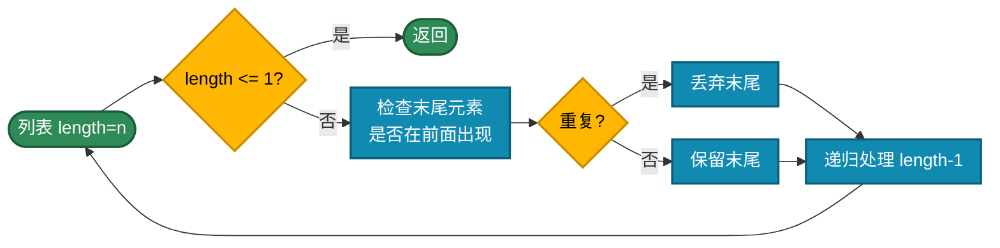
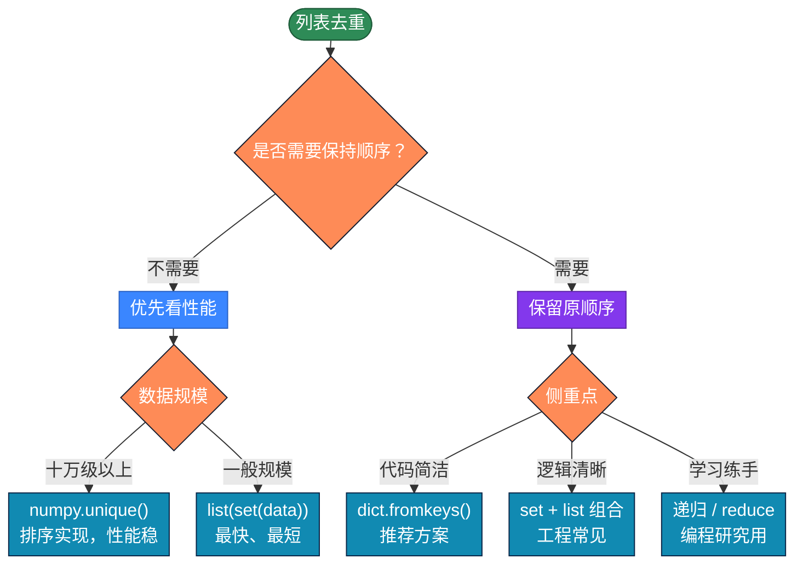

# Python列表去重的20种实现方式

列表（数组）去重是最常见的算法，非常简单，但不同实现方式背后的差异巨大。AI时代，可以不手写代码了，但需要知道代码背后的原理，这样才能更好地指导AI编程。

## 最简单的思路

新建列表，遍历原列表，当原列表的元素不在新列表的，则添加到新列表中。

```python
def unique(data):
    # 新建list
    new_list = []
    for item in data:
        # 原list中的项是否存在于新list中，不存在则添加。这是 O(n)操作
        if item not in new_list:
            new_list.append(item)
    return new_list
```

这种写法最直观易懂，但每次 `not in` 都要遍历整个 `new_list`，复杂度为 O(n²)。

如何降低复杂度呢？可以从以下角度思考：

- 哈希集合 / 字典：把查询从 O(n) 可压到 O(1)，整体 O(n)
- 先排序：相同元素两两比较再去重，O(nlogn)，但会破坏原顺序
- 函数式 / 递归：写法上换一种风格，适用不同场景，本质仍是上面的方式

## 第1类：基础循环（方法1-8）

策略原理：遍历原数组，直接用双重循环或下标比较找出重复项。每一步判断"是否存在"都是 O(n)，整体复杂度 O(n²)。

适用场景：这里主要是展示算法原理，用于教学示例，弄懂编程原理。生产代码不建议使用。



```python
# 方法1：最基础的线性查找
def unique_v1(data):
    new_list = []
    for item in data:
        # in 在列表上是 O(n) 扫描，整体 O(n²)
        # 该元素不在新list则添加
        if item not in new_list:
            new_list.append(item)
    return new_list

# 方法2：用下标遍历
def unique_v2(data):
    new_list = []
    for i in range(len(data)):
        # 与第1种相同，遍历方式换成range，复杂度不变
        if data[i] not in new_list:
            new_list.append(data[i])
    return new_list

# 方法3：列表推导式
def unique_v3(data):
    new_list = []
    # 利用列表推导式的副作用追加元素，写法简化，本质与前面一样
    [new_list.append(i) for i in data if i not in new_list]
    return new_list

# 方法4：通过元素首次出现位置判断
def unique_v4(data):
    new_list = []
    for i in range(len(data)):
        # data.index(x) 返回 x 在 data 里第一次出现的下标
        # 当前下标恰好等于该值时，说明该元素是首次出现，将首次出现的添加到新list
        if i == data.index(data[i]):
            new_list.append(data[i])
    return new_list

# 方法5：原地删除（从右往左扫描）
def unique_v5(data):
    l = len(data)
    while l > 0:
        l -= 1
        i = l
        while i > 0:
            i -= 1
            # 在 [0, l) 区间里寻找与 data[l] 相同的元素
            # 找到就删后面那个，保留前面的
            if data[i] == data[l]:
                del data[l]
                break
    return data
# 修改原列表，空间 O(1)

# 方法6：原地删除（从左往右扫）
def unique_v6(data):
    l = len(data)
    i = 0
    while i < l:
        j = i + 1
        while j < l:
            # 把 data[i] 后面所有等于它的元素删掉
            if data[i] == data[j]:
                del data[j]
                l -= 1   # 列表变短，长度同步更新
            else:
                j += 1
        i += 1
    return data

# 方法7：用 try-except 替代 in
def unique_v7(data):
    new_list = []
    for item in data:
        try:
            # index 找不到会抛 ValueError
            new_list.index(item)
        except ValueError:
            # 找不到才追加
            new_list.append(item)
    return new_list
# 实际上不会这么使用——拿异常处理正常的控制流，性能和可读性都吃亏

# 方法8：双层循环+下标判断
def unique_v8(data):
    new_list = []
    for i in range(len(data)):
        j = 0
        while j <= i:
            # 看 data[i] 在它之前是否出现过
            if data[i] == data[j]:
                # 只有 j == i（前面都没遇到）时才追加
                if i == j:
                    new_list.append(data[i])
                break
            j += 1
    return new_list
# 内层只跑到 i 而非 n，比较次数约为方法1的一半，但渐进复杂度仍是 O(n²)
```

---

## 第2类：哈希表（方法9-12）

策略原理：利用 `dict` 或 `set` 的键（Key）唯一性来记录"已经出现的元素"。哈希结构的查询是 O(1)，因此整体降到 O(n)。代价是需要 O(n) 额外内存空间，且元素必须可哈希——数字、字符串、元组都可以，但 list、dict 这类可变对象不行。

适用场景：日常项目的首选。需要保留原顺序时尤其合适，因为一边查重一边按原序写入结果。



```python
# 方法9：set 配合 list——工程最常见写法
def unique_v9(data):
    seen = set()        # set 用于 O(1) 判重
    result = []         # list 用于保持原顺序
    for item in data:
        if item not in seen:
            seen.add(item)
            result.append(item)
    return result

# 方法10：dict.fromkeys()——最佳版本，实际使用首选
def unique_v10(data):
    # dict 自 Python 3.7 起保持插入顺序
    # fromkeys 会自动用相同 key 覆盖，从而完成去重
    return list(dict.fromkeys(data))

# 方法11：filter + 列表，函数式风格
def unique_v11(data):
    seen = []
    # 内部函数
    def check(item):
        # 闭包捕获 seen
        # 注意 seen 是 list，in 仍是 O(n)，整体仍是 O(n²)
        if item not in seen:
            seen.append(item)
            return True
        return False
    return list(filter(check, data))
# 函数式风格，但不纯粹，seen 类型选错了，这里只是为了展示写法

# 方法12：filter + 字典，由list改为dict，仍然不是纯函数式
def unique_v12(data):
    obj = {}
    def check(item):
        # 用 dict 替代上面的 list，查询变成 O(1)
        if obj.get(item) is None:
            obj[item] = item
            return True
        return False
    return list(filter(check, data))
```

---

## 第3类：集合与排序（方法13-16）

策略原理：将`list`直接转 `set`，或者通过 `sort()` 让相同元素挨在一起再去重，从而简化查找逻辑。两种思路都不再保留原有顺序。集合方式 O(n)，排序方式 O(nlogn)，且要求元素可比较。

适用场景：不关心顺序、只关心结果集合的场合，例如统计去重数量、做集合运算、把列表当作"无序集合"使用。



```python
# 方法13：set 直接转列表，常见用法
def unique_v13(data):
    # 哈希集合天然不重复
    return list(set(data))
# 写法最短，但顺序会被打乱

# 方法14：map + filter 组合
def unique_v14(data):
    seen = []
    def mark(item):
        # 第一次见到返回元素本身，后续返回 None
        if item not in seen:
            seen.append(item)
            return item
        return None
    # 先 map 标记，再 filter 把 None 去掉
    return list(filter(lambda x: x is not None, map(mark, data)))
# 函数式风格，但 seen 用 list 仍是 O(n²)

# 方法15：先排序再相邻去重（从右往左删）
def unique_v15(data):
    data.sort()  # 排序后，相同元素会聚到一起
    l = len(data)
    while l > 0:
        l -= 1
        # 相邻两两比较，相同就删后面那个
        if l > 0 and data[l] == data[l-1]:
            del data[l]
    return data
# 复杂度由 sort 决定，O(nlogn)；元素需要可比较

# 方法16：先排序再相邻去重（从左往右删）
def unique_v16(data):
    data.sort()
    l = len(data) - 1
    i = 0
    while i < l:
        if data[i] == data[i+1]:
            del data[i]   # 删当前，i 不前进；同时长度减一
            i -= 1
            l -= 1
        i += 1
    return data
```

---

## 第4类：函数式与递归（方法17-20）

策略原理：用 `reduce`、外部库或递归换一种表达方式。`reduce` 配合元组累加器可以做到 O(n)，但写法比直接 for 循环晦涩；递归则吃调用栈、numpy 需要库依赖。

适用场景：numpy 适合大规模数值数据；其余几种主要用于练习函数式或递归思维，工程上一般直接用第 2 类。



```python
# 方法17：reduce + 元组累加器（函数式风格但能跑到 O(n)）
import functools

def unique_v17(data):
    def foo(acc, item):
        # 累加器是一个元组 (result, seen)
        # result 保留首次出现的顺序，seen 用集合实现 O(1) 判重
        result, seen = acc
        if item in seen:
            return (result, seen)
        # 这里直接修改累加器内部的 list 和 set
        # 严格的纯函数式应返回新对象 (result + [item], seen | {item})
        # 但那样每步都新建列表/集合，复杂度退回到 O(n²)
        # 在 reduce 内做"受控副作用"，换取 O(n) 的性能
        seen.add(item)
        result.append(item)
        return (result, seen)

    # 初始累加器是空列表+空集合，最后取 [0] 即得到去重结果
    return functools.reduce(foo, data, ([], set()))[0]
# O(n)；保序；本质是用 reduce 重写了方法9的循环

# 方法18：调用 numpy.unique
def unique_v18(data):
    import numpy as np
    # numpy 底层用 C 实现的排序+相邻去重
    return list(np.unique(np.array(data)))
# O(nlogn)；不保序；适合大规模数值数据

# 方法19：递归+原地删除
def unique_v19(data, length=None):
    # 递归退出条件
    if length is None:
        length = len(data)
    if length <= 1:
        return data

    last_idx = length - 1
    # 看末尾元素是否在前面出现过
    is_repeat = False
    for i in range(last_idx):
        if data[i] == data[last_idx]:
            is_repeat = True
            break

    # 重复则删除
    if is_repeat:
        del data[last_idx]

    # 递归调用，处理前 length-1 项
    return unique_v19(data, length - 1)
# 递归深度 = n，大数据会栈溢出，仅作学习用

# 方法20：递归+拼接返回（不修改原列表）
# 递归自后往前逐个调用，当长度为1时终止。与上一个递归不同，这里将不重复的项目作为结果拼接起来
def unique_v20(data, length=None):
    if length is None:
        length = len(data)
    if length <= 1:
        return data

    last_idx = length - 1
    last_item = data[last_idx]

    is_repeat = False
    for i in range(last_idx):
        if data[i] == last_item:
            is_repeat = True
            break

    # 末尾元素重复就丢弃，否则拼到结果末尾
    result = [] if is_repeat else [last_item]
    # 切片 + 拼接都会产生新列表，空间开销大
    return unique_v20(data[:last_idx], length - 1) + result
# 演示如何用递归构造结果，工程上没有实用价值
```

---

## 这么多实现方式，如何选择？



| 类别 | 时间复杂度 | 是否保序 | 主要场景 |
|------|----------|--------|---------|
| 基础循环 | O(n²) | 是 | 教学、极小规模 |
| 哈希表 | O(n) | 是 | 日常项目首选 |
| 集合 / 排序 | O(n) / O(nlogn) | 否 | 不在意顺序 |
| 函数式 / 递归 | 视实现而定 | 看实现 | 学习、特定场景 |

---

## 实际项目里怎么选

绝大多数情况一行就够：

```python
# 保序、O(n)、对所有可哈希类型有效，Python 3.7+ 自带
result = list(dict.fromkeys(data))
```

不在意顺序：

```python
result = list(set(data))
```

数据量很大且都是数值：

```python
import numpy as np
result = list(np.unique(data))
```

---

## 带逻辑干预的去重

前面所有方法都把"重复的元素"直接丢掉。但实际工作里经常遇到这样的情况：遇到重复时不能简单丢弃，要根据某个条件做处理。比如：

- 按 `id` 去重，但要保留分数最高的那条记录
- 去重的同时累加重复次数（即频次统计）
- 数值在某个区间内才参与去重，区间外原样保留

这类需求 `set` 和 `dict.fromkeys` 都没法直接表达，需要把"判重"和"处理"两步拆开来写。

```python
def unique_with_rule(data, key=None, on_duplicate=None):
    """
    带逻辑干预的去重。

    key: 可哈希的去重键，默认拿元素本身
    on_duplicate: 遇到重复时如何处理 (旧值, 新值) -> 新的"代表值"
                  返回 None 时保持旧值不变（即等同于丢弃新值）
    """
    if key is None:
        key = lambda x: x

    chosen = {}     # 键 -> 当前选中的元素
    order  = []     # 记录键首次出现的顺序，保证保序

    for item in data:
        k = key(item)
        if k not in chosen:
            chosen[k] = item
            order.append(k)
        elif on_duplicate is not None:
            # 遇到重复时由调用方决定如何合并
            merged = on_duplicate(chosen[k], item)
            if merged is not None:
                chosen[k] = merged

    return [chosen[k] for k in order]
```

例 1，按 `id` 去重，保留分数最高的：

```python
students = [
    {'id': 1, 'name': '张三', 'score': 90},
    {'id': 1, 'name': '张三', 'score': 95},   # 同 id，分数更高
    {'id': 2, 'name': '李四',   'score': 99},
]
result = unique_with_rule(
    students,
    key=lambda x: x['id'],
    on_duplicate=lambda old, new: new if new['score'] > old['score'] else old,
)
# [{'id':1,'score':95,...}, {'id':2,'score':99,...}]
```

例 2，去重的同时统计每个值的出现次数：

```python
from collections import Counter

data = ['A', 'B', 'A', 'C', 'B', 'A']
# Counter 本身就是"键->计数"，遍历一次即可完成统计
counts = Counter(data)
# Python 3.7+ 起 dict / Counter 保留插入顺序，因此 keys 即首次出现顺序
unique_keys = list(counts.keys())
# unique_keys = ['A', 'B', 'C']
# counts      = {'A': 3, 'B': 2, 'C': 1}
```

例 3，区间过滤——只对 `[0, 50]` 区间内的值去重，区间外的原样保留：

```python
data = [5, 12, 5, 100, 12, 200]
seen = set()
result = []
for x in data:
    if 0 <= x <= 50:
        # 区间内才参与去重
        if x in seen:
            continue
        seen.add(x)
    # 区间外或首次出现，都保留
    result.append(x)
# [5, 12, 100, 200]
```

这三个例子是同一种思路：把判重与业务规则分开。判重用哈希结构保证 O(n)，规则部分留给回调或显式分支处理，这样既不丢性能，又能容纳各种业务变化。

---

## 处理不可哈希的元素

如果列表里是 dict、list 这类不可哈希对象，前面的 `set` / `dict.fromkeys` 都用不了，需要自己提供"去重键"：

```python
def deduplicate_with_key(data, key=None):
    """按自定义 key 去重，保留首次出现的元素"""
    if key is None:
        return list(dict.fromkeys(data))

    seen = set()
    result = []
    for item in data:
        # 把不可哈希的整体映射成可哈希的键
        k = key(item)
        if k not in seen:
            seen.add(k)
            result.append(item)
    return result

# 使用示例：按学生 id 去重
students = [
    {'id': 1, 'name': '张三', 'score': 90},
    {'id': 1, 'name': '张三', 'score': 95},   # id 重复
    {'id': 2, 'name': '李四', 'score': 85},
]
result = deduplicate_with_key(students, key=lambda x: x['id'])
# 只保留第一个 id=1 的学生
```

利用 `set.add()` 返回 None 的小技巧，也能把保序去重压成一行，但可读性下降，实际代码不建议：

```python
def deduplicate_short(data):
    seen = set()
    # x in seen 为 False 时才会执行 seen.add(x)
    # add 返回 None 让 or 短路，整个表达式得到 False，于是元素被保留
    return [x for x in data if not (x in seen or seen.add(x))]
```

---

## 总结

- 默认就用 `list(dict.fromkeys(data))`：保序、复杂度 O(n)、一行搞定
- 不需要保序就用 `list(set(data))`，利用数据结构特性
- 大规模数值数据用 `numpy.unique`，借助外部库
- 不可哈希元素用自定义 key 函数
- 遇到重复要做业务处理，把判重和规则分开写，具体算法根据情况采用

这20 种方法不是为了去记住如何编写，而是明白其中的编程思路：

1. 同一个问题可以从多个角度切入
2. 选对数据结构往往比写更聪明的代码更重要
3. O(n²) 与 O(n) 在数据变大时是几百倍的实际差距
4. 不要过度优化，能用 `dict.fromkeys` 就别用其他
5. 遇到新问题先写最直观的版本，再按瓶颈逐步优化

AI 时代，程序员不一定要手写代码，但一定要懂得编程思路，这样才能更好地指导 AI。

## 更多算法

不同语言算法实现：[https://github.com/microwind/algorithms](https://github.com/microwind/algorithms)

AI编程知识库：[https://microwind.github.io](https://microwind.github.io)