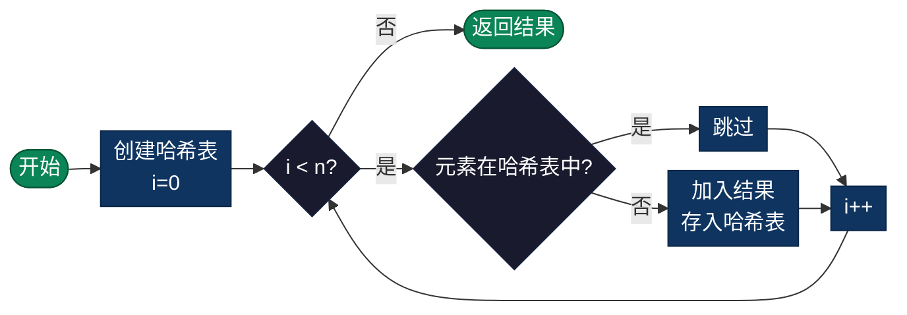

# 数组去重（Array Unique）

> 从数组中移除重复元素，只保留唯一的值。本目录提供多种去重方法的实现，包括哈希表法、双指针法和排序法等。

## 算法概述

数组去重问题是要从数组中移除重复的元素，只保留唯一的值。这是一个经典的数据处理问题，在实际应用中非常常见。根据不同的约束条件（是否需要保持原顺序、是否允许使用额外空间等），有多种实现方法。

### 问题定义

给定一个数组，移除其中的重复元素，使每个元素只出现一次。可以返回新的数组长度或去重后的数组，具体取决于实现要求。可能需要保持元素的原始相对顺序。

### 问题意义

- **数据处理**：数据清洗的基础操作，确保数据唯一性
- **哈希表应用**：展示了哈希表在去重场景的高效应用
- **算法对比**：不同方法（哈希表、双指针、排序）展示了时空权衡
- **实际需求**：在数据库、数据分析、用户输入处理等场景中广泛使用

### 典型应用场景

- **数据清洗**：移除重复的记录，如数据库去重
- **统计分析**：确保数据唯一性，避免重复计算
- **缓存优化**：避免重复计算相同的数据
- **用户输入处理**：过滤重复选项，如表单提交
- **集合运算**：准备数据用于集合操作，如并集、交集

## 算法原理

数组去重有多种实现方式，最常用的是**哈希表法**：
1. 创建哈希表记录已出现的元素
2. 遍历原数组，检查每个元素是否在哈希表中
   - 如果不在，加入结果数组并存入哈希表
   - 如果在，跳过该元素
3. 返回结果数组

### 示例演示

```
初始数组: [1, 2, 2, 3, 4, 4, 5]

遍历过程:
┌─────────────────┬─────────────────┬─────────────────┐
│   当前元素      │    哈希表状态    │    结果数组     │
├─────────────────┼─────────────────┼─────────────────┤
│       1         │    {1}          │      [1]        │
│       2         │    {1,2}        │      [1,2]      │
│       2         │    {1,2} ✗已存在 │      [1,2]      │
│       3         │    {1,2,3}      │      [1,2,3]    │
│       4         │    {1,2,3,4}    │      [1,2,3,4]  │
│       4         │    {1,2,3,4} ✗  │      [1,2,3,4]  │
│       5         │    {1,2,3,4,5}  │      [1,2,3,4,5]│
└─────────────────┴─────────────────┴─────────────────┘

结果: [1, 2, 3, 4, 5]
```

---

## 复杂度分析

### 哈希表法

| 指标 | 复杂度 | 说明 |
|------|--------|------|
| **时间复杂度** | O(n) | 单次遍历数组，哈希表操作 O(1) |
| **空间复杂度** | O(n) | 哈希表存储已出现元素 |
| **稳定性** | 不稳定 | 依赖哈希表实现，顺序可能改变 |

### 多种方法对比

| 方法 | 时间复杂度 | 空间复杂度 | 稳定性 | 适用场景 |
|------|-----------|-----------|--------|----------|
| 哈希表/集合 | O(n) | O(n) | 不稳定 | 大多数情况 |
| 双指针 | O(n) | O(1) | 稳定 | 已排序数组 |
| 排序后去重 | O(n log n) | O(1) | 不稳定 | 空间受限 |
| 暴力枚举 | O(n²) | O(1) | 稳定 | 极小数组 |

---

## 流程图



---

## 适用场景

- **数据清洗**：移除重复的记录
- **统计分析**：确保数据唯一性
- **缓存优化**：避免重复计算
- **用户输入处理**：过滤重复选项
- **集合运算**：准备数据用于集合操作

---

## 实现列表

| 语言 | 文件名 | 说明 |
|------|--------|------|
| C | [unique.c](./unique.c) | 多种方法实现 |
| Go | [unique.go](./unique.go) | map和slice实现 |
| Java | [UniqueArray.java](./UniqueArray.java) | 面向对象多种方式 |
| JavaScript | [unique.js](./unique.js) | ES6+现代实现 |
| Python | [unique.py](./unique.py) | set和列表推导 |
| Rust | [unique.rs](./unique.rs) | HashSet实现 |
| TypeScript | [UniqueArray.ts](./UniqueArray.ts) | 类型安全版本 |
| Dart | [unique.dart](./unique.dart) | Dart集合操作 |

---

## 使用示例

### C 版本
```c
int arr[] = {1, 1, 3, -1, 1, 2, 2, 4, 2, 2, -1};
uniqueArray(arr, 11, result);
// 结果: [1, 3, -1, 2, 4]
```

### Python 版本
```python
arr = [1, 1, 3, -1, 1, 2, 2, 4, 2, 2, -1]
result = list(set(arr))  # 简单去重
# 或保持顺序: unique(arr)
```

---

## 扩展阅读

- 双指针法适用于已排序数组，可实现原地去重
- 排序后去重使用 dedup 操作，时间复杂度 O(n log n)
- 对于对象数组，需要自定义相等比较函数
- 流式数据去重需要考虑缓存淘汰策略