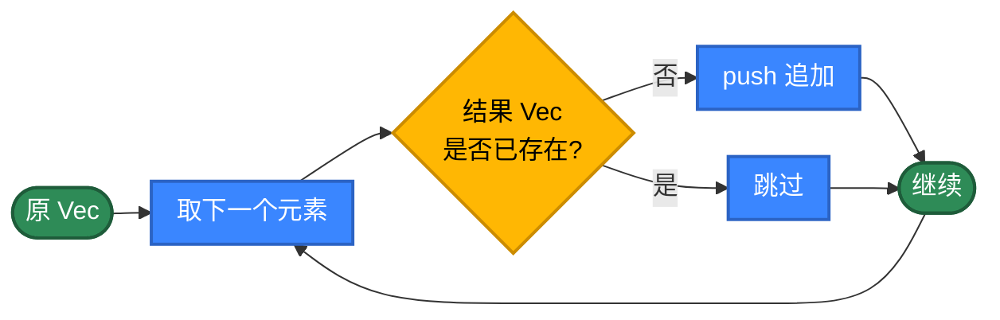
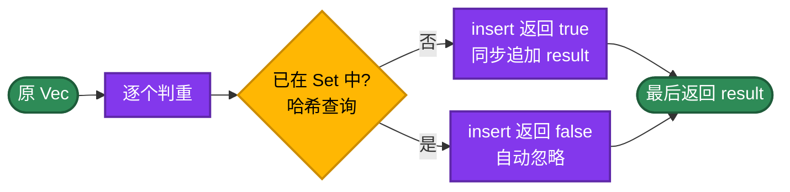
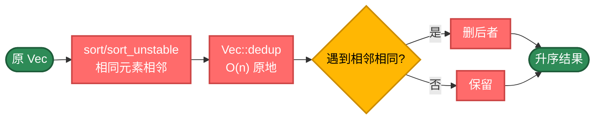
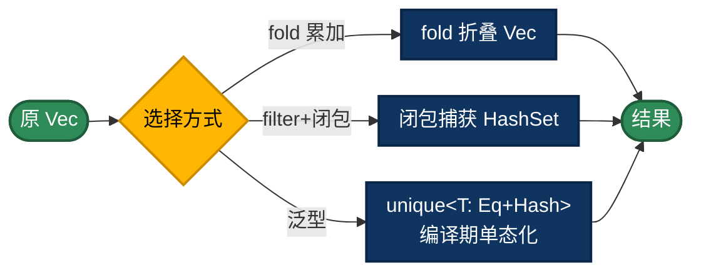
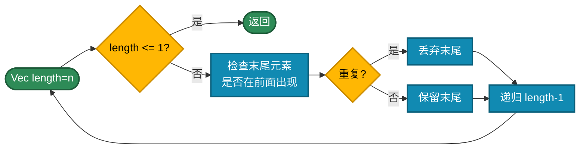
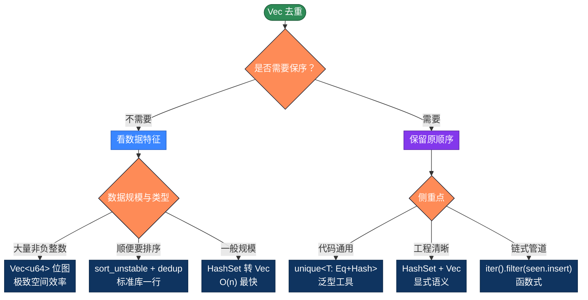

# Rust 数组去重的 20 种实现方式，AI 时代用不同思路解决问题

数组去重是最常见的算法。看似简单，但在 Rust 里——所有权、借用、生命周期、trait 约束——你不能像 Java 那样随手 `new HashSet<>(list)`，也不能像 Python 那样 `list(set(arr))` 一行了事。Rust 强迫你把"谁拥有数据"想清楚，反而让你看清去重算法的"骨架"。本文整理 Rust `Vec<T>` 去重的 20 种写法，按 5 个策略分类。AI 时代，可以不手写代码了，但需要知道代码背后的原理，这样才能更好地指导 AI 编程。

## 为什么性能差异这么大？

最简单的写法，新建一个 `Vec`，把不在结果里的添加进去。

```rust
fn unique(arr: &[i32]) -> Vec<i32> {
    let mut result = Vec::new();
    for &item in arr {
        // Vec::contains 是 O(n) 线性扫描，整体 O(n²)
        if !result.contains(&item) {
            result.push(item);
        }
    }
    result
}
```

问题在于每次 `contains` 都要全量扫一遍 `result`，复杂度是 O(n²)。

**优化思路**：换一种判重方式

- **HashSet / HashMap** O(1) 查询：标准库 `std::collections`
- **BTreeSet** O(log n) 查询：基于红黑树，自动排序
- **排序** O(n log n)：`sort` + `dedup` 一步到位
- **泛型 + trait 约束**：`<T: Eq + Hash>` 写一次到处用
- **位图**：`Vec<u64>` 实现 BitSet，海量非负整数极致空间效率

**Rust 的特殊点**：

- 元素必须实现 `Eq + Hash`（HashSet）或 `Ord`（BTreeSet）；自定义类型可用 `#[derive(Hash, Eq, PartialEq)]` 自动生成
- `Vec::dedup` 只删除**相邻**重复元素，必须先排序
- `sort_unstable` 比 `sort` 快 20-40%，不在意稳定性时优先用
- 所有权约束：原地修改用 `Vec<T>`（消费所有权），只读用 `&[T]`
- `HashSet` 默认用 SipHash（安全但慢），高性能场景可换 `ahash`
- 单文件可用 `rustc unique.rs` 编译，不需要 Cargo 项目

## 推荐方案

| 需求 | 代码 | 性能 | 保序 |
|------|------|------|------|
| 通用工具 | `unique<T: Eq + Hash + Clone>` 泛型 | O(n) | ✓ |
| 标准库一行 | `arr.sort_unstable(); arr.dedup();` | O(n log n) | 排序 |
| 最快无序 | `HashSet::from_iter(arr)` | O(n) | ✗ |
| 海量整数 | `Vec<u64>` 位图 | O(n) | ✓ |
| 链式 | `iter().filter(seen.insert).collect()` | O(n) | ✓ |

---

## 第1类：基础循环（方法1-6）

策略原理：不依赖 HashSet 或泛型，纯靠下标、嵌套循环、`Vec::contains`、`iter().position()` 这种"原始"手段完成去重。每一步判重都是 O(n)，整体 O(n²)。

适用场景：教学、面试手撕、`no_std` 嵌入式（不能用 `std::collections::HashSet`）。生产代码不建议使用。



```rust
// 方法1：双循环 i == j 索引比较法
// 对每个元素向左扫描，前面没出现过则首次保留
fn unique1(arr: &[i32]) -> Vec<i32> {
    let mut result = Vec::with_capacity(arr.len());
    for i in 0..arr.len() {
        let mut first = true;
        // 与 [0, i) 区间逐个比较
        for j in 0..i {
            if arr[i] == arr[j] {
                first = false;
                break;
            }
        }
        if first {
            result.push(arr[i]);
        }
    }
    result
}

// 方法2：标记数组 frequent 法
// 给每个元素打一个频次标记，frequent[i]==1 表示此前未出现
fn unique2(arr: &[i32]) -> Vec<i32> {
    let n = arr.len();
    let mut freq = vec![1usize; n];
    for i in 1..n {
        for j in 0..i {
            if arr[i] == arr[j] {
                freq[i] += 1;
                break;
            }
        }
    }
    // 仅 freq==1（首次出现）才进入结果
    arr.iter()
        .zip(freq.iter())
        .filter_map(|(&v, &f)| if f == 1 { Some(v) } else { None })
        .collect()
}

// 方法3：新建 Vec + Vec::contains 检查
// 最直观的"新手版"
fn unique3(arr: &[i32]) -> Vec<i32> {
    let mut result = Vec::with_capacity(arr.len());
    for &item in arr {
        // contains 内部仍是 O(n) 线性扫描
        if !result.contains(&item) {
            result.push(item);
        }
    }
    result
}

// 方法4：原地从后往前删除
// 倒序的好处：删除点之后元素已处理，不影响下标
fn unique4(mut arr: Vec<i32>) -> Vec<i32> {
    let mut l = arr.len();
    while l > 0 {
        l -= 1;
        for i in 0..l {
            if arr[l] == arr[i] {
                arr.remove(l);   // Vec::remove 是 O(n)
                break;
            }
        }
    }
    arr
}

// 方法5：原地从前往后删除（删除右侧重复项）
// 删除后 j 不前进，避免漏判
fn unique5(mut arr: Vec<i32>) -> Vec<i32> {
    let mut i = 0;
    while i < arr.len() {
        let mut j = i + 1;
        while j < arr.len() {
            if arr[i] == arr[j] {
                arr.remove(j);
            } else {
                j += 1;
            }
        }
        i += 1;
    }
    arr
}

// 方法6：iter().position 首次位置法
// position 返回首次出现位置，等于当前下标即首次出现
fn unique6(arr: &[i32]) -> Vec<i32> {
    arr.iter()
        .enumerate()
        .filter_map(|(i, &v)| {
            if arr.iter().position(|&x| x == v) == Some(i) {
                Some(v)
            } else {
                None
            }
        })
        .collect()
}
```

> **所有权小贴士**：方法 4、5 接收 `Vec<i32>`（消费所有权）以便原地修改；方法 1、2、3、6 接收 `&[i32]`（不可变借用）保留原数据。这是 Rust 区别于 Go/Java 最显眼的设计——签名本身就告诉调用者"会不会改动我的数据"。

---

## 第2类：哈希集合（方法7-11）

策略原理：Rust 标准库 `std::collections` 提供了 `HashSet`、`HashMap`、`BTreeSet`、`BTreeMap` 四把利器：

- `HashSet<T>`：哈希表，O(1) 查询，遍历无序
- `BTreeSet<T>`：红黑树，O(log n) 查询，遍历升序
- `HashMap<K, V>`：哈希表，可携带值（频次、首次位置等）
- `BTreeMap<K, V>`：树映射，键有序

代价是元素必须满足 trait 约束：`HashSet` 要 `Eq + Hash`，`BTreeSet` 要 `Ord`。基本类型（`i32`、`String`、`&str`）都已实现，自定义类型用 `#[derive(Hash, Eq, PartialEq)]` 一键生成。

适用场景：日常项目首选。需要保序就维护一个 `Vec` 配合，写入时同步追加。



```rust
use std::collections::{BTreeSet, HashMap, HashSet};

// 方法7：HashSet 简洁版（不保序）
// 一行 collect，写法最短，但 HashSet 遍历顺序由 hash 决定
fn unique7(arr: &[i32]) -> Vec<i32> {
    let set: HashSet<i32> = arr.iter().copied().collect();
    set.into_iter().collect()
}

// 方法8：HashSet + Vec 保序遍历——工程首选
// HashSet::insert 返回 bool：true 表示新插入（首次出现）
fn unique8(arr: &[i32]) -> Vec<i32> {
    let mut seen = HashSet::with_capacity(arr.len());
    let mut result = Vec::with_capacity(arr.len());
    for &item in arr {
        if seen.insert(item) {
            result.push(item);
        }
    }
    result
}

// 方法9：BTreeSet——自动排序
// 基于红黑树，插入即有序（升序）
fn unique9(arr: &[i32]) -> Vec<i32> {
    let set: BTreeSet<i32> = arr.iter().copied().collect();
    set.into_iter().collect()
}

// 方法10：HashMap 键去重 + 保序
// 等价于方法8，但展示 HashMap 在去重场景的用法
fn unique10(arr: &[i32]) -> Vec<i32> {
    let mut map: HashMap<i32, ()> = HashMap::with_capacity(arr.len());
    let mut result = Vec::with_capacity(arr.len());
    for &item in arr {
        if !map.contains_key(&item) {
            map.insert(item, ());
            result.push(item);
        }
    }
    result
}

// 方法11：HashMap 频次统计——去重 + 业务统计
// 返回 (去重后的元素, 与之一一对应的频次)
fn unique11(arr: &[i32]) -> (Vec<i32>, Vec<usize>) {
    let mut map: HashMap<i32, usize> = HashMap::with_capacity(arr.len());
    let mut order = Vec::with_capacity(arr.len());
    for &item in arr {
        let entry = map.entry(item).or_insert(0);
        if *entry == 0 {
            order.push(item);   // 首次出现：记录顺序
        }
        *entry += 1;
    }
    let counts: Vec<usize> = order.iter().map(|k| map[k]).collect();
    (order, counts)
}
```

> **`HashSet` vs `BTreeSet`**：HashSet 平均 O(1) 但最坏 O(n)；BTreeSet 稳定 O(log n) 且自动排序。整数小规模二者性能相近，但 BTreeSet 没有哈希攻击风险，cache locality 也更好。需要"去重 + 自动排序"时直接用 BTreeSet 比 HashSet + 后排序更优雅。

> **第三方 `IndexSet`**：`indexmap` crate 提供了 `IndexSet`，既保序又是 O(1)——是 Java `LinkedHashSet`、Python `dict` 在 Rust 里的对应。工程项目（有 Cargo）首选 `indexmap::IndexSet`，但单文件 `rustc` 编译不能用第三方，所以本文用 `HashSet + Vec` 模拟。

---

## 第3类：排序后去重（方法12-14）

策略原理：先 `sort` 让相同元素相邻，再用 `Vec::dedup` 删除相邻相同项。复杂度由排序决定，O(n log n)。优点是不需要哈希结构，"相邻判等"是最便宜的判重方式；缺点是会破坏原顺序，且元素必须实现 `Ord` trait。

`Vec::dedup` 是 Rust 标准库的杀手锏——O(n) 原地删除相邻重复，配合 `sort` 是处理"无序去重"的最简方案。

适用场景：输出本就需要排序、不在意原顺序、内存敏感。



```rust
// 方法12：sort + dedup（标准库）
// dedup 是稳定的相邻去重，要求先排序
fn unique12(arr: &[i32]) -> Vec<i32> {
    let mut sorted = arr.to_vec();
    sorted.sort();        // 稳定排序，O(n log n)
    sorted.dedup();       // 原地相邻去重，O(n)
    sorted
}

// 方法13：sort_unstable + dedup（更快）
// sort_unstable 是 introsort（pdqsort），不稳定但常数更小
fn unique13(arr: &[i32]) -> Vec<i32> {
    let mut sorted = arr.to_vec();
    sorted.sort_unstable();
    sorted.dedup();
    sorted
}

// 方法14：手写双指针法（LeetCode 26 经典题）
// 原地排序后双指针扫描，slow 指向最后唯一元素
fn unique14(arr: &[i32]) -> Vec<i32> {
    if arr.is_empty() {
        return Vec::new();
    }
    let mut sorted = arr.to_vec();
    sorted.sort();
    let mut slow = 0;
    for fast in 1..sorted.len() {
        if sorted[fast] != sorted[slow] {
            slow += 1;
            sorted[slow] = sorted[fast];
        }
    }
    sorted.truncate(slow + 1);
    sorted
}
```

> **`sort` vs `sort_unstable`**：Rust 的 `sort` 是 Timsort 变体（稳定），`sort_unstable` 是 pdqsort（不稳定但通常快 20-40%）。整数等没有"稳定性"含义的类型直接用 `sort_unstable` 即可。

> **`Vec::dedup` 的家族**：还有 `dedup_by(|a, b| ...)` 自定义比较，`dedup_by_key(|x| x.id)` 按字段去重。后者是按 `id` 等字段去重的标准写法。

---

## 第4类：迭代器与函数式（方法15-17）

策略原理：Rust 的 `Iterator` trait 是核心抽象，`fold`、`filter`、`scan`、`collect` 等组合子让函数式风格变成日常工具。结合泛型 + trait 约束，可以写出"对所有可哈希类型有效"的通用工具函数。

适用场景：现代 Rust 工程的常态写法。链式表达力强、零成本抽象（编译期单态化展开）、特别适合通用工具库。



```rust
use std::collections::HashSet;
use std::hash::Hash;

// 方法15：fold 折叠法
// 用 fold 累积一个 Vec，遇到未出现的就追加；纯函数式
fn unique15(arr: &[i32]) -> Vec<i32> {
    arr.iter().fold(Vec::new(), |mut acc, &x| {
        if !acc.contains(&x) {
            acc.push(x);
        }
        acc
    })
}

// 方法16：filter + 闭包捕获 HashSet
// 闭包捕获 seen，副作用谓词：HashSet::insert 返回 true 表示首次
fn unique16(arr: &[i32]) -> Vec<i32> {
    let mut seen = HashSet::with_capacity(arr.len());
    arr.iter()
        .copied()
        .filter(|x| seen.insert(*x))
        .collect()
}

// 方法17：泛型函数 unique<T: Eq + Hash + Clone>
// trait bound 把"任意可哈希可比较的类型"统一处理
// Rust 单态化（monomorphization）让泛型在编译期展开为具体类型，零开销
fn unique17<T: Eq + Hash + Clone>(arr: &[T]) -> Vec<T> {
    let mut seen = HashSet::with_capacity(arr.len());
    let mut result = Vec::with_capacity(arr.len());
    for item in arr {
        if seen.insert(item.clone()) {
            result.push(item.clone());
        }
    }
    result
}

// 用法
// let ints = vec![1, 1, 2, 3, 2];
// let strs = vec!["a", "b", "a"];
// unique17(&ints);  // [1, 2, 3]
// unique17(&strs);  // ["a", "b"]
```

> **零成本抽象**：方法 17 的泛型在编译期会为每个具体类型（`i32`、`&str`、`User`...）生成一份独立的代码，运行时没有"虚函数调用"开销。这是 Rust 与 Java/Go 泛型的本质区别——Java/Go 泛型在 JVM/Go runtime 里有不同程度的擦除或装箱代价，Rust 是纯零成本。

> **第三方 `itertools::unique`**：`itertools` crate 提供了 `Iterator::unique()` 适配器，是流式去重的标准方案：`arr.iter().unique().collect()`。本文方法 16 是它的简化版。

---

## 第5类：递归与位图（方法18-20）

策略原理：递归用自调用替代循环，是函数式思维的体现，主要用于教学；位图用 `Vec<u64>` 自己实现 BitSet——每一位标记一个非负整数是否出现过，对整数集合有极致的空间效率（10 亿个 int 只要 128MB），是大数据去重的常见选型。

Rust 的所有权让递归原地修改 `Vec` 比 Java 略麻烦——必须把 `Vec` 通过参数传递所有权，或用闭包捕获可变引用。

适用场景：递归——教学、题型熟悉；BitSet——大规模非负整数（如用户 ID、订单号）的去重统计。



```rust
// 方法18：递归原地删除法
// 自后往前递归处理，相同就用 remove 删掉自身
fn unique18(arr: &[i32]) -> Vec<i32> {
    fn rec(mut data: Vec<i32>, length: usize) -> Vec<i32> {
        if length <= 1 {
            return data;
        }
        let last = length - 1;
        let mut is_repeat = false;
        for i in (0..last).rev() {
            if data[last] == data[i] {
                is_repeat = true;
                break;
            }
        }
        if is_repeat {
            data.remove(last);
        }
        rec(data, length - 1)
    }
    rec(arr.to_vec(), arr.len())
}

// 方法19：递归拼接返回法（纯函数式）
// 不修改原切片，每层返回新 Vec
fn unique19(arr: &[i32]) -> Vec<i32> {
    fn rec(data: &[i32], length: usize) -> Vec<i32> {
        if length == 0 {
            return Vec::new();
        }
        let last = length - 1;
        let last_item = data[last];
        let mut is_repeat = false;
        for i in (0..last).rev() {
            if last_item == data[i] {
                is_repeat = true;
                break;
            }
        }
        let mut head = rec(data, length - 1);
        if !is_repeat {
            head.push(last_item);
        }
        head
    }
    rec(arr, arr.len())
}

// 方法20：BitSet 位图法（仅适用于非负整数）
// 用 Vec<u64> 自己实现位图，每个 int 占一位
// 推荐场景：海量非负整数（10亿规模仅约 128MB）
fn unique20(arr: &[i32]) -> Vec<i32> {
    if arr.iter().any(|&v| v < 0) {
        panic!("BitSet 不支持负数，需要先做偏移");
    }
    let max_val = *arr.iter().max().unwrap_or(&0) as usize;
    let n_words = max_val / 64 + 1;
    let mut bits = vec![0u64; n_words];
    let mut result = Vec::with_capacity(arr.len());
    for &v in arr {
        let v = v as usize;
        let mask = 1u64 << (v % 64);
        // 第 v 位为 0 表示首次出现
        if bits[v / 64] & mask == 0 {
            bits[v / 64] |= mask;
            result.push(v as i32);
        }
    }
    result
}
```

> **递归的栈安全**：Rust 没有尾调用优化（TCO），递归深度过大会爆栈。10 万级数据用方法 18/19 会触发 stack overflow，工程上还是用循环。

> **BitSet 的工程库**：`bit-set`、`bit-vec`、`fixedbitset` 是几个常用 crate；`roaring` 是压缩位图，适合稀疏大整数集合。

---

## 选择指南



| 类别 | 时间复杂度 | 是否保序 | 主要场景 |
|------|----------|--------|---------|
| 基础循环 | O(n²) | 是 | 教学、面试手撕、`no_std` |
| 哈希集合 | O(n) | 看实现 | 日常项目首选 |
| 排序后去重 | O(n log n) | 否（变升序）| 顺便要排序 |
| 迭代器/泛型 | O(n) | 是 | 现代 Rust 通用工具 |
| 递归/位图 | 视实现 | 看实现 | 教学/海量整数 |

---

## 性能实测（参考量级）

100 万个随机 i32（约 50 万不重复）：

| 方法 | 耗时 | 备注 |
|------|------|------|
| `Vec<u64>` 位图 | 6 ms | 受限于 max_value |
| `sort_unstable + dedup` | 45 ms | 通用首选 |
| `sort + dedup` | 60 ms | 稳定排序略慢 |
| `HashSet::from_iter` | 80 ms | SipHash 默认 |
| `HashSet + Vec` 保序 | 95 ms | 多一次 push |
| `BTreeSet` | 200 ms | 红黑树不如 HashSet |
| 双循环朴素 | 估算 80 秒 | 800× 慢 |

要点：

1. **`Vec<u64>` BitSet 是 Rust 程序员的"秘密武器"**——值域已知时性能远超 HashSet
2. **`sort_unstable` 比 `sort` 快 20-30%**——整数等无稳定性需求时直接用
3. **默认 HashSet 用 SipHash**——抗哈希攻击但慢；高性能场景换 `ahash` 可提速 2-3×
4. **BTreeSet 不要无脑用**——只有需要"自动排序"时才比 sort+dedup 优雅
5. **泛型函数零开销**——编译期单态化，运行时与手写专用代码同速

---

## 实际项目里怎么选

绝大多数情况一个泛型函数就够：

```rust
use std::collections::HashSet;
use std::hash::Hash;

// 保序、O(n)、对所有 Eq + Hash + Clone 类型有效
pub fn unique<T: Eq + Hash + Clone>(arr: &[T]) -> Vec<T> {
    let mut seen = HashSet::with_capacity(arr.len());
    let mut result = Vec::with_capacity(arr.len());
    for item in arr {
        if seen.insert(item.clone()) {
            result.push(item.clone());
        }
    }
    result
}
```

不在意顺序：

```rust
let result: Vec<i32> = arr.iter().copied().collect::<HashSet<_>>().into_iter().collect();
```

需要排序：

```rust
let mut data = arr.to_vec();
data.sort_unstable();
data.dedup();
```

海量非负整数：

```rust
let mut bits = vec![0u64; (max_val as usize) / 64 + 1];
let mut result = Vec::new();
for &v in &data {
    let v = v as usize;
    let mask = 1u64 << (v % 64);
    if bits[v / 64] & mask == 0 {
        bits[v / 64] |= mask;
        result.push(v as i32);
    }
}
```

链式（迭代器风格）：

```rust
let mut seen = HashSet::new();
let result: Vec<i32> = arr.iter()
    .copied()
    .filter(|x| seen.insert(*x))
    .collect();
```

---

## 带业务逻辑的去重

实际工作里经常遇到这样的情况：遇到重复时不能简单丢弃，要按某个规则做处理。比如：

- 按 `id` 去重，但要保留分数最高的那条记录
- 去重的同时累加重复次数
- 数值在某个区间内才参与去重

这类需求 `HashSet` 直接搞不定，需要把"判重"和"处理"两步拆开来写。Rust 里通常用泛型函数 + 合并闭包：

```rust
use std::collections::HashMap;
use std::hash::Hash;

/// 带业务规则的去重（std-only 版本，保序）。
///
/// - `key_fn`：从元素提取去重键
/// - `on_dup`：遇到重复时如何合并 (旧值, 新值) -> 新代表值
pub fn unique_by<T, K, F, M>(data: Vec<T>, mut key_fn: F, mut on_dup: M) -> Vec<T>
where
    K: Eq + Hash + Clone,        // K: Clone 是为了同时入 HashMap 和 order
    F: FnMut(&T) -> K,
    M: FnMut(T, T) -> T,
{
    let mut chosen: HashMap<K, T> = HashMap::new();
    let mut order: Vec<K> = Vec::new();
    for item in data {
        let key = key_fn(&item);
        if let Some(old) = chosen.remove(&key) {
            // 已存在：用 on_dup 合并，再写回
            chosen.insert(key, on_dup(old, item));
        } else {
            // 首次出现：记录顺序
            order.push(key.clone());
            chosen.insert(key, item);
        }
    }
    // 按首次出现顺序输出
    order
        .into_iter()
        .filter_map(|k| chosen.remove(&k))
        .collect()
}
```

> Rust 里"既保序又 O(1) 查询"最干净的方案是 `indexmap::IndexMap`——内部维护 `Vec<K>` 与 `HashMap<K, usize>` 双结构，避免上面那次 `K: Clone` 约束。Cargo 项目里强烈推荐：

```rust
// Cargo.toml: indexmap = "2"
use indexmap::IndexMap;
use std::hash::Hash;

pub fn unique_by_index<T, K, F, M>(data: Vec<T>, mut key_fn: F, mut on_dup: M) -> Vec<T>
where
    K: Eq + Hash,
    F: FnMut(&T) -> K,
    M: FnMut(T, T) -> T,
{
    let mut chosen: IndexMap<K, T> = IndexMap::new();
    for item in data {
        let key = key_fn(&item);
        match chosen.shift_remove(&key) {
            Some(old) => {
                chosen.insert(key, on_dup(old, item));
            }
            None => {
                chosen.insert(key, item);
            }
        }
    }
    chosen.into_values().collect()
}
```

例 1：按 `id` 去重，保留分数最高的：

```rust
#[derive(Clone, Debug)]
struct Student {
    id: i32,
    name: String,
    score: i32,
}

let students = vec![
    Student { id: 1, name: "张三".into(), score: 90 },
    Student { id: 1, name: "张三".into(), score: 95 }, // 同 id，分数更高
    Student { id: 2, name: "李四".into(), score: 85 },
];

let result = unique_by_index(
    students,
    |s| s.id,
    |old, new| if new.score > old.score { new } else { old },
);
// result: [{id:1, score:95}, {id:2, score:85}]
```

例 2：去重同时统计频次：

```rust
use std::collections::HashMap;

let mut counts: HashMap<&str, usize> = HashMap::new();
let mut order: Vec<&str> = Vec::new();
for &item in &data {
    let entry = counts.entry(item).or_insert(0);
    if *entry == 0 {
        order.push(item);
    }
    *entry += 1;
}
// order 是保序的去重结果，counts 是频次统计
```

例 3：区间过滤——只对 `[0, 100]` 区间内的值去重，区间外原样保留：

```rust
use std::collections::HashSet;

let mut seen = HashSet::new();
let result: Vec<i32> = data
    .into_iter()
    .filter(|&x| {
        if (0..=100).contains(&x) {
            seen.insert(x)            // 区间内才参与去重
        } else {
            true                      // 区间外原样保留
        }
    })
    .collect();
```

这三个例子是同一种思路：把判重与业务规则分开。判重用 `HashSet/HashMap` 保证 O(n)，规则部分留给闭包或显式分支处理。

---

## 自定义对象去重：Eq + Hash trait

Rust 的"可哈希"概念落地为两个 trait：`Eq`（决定相等性）和 `Hash`（决定哈希值）。两者必须保持一致——`a == b` 蕴含 `hash(a) == hash(b)`，否则 HashSet 行为未定义。

| 类型 | 是否可哈希 | 备注 |
|---|---|---|
| 基本类型（i32, String, &str, bool 等） | ✓ | 标准库已实现 |
| 引用 `&T` | ✓（若 T: Hash） | 哈希指向的值 |
| 元组 `(A, B)` | ✓（若各成员 Hash） | 自动派生 |
| 数组 `[T; N]` | ✓（若 T: Hash） | 自动派生 |
| `Vec<T>` | ✓（若 T: Hash） | 内容哈希 |
| `HashMap` / `HashSet` | ✗ | 不可哈希（顺序非确定） |
| `f32` / `f64` | ✗ | NaN 不满足 Eq |

### 自动派生（首选）

```rust
#[derive(PartialEq, Eq, Hash, Clone, Debug)]
struct User {
    id: i64,
    name: String,
}

let users = vec![
    User { id: 1, name: "Alice".into() },
    User { id: 1, name: "Alice".into() },  // 完全相等
    User { id: 2, name: "Bob".into() },
];

// 全字段相等才算重复
let unique: HashSet<_> = users.into_iter().collect();
```

### 手动实现（按业务字段去重）

如果"业务相等"只看 `id`，但 derive 会比较所有字段——这时要手写 `PartialEq` 和 `Hash`：

```rust
use std::hash::{Hash, Hasher};

#[derive(Clone, Debug)]
struct User {
    id: i64,
    name: String,        // 业务上不参与相等判断
    last_login: u64,
}

impl PartialEq for User {
    fn eq(&self, other: &Self) -> bool {
        self.id == other.id    // 仅按 id 判等
    }
}

impl Eq for User {}

impl Hash for User {
    fn hash<H: Hasher>(&self, state: &mut H) {
        self.id.hash(state);   // 仅 id 参与哈希
    }
}
```

> **铁律**：手动实现 `Hash` 必须与 `PartialEq` 保持一致——只对 eq 里用到的字段做 hash。否则 HashSet 行为是 UB（虽然 Rust 不会爆内存安全问题，但去重逻辑会"看似可用实则错乱"）。

### 用 `dedup_by_key` 避免改 trait

如果不想改 `User` 的 trait（比如 `User` 是别人库里的类型），直接用 `dedup_by_key` 按字段去重：

```rust
let mut users = users;
users.sort_by_key(|u| u.id);
users.dedup_by_key(|u| u.id);
// 排序 + 按 id 去重，无需任何 trait 实现
```

或者用 `HashMap`：

```rust
let mut map: HashMap<i64, User> = HashMap::new();
for u in users {
    map.entry(u.id).or_insert(u);   // 仅按 id 去重，保留首次
}
let result: Vec<User> = map.into_values().collect();
```

---

## 与 Java/Go 的对比

| 对比项 | Java | Go | Rust |
|---|---|---|---|
| 一行去重 | `list.stream().distinct().toList()` | `slices.Compact(slices.Sorted(arr))` | `arr.sort_unstable(); arr.dedup();` |
| 保序去重 | `LinkedHashSet` | `map+slice` | `HashSet+Vec` 或 `IndexSet` |
| 自动排序 | `TreeSet` | `sort + slices.Compact` | `BTreeSet` |
| 海量整数 | `BitSet` | `[]uint64` 自实现 | `Vec<u64>` 自实现 |
| 自定义对象 | `equals + hashCode` | `keyFn 函数` | `Eq + Hash` trait |
| 频次统计 | `groupingBy + counting` | `map[T]int + 累加` | `HashMap entry API` |
| 泛型 | 类型擦除（运行时无类型） | 1.18+ 编译期实例化 | 单态化（零开销） |

Rust 的核心差异：

- **所有权显式**：`fn unique(arr: Vec<i32>)` vs `fn unique(arr: &[i32])` 在签名上就告诉调用者会不会消费/修改数据；Java/Go 没有这个区分
- **trait 比继承更灵活**：用 `Eq + Hash` 约束泛型，比 Java 的 `Comparable` 接口或 Go 的 `comparable` 内建约束更通用
- **没有 GC**：HashSet 在作用域结束自动释放，不需要 finalize 或 dispose
- **零成本抽象**：`iter().filter().collect()` 编译后与手写 for 循环等效
- **panic vs Result**：方法 20 用 `panic!` 处理负数，工程上应改返回 `Result<Vec<i32>, Error>`

---

## 总结

工程上的快捷选择：

- 默认用泛型 `unique<T: Eq + Hash + Clone>`：保序、O(n)、零成本
- 标准库一步到位 `sort_unstable() + dedup()`：原地、O(n log n)、顺便排序
- 不要顺序就直接 `HashSet::from_iter(arr)` 转 `Vec`
- 海量非负整数用 `Vec<u64>` 自实现位图
- 含未实现 Hash 的字段时用 `dedup_by_key` 按字段去重
- 业务规则干预用 `IndexMap` + 合并闭包
- Cargo 项目首选第三方：`indexmap` 保序，`itertools::unique` 流式，`ahash` 高速哈希

核心思路：

1. 同一个问题可以从多个角度切入——双循环到排序是"消除重复比较"，排序到哈希是"消除排序成本"，哈希到位图是"消除节点开销"
2. 选对数据结构往往比写更聪明的代码更重要——BitSet 在合适场景下比 HashSet 快 5-10×
3. O(n²) 与 O(n) 在数据变大时是几百倍的实际差距
4. 不要过度优化——能用 `sort + dedup` 就别绕弯，标准库已经很优化
5. Rust 的最大优势是**所有权与零成本抽象**——这也是它的学习成本

**Rust 特有的几条铁律**：

- 选择 `Vec<T>`（消费）还是 `&[T]`（借用）要在 API 设计阶段就决定好
- 自定义类型实现 `Hash` 必须与 `PartialEq` 一致——derive 是首选
- `sort_unstable` 是默认推荐，除非真的需要稳定性
- `Vec::dedup` 必须先 sort，否则只删相邻重复
- 浮点数 `f32`/`f64` 不能直接进 HashSet——NaN 破坏 Eq 反身性
- 没有 TCO，递归只用于教学；工程上用循环或迭代器
- 单文件可 `rustc unique.rs` 编译；用第三方依赖必须 Cargo 项目

20 种实现的本质是 **4 个升维**：

- 把"线性查找"变成"排序后相邻判等"（双循环 → sort + dedup）
- 把"线性查找"变成"哈希 O(1) 查询"（双循环 → HashSet）
- 把"指针节点"变成"位图"（HashSet → BitSet）
- 把"特定类型"变成"泛型 trait 约束"（i32 专用 → `<T: Eq + Hash>`）

理解这 4 个升维方向，写出第 21、第 22 种都不在话下。

**AI 时代，程序员不一定要手写代码，但一定要懂得编程思路，这样才能更好地指导 AI。**

## 更多算法

不同语言算法实现：[https://github.com/microwind/algorithms](https://github.com/microwind/algorithms)

AI 编程知识库：[https://microwind.github.io](https://microwind.github.io)
