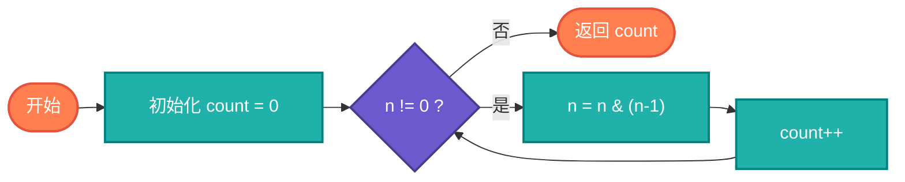

# 计数1位算法完整教学资源

## 说明

计数1位（Count Bits）算法用于计算二进制表示中1的个数，也称为哈明权重（Hamming Weight）。这是计算机科学中的一个基础问题，在错误检测、网络协议、图像处理等领域有广泛应用。

> **生活类比**：就像统计一串灯泡中有多少个是亮着的，计数1位就是统计二进制数中有多少个1。

## 实现过程

1. 初始化计数器为0
2. 使用位操作技巧清除最低位的1
3. 每次清除一个1，计数器加1
4. 重复直到数字变为0

## 算法流程



## 核心思想

### Kernighan 算法

使用 n & (n-1) 清除最低位的1，每次操作都清除一个1，直到数字变为0。

### 查表法

预计算8位或16位数字的1的个数，通过查表快速得到结果。

### 并行计数

利用位运算并行计算，将32位整数分成多个部分同时计算。

## 目录结构

```
count-bits/
├── count_bits.c       # C 语言实现
├── CountBits.java     # Java 语言实现
├── count_bits.go      # Go 语言实现
├── count_bits.py      # Python 语言实现
├── count_bits.js      # JavaScript 语言实现
├── count_bits.rs      # Rust 语言实现
├── count_bits.ts      # TypeScript 语言实现
└── README.md          # 本文档
```

## 核心思想

### Kernighan 算法

使用 n & (n-1) 清除最低位的1，每次操作都清除一个1，直到数字变为0。

### 查表法

预计算8位或16位数字的1的个数，通过查表快速得到结果。

### 并行计数

利用位运算并行计算，将32位整数分成多个部分同时计算。

## 复杂度分析

| 方法 | 时间复杂度 | 空间复杂度 | 描述 |
|------|----------|----------|------|
| 逐位计数 | O(log n) | O(1) | 遍历每一位 |
| Kernighan | O(k) | O(1) | k为1的个数 |
| 查表法 | O(n/8) | O(256) | 预计算表 |
| 并行计数 | O(log n) | O(1) | 固定次数位运算 |

## 应用场景

- 错误检测和纠正
- 网络协议校验
- 图像处理
- 密码学
- 数据压缩

## 简单例子

### Python 示例 - Kernighan 算法
```python
def count_bits_kernighan(n):
    """使用Kernighan算法计算1的个数"""
    count = 0
    while n:
        n &= (n - 1)  # 清除最低位的1
        count += 1
    return count

print(count_bits_kernighan(13))  # 输出: 3 (1101)
```

### C 语言示例 - 查表法
```c
#include <stdio.h>

// 预计算256个8位数的1的个数
int bit_counts[256];

void init_bit_counts() {
    for (int i = 0; i < 256; i++) {
        bit_counts[i] = __builtin_popcount(i);
    }
}

int count_bits_lookup(unsigned int n) {
    int count = 0;
    while (n) {
        count += bit_counts[n & 0xFF];
        n >>= 8;
    }
    return count;
}

int main() {
    init_bit_counts();
    printf("%d\n", count_bits_lookup(13));  // 输出: 3
    return 0;
}
```

### Java 示例 - 逐位计数
```java
public class CountBits {
    public static int countBits(int n) {
        int count = 0;
        while (n != 0) {
            count += (n & 1);
            n >>>= 1;
        }
        return count;
    }
    
    public static void main(String[] args) {
        System.out.println(countBits(13));  // 输出: 3
    }
}
```

## 特点

### 优点
- 执行效率高：位运算操作快速
- 空间占用小：查表法除外
- 硬件友好：对应CPU指令
- 应用广泛：多个领域使用

### 缺点
- 查表法占用空间：需要预计算表
- 可读性差：位操作代码不易理解
- 平台差异：不同平台可能需要调整

## 优化技巧

### 1. Kernighan 算法
```python
def count_bits(n):
    count = 0
    while n:
        n &= (n - 1)  # 清除最低位的1
        count += 1
    return count
```

### 2. 查表法
```python
# 预计算256个8位数的1的个数
BIT_COUNTS = [bin(i).count('1') for i in range(256)]

def count_bits_lookup(n):
    count = 0
    while n:
        count += BIT_COUNTS[n & 0xFF]
        n >>= 8
    return count
```

### 3. 并行计数
```c
int parallelCount(int n) {
    n = n - ((n >> 1) & 0x55555555);
    n = (n & 0x33333333) + ((n >> 2) & 0x33333333);
    n = (n + (n >> 4)) & 0x0F0F0F0F;
    n = n + (n >> 8);
    n = n + (n >> 16);
    return n & 0x3F;
}
```

## 学习建议

1. 理解二进制表示：掌握数字的二进制形式
2. 熟悉位运算符：掌握各种位运算符的作用
3. 练习 Kernighan 算法：理解 n & (n-1) 的巧妙之处
4. 学习查表法：掌握空间换时间的思想
5. 了解并行计数：理解位运算的并行特性
