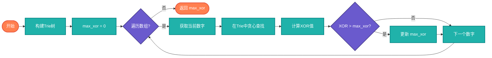

# 最大XOR对算法完整教学资源

## 说明

最大XOR对算法用于从数组中找到两个数，使它们的XOR值最大。这个问题有多种解法，包括蛮力法、Trie树法和贪心法。在实际应用中，常用于数组配对问题、最大差异计算等场景。

> **生活类比**：就像在人群中找到两个人，让他们的"差异"（XOR）最大，Trie树法就像先看最高的人，再找最矮的人来配对。

## 实现过程

### 蛮力法
1. 遍历所有可能的数对
2. 计算每对数的XOR值
3. 记录最大的XOR值

### Trie树法
1. 将所有数的二进制表示构建成Trie树
2. 对每个数，在Trie树中贪心查找能使XOR最大的路径
3. 记录最大的XOR值

## 算法流程（Trie树法）



## 核心思想

### 蛮力法

检查所有可能的数对，计算它们的XOR值，找出最大值。时间复杂度 O(n²)。

### Trie树法

构建二进制前缀树，从高位到低位贪心查找使XOR最大的路径。时间复杂度 O(n)。

### 位贪心法

从高位到低位逐步构建最大可能的XOR值，每次选择能使当前位为1的数字。

## 目录结构

```
max-xor-pair/
├── max_xor_pair.c     # C 语言实现
├── MaxXorPair.java    # Java 语言实现
├── max_xor_pair.go    # Go 语言实现
├── max_xor_pair.py    # Python 语言实现
├── max_xor_pair.js    # JavaScript 语言实现
├── max_xor_pair.rs    # Rust 语言实现
├── max_xor_pair.ts    # TypeScript 语言实现
└── README.md          # 本文档
```

## 核心思想

### 蛮力法

检查所有可能的数对，计算它们的XOR值，找出最大值。时间复杂度 O(n²)。

### Trie树法

构建二进制前缀树，从高位到低位贪心查找使XOR最大的路径。时间复杂度 O(n)。

### 位贪心法

从高位到低位逐步构建最大可能的XOR值，每次选择能使当前位为1的数字。

## 复杂度分析

| 方法 | 时间复杂度 | 空间复杂度 | 描述 |
|------|----------|----------|------|
| 蛮力法 | O(n²) | O(1) | 检查所有数对 |
| Trie树 | O(n) | O(n) | 构建Trie树 |
| 位贪心 | O(n) | O(1) | 逐位构建 |

## 应用场景

- 数组配对问题
- 最大差异计算
- 游戏策略
- 密码学
- 数据分析

## 简单例子

### Python 示例 - 蛮力法
```python
def max_xor_pair_brute(nums):
    """蛮力法找出最大XOR对"""
    max_xor = 0
    for i in range(len(nums)):
        for j in range(i + 1, len(nums)):
            max_xor = max(max_xor, nums[i] ^ nums[j])
    return max_xor

print(max_xor_pair_brute([3, 10, 5, 25, 2, 8]))  # 输出: 28
```

### Java 示例 - Trie树法
```java
import java.util.*;

public class MaxXorPair {
    static class TrieNode {
        TrieNode[] children = new TrieNode[2];
    }
    
    public static int findMaximumXOR(int[] nums) {
        TrieNode root = new TrieNode();
        
        // 构建Trie树
        for (int num : nums) {
            TrieNode node = root;
            for (int i = 31; i >= 0; i--) {
                int bit = (num >> i) & 1;
                if (node.children[bit] == null) {
                    node.children[bit] = new TrieNode();
                }
                node = node.children[bit];
            }
        }
        
        int maxXor = 0;
        for (int num : nums) {
            TrieNode node = root;
            int currentXor = 0;
            for (int i = 31; i >= 0; i--) {
                int bit = (num >> i) & 1;
                int toggledBit = 1 - bit;
                if (node.children[toggledBit] != null) {
                    currentXor = (currentXor << 1) | 1;
                    node = node.children[toggledBit];
                } else {
                    currentXor = (currentXor << 1) | 0;
                    node = node.children[bit];
                }
            }
            maxXor = Math.max(maxXor, currentXor);
        }
        
        return maxXor;
    }
    
    public static void main(String[] args) {
        int[] nums = {3, 10, 5, 25, 2, 8};
        System.out.println(findMaximumXOR(nums));  // 输出: 28
    }
}
```

## 特点

### 优点
- Trie树法效率高：线性时间复杂度
- 贪心策略直观：从高位到低位逐步构建
- 应用广泛：多个场景可以使用

### 缺点
- 蛮力法效率低：平方时间复杂度
- Trie树占用空间：需要额外空间存储树
- 实现复杂：Trie树实现相对复杂

## 优化技巧

### 1. Trie树优化
- 使用位操作代替字符串
- 从高位到低位构建
- 贪心选择相反的位

### 2. 位操作优化
- 使用移位操作提取特定位
- 使用异或运算计算差值
- 避免不必要的计算

## 学习建议

1. 理解XOR性质：掌握异或运算的基本性质
2. 学习Trie树：理解二进制前缀树的构建
3. 练习贪心算法：从高位到低位贪心选择
4. 分析复杂度：理解不同方法的效率差异
5. 实际应用：了解算法在实际问题中的应用
