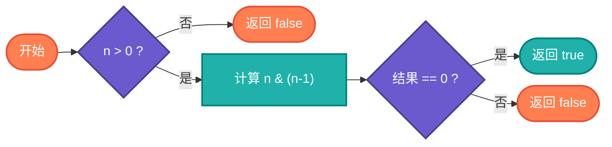

# 2的幂检测算法完整教学资源

## 说明

2的幂检测算法用于判断一个数是否为2的幂。2的幂在二进制表示中只有一个1，利用这个特性可以高效地进行判断。该算法广泛应用于内存分配对齐、数据结构设计等领域。

> **生活类比**：就像判断一个数字是否是2、4、8、16这样的"整齐"数字，2的幂就像是可以不断对半切的完美蛋糕。

## 实现过程

1. 检查数字是否大于0
2. 计算 n & (n-1)
3. 如果结果为0，则是2的幂
4. 否则不是2的幂

## 算法流程



## 核心思想

### 检测方法

使用 n & (n-1) == 0 来判断。如果 n 是2的幂，则 n 的二进制表示只有一个1，n-1 的所有位都是1，两者相与结果为0。

### 找下一个2的幂

将最高位的1后面的所有位都变成1，然后加1，得到下一个2的幂。

### 计算指数

通过右移计数或使用内置函数计算2的幂的指数。

## 目录结构

```
power-of-two/
├── power_of_two.c     # C 语言实现
├── PowerOfTwo.java    # Java 语言实现
├── power_of_two.go    # Go 语言实现
├── power_of_two.py    # Python 语言实现
├── power_of_two.js    # JavaScript 语言实现
├── power_of_two.rs    # Rust 语言实现
├── power_of_two.ts    # TypeScript 语言实现
└── README.md          # 本文档
```

## 核心思想

### 检测方法

使用 n & (n-1) == 0 来判断。如果 n 是2的幂，则 n 的二进制表示只有一个1，n-1 的所有位都是1，两者相与结果为0。

### 找下一个2的幂

将最高位的1后面的所有位都变成1，然后加1，得到下一个2的幂。

### 计算指数

通过右移计数或使用内置函数计算2的幂的指数。

## 复杂度分析

| 操作 | 时间复杂度 | 空间复杂度 | 描述 |
|------|----------|----------|------|
| 2的幂检测 | O(1) | O(1) | 单次位运算 |
| 找下一个2的幂 | O(log n) | O(1) | 位操作 |
| 计算指数 | O(log n) | O(1) | 右移计数 |

## 应用场景

- 内存分配对齐
- 数据结构设计
- 算法优化
- 图形处理
- 系统编程

## 简单例子

### Python 示例
```python
def is_power_of_two(n):
    """判断是否为2的幂"""
    if n <= 0:
        return False
    return (n & (n - 1)) == 0

def next_power_of_two(n):
    """找下一个2的幂"""
    if n <= 0:
        return 1
    n -= 1
    n |= n >> 1
    n |= n >> 2
    n |= n >> 4
    n |= n >> 8
    n |= n >> 16
    return n + 1

print(is_power_of_two(8))    # True
print(is_power_of_two(6))    # False
print(next_power_of_two(10))  # 16
```

### C 语言示例
```c
#include <stdio.h>
#include <stdbool.h>

bool isPowerOfTwo(int n) {
    if (n <= 0) return false;
    return (n & (n - 1)) == 0;
}

int nextPowerOfTwo(int n) {
    if (n <= 0) return 1;
    n--;
    n |= n >> 1;
    n |= n >> 2;
    n |= n >> 4;
    n |= n >> 8;
    n |= n >> 16;
    return n + 1;
}

int main() {
    printf("%d\n", isPowerOfTwo(8));    // 1 (true)
    printf("%d\n", isPowerOfTwo(6));    // 0 (false)
    printf("%d\n", nextPowerOfTwo(10));  // 16
    return 0;
}
```

### Java 示例
```java
public class PowerOfTwo {
    public static boolean isPowerOfTwo(int n) {
        if (n <= 0) return false;
        return (n & (n - 1)) == 0;
    }
    
    public static int nextPowerOfTwo(int n) {
        if (n <= 0) return 1;
        n--;
        n |= n >> 1;
        n |= n >> 2;
        n |= n >> 4;
        n |= n >> 8;
        n |= n >> 16;
        return n + 1;
    }
    
    public static void main(String[] args) {
        System.out.println(isPowerOfTwo(8));    // true
        System.out.println(isPowerOfTwo(6));    // false
        System.out.println(nextPowerOfTwo(10));  // 16
    }
}
```

## 特点

### 优点
- 执行效率高：单次位运算
- 空间占用小：不需要额外空间
- 硬件友好：直接对应CPU指令
- 应用广泛：多个场景使用

### 缺点
- 边界情况：需要处理负数和零
- 可读性差：位操作代码不易理解
- 平台差异：不同平台的整数位数可能不同

## 优化技巧

### 1. 位操作判断
```python
def is_power_of_two(n):
    return n > 0 and (n & (n - 1)) == 0
```

### 2. 找下一个2的幂
```python
def next_power_of_two(n):
    if n <= 0:
        return 1
    n -= 1
    n |= n >> 1
    n |= n >> 2
    n |= n >> 4
    n |= n >> 8
    n |= n >> 16
    return n + 1
```

### 3. 计算指数
```python
def log2(n):
    if n <= 0:
        return -1
    exponent = 0
    while n > 1:
        n >>= 1
        exponent += 1
    return exponent
```

## 学习建议

1. 理解二进制表示：掌握2的幂的二进制特征
2. 熟悉位操作：掌握 n & (n-1) 的巧妙之处
3. 处理边界情况：注意负数和零的处理
4. 学习位传播：理解如何将1传播到所有低位
5. 实际应用：了解算法在实际项目中的应用
