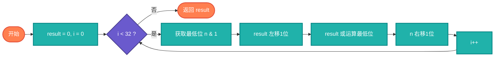

# 位反转算法完整教学资源

## 说明

位反转算法用于反转整数的二进制位顺序。例如，将 0b00000010100101000001111001011100 反转为 0b00111001011100000010100101000000。这个算法在加密、数据压缩、网络协议等领域有广泛应用。

> **生活类比**：就像把一段文字从右到左倒着读，位反转就是把二进制数从右到左重新排列。

## 实现过程

### 逐位迭代法
1. 初始化结果为0
2. 从最低位开始遍历
3. 取出最低位，添加到结果的最高位
4. 重复直到处理完所有位

### 分治法
1. 反转16位
2. 反转8位
3. 反转4位
4. 反转2位
5. 反转1位

## 算法流程（逐位迭代法）



## 核心思想

### 逐位迭代法

从最低位到最高位依次处理，每次取出最低位，将其添加到结果的最高位。

### 分治法

先反转16位，再反转8位，最后反转1位，通过多次交换实现反转。

### 查表法

预计算8位或16位的反转结果，通过查表快速得到反转后的值。

## 目录结构

```
reverse-bits/
├── reverse_bits.c     # C 语言实现
├── ReverseBits.java    # Java 语言实现
├── reverse_bits.go    # Go 语言实现
├── reverse_bits.py    # Python 语言实现
├── reverse_bits.js    # JavaScript 语言实现
├── reverse_bits.rs    # Rust 语言实现
├── reverse_bits.ts    # TypeScript 语言实现
└── README.md          # 本文档
```

## 核心思想

### 逐位迭代法

从最低位到最高位依次处理，每次取出最低位，将其添加到结果的最高位。

### 分治法

先反转16位，再反转8位，最后反转1位，通过多次交换实现反转。

### 查表法

预计算8位或16位的反转结果，通过查表快速得到反转后的值。

## 复杂度分析

| 方法 | 时间复杂度 | 空间复杂度 | 描述 |
|------|----------|----------|------|
| 逐位迭代 | O(log n) | O(1) | 遍历每一位 |
| 分治法 | O(log n) | O(1) | 固定次数交换 |
| 查表法 | O(n/8) | O(256) | 预计算表 |

## 应用场景

- 加密算法
- 数据压缩
- 网络协议
- 图像处理
- 密码学

## 简单例子

### Python 示例 - 逐位迭代法
```python
def reverse_bits(n):
    """逐位迭代反转32位整数"""
    result = 0
    for i in range(32):
        result = (result << 1) | (n & 1)
        n >>= 1
    return result

print(reverse_bits(43261596))  # 输出: 964176192
```

### C 语言示例 - 查表法
```c
#include <stdio.h>

// 预计算256个8位数的反转结果
unsigned char reverse_table[256];

void init_reverse_table() {
    for (int i = 0; i < 256; i++) {
        unsigned char reversed = 0;
        for (int j = 0; j < 8; j++) {
            reversed = (reversed << 1) | ((i >> j) & 1);
        }
        reverse_table[i] = reversed;
    }
}

unsigned int reverse_bits_lookup(unsigned int n) {
    unsigned int reversed = 0;
    reversed |= reverse_table[n & 0xFF] << 24;
    reversed |= reverse_table[(n >> 8) & 0xFF] << 16;
    reversed |= reverse_table[(n >> 16) & 0xFF] << 8;
    reversed |= reverse_table[(n >> 24) & 0xFF];
    return reversed;
}

int main() {
    init_reverse_table();
    printf("%u\n", reverse_bits_lookup(43261596));  // 输出: 964176192
    return 0;
}
```

### Java 示例 - 分治法
```java
public class ReverseBits {
    public static int reverseBits(int n) {
        n = (n >>> 16) | (n << 16);
        n = ((n & 0xff00ff00) >>> 8) | ((n & 0x00ff00ff) << 8);
        n = ((n & 0xf0f0f0f0) >>> 4) | ((n & 0x0f0f0f0f) << 4);
        n = ((n & 0xcccccccc) >>> 2) | ((n & 0x33333333) << 2);
        n = ((n & 0xaaaaaaaa) >>> 1) | ((n & 0x55555555) << 1);
        return n;
    }
    
    public static void main(String[] args) {
        System.out.println(reverseBits(43261596));  // 输出: 964176192
    }
}
```

## 特点

### 优点
- 执行效率高：位运算操作快速
- 空间占用小：查表法除外
- 硬件友好：某些CPU有专用指令
- 应用广泛：多个领域使用

### 缺点
- 查表法占用空间：需要预计算表
- 可读性差：位操作代码不易理解
- 平台差异：不同平台的整数位数可能不同

## 优化技巧

### 1. 逐位迭代
```python
def reverse_bits(n):
    result = 0
    for i in range(32):
        result = (result << 1) | (n & 1)
        n >>= 1
    return result
```

### 2. 分治法
```python
def reverse_bits_divide(n):
    # 反转16位
    n = ((n & 0xffff0000) >> 16) | ((n & 0x0000ffff) << 16)
    # 反转8位
    n = ((n & 0xff00ff00) >> 8) | ((n & 0x00ff00ff) << 8)
    # 反转4位
    n = ((n & 0xf0f0f0f0) >> 4) | ((n & 0x0f0f0f0f) << 4)
    # 反转2位
    n = ((n & 0xcccccccc) >> 2) | ((n & 0x33333333) << 2)
    # 反转1位
    n = ((n & 0xaaaaaaaa) >> 1) | ((n & 0x55555555) << 1)
    return n
```

### 3. 查表法
```python
# 预计算256个8位数的反转结果
REVERSE_TABLE = [int(bin(i)[2:].zfill(8)[::-1], 2) for i in range(256)]

def reverse_bits_lookup(n):
    reversed = 0
    reversed |= REVERSE_TABLE[n & 0xFF] << 24
    reversed |= REVERSE_TABLE[(n >> 8) & 0xFF] << 16
    reversed |= REVERSE_TABLE[(n >> 16) & 0xFF] << 8
    reversed |= REVERSE_TABLE[(n >> 24) & 0xFF]
    return reversed
```

## 学习建议

1. 理解二进制位：掌握数字的二进制表示
2. 熟悉位操作：掌握移位和或运算
3. 练习分治法：理解如何分步反转
4. 学习查表法：掌握空间换时间的思想
5. 实际应用：了解算法在实际项目中的应用
